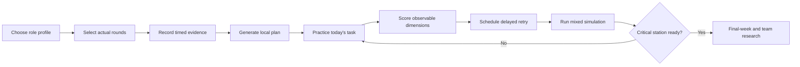

# ML career curriculum and usability roadmap

**Prepared:** August 28, 2026

**Audience:** Senior ML and AI candidates, primarily Applied Scientist, Machine Learning Engineer, Research Scientist, and Research Engineer roles, with specialist tracks for frontier-model, recommendation, safety, multimodal, speech, robotics, and ML systems work.

**Product boundary:** mlmentorship should teach the ML-specific knowledge and performances layered on top of a general software interview. It should not become another LeetCode, generic SQL, or generic backend-system-design site.

---

## Executive recommendation

mlmentorship already has enough raw breadth to be useful. It has 185 concept notes, 85 interview questions, 13 guides, integrated Practice Mode on question pages, role-aware readiness, simulations, and realistic labs. The August implementation resolved the main selection and sequencing constraint with an ordered curriculum, focused role routes, and a browser-local preparation plan.

The remaining roadmap is deliberately narrower:

1. Add a small, evidence-driven set of missing ML concepts.
2. Refine the implemented workflow from **role -> actual rounds -> diagnostic evidence -> today's practice -> delayed retry -> simulation** without adding accounts or a server.

The highest-return content work is not publishing another 100 isolated definitions. It is making every concept answer four questions immediately:

- Is this core for my role?
- In which interview round will it appear?
- What must I know first?
- What should I practice after reading it?

### Recommended content scope

- **18 completed P0 concepts** that close core statistical, evaluation, research, ranking, and ML-production gaps.
- **20 P1 concepts** that complete important specialist paths.
- **25 P2 concepts** held behind evidence of user demand or a specialist review.
- **9 existing pages to deepen or recategorize instead of duplicating.**

### Recommended product scope

- Keep all existing URLs.
- Keep the book contents as the primary entry point.
- Use one **Workbook** for planning and practice state.
- Generate one local plan from role, level, domain, actual interview rounds, and timed evidence.
- Add role, domain, round, difficulty, prerequisites, and practice links to content metadata.
- Put the next action and due retries in the Workbook with one-click practice.
- Make the concept library filterable and stop showing all 173 items in a persistent sidebar.

### Static-first UX decision

The August 28, 2026 interface pass made the root page a subject-first curriculum with four shelves and nine books. Later passes gave all 283 entries an explicit pedagogical order across 49 chapters, added chapter routes, split the four role paths, and connected readiness to local next tasks and evidence history. Type-specific indexes remain available, but users no longer choose a publishing format before a subject.

GitHub Pages remains a hard constraint. Do not add accounts, cloud state, server APIs, required client-side routing, or database-backed recommendations. Pagefind, browser-local practice progress, theme choice, and newsletter forms are progressive enhancements. The complete rules are in [STATIC_FIRST_UX.md](STATIC_FIRST_UX.md).

### First content batch completed

The August 28, 2026 batch added ten AI-lab concepts:

- hypothesis testing and confidence intervals;
- reproducibility and fair model comparison;
- contrastive and self-supervised learning;
- neural scaling laws;
- MDPs and Bellman equations;
- LLM-as-judge evaluation;
- evaluation validity and benchmark contamination;
- synthetic data generation and verification;
- RL with verifiable rewards and GRPO;
- test-time compute, search, and verifiers.

The research, post-training, alignment, multimodal, agent, and infrastructure domain paths now link to this material.

### Scaling systems batch completed

The [JAX Scaling Book content audit](JAX_SCALING_BOOK_CONTENT_AUDIT.md) compared all twelve chapters with the existing library. It found that the site already covered most individual training and inference tools, but did not connect tensor shape, memory, compute, communication, topology, and measured scaling in one path.

The August 28, 2026 scaling batch added:

- transformer compute and memory accounting;
- sharded matrix multiplication;
- accelerator network topology;
- strong scaling, MFU, and parallelism selection;
- context parallelism and ring attention;
- profiling distributed ML workloads;
- a worked 70B training-plan question.

It also corrected communication, memory, checkpointing, and inference assumptions in the existing scaling pages. Broad JAX API teaching remains optional because it is role-specific rather than a universal ML interview requirement.

---

# Part I: curriculum strategy

## 1. What belongs on mlmentorship

A new concept should meet at least three of these criteria:

1. It recurs across current ML job descriptions or credible interview reports.
2. It is specific to ML, statistical modeling, AI systems, or ML research.
3. It supports at least two role families, or it is essential to one explicit specialist path.
4. It unlocks an existing question, lab, design case, or simulation.
5. A candidate can use the idea to make a decision, derive something, debug a failure, or defend a trade-off.
6. The concept is stable enough to maintain as a reference rather than a news post.

A concept should **not** be added merely because it appears in one paper, framework, or company rumor.

## 2. What should remain out of scope

### Do not build

- a general LeetCode or data-structures question bank;
- generic object-oriented-design exercises with no ML connection;
- a generic SQL drill bank;
- generic backend architecture such as URL shorteners or social feeds;
- framework API trivia for PyTorch, TensorFlow, JAX, Spark, or Kubernetes;
- vendor-specific prompt-engineering recipes;
- alleged leaked company prompts;
- benchmark leaderboards that become stale quickly;
- one page for every model architecture or recent paper.

### Do acknowledge and route

General coding, SQL, and backend design can still be selectable dependencies in a user's interview plan. The site should say:

> This round is required for your target loop, but mlmentorship does not teach it. Use a dedicated resource and record a timed baseline here.

This prevents false readiness without duplicating mature external curricula.

---

## 3. Current strengths to protect

The current library is strongest in:

- transformer and LLM internals;
- training optimization and failure diagnosis;
- inference performance and distributed training;
- LLM application evaluation, RAG, agents, and safety;
- recommendation, retrieval, and ranking design;
- project deep dives, values, and calibration through company-dependent senior-principal scope;
- realistic work samples;
- active-recall Practice Mode and spaced retry records.

New content should fill missing decision concepts around these strengths, not compete with them.

---

# Part II: concepts to add

## 4. P0 concept set: completed August 29, 2026

These 18 topics were the highest-value dedicated gaps across the intended role portfolio, not a universal reading list for every candidate. Each now has a findable page, an ordered library position, role and round metadata, prerequisites, and practice connections.

| # | Proposed concept | Scope | Core roles | Existing practice anchor |
| ---: | --- | --- | --- | --- |
| 1 | **Expectation, variance, covariance, and correlation** (completed) | Random-variable moments, covariance matrices, correlation versus causation, variance of sums and estimators | AS, RS, RE, MLE | Math oral; Bayesian versus frequentist; model evaluation |
| 2 | **Probability distributions used in ML** (completed) | Bernoulli, binomial, categorical, Gaussian, Poisson, exponential, Beta, and Dirichlet; assumptions and conjugate intuition | AS, RS, RE | Derive logistic regression; MLE; Bayesian questions |
| 3 | **Entropy and mutual information** (completed) | Entropy, conditional entropy, mutual information, cross-entropy, KL identities, information gain, and representation relevance | RS, RE, frontier ML | KL divergence; cross-entropy; decision trees; math oral |
| 4 | **Hypothesis testing and confidence intervals** (completed) | Null and alternative, test statistic, p-value, confidence interval, Type I/II errors, effect size, practical significance | AS, RS, experimentation | Design an ML A/B test; paper critique |
| 5 | **Bootstrap and resampling** (completed) | Nonparametric bootstrap, paired model comparison, percentile and bootstrap-t intervals, failure under dependence | AS, RS, evaluation | Search-ranker evaluation; ablation design; paper critique |
| 6 | **Causal inference for ML decisions** (completed) | DAGs, confounding, selection bias, interventions, propensity, difference-in-differences, regression discontinuity, and when identification fails | AS, product ML, RS | Offline/online gap; ML A/B testing; recommendation design |
| 7 | **Data leakage and point-in-time correctness** (completed) | Target, temporal, group, preprocessing, feature, and evaluation leakage; historical joins as-of prediction time | AS, MLE, RE | Cross-validation; feature-store design; fraud design |
| 8 | **Decision thresholds, asymmetric costs, and abstention** (completed) | Expected-cost decisions, threshold selection, reject options, capacity-constrained review, and ranking versus calibrated probabilities | AS, MLE, safety | Fraud design; class imbalance; calibration |
| 9 | **Reproducibility, randomness, and fair model comparison** (completed) | Seeds, variance sources, repeated runs, matched compute/tuning, deterministic versus representative execution, and experiment ledgers | AS, RS, RE | Ablation design; paper critique; broken-training lab |
| 10 | **Contrastive and self-supervised representation learning** (completed) | InfoNCE-style objectives, positive/negative construction, collapse, augmentation invariance, CLIP, SimCLR, and masked prediction | AS, RS, ranking, multimodal, speech | Two-tower design; embeddings; multimodal models |
| 11 | **Multi-task learning and objective interference** (completed) | Shared-bottom, hard/soft sharing, loss weighting, negative transfer, gradient conflict, MMoE/PLE intuition | AS, ranking, multimodal, MLE | YouTube recommender; Spotify homepage; multimodal design |
| 12 | **Neural scaling laws and compute-optimal training** (completed) | Loss scaling with parameters/data/compute, Chinchilla-style allocation, extrapolation limits, data quality, and inference-aware trade-offs | RS, RE, pretraining | Train a 100B model; fixed-budget ML design |
| 13 | **Markov decision processes and Bellman equations** (completed) | States, actions, transitions, rewards, returns, value functions, policies, Bellman expectation/optimality, horizon and discounting | RS, post-training, robotics | Q-learning; policy gradients; reward shaping |
| 14 | **ML data lineage and versioning** (completed) | Dataset snapshots, feature definitions, labels, transforms, model/config lineage, reproducibility, deletion, audit, and rollback | MLE, RE, safety | Feature-store design; foundation-model curation |
| 15 | **Delayed labels, selective labels, and feedback loops** (completed) | Labels observed only after action or only for selected examples, censored outcomes, policy-induced data, exploration and random audits | AS, MLE, ranking, fraud | Fraud design; recommendation design; offline/online debugging |
| 16 | **LLM-as-judge reliability and calibration** (completed) | Pairwise versus scalar grading, position/verbosity/self bias, reference leakage, judge ensembles, human calibration, uncertainty and adversarial validation | AS, safety, post-training, LLM apps | Evaluate an LLM app; agent eval; coding-assistant evals |
| 17 | **Learning-to-rank losses** (completed) | Pointwise, pairwise, and listwise objectives; surrogate mismatch; LambdaRank intuition; calibration and top-k decisions | Ranking, search, AS, MLE | Evaluate a search ranker; two-tower versus cross-encoder |
| 18 | **Position bias and counterfactual learning to rank** (completed) | Exposure bias, examination models, propensities, randomized swaps, IPS/SNIPS/doubly robust estimation, support and variance | Ranking, search, product ML | Search-ranker evaluation; personalized search case study |

### Why these are first

This set closes the most consequential holes around the site's current strengths:

- math pages become a coherent statistics foundation rather than isolated theorems;
- design answers get correct data and decision semantics;
- RS candidates gain research-evidence concepts;
- ranking coverage gains the causal machinery currently referenced but not taught;
- frontier evaluation gains a dedicated judge-validity concept;
- production ML gains lineage and policy-induced-data reasoning.

### Suggested publication order

Publish in four coherent clusters rather than one per week across unrelated topics:

1. **Statistical reasoning:** 1-6.
2. **Reliable applied ML:** 7-9, 14-15.
3. **Representation and sequential decisions:** 10-13.
4. **Evaluation and ranking:** 16-18.

Every cluster should ship with one path update and one changed-surface practice prompt.

---

## 5. P1 concept set: complete important paths

These 20 concepts are highly useful but narrower, or partly covered inside an existing page today.

| # | Proposed concept | Scope | Primary paths |
| ---: | --- | --- | --- |
| 1 | **Statistical power, minimum detectable effect, and variance reduction** | Sample size, power curves, noisy ratio metrics, CUPED/control variates, cluster effects | AS, experimentation |
| 2 | **Conformal prediction and coverage** | Split conformal, exchangeability, classification sets, regression intervals, conditional-coverage limits | AS, safety, high-stakes ML |
| 3 | **Learning with expensive or incomplete labels** | Active learning, weak supervision, positive-unlabeled learning, pseudo-labeling, disagreement and label-model risks | AS, fraud, moderation, medical ML |
| 4 | **Time-series forecasting and temporal backtesting** | Baselines, leakage-safe validation, horizons, seasonality, covariates, probabilistic forecasts, rolling evaluation | AS, product ML |
| 5 | **Anomaly and novelty detection** | One-class methods, density and reconstruction scores, thresholding, drift, contamination, alert capacity | AS, platform, safety |
| 6 | **Fairness and subgroup evaluation** | Allocation versus quality harms, demographic parity/equalized odds/calibration incompatibilities, intersectional slices, uncertainty | AS, safety, product ML |
| 7 | **Privacy-preserving ML** | Differential privacy intuition and accounting, federated learning, secure aggregation, utility and deployment trade-offs | On-device, health, safety, Apple-style ML |
| 8 | **Distributed data parallel and the parallelism map** (completed through the strong-scaling path) | DDP plus data, tensor, pipeline, context/sequence, and expert parallelism; communication and memory trade-offs | RE, training systems |
| 9 | **Training and inference memory accounting** (completed) | Parameters, gradients, optimizer states, activations, temporary buffers, KV cache, fragmentation and precision | RE, inference, performance |
| 10 | **Input pipelines and accelerator starvation** | Data loading, preprocessing, shuffling, prefetch, host/device transfer, storage throughput and profiling | RE, training systems |
| 11 | **Shadow, canary, staged rollout, and rollback** | Offline gate, shadow traffic, canary, A/B, model/feature compatibility, fallback and incident ownership | MLE, AS, LLM apps |
| 12 | **Evaluation validity and benchmark contamination** | Construct validity, memorization, benchmark saturation, prompt/template overlap, adaptive test sets and held-out families | RS, safety, frontier evals |
| 13 | **Synthetic-data generation and verification loops** | Generator/filter/student coupling, diversity, provenance, self-training collapse, independent verifiers and held-out tests | Pretraining, post-training, safety |
| 14 | **RL with verifiable rewards and GRPO** | Outcome verification, group-relative advantages, sparse reward, reward hacking, curriculum and train/eval separation | Post-training, RS, RE |
| 15 | **Test-time compute, search, and verifiers** | Best-of-n, self-consistency, tree/search methods, process versus outcome supervision, compute allocation and stopping | RS, post-training, inference |
| 16 | **Agent tool use and state-machine semantics** | Tool schemas, action/observation contracts, retries, idempotency, permissions, partial failure and trajectory evaluation | Agent/LLM engineer, safety |
| 17 | **Agent memory and context engineering** | Working memory, retrieval, summaries, durable state, provenance, context budgeting, poisoning and forgetting | Agent/LLM engineer, safety |
| 18 | **Constrained decoding and structured outputs** | Grammar/FSM constraints, JSON schemas, token masking, validity versus semantic correctness, latency | LLM apps, inference |
| 19 | **Model routing, cascades, and escalation** | Cheap-to-expensive routing, confidence, abstention, specialist models, latency/cost/quality frontiers and fallback | LLM apps, inference, product ML |
| 20 | **Off-policy evaluation across RL and recommendation** | Importance ratios, support, clipping, self-normalization, direct-method and doubly robust estimators, variance diagnostics | Ranking, RL, experimentation |

### Publication condition

A P1 concept should ship only when it is attached to one of:

- a first-class role path;
- a new simulation station;
- an existing question receiving a meaningful follow-up;
- a specialist lab.

This keeps the library from becoming a disconnected reference dump.

---

## 6. P2 specialist backlog: add only with demand and review

These concepts are relevant to real roles but should not displace the P0 set. Several require review by a current specialist.

### Performance and training systems

1. **GPU execution model:** warps, occupancy, coalescing, shared memory, registers and divergence.
2. **CUDA and Triton kernel anatomy:** program model, tiling, masks, autotuning and numerical verification.
3. **Context and sequence parallelism** (completed); deepen expert parallelism only with demand.
4. **Elastic training and complete checkpoint state:** model, optimizer, scheduler, scaler, RNG, dataloader and world-size changes.

### Recommendation and retrieval

5. **Multi-objective ranking and value models:** task calibration, scalarization, Pareto trade-offs and ecosystem guardrails.
6. **Sequential and session-based recommendation:** sequence encoders, next-item objectives, long-term history and leakage.
7. **Hybrid retrieval and reranking:** sparse+dense fusion, query rewriting, cross-encoder reranking and retrieval attribution.

### Vision and multimodal

8. **Multimodal evaluation and missing-modality robustness.**
9. **3D vision and camera geometry:** projection, calibration, depth, pose and coordinate transforms.
10. **Flow matching and modern diffusion ODEs:** relation to diffusion, probability paths, solver and distillation trade-offs.
11. **State-space sequence models:** recurrence/convolution views, selective state spaces, memory and when they differ from attention.

### Speech

12. **Audio representations:** sampling, Fourier transform, STFT, mel filters and MFCCs.
13. **Speech evaluation:** WER/CER, latency, endpointing, stability, speaker and synthesis metrics.
14. **Real-time speech front ends:** VAD, endpointing, diarization and streaming segmentation.
15. **Text-to-speech and neural vocoders:** acoustic models, duration/prosody, codec models, MOS and real-time constraints.

### Robotics and RL

16. **Offline RL and extrapolation error.**
17. **Model-based RL, world models, and planning.**
18. **State estimation:** Bayes filters, Kalman/EKF and particle filters.
19. **Feedback control and model-predictive control:** PID, stability intuition, constraints and learned-policy interfaces.
20. **System identification and sim-to-real validation.**

### Safety and alignment

21. **Reward hacking, Goodhart's law, and specification gaming.**
22. **Constitutional AI and RLAIF.**
23. **Safeguard classifiers and policy-enforcement systems.**
24. **Dangerous-capability and autonomy evaluations.**
25. **Evaluation-aware models and adaptive red-team validity.**

### Specialist review rule

Do not present these pages as settled canon until a current practitioner reviews:

- the technical scope;
- what is actually asked versus merely useful at work;
- the terminology and defaults;
- the practice prompt and rubric;
- the freshness interval.

---

## 7. Existing pages to revise instead of duplicating

| Existing page | Revision | Why not create another page |
| --- | --- | --- |
| **Domain adaptation** | Move from a CV-only mental bucket to a general Robustness and Shift cluster; add drift detection, target-label collection, and retraining decisions | It already defines covariate, label and concept shift correctly |
| **A/B testing for ML** | Keep its existing power, multiple-comparison, sequential-testing, SRM, network-effect and HTE material; add links to the new statistical foundations | It already contains more depth than several proposed standalone pages |
| **Calibration** and **Expected Calibration Error** | Clarify the relationship and create a single learning sequence: calibration -> reliability/ECE -> decision thresholds -> conformal prediction | Avoid two disconnected entry points for the same path |
| **RLHF and DPO** | Keep SFT, preference optimization and verifiable-reward overview; link out to a focused RLVR/GRPO page only for implementation depth | The basic post-training stack is already covered |
| **Preference data and reward models** | Add direct links to LLM-as-judge, eval validity and reward hacking | The page already covers sampling, annotators, calibration and policy shift well |
| **Foundation-model data curation** | Keep provenance, filtering, deduplication, decontamination, mixture, synthetic data and audit together | A generic foundation-data-quality page would duplicate it |
| **GPU memory hierarchy** | Add one worked roofline/arithmetic-intensity example and link to memory accounting | The key hardware mental model is already present |
| **Multimodal foundation models** | Keep dual-encoder, fusion and multimodal evaluation overview; use contrastive learning for mechanism depth | It already covers CLIP and missing-modality evaluation at the right overview level |
| **Robotics policy learning** | Keep behavior cloning, offline/online RL, world models and sim-to-real as the overview; split only when a robotics path exists | It is already a strong compact map of the field |

---

## 8. Role bundles built from the concept set

The site should compose paths from shared concepts rather than duplicating a complete curriculum per title.

### Applied Scientist

Core additions:

- expectation/variance/covariance;
- distributions;
- hypothesis tests and confidence intervals;
- bootstrap;
- causal inference;
- leakage and point-in-time correctness;
- thresholds and asymmetric cost;
- reproducibility and fair comparison;
- multi-task learning;
- delayed/selective labels.

### Product Machine Learning Engineer

Core additions:

- leakage and point-in-time correctness;
- thresholds and abstention;
- reproducibility;
- data lineage;
- delayed labels and feedback loops;
- model rollout;
- input pipelines;
- multi-task learning.

A general coding dependency may be shown in the plan but should route externally.

### Research Scientist

Core additions:

- probability foundations;
- entropy and mutual information;
- hypothesis testing and bootstrap;
- reproducibility and fair model comparison;
- contrastive/self-supervised learning;
- scaling laws;
- MDPs for RL-oriented roles;
- evaluation validity.

The path also needs paper defense, research brainstorm, ML implementation, math oral and job-talk practice. Publications get the interview; these performances pass it.

### Research Engineer

Core additions:

- reproducibility;
- scaling laws;
- data lineage;
- DDP and the parallelism map;
- memory accounting;
- input pipelines;
- evaluation validity;
- LLM-as-judge for eval-oriented teams.

### Post-training and frontier evaluation

Core additions:

- MDPs;
- LLM-as-judge;
- evaluation validity;
- synthetic-data verification;
- RLVR/GRPO;
- test-time compute and verifiers;
- reward hacking;
- agent tool/state semantics.

### Recommendation and search

Core additions:

- contrastive learning;
- multi-task learning;
- delayed labels and feedback loops;
- learning-to-rank losses;
- position bias;
- off-policy evaluation;
- multi-objective ranking.

### Safety and alignment

Core additions:

- thresholds and abstention;
- uncertainty/conformal prediction;
- LLM-as-judge;
- evaluation validity;
- reward hacking;
- constitutional AI/RLAIF;
- safeguards;
- adaptive-red-team validity.

### Multimodal, speech and robotics

Use the common foundations first, then add a reviewed specialist bundle. Do not make a candidate read all general CV, speech, and RL pages because the role title contains "multimodal."

---

## 9. New concept-page contract

Every new concept should follow this structure:

1. **One-line definition.**
2. **Who needs this.** Role and domain badges.
3. **Where it appears.** Interview round and representative question shapes.
4. **Prerequisites.** At most three links.
5. **Mechanism.** Equations or system invariants where useful.
6. **Assumptions and failure conditions.**
7. **Worked micro-example.** Small enough to verify by hand.
8. **Decision table.** When to use, avoid, or prefer an alternative.
9. **What an interviewer expects.** A concise 90-second answer outline.
10. **One deeper follow-up.** Derivation, changed assumption, debugging, or design transfer.
11. **Common confusions.**
12. **Practice next.** One question, lab, or simulation station.
13. **Freshness.** Last technical review and source confidence for moving topics.

### Content gate

A concept is not complete until it has:

- one prerequisite link;
- one practice anchor;
- one changed-assumption follow-up;
- one role/domain assignment;
- one reviewer for P2 specialist content.

---

# Part III: make the site much easier to use

## 10. Product north star

Within 90 seconds, a first-time visitor should be able to answer:

1. What role profile am I preparing for?
2. Which interview rounds are actually in my loop?
3. What are my highest-risk ML-specific gaps?
4. What should I do next?

A returning visitor should answer one question immediately:

> What is due today?

The current site answers "What content exists?" very well. The redesign should answer "What should I do now?"

---

## 11. User friction resolved in the online-book pass

### 11.1 The homepage gives a default start

The root is a short book-like contents page with goal-based starts. Candidates who do not yet know what to choose are told to begin with the Core chapters in Books I and II, then add Role-specific or Specialist work only when their role or loop requires it.

### 11.2 The curriculum is ordered and scoped

All entries have one explicit placement and chapter order. Book pages remain short, chapter routes carry the complete sequence, and article navigation follows learning order. Chapters expose priority, difficulty, roles, rounds, and prerequisites.

### 11.3 Role preparation is focused

Applied Scientist, Machine Learning Engineer, Research Scientist, and Research Engineer each have a dedicated static route. The shared page is a short chooser. Specialist domains remain optional overlays by design rather than pretending every domain needs a separate full curriculum.

### 11.4 Readiness persists a usable plan

Readiness saves role, level, selected rounds, domain, evidence ratings, workload, horizon, and top gaps in browser storage. Prep and Progress can then show current-week context and the next three tasks.

### 11.5 Returning evidence is broader than question retries

The local record includes question attempts, concepts, guides, role steps, labs, and completed simulations. Export and import make the private state portable without cloud synchronization.

### 11.6 Search handles exact, filtered, and missing topics

Pagefind gives titles more weight, supports aliases, limits section noise, and filters by Type, Shelf, and Book. Missing-topic guidance makes an absent exact subject explicit instead of presenting a lexical near-match as coverage.

### 11.7 Static HTML remains complete

Home, Book, Chapter, Article, Role path, Readiness, and Progress retain meaningful content without JavaScript. JavaScript adds only planning, completion, timers, search, and other local conveniences. Mobile validation found no horizontal overflow.

### 11.8 External dependencies stay explicit and manual

Readiness exposes general algorithms, practical software, SQL, and general distributed systems as external dependencies. This is a deliberate product boundary, not an unfinished internal curriculum.

> Use dedicated resources for general coding. Use mlmentorship for the ML-specific rounds, concepts, decisions, and work samples.

---

## 12. Implemented information architecture

### Primary navigation

Use four stable destinations:

1. **Contents**: the four shelves, nine books, and ordered chapters.
2. **Questions**: the direct exercise index.
3. **Workbook**: plan, next action, due attempts, method, backup, and simulation handoff.
4. **About**: scope, authorship, and product boundaries.

Keep Search globally visible as the book index. Concepts and Guides remain complete reference indexes and stable destinations, but they do not compete in the primary header. Reading paths remain optional front matter. Legacy Practice-method and Progress URLs redirect into the relevant Workbook section.

### Candidate workflow



### Curriculum composition

A generated path should be composed from four layers:

$$
\text{Plan} = \text{shared core} + \text{role overlay} + \text{domain overlay} + \text{confirmed round formats}
$$

- **Shared core:** ML fundamentals, evidence, implementation, systems and ownership.
- **Role overlay:** AS, MLE, RS, RE, or leadership weighting.
- **Domain overlay:** LLM, ranking, post-training, safety, multimodal, speech, robotics, product ML.
- **Round formats:** ML breadth, math oral, ML implementation, system design, project, research, agentic codebase, and so on.

Company pages should alter format expectations only when supported. They should not produce a company-specific leaked-question curriculum.

---

## 13. Homepage redesign

### Above the fold

- **Headline:** Keep the senior-ML positioning.
- **Subhead:** Add the boundary explicitly: "The ML-specific layer on top of general coding prep. No leaked questions, no LeetCode clone."
- **Primary action:** **Build my interview plan**
- **Secondary action:** **I already know my rounds**
- **Tertiary text link:** Browse the concept library

### Three intent cards

1. **I have an interview scheduled**
   - enter weeks and rounds;
   - get the shortest viable plan.
2. **I am choosing an ML career path**
   - compare work profiles, not titles;
   - choose a role and domain bundle.
3. **I need to refresh one topic**
   - open faceted concept search.

### Returning-user state

When local progress exists, replace generic CTAs with:

- 2 retries due;
- next planned task;
- weakest round;
- Continue button.

No account is required.

---

## 14. One onboarding flow, not several disconnected tools

The existing readiness logic should become a progressive plan builder.

### Step 1: target work profile

Use observable work rather than title alone:

- invent and validate methods;
- turn modeling into product decisions;
- build reliable ML systems;
- scale training/inference;
- build LLM/agent products;
- evaluate safety/model behavior;
- lead a team or technical portfolio.

Map this to role profiles, but allow manual override.

### Step 2: level and domain

- Mid-level / L4
- Senior / L5
- Staff / L6+

Domains should be multi-select with one primary:

- general product ML;
- LLM applications and agents;
- pretraining/post-training;
- ML platform/training/inference;
- recommendation/search/ranking;
- safety/alignment/evals;
- CV/multimodal;
- speech;
- robotics;
- research/general modeling.

### Step 3: actual interview rounds

The recruiter description wins. Separate these clearly:

- general coding, external curriculum;
- practical software/codebase;
- ML implementation;
- AI-assisted codebase;
- ML breadth;
- math/statistics;
- ML system design;
- ML infrastructure/performance;
- product/experimentation;
- research discussion/brainstorm;
- project presentation;
- behavioral/values.

### Step 4: evidence

Do not ask only "How confident are you?" Ask for the best recent evidence:

- not attempted;
- attempted but could not structure;
- completed with major help/notes;
- workable timed attempt;
- handles unfamiliar follow-up;
- two spaced successes.

Offer direct baseline tasks for any unattempted critical station.

### Step 5: generated plan

Return:

- three highest-risk stations;
- external dependencies, such as general DSA, clearly marked;
- a concrete first seven days;
- exact questions/concepts/labs, not just topic categories;
- one simulation date;
- expected weekly hours and honest horizon;
- a Save locally button.

Do not force a deep transition into the current 2/4/8-week ceiling. Add a 12-week option or report that the available runway is insufficient.

---

## 15. The Workbook experience

### Next action

Lead with one task:

1. the oldest due retry;
2. otherwise the highest-priority planned attempt;
3. otherwise the role path or simulation when enough evidence exists.

Place later tasks behind a disclosure. Do not show a dashboard of equal-priority choices.

### One-click continuation

A retry card should link to:

`/questions/<slug>/?practice=1`

The question page should automatically open Practice Mode when the query is present. This removes the extra click and preserves the strong existing dialog workflow.

### Practice record

Show due attempts first. Keep scheduled and graduated attempts behind a disclosure. Reading counts may describe study history, but must never imply interview readiness.

### Local persistence

Continue the privacy-first design:

- plan configuration, task IDs, scores and dates only;
- no scratchpad text;
- explicit opt-in for story text;
- export/import JSON;
- no account requirement.

---

## 16. Make the concept library navigable

### Index behavior

On the concept index:

- remove the full 173-item sidebar;
- show search first;
- offer filters for role, domain, interview round and difficulty;
- add **Core for my path** when a local plan exists;
- let users switch between grouped list and compact table;
- keep the 14 domain categories as a secondary browse mode.

### Concept cards

Show:

- title and one-line definition;
- role badges;
- domain;
- difficulty: foundation, working, advanced;
- estimated reading/practice time;
- prerequisite count;
- linked interview station.

### Concept detail page

Replace the expanded 27-item category list with:

- current learning path;
- up to three prerequisites;
- previous/next in this path;
- linked practice question;
- a compact category explorer behind a button.

### Active recall for concepts

Questions already have a strong Practice Mode. Concepts need a lighter version:

1. Hide the article body.
2. Ask for a 90-second explanation.
3. Ask one changed-assumption follow-up.
4. Reveal a five-point checklist.
5. Link to a full question or lab.

Do not turn concept reading into a gamified completion count. Record only whether the explanation was attempted and whether a repair is due.

---

## 17. Search and metadata

### Minimal content metadata

The current content schema does not contain role, domain, round, difficulty, prerequisite, practice, or freshness fields. Add these optional frontmatter fields gradually:

```yaml
subcategory: LLM Internals
roles:
  - research-engineer
  - ml-engineer
domains:
  - llm
  - inference
rounds:
  - ml-breadth
  - systems-infrastructure
difficulty: working
prerequisites:
  - attention-mechanism
  - gpu-memory-hierarchy
practice:
  - reduce-llm-inference-cost-10x
freshness: annual
```

### Design decisions

- Use arrays for roles and rounds.
- Use `difficulty`, not a single L4/L5/L6 label. Many pages explicitly teach multiple levels.
- Keep learning paths curated and deterministic. Do not auto-generate path order from tags alone.
- Use metadata for filtering, validation and suggestions.
- Put taxonomy enums in one typed module.
- Move subcategory out of the manual slug map over time, with a legacy fallback during migration.
- Validate every prerequisite and practice slug at build time.

### Search filters

Pagefind can index filters for:

- content type;
- role;
- domain;
- round;
- difficulty;
- freshness.

Useful queries then become possible:

- "core concepts for Research Engineer + training systems";
- "questions for Applied Scientist + experimentation";
- "advanced LLM evaluation concepts";
- "30-minute practice for inference."

---

## 18. Use one Workbook instead of Prep navigation

The earlier four-tab proposal still created four competing destinations. The implemented model removes the nested Prep navigation entirely.

The Workbook contains:

- one plan summary;
- one dominant next action;
- due and recent question attempts;
- a three-step practice-method disclosure;
- contextual links to role guides and simulations;
- specialist and final-stage appendices behind one disclosure.

Generic weekly plans are printable appendices. Role guides explain scope but do not compete with the generated next action. This keeps the interactive system subordinate to the book.

---

## 19. Role and specialist paths

### First-class role profiles

Ship next:

1. Applied Scientist
2. Machine Learning Engineer
3. Research Scientist
4. Research Engineer

Then add work-profile overlays rather than ten more top-level roles:

- product ML;
- foundation-model/post-training;
- training/inference systems;
- LLM/agent application;
- safety/evals;
- ranking/search;
- multimodal/speech/robotics;
- staff, principal, and senior principal;
- manager.

### Why composition is better than one page per title

A post-training RE and a safety-evals RS may share:

- LLM-as-judge;
- research design;
- Python/ML implementation;
- reward hacking;
- project defense.

Duplicating entire paths creates maintenance drift. Composable overlays preserve shared core while changing the highest-weight modules and simulation stations.

---

## 20. Preserve and improve Practice Mode

Practice Mode on question pages is one of the site's strongest product features. Keep its:

- closed-book timer;
- private scratchpad;
- observable-dimension rubric;
- weak/review/confident scores;
- corrective drill;
- spaced retry record;
- no-answer-text storage.

Improve it by:

- auto-opening from Today/retry links;
- showing why the question is in the user's plan;
- showing prerequisite repairs after scoring;
- adding one alternate follow-up for a second attempt;
- letting an observer use the same rubric in simulation mode;
- recording completion by round and rubric dimension.

Do not create a separate generic practice destination that duplicates the question-page dialog.

---

## 21. Measurement plan

Do not set numerical targets before collecting a baseline. Add privacy-preserving funnel events that contain no role selections, answers, or story text.

### Events

- `plan_started`
- `plan_created`
- `plan_saved`
- `task_started`
- `practice_started`
- `practice_scored`
- `retry_opened`
- `retry_completed`
- `simulation_started`
- `simulation_completed`
- `concept_to_practice_clicked`
- `search_zero_results`
- `plan_resumed`

### Product metrics

- median time from landing to first practice attempt;
- homepage-to-plan conversion;
- generated-plan-to-first-task conversion;
- due-retry completion rate;
- seven-day return among users who save a plan;
- percent of plans with at least one simulation;
- zero-result search rate;
- concept-to-practice click-through;
- distribution of weak rubric dimensions;
- plan abandonment step.

### Content metrics

- path starts by role/domain;
- concept opens from search versus path versus repair;
- concepts with high opens but low practice continuation;
- specialist path demand before commissioning expert-reviewed content;
- stale-page reports and source corrections.

The goal is not page views. The goal is more candidates reaching repeated, observed, round-matched practice.

---

# Part IV: implementation roadmap

**Status on August 28, 2026:** The candidate-workflow and online-book work in Phases 0 and 1 is complete or superseded by the static-first implementation. Phases 2 and 3 remain evidence-gated content work, not unresolved navigation or preparation friction.

## 22. Phase 0: one-week clarity pass, completed or superseded

### Changes

1. Add the no-LeetCode product boundary above the fold.
2. Make **Build my plan** the primary homepage CTA.
3. Add **I already know my rounds** as the fast path.
4. Group Prep's eleven pills into four stages.
5. Remove the full item sidebar from Questions and Concepts index pages.
6. Add Research Scientist as a role profile using existing material.
7. Add `?practice=1` auto-open and use it from retry cards.
8. Add a 12-week result when the current evidence requires it.

### Acceptance checks

- A first-time visitor can reach a concrete first task in at most five decisions.
- A returning visitor with due work reaches the practice dialog in one click.
- No desktop Prep page displays a horizontal navigation scrollbar.
- The product boundary is visible without opening role-path documentation.

## 23. Phase 1: metadata and plan continuity, core UX completed

### Changes

1. Extend frontmatter with optional role/domain/round/difficulty/relationship metadata.
2. Backfill the remaining path dependencies and all 85 questions first, not all 283 posts at once.
3. Add role/domain/round filters to Questions and Concepts.
4. Save the generated local plan.
5. Build Today and progress-by-round views.
6. Validate relationship slugs at build time.

### Acceptance checks

- Every plan task can explain why it was selected.
- Every P0 concept has a prerequisite and a practice anchor.
- A filter URL can be copied and reopened with the same state.
- Existing routes and SEO metadata remain stable.

## 24. Phase 2: P0 curriculum clusters, completed

The P0 concepts shipped as coherent clusters. Each release:

- add or update one role/domain path;
- add one mixed retrieval set;
- add one question follow-up or lab hook;
- run technical review;
- preserved practice and role connections.

The final entropy and mutual-information page closed the set on August 29, 2026.

## 25. Phase 3: role and specialist completion, ongoing content backlog

1. Ship a full Research Scientist simulation and research-brainstorm packet.
2. Complete post-training, safety/evals, ranking and performance overlays.
3. Add P1 concepts only where those paths expose a gap.
4. Commission speech, multimodal and robotics review before P2 expansion.
5. Upper-IC overlay through senior principal completed; add a manager overlay only after observed demand supports it.

---

## 26. Status of the first ten actions

The first five product actions are complete or were superseded by the subject-first online-book design. The remaining five are content publication decisions and should proceed only with demand and technical review.

1. Completed: reframe the homepage around the subject library and ML-specific candidate workflow.
2. Completed: simplify Prep navigation.
3. Completed: add local plan persistence, next tasks, and an evidence queue.
4. Completed: add Research Scientist to role selection, paths, and simulations.
5. Completed: introduce role, round, difficulty, priority, and prerequisite metadata.
6. Completed: publish the statistical reasoning cluster, including entropy and mutual information.
7. Completed: publish leakage, thresholds, reproducibility, lineage, and delayed-label concepts.
8. Completed: publish contrastive learning, multi-task learning, scaling laws, and MDPs.
9. Completed: publish LLM-as-judge and ranking-causality concepts.
10. Ongoing: use observed path demand to choose P1 and P2 content.

---

## Bottom line

The site should become the place that answers:

> Given this ML role and these interview rounds, what ML-specific knowledge and practice do I need next?

It should not compete on the number of coding problems or generic tutorials. Its defensible advantage is:

- current ML-specific concepts;
- level-aware answers;
- role and domain composition;
- realistic work samples;
- explicit evidence quality;
- active recall and delayed retries;
- privacy-first local planning.

The content library is already strong enough to support that product. The next leap comes from a focused 18-concept core and a much simpler path from intent to repeated practice.