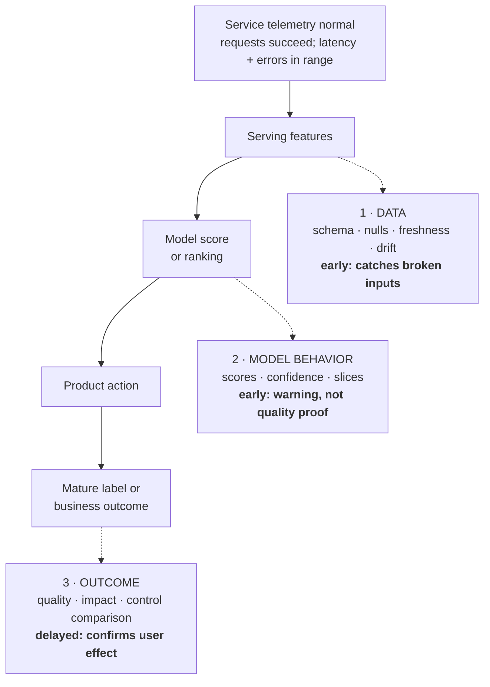

> *Asked in: ML platform and senior MLE interviews.*

The L4 candidate proposes "monitor accuracy in production." The L6 candidate monitors at three layers (data, model, outcome) and knows what each catches.

## What ML monitoring is for

Standard service monitoring (uptime, latency, error rates) tells you if the *service* is working. ML monitoring tells you if the *model* is working. They're separate problems.

ML failures are often silent: the service runs, requests succeed, predictions return, but the model has degraded because data drifted, features broke, labels shifted, or the world changed. You won't notice from logs.

**Learning objective:** Locate the earliest monitoring layer that can detect a failure, and distinguish an early warning from delayed evidence that users were harmed.

<!-- visual:ml-monitoring-observability-layers -->

<strong>Read it this way:</strong> follow the solid serving path first: every request can complete even when the ML system is wrong. Then read each dashed tap at the point where its evidence exists. Data checks catch broken or stale inputs earliest; output checks expose changed behavior but cannot prove degraded quality; only mature labels or business outcomes confirm user impact, and they arrive last. Keep service telemetry as a separate guardrail rather than treating it as model health.

## What an L5 answer sounds like

> "Three layers:
>
> **Layer 1: data quality.**
> - Feature distributions: track per-feature mean, std, percentiles, null rates. Alert on drift.
> - Schema: alert on missing features, type changes.
> - Freshness: feature staleness lag, alert if it exceeds SLA.
>
> **Layer 2: model behavior.**
> - Prediction distribution: shape and percentiles of model output scores.
> - Per-segment predictions: model behavior on important slices (user-tier, geography, content type).
> - Confidence drift: rising or falling average confidence is often a leading indicator of degraded performance.
>
> **Layer 3: outcomes.**
> - Direct metric tracking: accuracy / AUC / NDCG when labels are available.
> - Business metric correlation: when ground truth is delayed (e.g., next-day return), monitor proxies.
> - Online metric vs control: if running multiple models, compare ongoing performance.
>
> Plus standard service monitoring (latency, error rates, throughput, resource utilization).
>
> Alerts on each layer go to different audiences: data quality to data eng, model behavior to ML eng, outcomes to product."

This is L5. Three layers, what to track at each.

## What an L6 answer adds

> "...practical things:
>
> **Drift detection: choice of test matters.** Common tests: KS for continuous features, chi-square for categorical, PSI (population stability index) for both. None are perfect. Alert thresholds are tuned per feature based on historical noise; sensitive features have tighter thresholds, noisy features looser.
>
> **Drift doesn't always mean a problem.** Seasonal patterns, marketing campaigns, product launches all cause legitimate drift. Distinguishing legit drift from anomaly requires either historical context (per-day-of-week baselines) or human review of alerts. Most monitoring failures are too many alerts → alert fatigue → real alerts ignored.
>
> **Per-slice monitoring catches what aggregates hide.** Aggregate metrics can look stable while a critical user segment regresses. Pre-define important slices (paying customers, high-volume queries, regulated content); monitor each separately.
>
> **The hardest layer to monitor is outcome, because labels are delayed.** Strategies: (1) proxy metrics that move quickly (engagement, regeneration rate), (2) periodic random sample audit (label a small sample with full delay, use to calibrate proxy metrics), (3) monitor confidence drift as a leading indicator of accuracy drift.
>
> **Monitor for label drift, not just feature drift.** Model retrained on stale labels degrades against current production. Track label distribution shift over time.
>
> **Shadow deployments for new models** are part of the monitoring system, not a separate concern. Run a candidate model in parallel with the production model; compare prediction distributions and (where labels exist) outcomes. Catches issues before A/B test exposes them to users.
>
> **Cost is a metric.** Inference cost per request, GPU utilization, batch effectiveness. Cost regressions are easy to ship and easy to miss; monitor explicitly."

## Tells that get you a strong-hire vote

- You name **three layers** (data, model, outcome).
- You bring up **drift tests** with awareness that thresholds need tuning.
- You insist on **per-slice monitoring**.
- You discuss **outcome layer's delay problem** and proxy strategies.
- You mention **shadow deployments** as part of monitoring.
- You include **cost** as a monitored metric.

## Tells that get you down-leveled

- "Monitor accuracy" with no other layer.
- No drift detection.
- No slicing.
- Treating ML monitoring as a subset of service monitoring.

## Common follow-up

"How do you avoid alert fatigue?"

The L6 answer:

> "Several patterns. (1) Tier alerts by severity: page-worthy vs slack-worthy vs dashboard-only. Most drift falls in dashboard-only. (2) Tune thresholds per feature based on historical noise; the threshold that works for stable features over-alerts on noisy ones. (3) Group alerts: a single 'data pipeline degraded' summary covers many feature alerts that all stem from one root cause. (4) Require alert acknowledgment with explanation; helps build muscle memory and identifies recurring false alarms to be tuned. (5) Quarterly review of alert volume and meaningful-action rate; if < 30% of alerts result in action, you have alert fatigue and need to recalibrate."

---

*Related: [multi-team ML platform design](/questions/design-multi-team-ml-platform/), [ML data lineage and versioning](/concepts/ml-data-lineage-versioning/), [delayed and selective labels](/concepts/delayed-labels-selective-labels-feedback-loops/), and [A/B testing for ML systems](/concepts/ab-testing-for-ml/).*
