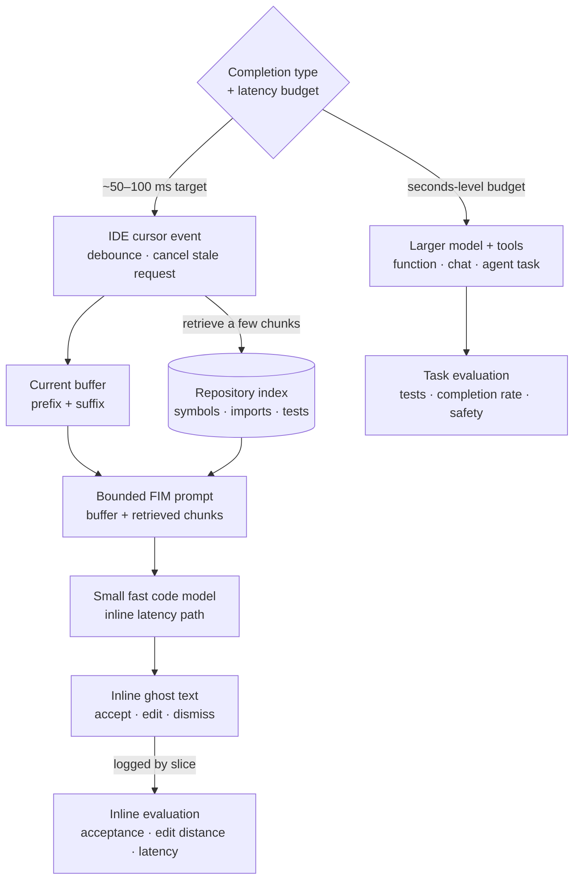

> *Asked in: LLM-team and developer-tooling interviews.*

The L4 candidate proposes "use Codex / Claude / GPT-4 in an IDE." The L6 candidate first asks what completion type, what scope of context, and what acceptance metric, then designs.

## Frame before architecture

Three scoping questions:
1. **Completion type**: single-line / multi-line completion, function generation from comment, multi-file refactor, agentic task completion?
2. **Context**: just the current file, the open files, the whole repo, the dependency graph?
3. **Where it runs**: hosted (latency: ~500ms), local (privacy and offline)?

Each answer changes the architecture meaningfully.

## What an L4 answer sounds like

> "Hook GPT-4 up to the IDE, send the current file as context, return completions."

This is a plausible v0. It will be slow, expensive, and miss what good coding assistants do well (relevant context, fast inline completion). You've used coding assistants but haven't built one.

## What an L5 answer sounds like

> "Assume the use case is inline-completion in an IDE for a developer working in a multi-file repo. Architecture:
>
> **Two-tier model strategy.** Inline (single-line, multi-line) completions need ~50-100ms latency, so use a small fast model (3-8B). 'Generate this function' or chat-style completions can use a larger model (30-70B+) with ~1-2s latency.
>
> **Context retrieval.** Beyond the current file, retrieve relevant context: same-file recent edits, open file contents, repository-aware retrieval (BM25 or embedding search over the repo), import-graph aware (pull in definitions of imported symbols). Cap context size based on what each tier model can handle.
>
> **Prompt structure.** Fill-in-the-middle (FIM) format for inline completion: prefix, suffix, and the position to fill. Trained models support this format directly.
>
> **Eval**: per-completion metrics (acceptance rate, edit-distance from completion to final code), per-language slicing, per-task-type slicing (single-line vs function-generation). Compare against a baseline (the previous model, no completion at all).
>
> **Privacy and security**: code can contain secrets, PII, regulated data. Filter completions for credentials; respect repo-level enterprise privacy policies; for sensitive customers, offer self-hosted or on-prem deployment."

This is L5. Scoped use case, multi-tier model, context retrieval, eval framework, security.

<!-- visual:coding-assistant-two-latency-paths -->

<strong>Read it this way:</strong> choose the product and latency contract before choosing the model. Follow the inline branch: a cancelable IDE event combines prefix and suffix with a small set of retrieved repository chunks, then a fast model returns ghost text and logs acceptance-quality evidence. Function, chat, and agentic work belongs on the separate seconds-budget branch and needs task-level verification. Original schematic informed by the <a href="https://arxiv.org/abs/2207.14255">FIM paper</a>, <a href="https://arxiv.org/abs/2303.12570">RepoCoder</a>, and <a href="https://docs.github.com/en/copilot/concepts/context/repository-indexing">GitHub's repository-indexing documentation</a>.

## What an L6 answer adds

> "...practical things:
>
> **Speculative execution for inline completion.** Generate completions speculatively as the user types, with debouncing. Cancel and re-issue when the prefix changes. Latency feels much better than waiting for a request after each keystroke.
>
> **Caching at multiple levels.** KV-cache reuse across requests sharing a prefix (most inline completions in the same file share most of their prefix). Embedding cache for context retrieval. Reduces both latency and cost.
>
> **Suffix-aware completion (FIM)** dramatically improves multi-line code completion. The model sees what comes *after* the cursor, not just before. Models trained with FIM (StarCoder, DeepSeek-Coder, CodeLlama) outperform left-to-right models for IDE use.
>
> **Repository-level context** is where products differentiate. The hard part isn't the model; it's deciding which 4-8 chunks of repo context are most relevant to the current cursor position. This involves: same-symbol recent edits, recent navigation, structural neighbors (the function being called, the class being subclassed), test files referencing the current code.
>
> **Agentic task completion** is a different product than completion. Plan / tool-call / verify loop, with execution against the user's repo and tests. Eval is task-completion-rate on real tasks (SWE-bench style), not per-token accuracy.
>
> **Distillation from a strong model down to a fast one** is the standard cost-quality trade. Train the small fast model on the outputs of the large strong one for the production prompt distribution. Often beats general-purpose small models by a wide margin on the production task."

## Tells that get you a strong-hire vote

- You scope **completion type, context scope, hosting** before architecture.
- You bring up **two-tier model strategy** (fast small for inline, slow large for generation).
- You name **FIM** as the right prompt format for inline completion.
- You distinguish **repo-level context retrieval** as the differentiator.
- You discuss **caching at multiple levels** for cost and latency.

## Tells that get you down-leveled

- "Just use GPT-4." (Too slow for inline completion.)
- No context retrieval beyond the current file.
- No mention of FIM.
- No latency budget.

## Common follow-up

"How would you train the small fast inline-completion model?"

The L6 answer:

> "Three options, ranked by complexity. (1) Use an off-the-shelf code model in the 3-7B range (DeepSeek-Coder, StarCoder, etc.) with FIM training. (2) Continue-pretraining one of these on your customer's code (with privacy controls) for substantial domain alignment. (3) Distill from a much larger model on your production prompt distribution: collect prompts and large-model completions from production traffic, train the small model to reproduce them. Distillation usually wins on the production task at the cost of inflexibility on out-of-distribution prompts."

---

*Related: [design an AI coding product](/questions/design-ai-coding-product/), [enterprise agent-platform design](/questions/design-enterprise-agent-platform/), [build evals for a coding assistant](/questions/evals-for-coding-assistant/), and [reduce LLM inference cost](/questions/reduce-llm-inference-cost-10x/).*
