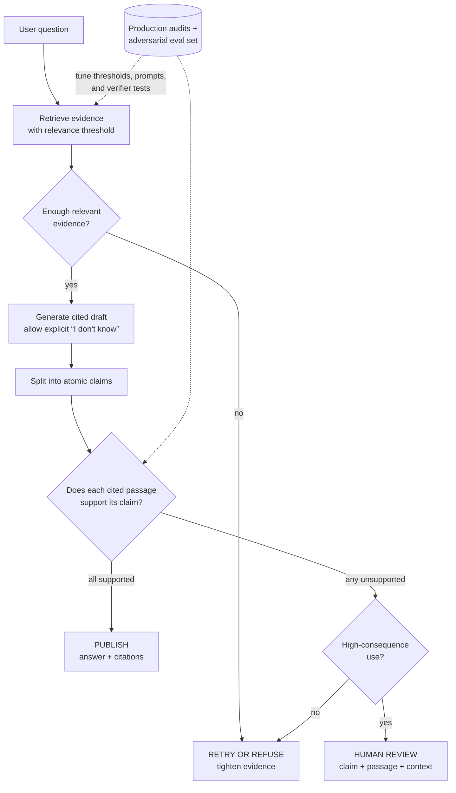

> *Asked in: LLM-team interviews, especially in regulated domains (healthcare, fintech, legal-tech).*

The question separates candidates who have *deployed* LLMs from those who have *demoed* them. Hallucinations are managed, not solved; the senior answer is a layered system that catches different hallucination types at different stages.

## What an L4 answer sounds like

> "We can use RAG to ground the model in real documents, then the hallucination problem mostly goes away. We can also use a fact-checking model to verify outputs, and use temperature 0 to make it more deterministic."

Each of these is partially right and individually insufficient. RAG reduces hallucinations of facts the documents contain but does nothing for hallucinations of facts they don't. Fact-checking models hallucinate too. Temperature 0 affects determinism, not factuality.

you've read about hallucinations in tutorials but haven't fought them in production.

## What an L5 answer sounds like

> "Hallucinations come from a few different mechanisms and each needs a different mitigation:
>
> 1. **Knowledge gaps**: the model doesn't know the answer and confabulates. Fix: ground in retrieval (RAG), instruct to refuse if not in source.
> 2. **Reasoning errors**: the model has the facts but draws a wrong conclusion. Fix: chain-of-thought, multi-step decomposition, sometimes multiple sampled paths with self-consistency.
> 3. **Context confusion**: the model conflates facts from different parts of the input. Fix: shorter context, explicit citation requirements, structured prompts.
> 4. **Confident wrong outputs in long-tail**: rare cases where the model is just confident and wrong. Fix: human-in-the-loop for high-stakes decisions, confidence calibration, post-hoc verification.
>
> In production I'd build a layered system:
>
> - **Pre-generation**: ground the model in retrieved documents; restrict the prompt to ask for cited claims.
> - **Generation**: instruct 'if the answer is not in the provided sources, say so'; use a structured output format that forces citations.
> - **Post-generation**: a verification pass that checks each claim against its cited source. Flag ungrounded claims; either retry or surface to the user with a warning.
> - **Out-of-band**: a periodic eval set focused on hallucination, with metrics tracked release-over-release.
>
> Importantly: the goal isn't zero hallucinations, that's not achievable with current technology. The goal is *acceptable hallucination rate for the use case*, with detection and graceful handling for the rest."

**Learning objective:** Trace how evidence, claim-level verification, and consequence determine whether a generated answer is published, retried, refused, or reviewed by a human.

<!-- visual:hallucination-claim-release-gates -->

<strong>Read it this way:</strong> follow the solid path and notice that retrieval is only the first gate. A draft earns release only when each atomic claim is supported by its cited passage; unsupported claims branch by consequence into retry or refusal versus human review. The verifier is another imperfect model component, so dashed production audits improve its tests and thresholds rather than declaring the system solved. Original synthesis informed by <a href="https://arxiv.org/abs/2005.11401">Lewis et al. on retrieval-augmented generation</a>, <a href="https://aclanthology.org/2023.emnlp-main.398/">Gao et al. on citation correctness</a>, <a href="https://aclanthology.org/2023.emnlp-main.741/">Min et al. on atomic factual evaluation</a>, and the <a href="https://doi.org/10.6028/NIST.AI.600-1">NIST Generative AI Profile</a>.

This is L5. You've decomposed the problem, named specific mitigations per type, and acknowledged the operational reality.

## What an L6 answer sounds like

The L6 answer adds the things that come from running this in production for a couple of years:

> "...and a few more things I've learned the hard way:
>
> **Citation-checking is harder than it sounds.** A model can cite a passage that doesn't actually support its claim. The standard pattern is to use an LLM-based verifier that takes the (claim, cited passage) pair and decides whether the passage supports the claim. The verifier itself can hallucinate, but its error rate is much lower than the answer model's because the task is more constrained. This catches a meaningful fraction of the worst hallucinations in production.
>
> **Refusal is a quality, not a failure.** A model that says 'I don't know' on the questions it shouldn't answer is *better* than one that confidently makes things up. Train your team and your eval to reward refusals on out-of-scope questions.
>
> **Pure RAG isn't enough for adversarial inputs.** Users will ask things that look like the documents but aren't actually in them. The model will pattern-match and hallucinate. Mitigations: explicit instruction to refuse if no relevant passage found, retrieval thresholds (don't pass low-confidence retrievals to the model), distinct prompt branches for 'high confidence retrieval' vs 'low confidence retrieval'.
>
> **Self-consistency is real but expensive.** Sample N completions with high temperature, take the majority answer. Improves accuracy on reasoning tasks at N times the cost. Useful for high-stakes single-shot questions; not viable for high-throughput.
>
> **Calibration matters more than confidence scores.** Most LLMs report confidence (or you can get a probability from logprobs), but those numbers are uncalibrated; a 'highly confident' wrong answer is just as wrong. The most reliable confidence signal in production tends to be *consistency across multiple samples*: if 5 sampled answers agree, the model is probably right; if they disagree, it's probably wrong, regardless of any individual confidence score.
>
> **The hardest hallucinations are subtle.** Not 'the capital of France is Berlin', those are easy to catch. The hard ones are 'the SOC analyst should investigate this alert because it's correlated with X' where X is a plausible-sounding but wrong correlation. These slip past most automated checks. The only defense is human review of high-stakes outputs and a strong eval set built from real failure cases."

This is L6. You've gone past the techniques into the *operational discipline* of managing hallucinations in a real product, with specific examples from your own experience.

## The tells that get you a strong-hire vote

- You **decompose the problem by hallucination type**: not as one undifferentiated thing.
- You acknowledge that **zero hallucinations is not the goal**; acceptable rate is.
- You bring up **citation-checking as a separate verification step**.
- You mention **calibration vs raw confidence** and that LLMs are uncalibrated.
- You distinguish **easy hallucinations** (factual errors) from **subtle ones** (plausible-but-wrong reasoning).

## The tells that get you down-leveled

- "Just use RAG", oversimplifies; doesn't address knowledge-not-in-source cases.
- "Use a fact-checking API", vague; the LLM-team interviewer wants to know how *you* would build this.
- "Temperature 0", affects determinism, not factuality.
- No mention of refusal as a valid output.
- No mention of A/B-testing or release-over-release tracking of a hallucination metric.
- Treating the question as a model-choice question instead of a system-design question.

## A common follow-up

"How would you measure your hallucination rate?"

The L6 answer:

> "Hallucination rate is hard to measure because the ground truth is judgment, not a label. I'd build it in layers:
>
> 1. **A golden set of ~200 question/answer pairs** with hand-labeled correct answers. Run the model, have humans (or an LLM-judge calibrated against humans) compare outputs to references. Compute a faithfulness rate.
> 2. **For RAG specifically: claim-level verification**: decompose each output into atomic claims, check each against the retrieved sources. Compute the fraction of unsupported claims.
> 3. **Targeted adversarial set**: questions designed to elicit hallucinations (out-of-scope queries, questions about non-existent things, questions with subtle factual traps). Track the refusal rate and the hallucination rate separately.
> 4. **Production sample audit**: randomly sample N production responses per week, have humans review.
>
> The numbers from these don't combine into a single 'hallucination rate' because they measure different things. I'd report all of them and tell the team which trends to watch."

If you can have this conversation fluently, you're at the senior bar.

---

*Related: [How would you evaluate an LLM application?](/questions/how-would-you-evaluate-an-llm-application/), [Designing a RAG system that actually works](/guides/designing-rag-that-works/), [LLM Evals essay](/guides/llm-evals-the-hardest-part/).*
