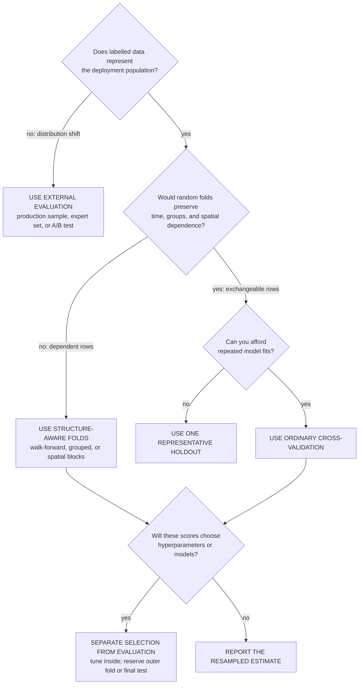

> *Asked in: ML breadth at every level.*

The interviewer is checking whether you treat cross-validation as a reflex or as a choice. The L4 candidate uses it everywhere. The L6 candidate names specific cases where it's the wrong tool.

Learning objective

Choose an evaluation that matches the deployment question before choosing folds.

<!-- visual:cross-validation-fit-the-question -->

<strong>Read it this way:</strong> decide what must remain unseen before deciding how many folds to run. Distribution shift calls for evaluation on the target population, dependence calls for boundaries that keep future, groups, or nearby locations out of training, and prohibitive cost calls for one representative holdout. If a resampled score selects the model, keep an outer fold or final test untouched so selection does not grade itself. Original synthesis informed by <a href="https://scikit-learn.org/stable/modules/cross_validation.html">scikit-learn's cross-validation guide</a> and <a href="https://jmlr.org/papers/v11/cawley10a.html">Cawley and Talbot's analysis of selection bias</a>.

## What an L4 answer sounds like

> "Cross-validation is the standard way to evaluate a model. I'd always use 5-fold or 10-fold CV unless the dataset is really large."

This is fine for textbook ML. It misses several real-world cases where CV is misleading or wasteful.

## What an L5 answer sounds like

> "I'd not use cross-validation when:
>
> 1. **The data has structure CV breaks.** Time series (random folds leak future info), grouped data (random folds leak across groups, e.g., the same patient in train and test), spatial data (nearby points are correlated). For these I'd use time-aware splits, group splits, or spatial blocking.
>
> 2. **The training cost is too high.** For deep networks with day-long training, 10x the cost is impractical. A single hold-out validation set with a representative distribution is the right call.
>
> 3. **There's a separate, decisive evaluation signal.** If you have a held-out production traffic sample, an A/B test, or a domain-expert evaluation set, that signal beats CV on the training distribution.
>
> 4. **The dataset is large enough.** Past ~10K samples for tabular tasks, the variance reduction from CV is small compared to a single well-chosen split."

This is L5. You've named the cases concretely and given the right alternative for each.

## What an L6 answer sounds like

> "...a few subtler points:
>
> **CV doesn't fix distribution shift.** If your test data has a different distribution than your training data (which it usually does in production), CV on training data tells you about training-distribution generalization, not deployment performance.
>
> **CV can mislead model selection at scale.** With many candidate models and small CV variance, the best CV score is often a noisy lucky pick. Repeated CV (averaging over multiple random splits) reduces this. Bootstrap-CI on the CV difference is more honest than 'model A beat model B.'
>
> **Nested CV is needed for honest hyperparameter selection.** Picking hyperparameters with CV and reporting that same CV score as your generalization estimate is a form of leakage. Nested CV (outer loop for evaluation, inner loop for hyperparameter tuning) is the principled fix, but it's expensive and rarely done in practice. Most people use a separate held-out test set instead."

## Tells that get you a strong-hire vote

- You name **specific structures** that break CV (time, grouping, spatial).
- You discuss **cost** as a legitimate reason to skip.
- You mention **distribution shift** as a confound CV doesn't address.
- You bring up **nested CV** (or the alternative: separate test set) for honest hyperparameter selection.

## Tells that get you down-leveled

- Treating CV as universally applicable.
- Not knowing what time-series CV looks like.
- "Use 5-fold for everything."
- Confusing CV with bootstrap or with a held-out test set.

## Common follow-up

"How would you cross-validate a time series?"

The L6 answer:

> "Walk-forward (also called expanding-window or sliding-window) CV: train on data up to time t, test on (t, t+h]. Slide forward, repeat. Never sample test points from before training points. The fold count and window size are tuned to the autocorrelation length and the prediction horizon."

---

*Related: [Walk me through the bias-variance tradeoff](/questions/bias-variance-tradeoff/), [A/B testing for ML systems](/concepts/ab-testing-for-ml/).*
