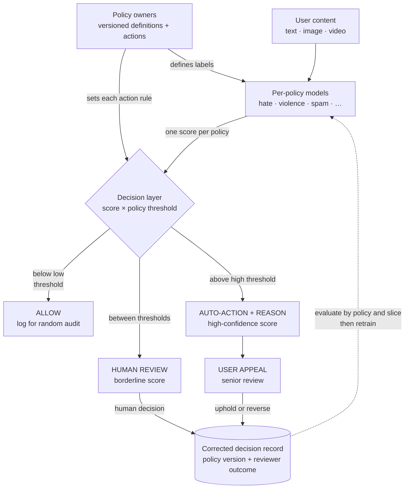

> *Asked in: trust-and-safety, social-platform, and LLM-deployment interviews.*

The L4 candidate proposes "a classifier that filters bad content." The L6 candidate separates policy specification from model implementation, designs the human-review path, and addresses adversarial robustness and per-policy calibration.

## What makes moderation hard

1. **Policy is fuzzy and contested.** "Hate speech" has no universal definition; the platform's policy is a specification.
2. **Users adapt.** What's flagged today is rephrased tomorrow.
3. **High-stakes both ways.** Over-moderation suppresses legitimate speech; under-moderation harms users.
4. **Scale.** Billions of items; can't human-review everything.
5. **Multi-policy.** Hate speech, sexual content, violence, spam, fraud, copyright are different tasks with different policies and costs.

## What an L5 answer sounds like

> "Architecture, in layers:
>
> **Layer 1: triage by score.** A multi-task classifier (or one model per policy) outputs scores for each policy violation. Most content is low-risk and gets allowed. High-risk content is flagged.
>
> **Layer 2: action determination.** Per policy, decide what to do based on the score:
> - Below low threshold: allow.
> - Between low and high thresholds: route to human review.
> - Above high threshold: auto-action (remove, reduce reach, age-gate, depending on policy).
>
> **Layer 3: human review.** Trained moderators review the routed content. Their decisions feed back as labels for retraining.
>
> **Layer 4: appeals.** Users can appeal automated actions; appeals route to senior reviewers; final decisions feed back as labels.
>
> **Eval**: per-policy precision and recall at multiple thresholds. Calibrate against trained moderator decisions on a held-out set. A/B-test policy threshold changes with explicit business and harm-floor metrics."

This is L5. Layered architecture with human-in-the-loop and feedback.

## What an L6 answer adds

> "...practical things:
>
> **Policy and model are separate concerns.** The platform decides policy; ML implements it. Conflating the two creates ML teams that look like they're making policy decisions (which they shouldn't be unilaterally). Document the policy in plain language; build the model to that spec; track 'model agreement with policy spec' as a metric, not 'model agreement with current model behavior.'
>
> **Per-policy thresholds, not a single 'bad' threshold.** Different policies have different cost structures. Hate speech: high cost of false negative, willing to tolerate more false positives. Spam: high volume, lower cost per error, optimize differently.
>
> **Adversarial robustness.** Users will test the system, find phrasings that bypass it, and share. Augment training data with known evasion patterns; track 'evasion rate' (flagged content that mutates to unflagged versions); maintain a fast-update path for new patterns.
>
> **Calibrate on minority groups separately.** A model with overall 95% accuracy can have 70% accuracy on content from a specific demographic, language, or cultural context. Required to track per-slice; required to fix gaps.
>
> **Borderline content is the hardest.** Models score most things confidently; the high-judgment content is in the middle of the score distribution. Humans should review borderline cases, not extremes; calibrate routing thresholds so review queue is high-value.
>
> **Counterfactual eval for false negatives.** False positives are visible (users complain). False negatives are invisible by definition (the bad content stayed up). Track via periodic random audits and via reports from users / partners.
>
> **The appeals process is part of the model**, not just a customer service function. Appeals data is the highest-quality label source you have; treat it as a first-class training signal.
>
> **Explainability is a regulatory and trust issue.** When auto-actioning content, surface a reason ('flagged for hate speech against [protected category]'); helps user understanding and reduces disputes."

<!-- visual:content-moderation-governed-decision-loop -->

<strong>Read it this way:</strong> follow one policy at a time. Its versioned definition shapes labels and action thresholds; its model emits a score; the decision layer routes that score to allow, human review, or explained auto-action. Review and appeal outcomes return as evidence for evaluation and retraining, but the feedback loop never gives the model authority to rewrite policy. Original schematic informed by <a href="https://doi.org/10.1177/2053951719897945">Gorwa, Binns, and Katzenbach</a>, the <a href="https://www.santaclaraprinciples.org/">Santa Clara Principles</a>, and the <a href="https://doi.org/10.6028/NIST.AI.100-1">NIST AI RMF</a>.

## Tells that get you a strong-hire vote

- You **separate policy from model**.
- You name **per-policy thresholds** rather than one global score.
- You make **human review and appeals** part of the architecture.
- You bring up **adversarial robustness** with continuous retraining.
- You insist on **per-slice fairness eval**.
- You name **borderline routing** as the high-value review queue.

## Tells that get you down-leveled

- One classifier, one threshold.
- No human-in-the-loop or appeals process.
- No mention of adversarial drift.
- No fairness slicing.

## Common follow-up

"How do you handle policy changes? E.g., the company updates its definition of hate speech."

The L6 answer:

> "Several layers. First, the policy spec is a versioned document; changes go through a review process and have an effective date. Second, retrain the model on data labeled under the new policy (re-label a held-out set first; if old labels are now misclassified, retrain; otherwise just patch the rules layer). Third, track 'agreement with current policy' over time as a metric; if the model drifts from policy faster than retraining can keep up, that's a flag for accelerated retraining cadence. Fourth, communicate the change to moderators and users via release notes; appeals processed under the old policy may need re-review."

---

*Related: [How do you handle hallucinations in production?](/questions/handle-hallucinations-in-production/), [How do you deal with class imbalance in 2026?](/questions/class-imbalance/), [A/B testing for ML systems](/concepts/ab-testing-for-ml/).*
