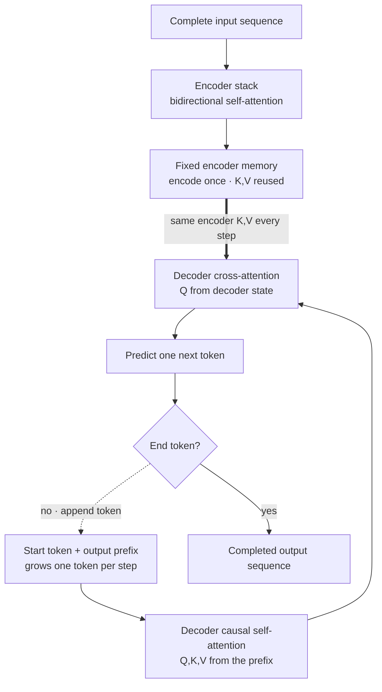

## Summary

An **encoder-decoder** model has two networks: an **encoder** that reads the input sequence and produces hidden representations, and a **decoder** that generates the output sequence one token at a time, attending to both the encoder's representations and the partial output so far.

Encoder-decoder is the canonical architecture for **sequence-to-sequence** tasks where the input and output may differ in length, structure, or modality:

- Machine translation (original transformer, 2017).
- Summarization (BART, T5).
- Text-to-speech.
- Image captioning, image-to-text.
- Modern diffusion models (text encoder + denoising decoder).

Modern decoder-only LLMs (GPT, Llama, Mistral) are the dominant chat architecture, but encoder-decoder remains better for tasks with a *clear input-output split* and constrained output length (translation, summarization).

## The structure

<!-- visual:encoder-once-decoder-loop -->

<strong>Read it this way:</strong> at inference, encode the complete input once. The decoder's causal self-attention reads only the output prefix generated so far; its cross-attention then uses the decoder state as Q and the unchanged encoder memory as K,V. Append one predicted token and repeat the decoder path, not the encoder path. Original synthesis checked against the <a href="https://arxiv.org/abs/1706.03762">Transformer paper</a>, the original <a href="https://arxiv.org/abs/1409.3215">sequence-to-sequence formulation</a>, and <a href="https://huggingface.co/docs/transformers/en/model_doc/encoder-decoder">Hugging Face's implementation documentation</a>.

Each decoder block has two attention sub-blocks:

- **Self-attention** over previous decoder outputs (causal masking).
- **Cross-attention** with $Q$ from decoder state, $K, V$ from encoder hidden states.

## Encoder-only vs. decoder-only vs. encoder-decoder

| Model class | Use cases | Examples |
|------------|-----------|----------|
| **Encoder-only** | Embeddings, classification, retrieval | BERT, RoBERTa, sentence-T5 |
| **Decoder-only** | Generation, chat, code | GPT-2/3/4, Llama, Mistral, Claude |
| **Encoder-decoder** | Translation, summarization, structured output | T5, BART, mT5, FLAN-T5 |

## Why decoder-only models took over chat

Several reasons:

1. **In-context learning** emerged in decoder-only LLMs at scale; the encoder-decoder split is unnecessary if the task is conveyed in the prompt.
2. **Simpler training**: one stack of identical blocks, one objective (next-token prediction).
3. **Easier to scale**: weight-sharing between encoder and decoder is awkward; decoder-only just adds layers.
4. **Single inference path**: no separate encoder pass.

For tasks where the input is fixed and the output is a transformation of it (translation, summarization, code completion from a spec), encoder-decoder still has efficiency advantages.

## Variants and their distinctions

- **Original transformer** [(Vaswani 2017)](https://arxiv.org/abs/1706.03762): encoder-decoder for NMT.
- **BERT**: encoder-only, masked-language-model objective.
- **GPT**: decoder-only, autoregressive next-token.
- **T5** [(Raffel 2019)](https://arxiv.org/abs/1910.10683): encoder-decoder, span-corruption objective; everything is text-to-text.
- **BART**: encoder-decoder, denoising autoencoder.
- **FLAN-T5**: T5 + instruction fine-tuning.

## Cross-attention complexity

Cross-attention from decoder to encoder is $O(n_\text{out} \cdot n_\text{in})$. For long inputs (long-document summarization), this dominates. Variants:

- **Sparse cross-attention**: BigBird-style for long inputs.
- **Encoder caching**: encoder runs once per input; cached for all decoder steps.

## Common pitfalls

- **Confusing T5 (encoder-decoder) and BERT (encoder-only)**. Different training objectives, different uses.
- **Using decoder-only for translation when encoder-decoder is better.** Decoder-only translation works but encoder-decoder usually trains faster and gives slightly better quality at smaller scale.
- **Sharing position encodings between encoder and decoder naively.** Often they need different schemes (relative for encoder, RoPE for decoder).
- **Treating encoder hidden states as static during decoding.** They are; the encoder runs once per input. Don't recompute.

## Related

- [Transformer architecture](/concepts/transformer-architecture/). Block-level structure.
- [Attention mechanism](/concepts/attention-mechanism/). Both self- and cross-attention.
