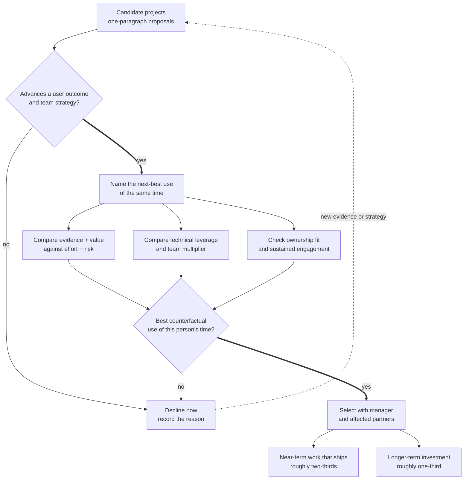

> *Asked in: behavioral round at every senior level.*

The L4 candidate names interesting topics. The L6 candidate describes a process for choosing among many possible projects, with specific recent examples of trade-offs they made.

## What an L4 answer sounds like

> "I work on whatever my manager prioritizes, plus side projects that I find interesting."

True for L4. Junior ICs are not expected to set their own direction. you're being honest, but you're at L4.

## What an L5 answer sounds like

> "Three factors:
>
> 1. **User and business value.** Will this measurably improve a metric the team cares about? Is the impact-per-effort ratio favorable?
>
> 2. **Technical leverage.** Does this build a foundation other things depend on? Or is it a one-off?
>
> 3. **My role on the team.** Where am I uniquely positioned to add value vs delegating? What's the team's skill gap I can fill?
>
> When several projects are candidates, I'll write a one-paragraph proposal for each and discuss with my manager. The conversation often reframes the choice."

This is L5. You have a framework, you involve your manager, you're aware of your position on the team.

## What an L6 answer adds

> "...some additional dimensions:
>
> **Long-term vs short-term.** Some work pays off quickly (a model improvement that ships in a quarter); some pays off over years (a foundational infrastructure investment, a new research direction). I balance the portfolio explicitly: roughly two-thirds short-term work that ships, one-third longer-term investment.
>
> **Counterfactual impact.** The right question isn't 'is this project valuable?' but 'is this project more valuable than the next-best thing I could do?' For senior engineers, the cost of a wrong choice isn't the project that failed; it's the project that wasn't done.
>
> **Strategic alignment.** Is this in line with where the team and the broader org are going over the next 12-18 months? Even valuable projects in the wrong strategic direction tend to die or get re-routed.
>
> **Team multiplier effects.** Some projects empower other engineers (shared infrastructure, eval frameworks, internal tools); some only benefit me. At senior levels, multiplier work is often the highest impact even when individual project metrics are smaller.
>
> **Honest assessment of my own engagement.** If I'm dragging through a project I should be excited about, that's a signal. Either the project isn't actually well-scoped, or I'm not the right person, or my interests have shifted. Worth surfacing before I burn months on it."

<!-- visual:work-prioritization-counterfactual-portfolio -->

<strong>Read it this way:</strong> do not ask only whether a project is valuable. First remove work that misses user outcomes or strategy, then compare each survivor with the next-best use of the same person's time. Select a portfolio rather than a single winner, so near-term delivery and longer-term leverage both receive deliberate capacity. The two-thirds/one-third split is the answer's example, not a universal rule. Original synthesis checked against <a href="https://ntrs.nasa.gov/citations/20170001761">NASA's decision-analysis guidance</a>, <a href="https://openstax.org/books/principles-economics-3e/pages/2-1-how-individuals-make-choices-based-on-their-budget-constraint">OpenStax on opportunity cost</a>, and <a href="https://doi.org/10.1111/1467-9310.00225">Cooper, Edgett, and Kleinschmidt on project portfolios</a>.

## Tells that get you a strong-hire vote

- You have an **explicit framework**, not just a list of considerations.
- You bring up **counterfactual impact** (vs the next-best alternative).
- You name **strategic alignment** as a separate axis from technical merit.
- You discuss **multiplier effects** of platform / shared work.
- You can give a **specific recent example** of a project you chose vs one you declined.

## Tells that get you down-leveled

- "I work on what's most interesting" with no business framing.
- No mention of strategic alignment.
- No examples of trade-offs you made.
- Treating prioritization as your manager's problem alone.

## Common follow-up

"Tell me about a time you decided not to do a project that was assigned to you."

The L6 answer should describe:
- The project and why it was assigned.
- The reasoning for declining (better alternative, scope creep, mismatch with team strategy).
- How you raised the concern with the assigning party.
- The eventual decision and what shipped instead.
- Any reflection on whether you'd handle it the same way again.

The signal is whether you can productively push back, not whether you've ever said no.

---

*Related: [The 5 things every applied scientist interview is testing for](/guides/five-things-as-interview-tests/), [senior through senior-principal ML scope](/guides/l5-vs-l6-faang-ml/).*
