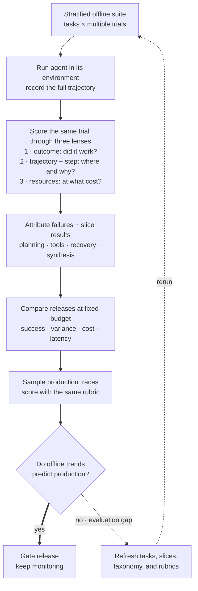

> *Asked in: LLM-team and agent-platform interviews.*

The L4 answer applies single-shot LLM eval to agents (and gets misleading numbers). The L6 answer evaluates trajectories at multiple granularities and tracks the offline-online correlation explicitly.

## Why agent eval is harder

A chat model produces one output per input. An agent produces a *trajectory*: plan, tool calls, intermediate results, final answer. Each step can fail, and failures compound. Standard end-to-end eval can't tell you whether the planner was wrong, the tool returned bad data, or the synthesis was bad.

<!-- visual:agent-eval-diagnostic-flywheel -->

<strong>Read it this way:</strong> do not choose between final success and trajectory grading; score the same repeated run through outcome, diagnostic, and resource lenses. Turn those signals into named failure modes and fixed-budget release comparisons, then apply the same rubric to production traces. If offline and production trends diverge, repair the evaluation before trusting it. Original synthesis checked against <a href="https://arxiv.org/abs/2308.03688">AgentBench</a>, <a href="https://www.anthropic.com/engineering/demystifying-evals-for-ai-agents">Anthropic's agent-evaluation guidance</a>, and <a href="https://developers.openai.com/api/docs/guides/agent-evals">OpenAI's trace-grading guidance</a>.

## What an L4 answer sounds like

> "I'd run the agent on a benchmark of tasks and measure final-answer accuracy. Compare against a baseline model."

This treats the agent as a black box and gives you one number with no diagnostic value. You've used agents but haven't debugged one.

## What an L5 answer sounds like

> "Agent eval needs three levels:
>
> 1. **Final-task success.** Did the agent complete the task? Binary or rubric-graded. The headline number.
>
> 2. **Trajectory-level metrics.** Step count, tool-call accuracy, plan adherence, recovery from intermediate failures. Surfaces where the agent is *failing* (planning vs tool use vs synthesis).
>
> 3. **Step-level eval.** For each tool call: was it the right tool? Were the arguments correct? For each plan step: did it move toward the goal? Often graded by an LLM judge against a rubric.
>
> Build a golden set of ~100-300 tasks stratified by difficulty and category. Evaluate at all three levels per release. Track the offline-online correlation: does success on the eval set predict success in production?"

This is L5. You've broken the eval into the right levels and named the operational concern.

## What an L6 answer adds

> "...practical things:
>
> **Cost is a first-class metric for agents.** A 90% successful agent that takes 50 tool calls per task is often worse than an 85% successful agent that takes 5. Report cost per task, success at fixed cost, or Pareto curves.
>
> **Failure-mode taxonomy is the most useful artifact.** Categorize failures: planning errors, tool-call errors, hallucinated tool results, infinite loops, premature termination, refusal-when-should-have-tried. Track frequencies over releases. The taxonomy itself takes weeks to build but pays back forever.
>
> **Multi-turn evals are necessary for conversational agents.** Single-turn benchmarks miss issues that only appear under conversation drift. Build multi-turn scenarios with realistic user replies (often LLM-simulated, validated against real conversations).
>
> **Trajectory replay** is the agent equivalent of the 'read the outputs' practice in LLM eval. Watch the agent solve 10 tasks per week, end-to-end. Patterns you'll only see by watching: agents giving up too early, repeating the same failed action, asking for clarification when they shouldn't.
>
> **Production-online vs offline gap.** Real users phrase tasks differently than your eval set assumes. Sample 50 production traces per week, score them against your rubric, compare to your offline trends. If they diverge, the offline eval is overfit to its assumptions."

## Tells that get you a strong-hire vote

- You evaluate at **multiple granularities**: task, trajectory, step.
- You bring up **cost per task** and **Pareto curves**.
- You build a **failure-mode taxonomy**.
- You discuss **trajectory replay** as a debugging practice.
- You track the **offline-online correlation** explicitly.

## Tells that get you down-leveled

- "Run a benchmark and report accuracy."
- No step-level eval.
- No cost metric.
- Treating multi-turn as the same problem as single-turn.

## Common follow-up

"How do you handle stochasticity in agent eval?"

The L6 answer:

> "Two angles. (1) Run each task multiple times (5-10 samples) and report mean and variance; small differences may be noise. (2) For deterministic comparisons, fix temperature to 0 and seeds where possible. (3) For metrics like 'success rate', binomial confidence intervals are honest about uncertainty when N is small. The biggest mistake is reporting a single run as if it were the population mean: many 'X% better' claims about agents are within run-to-run noise."

---

*Related: [enterprise agent-platform design](/questions/design-enterprise-agent-platform/), [LLM Evals essay](/guides/llm-evals-the-hardest-part/), [How would you evaluate an LLM application?](/questions/how-would-you-evaluate-an-llm-application/), and [How do you handle hallucinations in production?](/questions/handle-hallucinations-in-production/).*
