> *Asked in: coding rounds at LLM-team and senior MLE interviews.*

The interviewer pastes a training loop with several bugs (typically 2 to 5). You read it, find the bugs, and explain the impact of each. The signal is your *procedure*, not your speed.

## Example: a bug-laden PyTorch loop

```python
import torch
import torch.nn as nn
import torch.optim as optim

model = MyModel()
optimizer = optim.Adam(model.parameters(), lr=1e-3)
criterion = nn.MSELoss()

for epoch in range(10):
    for x, y in dataloader:
        # forward
        pred = model(x)
        loss = criterion(pred, y)

        # backward
        loss.backward()
        optimizer.step()

        # eval inside training loop
        if epoch % 2 == 0:
            model.eval()
            val_pred = model(x_val)
            val_loss = criterion(val_pred, y_val)
            print(f"epoch {epoch} val loss: {val_loss}")
```

What's wrong (in order of severity):

1. **Missing `optimizer.zero_grad()`**. Gradients accumulate across batches; effective learning rate is N times larger than intended. Will likely diverge or produce wrong dynamics.

2. **MSE loss on what looks like a classification task** (the variable is `criterion = nn.MSELoss()` but `MyModel` may produce class logits). If classification: vanishing gradients on confident-wrong predictions; should be `nn.CrossEntropyLoss()`.

3. **`model.eval()` not followed by `model.train()`**. After the eval block, the model stays in eval mode (dropout off, batch norm using running stats). Training resumes with broken behavior.

4. **No `torch.no_grad()` around eval**. Validation forward pass builds a computation graph and stores activations, wasting memory. Should be wrapped in `with torch.no_grad():`.

5. **Validation on the same batch as training** (`x` is from training loader; the eval block uses `x_val` only for the eval forward). If `x_val` is a fixed pre-loaded batch, validation isn't representative; if not defined, the code crashes.

6. **No data movement to device**. If model is on GPU, `x` and `y` need to be moved (`x = x.to(device)`). Will crash or silently work on CPU.

```mermaid
flowchart TB
	accTitle: Missing resets let gradient and module-mode state leak into later training batches
	accDescr: The diagram follows two independent pieces of persistent state. In the gradient lane, batch one backward sets parameter gradients to g one and the optimizer step uses them. Without zero grad, batch two backward adds g two to the old g one, so the next step uses both. In the module-mode lane, model eval switches the module to evaluation mode. Without a later model train call, the next training forward still uses evaluation behavior. No grad is a separate local setting and does not restore training mode.
	subgraph G["PARAMETER .grad STATE"]
		G0["Start batch 1<br/>grad = None"] --> G1["backward()<br/>grad = g₁"]
		G1 --> G2["step()<br/>update uses g₁"]
		G2 -. "zero_grad() missing" .-> G3["Batch 2 backward()<br/>grad = g₁ + g₂"]
		G3 --> G4["step()<br/>stale g₁ is reused"]
	end
	subgraph M["MODULE MODE STATE"]
		M0["Training forward<br/>mode = train"] --> M1["model.eval()<br/>mode = eval"]
		M1 -. "model.train() missing" .-> M2["Next training forward<br/>still eval mode"]
	end
	class G0,M0 viz-input
	class G1,G2,M1 viz-state
	class G3,G4,M2 viz-warning
	class G0 viz-compact
```

<!-- visual:training-loop-persistent-state -->


<p class="diagram-caption"><strong>Read it this way:</strong> follow each lane into the next batch. <code>optimizer.step()</code> changes parameters but does not clear their <code>.grad</code> buffers, and <code>model.eval()</code> changes module behavior until <code>model.train()</code> changes it back. These are separate state leaks; <code>torch.no_grad()</code> only disables gradient recording inside its own context.</p>

## Senior debugging procedure (the actual signal)

> "I'd read the loop top to bottom and find issues in this order, by impact:
>
> 1. **Optimizer / gradient flow first.** Missing `zero_grad`, missing `optimizer.step`, detached tensors, `.item()` calls that drop gradient. These break training entirely.
>
> 2. **Loss function vs task.** MSE on classification, CrossEntropy on probabilities (instead of logits), wrong reduction.
>
> 3. **Train/eval mode.** Forgetting to switch back, forgetting `no_grad` in eval. These work silently incorrectly.
>
> 4. **Device placement.** GPU/CPU mismatches, missing `.to(device)`, parameters on wrong device.
>
> 5. **Data shape and type issues.** Batch dimension mismatches, label encoding wrong, target dtype wrong.
>
> 6. **Numerical stability.** No grad clipping for transformers, no LR warmup for Adam, no fp32 for stability ops.
>
> The order isn't arbitrary; it's roughly by likelihood-of-being-wrong and severity."

## What an L4 candidate misses

- Doesn't mention `zero_grad` (the most common bug).
- Spots the eval-mode issue but not the `no_grad` issue.
- Doesn't have an order; finds bugs randomly.

## What an L5 candidate finds

- All the gradient-flow bugs.
- The loss / task mismatch.
- The eval-mode bug.

## What an L6 candidate adds

- A *procedure* explained out loud as they read.
- Severity ranking ("this is the most impactful, but this other one would silently corrupt eval metrics").
- A note on what they would *test* to verify each bug.

## Tells that get you a strong-hire vote

- You explain your **scanning order** out loud.
- You catch **`zero_grad`** immediately.
- You distinguish **bugs that crash** from **bugs that silently mislead**.
- You suggest **adding asserts or tests** to prevent recurrence.

## Tells that get you down-leveled

- Reading line by line in random order.
- Missing `zero_grad`.
- Spotting bugs but not characterizing their impact.
- Suggesting "use a framework" as the fix.

## Common follow-up

"You've fixed all the bugs. The model still isn't training. What now?"

The L6 answer is the same as the [debug a model that's not learning](/questions/debug-model-not-learning/) procedure: overfit a single batch, check gradient norms, LR sweep, look at predictions, etc.

---

*Related: [How would you debug a model that's not learning?](/questions/debug-model-not-learning/), [Implement attention from scratch](/questions/implement-attention-from-scratch/), [How do you choose a learning rate?](/questions/how-to-choose-learning-rate/).*
