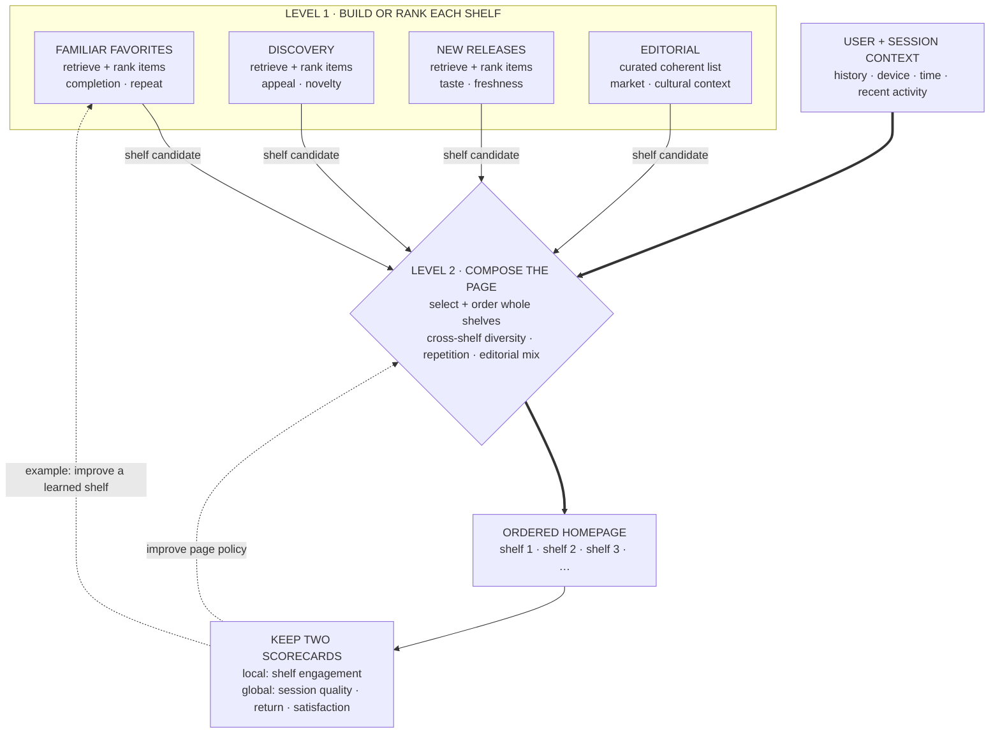

> *Asked in: recsys system design at music / video / content companies.*

The L4 candidate proposes one ranker. The L6 candidate decomposes the surface into shelves with distinct objectives and a meta-layer that decides what gets shown.

## What's distinctive about a homepage

It's not one recommendation problem. A homepage like Spotify's has many shelves (Made For You, Recently Played, New Releases, Daily Mix, Discover Weekly, Podcasts, etc.), each with a distinct purpose:
- Some surface what the user already loves (low novelty, high engagement).
- Some surface new things (high novelty, lower per-item engagement, long-term retention).
- Some are personalized; some are editorial.

The hardest design decision is how the shelves *interact*: which appear, in what order, with what content.

Learning objective

Trace why ranked item lists become candidates for a second decision that composes the whole homepage.

<!-- visual:spotify-two-level-shelf-composition -->

<strong>Read it this way:</strong> read the top row as four complete recommendation products, not four item pools. Each emits a completed shelf with a distinct promise; editorial shelves may be curated rather than ranked. Only then does the page composer use session context to select and order those shelves under cross-shelf constraints. A shelf can win its local metric and still lose page position if it repeats another intent or harms longer-term outcomes. Original synthesis checked against Spotify's <a href="https://arxiv.org/abs/2607.25823">shelf-generation research</a> and <a href="https://research.atspotify.com/2025/9/calibrated-recommendations-with-contextual-bandits-on-spotify-homepage">homepage calibration work</a>, plus the <a href="https://doi.org/10.3389/fdata.2022.910030">multi-carousel evaluation study</a>.

## What an L5 answer sounds like

> "Treat the homepage as two layers:
>
> **Layer 1: per-shelf rankers.** Each shelf has its own retrieval and ranking pipeline tuned to its purpose:
> - Made For You / Daily Mix: retrieve from user's listening history embedding space, rank by predicted listen-completion + repeat-listen probability.
> - New Releases: retrieve from new content (last 7-30 days) matched to user taste; rank balancing freshness with personalization.
> - Discover Weekly: retrieve far from user's history (exploration); rank by predicted appeal calibrated for novelty.
> - Recently Played: simple recency.
>
> Each shelf is its own multi-stage retrieve-then-rank pipeline.
>
> **Layer 2: shelf composition.** A meta-ranker decides which shelves appear on the homepage and in what order, per user, per session. Inputs: user features, time of day, device, recent shelf engagement. Output: an ordered list of shelves to show.
>
> **Eval**: each shelf has its own metrics (CTR, listen-time, completion). The composition layer optimizes a session-level metric (total session time, return rate, satisfaction). A/B test composition changes against a fixed baseline shelf order."

This is L5. Two layers, each shelf as its own ranker, meta-layer for composition.

## What an L6 answer adds

> "...practical things:
>
> **Diversity is critical.** Without explicit diversity, the homepage collapses to similar items everywhere. Explicit diversification at three levels: within-shelf (don't show 10 songs from the same artist), across-shelf (different shelves should serve different intents), and over-time (don't show the same item every day).
>
> **Editorial vs algorithmic mix.** Pure algorithmic recsys is fragile (filter bubbles, missed cultural moments). Editorial shelves (Today's Top Hits, regional charts, curated playlists) anchor the experience. The meta-ranker decides the mix.
>
> **Cold-start handling.** New users see fewer personalized shelves and more popularity-based / editorial. Transition to personalized as listen history accumulates. New items get a freshness boost in candidate generation; their long-term ranking depends on accumulated engagement.
>
> **Multi-task ranking per shelf.** Don't predict 'click probability' alone. Predict listen-time, completion, save, share, return-next-day. Combine with weights tuned via offline counterfactual eval and confirmed in A/B.
>
> **Latency budget**: homepage loads need ~200ms p99. Cache aggressively per user (re-compute every few hours, not per request). For real-time signals (just-finished song), update only the affected shelves.
>
> **Long-term metrics gate launches.** Short-term engagement is easy to optimize and easy to cannibalize the long-term experience. Track session-quality, return rate, churn proxies; require long-window A/B (4-8 weeks) for any composition change."

## Tells that get you a strong-hire vote

- You decompose into **shelves with distinct objectives**.
- You add a **meta-ranker for composition**.
- You bring up **editorial / algorithmic mix**.
- You discuss **diversity at multiple levels**.
- You insist on **long-window A/B tests** for composition changes.

## Tells that get you down-leveled

- One ranker for the whole homepage.
- No mention of diversity or editorial content.
- No cold-start handling.
- Optimizing only short-term clicks.

## Common follow-up

"How would you order the shelves for a brand-new user?"

The L6 answer:

> "For a new user with no history, the meta-ranker has no personal signal, so it falls back on three things: (1) editorial defaults (top playlists, popular new releases), (2) onboarding signal if any (genre selections from sign-up flow), (3) demographic and contextual proxies (region, device, time of day). The order should make engagement easy: hits and recognized content first, exploration second, personalized last (since the personalization will be weak). After a few sessions, transition to the personalized rank."

---

*Related: [Design YouTube's recommender](/questions/design-youtube-recommender/), [Two-tower vs cross-encoder: when to use which?](/questions/two-tower-vs-cross-encoder/), [System design case study: building personalized search ranking](/guides/personalized-search-ranking/).*
