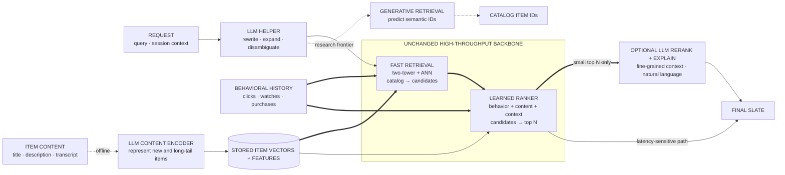

> *Asked in: senior recsys interviews, especially at companies pivoting to LLM-augmented surfaces.*

The L4 candidate proposes "use LLMs for everything." The L6 candidate identifies which parts of the recsys stack actually benefit from LLMs and which don't (and why).

## What hasn't changed

Most of recsys is the same in 2026 as it was in 2020:
- Two-stage retrieve-then-rank architecture.
- Two-tower for candidate generation.
- Multi-task ranking with calibration.
- A/B testing for shipping decisions.
- Counterfactual estimation for offline eval.
- Feedback loops, calibration drift, cold-start, diversity, and the long-tail problem.

LLMs don't replace any of this. They augment specific stages.

Learning objective

Trace where an LLM can enrich a production recommender while the high-throughput retrieve-then-rank backbone and behavioral personalization remain in control.

<!-- visual:recsys-llm-bounded-augmentation -->

<strong>Read it this way:</strong> follow the solid path through retrieval and ranking first: that fast behavioral backbone still does the catalog-scale work. LLMs sit at bounded edges: understanding the request, encoding item content offline, and optionally inspecting only the small top-N set. The dashed semantic-ID path is a separate research frontier, not a reason to remove the production backbone. Original synthesis checked against the <a href="https://research.google/pubs/deep-neural-networks-for-youtube-recommendations/">YouTube retrieve-then-rank architecture</a>, primary work on <a href="https://arxiv.org/abs/2305.13731">language-based item representations</a> and <a href="https://arxiv.org/abs/2305.08845">LLM reranking</a>, and <a href="https://arxiv.org/abs/2305.05065">generative retrieval with semantic IDs</a>.

## What an L5 answer sounds like

> "LLMs are most useful at three stages of the recsys stack:
>
> 1. **Query understanding / intent disambiguation**: rewriting natural-language queries, decomposing complex queries, expanding to related concepts. Especially valuable for search and conversational interfaces.
>
> 2. **Item representation**: LLM embeddings of item content (title, description, transcript, reviews) often outperform classical embeddings, especially for long-tail items with sparse engagement signal. Two-tower models with LLM-derived item towers are increasingly common.
>
> 3. **Reranking and explanation**: an LLM scoring (query, candidate, user-context) for fine-grained relevance, with the bonus of generating natural-language explanations for why an item was recommended.
>
> Less useful in the LLM era:
> - Candidate generation at scale: LLMs are too slow to score billions of items per query. Two-tower + ANN is still the right architecture for first-stage retrieval.
> - Personalization core: collaborative filtering signal (user-item engagement matrix) still dominates. LLMs add content signal, but engagement is the primary signal.
>
> The biggest LLM-era trend is *generative recommendation*: producing the item ID directly from the LLM rather than retrieving from a fixed catalog. Promising research, not yet production-dominant in 2026 for large catalogs."

This is L5. Three augmentation stages, what doesn't change, mention of generative recsys as a frontier.

## What an L6 answer adds

> "...practical points:
>
> **Cost / latency budgets shift the design.** LLM rerankers add 50-500ms; that's a meaningful fraction of typical recsys latency budgets. Use them only on the top N candidates from a fast first-stage ranker.
>
> **LLM-as-judge for offline eval.** Replaces some of what raters used to do for relevance judgments. Calibrate against humans first; useful for scaling eval, not for absolute scores.
>
> **Conversational recommendation** is a new product category, not just a new technique. The interface change (natural language back-and-forth) lets users specify intent more precisely than clicks ever could. Architecture: agent loop with retrieve-then-rank as a tool.
>
> **Semantic IDs for generative recsys.** Instead of an item ID being an arbitrary integer, encode it as a sequence of tokens (semantic ID) that an LLM can generate. The model can produce items it has never seen explicitly, by composing the right semantic ID. Active research area; emerging in production for some catalogs.
>
> **The long-tail problem changes character.** Classical recsys struggles with items that have little engagement. LLM-derived item embeddings can produce useful representations from item content alone, dramatically improving cold-item handling.
>
> **What's overhyped**: 'just use a chatbot for recommendations.' Most users don't want to type a paragraph to get a movie suggestion; they want a homepage that's already curated. Conversational interfaces are useful as an alternative surface, not a replacement."

## Tells that get you a strong-hire vote

- You name **specific stages** (query understanding, item rep, reranking).
- You acknowledge what **doesn't change** (two-stage, A/B, counterfactual).
- You bring up **generative recommendation** as a frontier without overhyping it.
- You discuss **semantic IDs** if you're at the senior frontier.
- You're explicit about the **cost / latency trade-off** of using LLMs in recsys.

## Tells that get you down-leveled

- "Just use an LLM for the whole pipeline."
- No mention of two-stage architecture or A/B testing.
- Treating conversational recsys as a strict improvement over traditional surfaces.
- No awareness of cost / latency constraints.

## Common follow-up

"What's a use case where LLMs significantly outperform classical recsys?"

The L6 answer:

> "Cold-item recommendation. Classical recsys struggles with items that have little or no engagement signal: brand-new content, niche items, long-tail products. LLM-derived embeddings of the item's content (text, image captions, transcripts) provide a useful initial representation that classical methods can't match without weeks of engagement data. The two-tower model with an LLM-derived item tower handles this naturally, dramatically reducing the cold-item ramp-up time. This is one of the clearest LLM-era wins in recsys."

---

*Related: [Design YouTube's recommender](/questions/design-youtube-recommender/), [Two-tower vs cross-encoder: when to use which?](/questions/two-tower-vs-cross-encoder/), [How would you do cold-start for a new user?](/questions/cold-start-new-user/), [Designing a RAG system that actually works](/guides/designing-rag-that-works/).*
