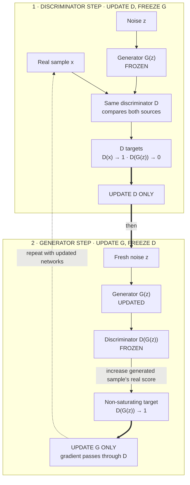

## Summary

A **GAN** [(Goodfellow et al., 2014)](https://arxiv.org/abs/1406.2661) trains two networks adversarially: a **generator** $G$ that maps noise $z \sim p_z$ to samples $G(z)$, and a **discriminator** $D$ that tries to distinguish $G(z)$ from real samples $x \sim p_\text{data}$. The minimax objective:

$$
\min_G \max_D \mathbb{E}_{x \sim p_\text{data}}[\log D(x)] + \mathbb{E}_{z \sim p_z}[\log(1 - D(G(z)))].
$$

GANs produced the sharpest, most realistic image samples of the deep learning era from 2015 to 2021, peaking with StyleGAN3 and BigGAN. They have largely been displaced by diffusion for image generation in 2026, but remain relevant in:

- Real-time / latency-critical generation (single forward pass vs diffusion's iterative).
- Image-to-image translation (CycleGAN, pix2pix).
- Specialized domains (medical, super-resolution).
- As a discriminator-style critic in other systems (perceptual losses, adversarial robustness).

Knowing GAN training dynamics is also key to understanding why diffusion's stable training is such an advantage.

## The two players

- **Generator $G$**: maps noise $z$ to a fake sample. Trained to fool $D$.
- **Discriminator $D$**: binary classifier distinguishing real from fake. Trained to maximize correct classification.

Learning objective

Trace which network receives an update in each half of GAN training.

<!-- visual:gan-alternating-update-ownership -->

<strong>Read it this way:</strong> first train <var>D</var> on both sources while <var>G</var> is only a sample factory. Then freeze <var>D</var> but keep it in the differentiable path: its judgment sends a gradient into <var>G</var>, whose practical non-saturating target is to push <var>D</var>(<var>G</var>(<var>z</var>)) toward “real.” Alternating changes who learns, not which networks participate in the forward pass.

At equilibrium (Nash), $G$ produces samples indistinguishable from real, and $D$ outputs $\tfrac{1}{2}$ everywhere.

## Why training is hard

The minimax game is unstable for many reasons:

1. **Mode collapse**: $G$ finds one or a few outputs that consistently fool $D$ and ignores the rest of the distribution.
2. **Vanishing gradients**: when $D$ is much better than $G$, $\nabla_G \log(1 - D(G(z))) \to 0$. No learning signal.
3. **Non-convergence**: minimax dynamics can cycle without converging to equilibrium.
4. **Sensitivity to architecture and hyperparameters**: small changes make a working GAN diverge.

A decade of research produced **many stabilization techniques**: spectral normalization, two-time-scale updates (TTUR), gradient penalty, WGAN/WGAN-GP, R1 regularization, progressive growing, StyleGAN's mapping network. Each helps; none fully solves it.

## Variants

| GAN | Innovation |
|-----|-----------|
| DCGAN [(Radford 2015)](https://arxiv.org/abs/1511.06434) | Convolutional architecture for images |
| WGAN [(Arjovsky 2017)](https://arxiv.org/abs/1701.07875) | Wasserstein loss; weight clipping or gradient penalty (WGAN-GP) for Lipschitz constraint |
| Conditional GAN | Add class label or text embedding to both $G$ and $D$ |
| pix2pix, CycleGAN | Image-to-image translation (paired and unpaired) |
| BigGAN [(Brock 2018)](https://arxiv.org/abs/1809.11096) | Class-conditional ImageNet generation at scale |
| StyleGAN 1/2/3 ([Karras 2018](https://arxiv.org/abs/1812.04948)-2021) | Mapping network + AdaIN + alias-free design; SoTA face generation |

## Why diffusion replaced GANs for image generation

| Property | GAN | Diffusion |
|----------|-----|-----------|
| Training stability | Notoriously unstable | Stable |
| Sample quality (FID) | Excellent | Excellent (better at scale) |
| Mode coverage | Mode collapse risk | Better coverage |
| Sample speed | One forward pass (fast) | Many denoising steps (slow) |
| Likelihood | None | Variational lower bound |
| Conditioning flexibility | Limited | Cross-attention conditioning is strong |

Diffusion's training stability and conditioning flexibility (especially text-to-image with classifier-free guidance) tipped the balance.

## Where GANs still win in 2026

- **Real-time generation**: single forward pass beats diffusion's tens of steps.
- **Style transfer / image-to-image**: CycleGAN-style pipelines remain strong.
- **Adversarial training as a regularizer**: not for generation per se, but as a critic loss in distillation, super-resolution, domain adaptation.

## Common pitfalls

- **Treating GAN inception/FID scores as the only metric.** They miss diversity issues; complement with precision/recall or coverage metrics.
- **Not using spectral normalization or gradient penalty.** Vanilla GAN training without modern stabilization is very fragile.
- **Comparing GAN samples to diffusion samples at matched compute without matching steps.** GAN: 1 forward pass; diffusion: 50–1000. Per sample, GAN is much cheaper.
- **Reading "GANs are mode collapsed" as universal.** Modern StyleGAN-class models cover ImageNet diversity well.

## Related

- [Autoregressive vs. diffusion](/concepts/autoregressive-vs-diffusion/). Broader generative paradigm map.
- [Variational autoencoders](/concepts/variational-autoencoders/). Earlier alternative.
