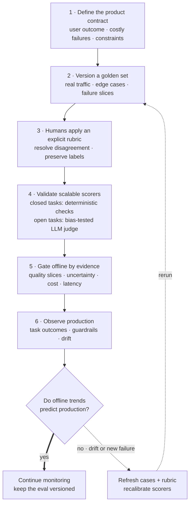

> *Asked in: Applied Scientist, Senior MLE, and Research Engineer screens at any company shipping LLMs.*

The same words elicit a junior, senior, or staff answer. Interviewers calibrate **on what you reach for first** and **what you don't say**.

<!-- visual:llm-eval-calibration-loop -->

<strong>Read it this way:</strong> start with the product contract, not a metric. Human-scored representative cases ground the scalable checks and judge; those scorers provide fast offline evidence but only production can show whether the evidence predicts user outcomes. When production diverges or reveals a new failure, repair the cases and rubric, recalibrate, and rerun. Original synthesis checked against the primary <a href="https://arxiv.org/abs/2306.05685">LLM-as-judge study</a>, <a href="https://developers.openai.com/api/docs/guides/evaluation-best-practices">OpenAI's evaluation guidance</a>, and the <a href="https://doi.org/10.6028/NIST.AI.100-1">NIST AI RMF</a>.

## What an L4 answer sounds like

> "I'd compute accuracy on a held-out test set. For generation tasks I'd use BLEU or ROUGE. I'd also do some manual inspection of outputs and check for hallucinations. We could also use perplexity."

**Why this is L4, not L5:**
- Reaches for *metrics* before *what we're measuring*. Accuracy of what? Against whose ground truth?
- Names BLEU/ROUGE without acknowledging they correlate weakly with human judgment on open-ended generation, especially instruction-following.
- "Manual inspection" mentioned as an afterthought, it's actually the foundation.
- No mention of: data construction, eval set drift, scoring rubrics, inter-annotator agreement, online vs offline, or cost.
- Treats the question as "list metrics" rather than "design a measurement system."

This answer gets you a "lean no" at any senior bar. Not because it's wrong, because it shows you've consumed eval material but never *built* an eval pipeline that anyone trusted.

## What an L5 answer sounds like

> "First I'd want to understand what we're optimizing for and who the user is, the eval has to mirror the production task. I'd build three things in sequence:
>
> 1. **A small (50-200) golden set hand-labeled by the team**: covering the failure modes we expect and a stratified sample of real traffic. This is what we look at every Friday.
> 2. **An automated scoring layer**: for closed-ended subtasks I can use exact match or programmatic checks; for open-ended outputs I'd use LLM-as-judge with a careful rubric, calibrated against the golden set.
> 3. **Online metrics in production**: task-completion rate, user edit distance, thumbs-up/down, to catch what offline missed.
>
> I'd treat eval-set construction as a real engineering project, version it, and re-label periodically because the distribution drifts. And I'd report a confidence interval on every number."

**Why this is L5:**
- Starts with the user/objective, not the metric.
- Mentions the golden-set practice, the single thing that separates teams that ship from teams that don't.
- Knows LLM-as-judge needs calibration, not just a prompt.
- Distinguishes offline / online, closed / open-ended.
- Mentions confidence intervals, small but important signal of statistical literacy.

This is hireable at L5 in any LLM org.

## What an L6 answer sounds like

The L6 answer contains everything in the L5 answer, then adds the things only people who've been burned three times know:

> "...A few extra things I've learned the hard way:
>
> **Eval is a product, not a script.** The eval set has owners, a changelog, a review process for adding examples, and a quarterly re-label to fight noise. I've seen teams 'improve' a model by 5 points on a stale eval that no longer reflected production traffic. Treating eval as code-review-able artifact prevents this.
>
> **LLM-as-judge has known pathologies.** It's biased toward longer answers, biased toward its own family's outputs, and unreliable on anything requiring domain knowledge it lacks. I'd validate the judge against ~200 human-labeled pairs before trusting it, report judge-vs-human agreement (Cohen's &kappa;, not just accuracy), and re-validate when I change models.
>
> **Pairwise > pointwise** for open-ended. Asking 'which of these two is better' has much higher inter-annotator agreement than 'rate this 1-5'. I'd structure most eval as pairwise A/B and aggregate with a Bradley-Terry model to get a single ranking.
>
> **Cost and latency are eval metrics.** A model that's 2pp better but 3&times; slower or 5&times; more expensive may be a regression. I'd report a Pareto frontier, not a single number.
>
> **Offline-online gap is the real metric.** I track the correlation between my offline eval and the online business metric quarterly. If it drops below ~0.6, the offline eval is lying to us and we rebuild it.
>
> **Failure-mode tracking, not aggregate scores.** Aggregate accuracy hides regressions on tail slices. I'd cut by user segment, query type, and known failure categories and gate releases on no-regression on any high-stakes slice. The aggregate is for the leadership deck; the per-slice table is what actually drives decisions."

**Why this is L6:**
- Treats eval as a system with lifecycle, owners, and failure modes, not as a measurement.
- Names specific pathologies and specific mitigations. Earned knowledge.
- Mentions offline-online correlation. Few candidates explain whether offline evals predict product behavior.
- Pareto framing, won't be tricked by a metric-only improvement.
- Cuts by slice, knows aggregates lie.

## The tells that get you a strong-hire vote

- You bring up **golden sets** and **judge calibration** unprompted.
- You distinguish **closed-ended subtasks** (exact match works) from **open-ended generation** (it doesn't), and you can name *which parts of your task fall in which bucket*.
- You acknowledge that **the eval is wrong, and your job is to make it less wrong over time**: not to find the "right" metric.
- You mention **at least one specific time eval misled you and what you did about it**. Concrete > theoretical, every time.
- You ask *back*: "What's the production task? What's the cost of a bad output?" Senior people scope before answering.

## The tells that get you down-leveled

- Naming BLEU/ROUGE/METEOR without caveats, interviewer infers your knowledge stops in 2020.
- Saying "perplexity" for an instruction-following or RAG task. Perplexity is not task quality, and using the term as if it were is a strong signal you haven't shipped one of these systems.
- Treating "LLM-as-judge" as a one-line solution. If you'd actually run one in production, you'd mention calibration, position bias, length bias, and re-validation.
- Reaching for benchmarks (MMLU, HumanEval, MT-Bench) as your primary plan. These are leaderboards, not product evals. Mentioning them is fine; relying on them is the tell.
- No mention of cost, latency, or online metrics. You've thought about the model but not about the system.
- Talking for 5 straight minutes without taking a breath to check the interviewer's reaction. Senior ICs collaborate; junior ICs perform.

## What the interviewer is *actually* checking

Behind the words, three boxes:
1. **Have you actually shipped an LLM feature?** (vs. read about them), surfaces in concrete failure stories.
2. **Do you know that eval is the hardest part?**: surfaces in what you reach for first.
3. **Are you the kind of person we'd want owning the eval system?**: surfaces in whether you treat it as a product or a script.

Answer the third one and the first two come along for free.

---

*Read the long-form essay this distills: ["LLM Evals: The hardest part of shipping LLMs"](/guides/llm-evals-the-hardest-part/).*
