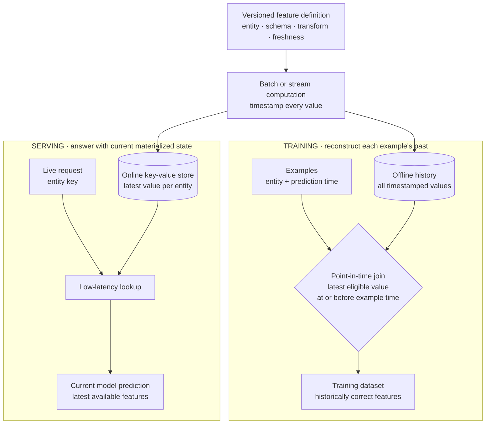

> *Asked in: ML platform and infra interviews.*

The L4 candidate names Feast or Tecton. The L6 candidate explains the three problems a feature store solves, sketches the components, and discusses the build-vs-buy decision.

## Three problems a feature store solves

1. **Training-serving skew**: features computed in training don't match features computed at serving. The dominant ML production failure mode.
2. **Feature reuse**: every team rebuilds the same features (user demographics, product attributes). Duplication, inconsistency, wasted compute.
3. **Lineage and reproducibility**: which features did this model use, with what definitions, computed from what data, at what time?

If you don't have these problems at scale, you don't need a feature store. Most teams do at scale.

## What an L5 answer sounds like

> "Components:
>
> **Feature definition layer.** Features are defined as named, typed transformations of source data. Definitions live in code (Python, often), versioned in git. The same definition is used in batch (training) and online (serving) computation.
>
> **Offline store.** A historical record of all feature values over time. Used for training: given an event timestamp, fetch the feature values *as they would have been* at that time (point-in-time correctness). Typically a columnar warehouse (BigQuery, Snowflake, Iceberg).
>
> **Online store.** Latest feature values for fast lookup at serving time. Typically a low-latency KV store (Redis, DynamoDB, Bigtable). Updated by the same pipeline that writes to the offline store.
>
> **Materialization pipeline.** Computes features from source data, writes to both offline and online stores. Batch (Spark, dbt) for slow-changing features; streaming (Flink, Kafka) for fresh features.
>
> **Serving API.** At inference, the application calls `get_features(entity_id, feature_names)` and the store returns latest values. SLA: single-digit milliseconds for a feature lookup of ~100 features.
>
> **Lineage / metadata.** Which model used which features, when, with what definitions. Backed by metadata DB.
>
> Reference implementations: Feast (open source), Tecton (commercial), Hopsworks, Vertex AI Feature Store, Databricks Feature Store."

Learning objective

Separate the two time contracts: reconstruct the past for training, retrieve the latest value for serving.

<!-- visual:feature-store-two-time-contract -->

<strong>Read it this way:</strong> start from the shared definition, then choose a clock. Training scans offline history backward from each example's timestamp; serving reads the latest materialized value from the online store. Sharing a definition reduces skew, but the stores cannot be conflated because their retrieval and latency contracts differ. Original synthesis checked against the <a href="https://docs.feast.dev/getting-started/concepts/point-in-time-joins">Feast point-in-time join</a>, <a href="https://docs.feast.dev/getting-started/components/online-store">online-store</a>, and <a href="https://arxiv.org/abs/2305.20077">managed feature-store architecture</a> descriptions.

This is L5. Components named, point-in-time correctness explicit, build-or-buy options listed.

## What an L6 answer adds

> "...practical points:
>
> **Point-in-time correctness is the hardest part.** When generating training data, you need feature values *as they were at the time of the event*, not as they are now. Naive joins use current values and leak future information. Implementation options: time-travel queries on a versioned store, append-only event-log architectures, or careful materialized views. Get this wrong and your offline metrics overestimate; the model fails in production.
>
> **Feature freshness vs cost.** Streaming features cost orders of magnitude more than batch. Tag each feature with a freshness SLA; route to batch by default; promote to streaming only when the use case demands it.
>
> **Schema evolution is painful.** Adding fields is easy; renaming or changing types breaks downstream consumers. Schema registries, deprecation processes, and dual-writes during transitions are required at scale.
>
> **Build vs buy**: building a custom feature store is months of work and ongoing maintenance. For most teams, an off-the-shelf option (Feast / Tecton / cloud-provider equivalent) is the right call. Build only if you have very specific requirements (extreme scale, on-prem, niche compliance).
>
> **The feature store is not magic for ML quality.** It solves the *infrastructure* problem of features being available, fresh, and consistent. It doesn't fix the *modeling* problem of which features to compute. Teams sometimes treat the feature store as the project goal; it's an enabler for actual ML work.
>
> **Feature store as serverless interface**: modern systems push toward 'declarative' features (you specify what, the system figures out how to compute and serve). Reduces application boilerplate but adds a layer of abstraction that can be hard to debug."

## Tells that get you a strong-hire vote

- You name the **three problems** (training-serving skew, reuse, lineage) up front.
- You explain **point-in-time correctness** correctly.
- You separate **offline and online stores** as different SLA tiers.
- You discuss **build vs buy** explicitly.
- You acknowledge that **feature stores enable**, don't replace, modeling work.

## Tells that get you down-leveled

- "Use Feast" with no further detail.
- No mention of point-in-time correctness.
- Conflating offline and online stores.
- No discussion of feature freshness tiers.

## Common follow-up

"What's the simplest viable feature store for a small team?"

The L6 answer:

> "For a small team: don't build one. Start with a feature library (a Python module with shared feature-computing functions). Use the same module in both your training pipeline and your serving code. Cache computed features in your existing data warehouse for offline and a Redis instance for online. This gives you most of the benefit (consistency, reuse) without the operational overhead of a full feature-store platform. Promote to a real feature-store product when feature count grows past ~50 and you have multiple teams contributing."

---

*Related: [multi-team ML platform design](/questions/design-multi-team-ml-platform/), [ML data lineage and versioning](/concepts/ml-data-lineage-versioning/), [point-in-time correctness](/concepts/data-leakage-point-in-time-correctness/), and [personalized search ranking](/guides/personalized-search-ranking/).*
