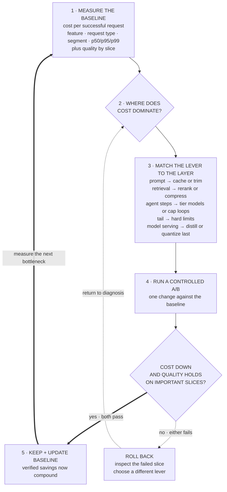

> *Asked in: LLM-team and platform interviews, especially at companies serving LLMs at scale.*

The L4 answer picks one technique. The L6 answer diagnoses where the cost actually is, then picks the highest-leverage levers in order. Engineering judgment matters more than technique knowledge.

Learning objective

Measure, test, and compound cost reductions without hiding a quality regression

<!-- visual:inference-cost-measure-test-compound-loop -->

<strong>Read it this way:</strong> follow the solid path from measurement to one layer-matched change. Savings count only when the same experiment lowers cost and preserves quality on important and tail slices; otherwise the dashed path rolls back. After a pass, update the baseline and measure again. The verified wins compound, not the untested techniques. Original synthesis informed by <a href="https://arxiv.org/abs/2406.18665">RouteLLM</a>, <a href="https://arxiv.org/abs/2305.05176">FrugalGPT</a>, <a href="https://developers.openai.com/api/docs/guides/prompt-caching">OpenAI prompt-caching documentation</a>, and <a href="https://developers.google.com/machine-learning/guides/rules-of-ml/">Google's Rules of ML</a>; no universal savings are implied.

## What an L4 answer sounds like

> "We could use a smaller model, or quantize to INT8 or INT4. We could also use a cheaper API."

Three techniques, no diagnosis, no prioritization. Each technique is right but the answer isn't structured.

## What an L5 answer sounds like

> "Before picking techniques I'd want to know where the cost is actually coming from. There are usually five layers to LLM cost:
>
> 1. Per-request token cost (the model + tokens).
> 2. System prompt amortization (the prompt you pay on every request).
> 3. Retrieved context (RAG chunks, conversation history).
> 4. Multi-step / agentic overhead (chained LLM calls).
> 5. Tail cost (the 1-5% of requests that consume disproportionate compute).
>
> The mix differs by use case. For a chatbot with no RAG and no agent loops, layer 1 dominates. For a RAG-backed agent (which is most production LLM systems in 2026), layers 2-4 typically dominate.
>
> Assuming a typical RAG-backed agent, my prioritized levers:
>
> - **Prompt caching** (Anthropic, OpenAI, Bedrock support this): if your system prompt is stable, cached tokens cost 5-10&times; less. This is often the single largest win and takes a day to implement.
> - **Better retrieval**: top-5 after a reranker beats top-20 raw, both in cost and quality. Retrieval is often the largest contributor to per-request token count in RAG systems.
> - **Tiered models**: cheap fast model for routine planning steps; expensive model only for the hard reasoning steps. Often 2-3&times; cost savings without quality loss.
> - **Output length steering**: explicit instructions and `max_tokens` can cut output cost by 30-50%, especially for chat models that default to verbose.
> - **Cap iteration count for agent loops**: prevents runaway cost on hard requests; one of the easiest tail-cost reductions.
>
> Only after these would I consider switching to a smaller / fine-tuned / quantized model. Those are bigger projects with quality risk; the prompt-cache and retrieval wins are nearly free."

This is L5. You've named the cost decomposition, prioritized correctly (cheap structural wins first), and acknowledged the quality risk of the deeper changes.

## What an L6 answer sounds like

The L6 answer adds the things that come from running cost optimization for several quarters:

> "...and a few practical considerations beyond the techniques:
>
> **You need a cost dashboard before you optimize.** Without per-request cost telemetry by feature, by user segment, and at p50 / p95 / p99, you can't know which changes actually moved the needle. I'd build that first; it usually surfaces the biggest wins automatically.
>
> **Quality regressions from cost changes are the failure mode.** Every cost reduction is a quality risk. Each change should be A/B tested against the baseline; cost savings without a quality eval are not real savings. We've seen 'cost-saving' optimizations get rolled back because they tanked a key metric.
>
> **Some cost optimizations are contagious in good ways.** Reducing context length helps cost, but it also reduces latency (less prefill), which improves agent step time, which lets you cap iterations earlier, which reduces total cost further. Optimizations compound.
>
> **Smaller-model-per-step is often the largest single win.** Most agentic systems use one model for everything. In reality, the planning step needs different capabilities than the synthesis step than the tool-calling step. Tiered serving (small model for routing, medium for planning, large only for synthesis) can substantially reduce cost with quality on par.
>
> **Distillation is a real option but expensive to do well.** If you have enough production data and a quality eval, you can distill a 70B model down to a 7B that handles 80% of your traffic and falls back to 70B for the remaining 20%. This is a months-long project but pays off significantly at scale.
>
> **Self-hosted vs API**: there's a crossover point at scale where self-hosting open-weight models becomes cheaper than API. The crossover is roughly at ~$10K-50K/month of API spend for typical models. Below that, API is cheaper because you don't pay for idle GPU time.
>
> **The least obvious lever**: making the eval set faster. Most teams have eval pipelines that take hours to run, which means they can't iterate on cost optimizations. Cutting eval time from 4 hours to 20 minutes triples how often you can experiment with cost changes, and most cost wins compound across iterations."

This is L6. You've gone past the techniques into the *operational discipline* of cost reduction, with specific patterns from running this in production.

## The tells that get you a strong-hire vote

- You **decompose where the cost is** before naming techniques.
- You **prioritize cheap structural wins** (prompt caching, better retrieval) over deep technique changes (smaller model, quantization).
- You bring up **quality A/B testing** as a gate on cost changes.
- You mention **tiered serving** (different models for different steps), the largest underrated win.
- You discuss **monitoring and dashboards** as a precondition for optimization.

## The tells that get you down-leveled

- "Just use a smaller model" as the first answer.
- "Quantize to INT8" as the only technique mentioned.
- No mention of prompt caching (the cheapest single win in 2026).
- Treating cost as a model-choice question rather than a system-design question.
- No mention of quality measurement.

## A common follow-up

"What's the trade-off you're most worried about?"

The L6 answer:

> "The cost-vs-quality regression on the long tail. Most of my cost optimizations work great on the median request and then fail on the 5% of hard requests, the ones with sparse context, edge-case queries, or unusual user behavior. The aggregate cost goes down, the aggregate quality goes down slightly, and the tail quality goes down a lot. If those tail users are also the high-value users, you've made a bad trade you can't see in your average metrics.
>
> The mitigation is rigorous tail monitoring. Track quality at p50 and p95 separately. Cut by user segment and request type. Gate releases on no-regression in the high-stakes slices, even if the average is up. This is the same pattern as in any system optimization, the average is for the leadership deck; the per-slice table is what actually drives decisions."

If you can have this conversation, you're at the senior bar.

---

*Related: [How to think about LLM inference cost](/guides/llm-inference-cost/) for the long-form treatment, [Designing a RAG system that actually works](/guides/designing-rag-that-works/).*
