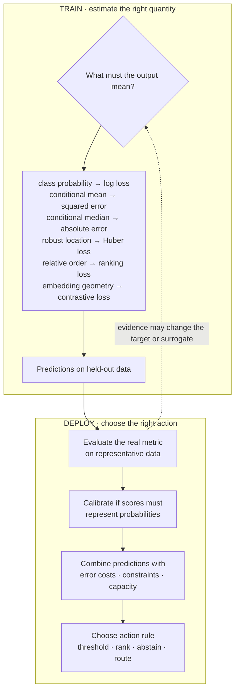

> *Asked in: ML breadth at every level.*

The L4 candidate names the canonical loss for the task type. The L6 candidate explains that the loss is a model of the noise distribution and the cost structure, and reasons from the problem to the loss.

## What an L4 answer sounds like

> "For classification, cross-entropy. For regression, MSE. For ranking, pairwise hinge. Use what fits the task."

Right inputs, no model. You've memorized which loss goes with which task type, but you can't reason about it.

## What an L5 answer sounds like

> "The loss encodes two things: the *noise model* of the targets and the *cost structure* of errors.
>
> - **Cross-entropy** for classification: assumes targets are samples from a categorical distribution, recovers MLE.
> - **MSE** for regression: assumes Gaussian noise on the targets, recovers MLE.
> - **MAE** for regression with heavy-tailed errors or median-targeting: assumes Laplace noise, more robust to outliers.
> - **Huber** for regression: a smooth interpolation between MSE (small errors) and MAE (large errors). Common when occasional outliers shouldn't dominate gradients.
> - **Pairwise / listwise losses** for ranking: encode the ordering of items, not absolute scores.
> - **Triplet / contrastive losses** for representation learning: encode that similar items should be close, dissimilar far.
>
> If the cost structure is asymmetric (e.g., false negatives much worse than false positives in fraud detection), I'd start with a calibrated probability model and tune the decision threshold for those costs. I might also weight the corresponding training examples. Focal loss is for down-weighting easy examples under severe imbalance; it does not specify which error is more costly."

This is L5. You've connected losses to noise models and cost structures.

Learning objective

Separate the quantity a loss estimates from the action a product takes

<!-- visual:loss-estimation-vs-decision -->

<strong>Read it this way:</strong> go down the training rail first: name the statistical quantity you need, then choose a loss that elicits it. Only after checking held-out predictions should you enter the deployment rail, where calibration, costs, constraints, and capacity choose the action. A metric can send you back to revise the surrogate, but it is not automatically a differentiable loss. Original synthesis informed by <a href="https://doi.org/10.1198/016214506000001437">Gneiting and Raftery on proper scoring rules</a>, <a href="https://doi.org/10.1214/aoms/1177703732">Huber on robust location</a>, and <a href="https://scikit-learn.org/stable/modules/classification_threshold.html">scikit-learn's threshold guidance</a>.

## What an L6 answer sounds like

> "...a few practical considerations:
>
> **The loss should be a useful surrogate for the metric you actually care about.** Cross-entropy estimates class probabilities; AUC and precision at K evaluate ranking or a chosen operating region. Ranking-aware or top-K surrogates may align better, but I would verify that on representative held-out data.
>
> **Multi-task losses are weighted sums of per-task losses.** The weighting matters and is hard to set; uncertainty-weighted multi-task loss (Kendall et al.) and gradient-magnitude balancing (GradNorm) are principled approaches.
>
> **For LLMs, the loss is usually next-token cross-entropy, but the *important* loss is the downstream behavior**. SFT trains on next-token CE; DPO replaces it with a preference loss; RLHF replaces it with a reward-model-derived gradient. Each shapes the model differently for the same evaluation goal.
>
> **Auxiliary losses can stabilize training without changing the main objective**: an auxiliary reconstruction loss for representation learning, an auxiliary load-balance loss for mixture-of-experts. These are tools to shape gradient flow, not just to add tasks."

## Tells that get you a strong-hire vote

- You connect the loss to the **noise model** (Gaussian / Laplace / categorical).
- You distinguish **mean** vs **median** targeting (MSE vs MAE).
- You bring up **calibration vs the downstream metric** as separate concerns.
- You separate **threshold tuning or explicit cost weighting** from focal loss for hard-example emphasis.

## Tells that get you down-leveled

- Memorized list with no underlying reasoning.
- Suggesting MSE for classification (vanishing gradients on confident-wrong predictions).
- No mention of cost asymmetry or imbalance.
- Treating loss selection as a closed problem.

## Common follow-up

"How would you train a model that values precision much more than recall?"

The L6 answer:

> "Several options, ranked by complexity. (1) Tune the threshold on representative validation data for the required precision, while checking the resulting recall and volume. (2) If retraining is justified, use a cost-sensitive loss that gives more weight to negative examples that become false positives. (3) For retrieval, optimize a ranking or top-K surrogate. (4) Train two-stage: a high-recall first stage, then a high-precision filter. The right answer depends on whether thresholding a calibrated model meets the operating constraint or the ranking itself must change."

---

*Related: [multi-task learning and objective interference](/concepts/multi-task-learning-objective-interference/), [cross-entropy and softmax](/concepts/cross-entropy-softmax/), [regularization](/concepts/regularization/), and [calibration](/concepts/calibration/).*
