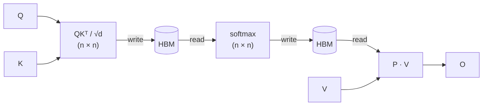

## Summary

Attention is **memory-bound**: not compute-bound, on modern GPUs. The bottleneck for long sequences is moving the n×n attention matrix between HBM and SRAM, not the matmuls. The n×n matrix never goes to HBM; only the n×d output and two n-sized per-row statistics are stored.

Result: same numerical output as standard attention, but **2-4&times; faster wall-clock and O(n) memory** instead of O(n²).

Essential in modern transformer training/inference. Every serious framework uses it or a close variant. Knowledge of FlashAttention is expected for 2026.

## The mechanism

Standard attention reads and writes the n×n attention matrix to HBM at every step:

<!-- visual:flashattention-standard-hbm-path -->


  <p class="diagram-caption"><strong>Read it this way:</strong> standard attention materializes the full n×n matrix in HBM twice. FlashAttention keeps small tiles and running softmax statistics in SRAM instead.</p>

Standard attention does this:

1. Compute S = QKᵀ / &radic;d (size n&times;n) → write to HBM
2. Read S, compute P = softmax(S, axis=-1) → write to HBM
3. Read P, compute O = PV → write to HBM

HBM traffic: **O(n² + nd)**. For n = 8192 and d = 128, the simplified ratio of the quadratic matrix term to the output term is n/d = 64; the exact traffic ratio depends on the implementation and other tensors.

FlashAttention restructures it:

- Tile Q into blocks Q&#7522; of size B&#7479;&times;d. Tile K, V into blocks K&#11388;, V&#11388; of size B&#7580;&times;d.
- Outer loop over Q&#7522; (output rows). Inner loop over K&#11388;, V&#11388; (key blocks).
- Per Q&#7522;, maintain three running statistics in SRAM:
  - **m&#7522;** = max-so-far across processed key blocks (numerical-stable softmax)
  - **&#8467;&#7522;** = denominator of the partial softmax
  - **O&#7522;** = running weighted sum of values
- On each new tile (Q&#7522;, K&#11388;, V&#11388;):
  - compute S&#7522;&#11388; = Q&#7522;K&#11388;ᵀ / &radic;d entirely in SRAM
  - update statistics using the streaming log-sum-exp identity:

```
m_new = max(m_i, max(S_ij))
ell_new = exp(m_i - m_new) * ell_i + sum(exp(S_ij - m_new))
O_new   = (exp(m_i - m_new) * ell_i * O_i + exp(S_ij - m_new) @ V_j) / ell_new
```

<!-- visual:flashattention-sram-tile-stream -->
<figure class="learning-figure" aria-labelledby="flashattention-tile-title" aria-describedby="flashattention-tile-description">
<p class="visual-kicker">Learning objective</p>
<p class="visual-title" id="flashattention-tile-title">Follow one query block as key and value blocks stream through SRAM.</p>
<p id="flashattention-tile-description">The full score matrix is shown as a grid, but only the highlighted query-key tile enters SRAM at one time. The tile updates running softmax state and the output block before the next key and value block is loaded.</p>
<div class="visual-scroll attention-tile-scroll">
<svg class="attention-tile-visual" viewBox="0 0 1000 500" role="img" aria-labelledby="flashattention-tile-svg-title flashattention-tile-svg-description" width="1000" height="500">
<title id="flashattention-tile-svg-title">FlashAttention streams one score tile through SRAM instead of materializing the full matrix</title>
<desc id="flashattention-tile-svg-description">On the left, a query-by-key score matrix has one highlighted Bq by Bk tile. An arrow points to the right, where HBM supplies one query block and one key-value block to SRAM. The SRAM tile computes scores, updates m, ell, and O, then writes only an output block and per-row statistics.</desc>
<defs><marker id="flashattention-tile-arrow" viewBox="0 0 10 10" refX="8" refY="5" markerWidth="7" markerHeight="7" orient="auto-start-reverse"><path d="M 0 0 L 10 5 L 0 10 z" fill="var(--viz-focus-stroke)" /></marker></defs>
<rect x="24" y="24" width="420" height="370" rx="10" fill="var(--viz-canvas)" stroke="var(--c-rule)" />
<text x="48" y="58" fill="var(--c-text)" font-family="Lato, sans-serif" font-size="20" font-weight="700">Global score matrix S</text>
<text x="48" y="82" fill="var(--c-muted)" font-family="Lato, sans-serif" font-size="13">n query rows x n key columns</text>
<text x="148" y="108" fill="var(--c-muted)" font-family="Lato, sans-serif" font-size="12">K blocks</text><text x="62" y="157" fill="var(--c-muted)" font-family="Lato, sans-serif" font-size="12" transform="rotate(-90 62 157)">Q blocks</text>
<text x="137" y="125" fill="var(--c-text-soft)" font-family="Lato, sans-serif" font-size="12">K1</text><text x="195" y="125" fill="var(--c-text-soft)" font-family="Lato, sans-serif" font-size="12">K2</text><text x="253" y="125" fill="var(--c-text-soft)" font-family="Lato, sans-serif" font-size="12">K3</text><text x="311" y="125" fill="var(--c-text-soft)" font-family="Lato, sans-serif" font-size="12">K4</text>
<text x="87" y="157" fill="var(--c-text-soft)" font-family="Lato, sans-serif" font-size="12">Q1</text><text x="87" y="215" fill="var(--c-text-soft)" font-family="Lato, sans-serif" font-size="12">Q2</text><text x="87" y="273" fill="var(--c-text-soft)" font-family="Lato, sans-serif" font-size="12">Q3</text><text x="87" y="331" fill="var(--c-text-soft)" font-family="Lato, sans-serif" font-size="12">Q4</text>
<rect x="120" y="132" width="50" height="50" rx="4" fill="var(--viz-neutral-bg)" stroke="var(--c-rule)" /><rect x="178" y="132" width="50" height="50" rx="4" fill="var(--viz-neutral-bg)" stroke="var(--c-rule)" /><rect x="236" y="132" width="50" height="50" rx="4" fill="var(--viz-neutral-bg)" stroke="var(--c-rule)" /><rect x="294" y="132" width="50" height="50" rx="4" fill="var(--viz-neutral-bg)" stroke="var(--c-rule)" />
<rect x="120" y="190" width="50" height="50" rx="4" fill="var(--viz-neutral-bg)" stroke="var(--c-rule)" /><rect x="178" y="190" width="50" height="50" rx="4" fill="var(--viz-neutral-bg)" stroke="var(--c-rule)" /><rect x="236" y="190" width="50" height="50" rx="4" fill="var(--viz-focus-bg)" stroke="var(--viz-focus-stroke)" stroke-width="3" /><rect x="294" y="190" width="50" height="50" rx="4" fill="var(--viz-neutral-bg)" stroke="var(--c-rule)" />
<rect x="120" y="248" width="50" height="50" rx="4" fill="var(--viz-neutral-bg)" stroke="var(--c-rule)" /><rect x="178" y="248" width="50" height="50" rx="4" fill="var(--viz-neutral-bg)" stroke="var(--c-rule)" /><rect x="236" y="248" width="50" height="50" rx="4" fill="var(--viz-neutral-bg)" stroke="var(--c-rule)" /><rect x="294" y="248" width="50" height="50" rx="4" fill="var(--viz-neutral-bg)" stroke="var(--c-rule)" />
<rect x="120" y="306" width="50" height="50" rx="4" fill="var(--viz-neutral-bg)" stroke="var(--c-rule)" /><rect x="178" y="306" width="50" height="50" rx="4" fill="var(--viz-neutral-bg)" stroke="var(--c-rule)" /><rect x="236" y="306" width="50" height="50" rx="4" fill="var(--viz-neutral-bg)" stroke="var(--c-rule)" /><rect x="294" y="306" width="50" height="50" rx="4" fill="var(--viz-neutral-bg)" stroke="var(--c-rule)" />
<text x="261" y="220" text-anchor="middle" fill="var(--c-text)" font-family="Lato, sans-serif" font-size="12" font-weight="700">Sij</text><text x="48" y="374" fill="var(--viz-focus-stroke)" font-family="Lato, sans-serif" font-size="13" font-weight="700">Only this tile is resident</text>
<line x1="444" y1="214" x2="476" y2="214" stroke="var(--viz-focus-stroke)" stroke-width="3" marker-end="url(#flashattention-tile-arrow)" />
<rect x="468" y="24" width="508" height="370" rx="10" fill="var(--viz-canvas)" stroke="var(--c-rule)" />
<text x="494" y="58" fill="var(--c-text)" font-family="Lato, sans-serif" font-size="20" font-weight="700">One SRAM tile at a time</text><text x="494" y="82" fill="var(--c-muted)" font-family="Lato, sans-serif" font-size="13">stream blocks, update state, evict the tile</text>
<rect x="494" y="110" width="116" height="112" rx="7" fill="var(--viz-neutral-bg)" stroke="var(--viz-state-stroke)" /><text x="552" y="136" text-anchor="middle" fill="var(--viz-state-stroke)" font-family="Lato, sans-serif" font-size="13" font-weight="700">HBM</text><text x="552" y="162" text-anchor="middle" fill="var(--c-text)" font-family="Lato, sans-serif" font-size="15">Qi</text><text x="552" y="184" text-anchor="middle" fill="var(--c-text-soft)" font-family="Lato, sans-serif" font-size="12">Kj, Vj</text><text x="552" y="207" text-anchor="middle" fill="var(--c-muted)" font-family="Lato, sans-serif" font-size="11">load blocks</text>
<line x1="610" y1="150" x2="646" y2="150" stroke="var(--viz-focus-stroke)" stroke-width="2" marker-end="url(#flashattention-tile-arrow)" /><line x1="610" y1="190" x2="646" y2="190" stroke="var(--viz-focus-stroke)" stroke-width="2" marker-end="url(#flashattention-tile-arrow)" />
<rect x="650" y="100" width="284" height="142" rx="8" fill="var(--viz-focus-bg)" stroke="var(--viz-focus-stroke)" stroke-width="2" /><text x="792" y="126" text-anchor="middle" fill="var(--viz-focus-stroke)" font-family="Lato, sans-serif" font-size="14" font-weight="700">GPU SRAM</text>
<rect x="672" y="145" width="78" height="50" rx="4" fill="var(--viz-canvas)" stroke="var(--c-rule)" /><rect x="761" y="145" width="78" height="50" rx="4" fill="var(--viz-canvas)" stroke="var(--c-rule)" /><rect x="850" y="145" width="62" height="50" rx="4" fill="var(--viz-canvas)" stroke="var(--c-rule)" />
<text x="711" y="174" text-anchor="middle" fill="var(--c-text)" font-family="Lato, sans-serif" font-size="13" font-weight="700">Qi</text><text x="800" y="174" text-anchor="middle" fill="var(--c-text)" font-family="Lato, sans-serif" font-size="13" font-weight="700">Kj, Vj</text><text x="881" y="174" text-anchor="middle" fill="var(--c-text)" font-family="Lato, sans-serif" font-size="13" font-weight="700">Sij</text>
<text x="711" y="188" text-anchor="middle" fill="var(--c-muted)" font-family="Lato, sans-serif" font-size="10">Bq x d</text><text x="800" y="188" text-anchor="middle" fill="var(--c-muted)" font-family="Lato, sans-serif" font-size="10">Bk x d</text><text x="881" y="188" text-anchor="middle" fill="var(--c-muted)" font-family="Lato, sans-serif" font-size="10">Bq x Bk</text>
<line x1="792" y1="242" x2="792" y2="270" stroke="var(--viz-focus-stroke)" stroke-width="2" marker-end="url(#flashattention-tile-arrow)" /><rect x="650" y="274" width="284" height="68" rx="8" fill="var(--viz-neutral-bg)" stroke="var(--viz-output-stroke)" stroke-width="2" /><text x="792" y="299" text-anchor="middle" fill="var(--viz-output-stroke)" font-family="Lato, sans-serif" font-size="13" font-weight="700">streaming softmax update</text><text x="792" y="322" text-anchor="middle" fill="var(--c-text-soft)" font-family="Lato, sans-serif" font-size="12">mi, elli, Oi -&gt; next tile</text>
<text x="494" y="374" fill="var(--viz-output-stroke)" font-family="Lato, sans-serif" font-size="13" font-weight="700">Write Oi (Bq x d), mi and elli; never S</text>
</svg>
</div>
<figcaption><strong>Read it this way:</strong> the left grid is the score matrix the naive implementation would materialize. FlashAttention keeps one highlighted query-key tile in SRAM, streams the next K/V block from HBM, updates the running softmax state, and moves on. The full n&times;n matrix never needs a trip to HBM.</figcaption>
</figure>

The final O&#7522; is **exact** (mathematically identical to the standard implementation; no approximation). The n&times;n matrix S is never materialized; only two n-sized per-row vectors, (m, &#8467;), are saved for the backward pass.

## Backward pass: trade memory for compute

Standard backprop needs the attention matrix P stored from the forward pass, that's the O(n²) memory cost.

FlashAttention discards P and recomputes the relevant tile S&#7522;&#11388; on the fly during backward, using the saved (m&#7522;, &#8467;&#7522;). Extra FLOPs spent recomputing attention are far cheaper than the HBM reads they save. **Memory drops from O(n²) to O(n).**

This is the same idea as gradient checkpointing applied at kernel level.

## What an interviewer expects you to say

If asked to explain FlashAttention:

1. Frame the problem as memory-bound, not compute-bound. The cost model then determines the design.
2. Mention HBM vs SRAM and that the n&times;n attention matrix is the bottleneck.
3. Describe tiling + streaming softmax + recomputation in backward.
4. State the result: exact, 2-4&times; faster, O(n) memory.
5. Bonus: mention FlashAttention-2 (better warp scheduling) and FlashAttention-3 (FP8 support, async overlap).

Explaining why streaming log-sum-exp works (numerical stability via running max) marks senior-level depth.

## Common confusions

- **"FlashAttention is approximate."** No. It is **bit-exact** with standard attention (modulo floating-point reordering). The win is purely from I/O reduction.
- **"It's a sub-quadratic attention algorithm."** No. The compute is still O(n²d). It's the *memory* that drops from O(n²) to O(n), and the *wall clock* improves because the operation was memory-bound. Sub-quadratic attention (BigBird, Linformer, LongNet) is a separate axis.
- **"It only helps long sequences."** It helps any non-trivial sequence (n &geq; 256 or so), and the gain grows with n. At n = 64 it is similar to standard attention; at n = 8K-128K it can change what fits in memory.
- **"It saves FLOPs."** No, it does *more* FLOPs in backward (the recomputation). The wins are I/O and memory.

## Why interviewers care

Knowing FlashAttention shows you understand:
1. GPU memory hierarchy and arithmetic intensity (what makes an op memory-bound vs compute-bound).
2. The difference between exact and approximate optimization.
3. The recompute-vs-store trade-off at kernel level (same logic as activation checkpointing).

Foundational for large-model training/inference work. Explains KV-cache, paged attention, and inference optimization reasoning.

## Reading list

- *FlashAttention: Fast and Memory-Efficient Exact Attention with IO-Awareness* [(Dao et al., 2022)](https://arxiv.org/abs/2205.14135)
- *FlashAttention-2: Faster Attention with Better Parallelism and Work Partitioning* [(Dao, 2023)](https://arxiv.org/abs/2307.08691)
- *FlashAttention-3: Fast and Accurate Attention with Asynchrony and Low-precision* [(Shah et al., 2024)](https://arxiv.org/abs/2407.08608)
- Tri Dao's blog posts, the clearest explanations of the algorithm

---

*Related: [speculative decoding](/concepts/speculative-decoding/), [LayerNorm versus BatchNorm](/concepts/batchnorm-vs-layernorm/), and [production LLM inference design](/questions/design-production-llm-inference-service/).*
