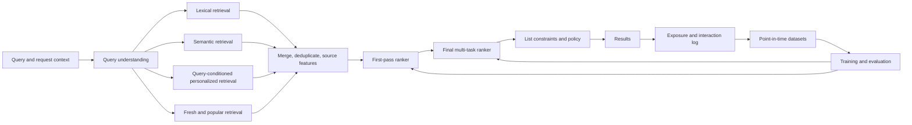

Personalized search should retrieve relevant items first, rank them for the current user and request, and control the feedback loop created by its own results. A strong design connects stage-specific objectives, exposure-aware data, online decisions, latency, fallback, and long-term product health.

This case uses one concrete workload, but the decisions transfer to product, media, marketplace, job, and enterprise search. It is a reference map rather than a script. In an interview, state the product decision, draw the request path, and take one or two areas deep.

## The prompt

Design the main search experience for a global media product.

Assume:

- 100 million monthly active users;
- 10 million searchable items;
- 10,000 peak queries per second;
- a top-20 result page;
- a p99 server latency target below 200 milliseconds;
- text, locale, device, current session, and consented history as inputs;
- new users, new items, and tail queries as important slices;
- long-term successful consumption as the product goal.

The current system uses lexical retrieval plus popularity. Exact-title search works, but broad queries are generic. New items receive little exposure. Repeated recommendations narrow over time. Search reformulation is rising in several locales.

The first release must improve broad-query success without regressing exact lookup, latency, new-item discovery, or critical market slices.

## State the design thesis first

Use a multi-stage retrieve, rank, and constrain architecture.

1. Retrieve candidates from lexical, semantic, personalized, and freshness-aware sources.
2. Preserve recall with a cheap first-pass ranker.
3. Predict several user outcomes with a richer final ranker.
4. Apply list-level constraints for availability, safety, diversity, and product policy.
5. Log exposure and decision context so evaluation does not confuse the old policy with user preference.
6. Launch by query segment and traffic stage, with a lexical fallback and rollback-ready artifacts.

Personalization should be conditional on the query. User history can resolve intent and order relevant candidates, but it should not replace query relevance. A user who often watches football should still receive the correct film when they search its exact title.

## Clarify the product decision

Ask questions that change the objective or architecture.

### User intent

- Is the dominant task exact lookup, broad discovery, navigation, or factual retrieval?
- Does success mean a click, completed consumption, purchase, application, or resolved task?
- Can one query express several valid intents?
- How costly is an empty or confidently wrong result?
- Are explanations or source citations part of the result?

### Inventory

- How often do items appear, change, expire, or become unavailable?
- Does availability depend on region, subscription, rights, age, or policy?
- Which item fields are searchable immediately after publication?
- Are text, audio, image, graph, or behavioral representations available?

### Personalization and policy

- Which user signals have consent and a valid retention purpose?
- Must some sessions operate without history?
- Which attributes must not influence ranking?
- Does the product owe exposure or quality guarantees to creators, sellers, or employers?
- What safety filters must apply before any learned score?

### Operations

- What are the request, index-freshness, and feature-freshness targets?
- What fallback is acceptable when one retriever or feature service fails?
- Which teams own query understanding, retrieval, ranking, policy, and serving?
- Can the current system shadow the new stages?

For this case, exact lookup has high value, broad discovery needs improvement, and the catalog changes continuously. Personalization uses recent consented interactions and coarse long-term preferences. Region and rights filters are hard requirements.

## Define success at three levels

A ranking system can improve one metric while making the product worse. Define the decision before selecting a loss.

### Request success

Measure whether the user reached a useful result for the current task.

Candidate metrics include:

- successful result consumption;
- query reformulation within a short window;
- immediate abandonment;
- long click or completed session;
- explicit dissatisfaction;
- zero-result and low-result rates.

A click alone is weak. Position, presentation, and curiosity can create clicks without satisfaction.

### Product outcome

Choose a primary outcome connected to the surface. For a media product, use a successful search session and confirm longer-term effects through return or retained consumption.

Long-term return is too delayed and diffuse to optimize alone. Use it to validate short-term objectives and detect harm rather than assigning every request direct credit.

### Guardrails

Track:

- exact-title success;
- p95 and p99 latency;
- cost per query;
- crash and timeout rates;
- new-item and tail-item exposure;
- result diversity;
- policy violations;
- critical locale and device slices;
- repeated-query and reformulation rates.

Predefine the launch rule. For example, broad-query success must improve, exact lookup must remain within a narrow non-inferiority margin, and no critical guardrail may cross its stop threshold.

## Build a workload and latency budget

Order-of-magnitude estimates constrain the design.

At 10,000 peak queries per second and 20 visible results, the product emits 200,000 visible result positions per second. The system may score thousands of candidates per request, so final model complexity depends on aggressive early reduction and batching.

A 200-millisecond p99 server target could allocate:

| Stage | p99 budget |
| --- | ---: |
| Request parsing, policy, and query understanding | 15 ms |
| Parallel candidate retrieval | 35 ms |
| Candidate merge and first-pass ranking | 35 ms |
| Final ranking | 55 ms |
| List constraints and response assembly | 20 ms |
| Network variance and safety margin | 40 ms |

These are budgets, not promises. Measure each stage and preserve headroom. If a stage consumes its full budget under ordinary load, small index or dependency changes will break the request target.

Assume each retriever returns hundreds or low thousands of candidates. The merge produces about 5,000 unique candidates, the first ranker keeps 500, and the final ranker scores 100 to 500 depending on model cost.

## Draw the request and learning loops

The online path ends at results. The learning path begins with the exact candidates, positions, scores, model versions, and features used to create those results.

If the exposure log is incomplete, later training cannot distinguish “the user disliked this item” from “the system never made it visible.”

## Stage 0: understand the query without delaying it

Query understanding can provide:

- normalization and tokenization;
- language and locale detection;
- spell correction;
- entity or title detection;
- intent probabilities;
- safety classification;
- query embeddings;
- structured constraints such as date, category, or language.

Keep reversible transformations. A correction should not erase the original query. Retrieve from both when confidence is uncertain.

### Exact versus broad intent

An entity or exact-title detector can protect lookup tasks. Exact lexical matches receive a strong feature or dedicated candidate quota. Broad queries rely more on semantic, personalized, and exploratory sources.

Do not use one fixed source mixture for every query. A learned or rule-based query router can select budgets by intent, but the first version can use a few transparent classes.

### Query rewriting

Rewriting can improve recall, especially across languages and vocabulary mismatch. It can also change intent.

Log the original and rewritten query, assign a confidence, and run retrieval on the original when uncertainty is material. Evaluate rewrites on exact entities, sensitive topics, negation, and tail languages.

## Stage 1: retrieve with complementary sources

No one retriever handles every query. Run several sources in parallel and preserve source identity as a feature.

### Lexical retrieval

An inverted index with a term-based score handles:

- exact titles and names;
- rare terms;
- identifiers;
- spelling variants captured by the analyzer;
- fresh items with little behavioral data.

Use field weights and phrase features. Title matches should differ from body or transcript matches. Region and hard availability filters should run before expensive ranking when possible.

### Semantic retrieval

A two-tower model embeds the query context and items into a shared space. Item vectors are computed offline or on publication. Query vectors are computed online.

Training pairs can use successful query-item interactions, explicit judgments, and teacher scores. Negative construction matters:

- random negatives teach broad separation;
- in-batch negatives improve efficiency but may contain false negatives;
- impression negatives reflect confusing exposed items;
- hard lexical or semantic negatives teach fine distinctions;
- cross-encoder distillation transfers a richer relevance signal.

Approximate nearest-neighbor search trades recall for memory and latency. Evaluate index recall against exact search on a representative query distribution. Report head, tail, locale, and freshness slices.

### Query-conditioned personalization

Personalized retrieval should combine query and user state. Options include:

- a query embedding adjusted by recent session intent;
- separate query and user retrieval whose candidates are intersected or fused;
- a model that attends from the query to selected history events;
- category or creator preferences applied after a relevance floor.

Limit the history window and remove events without a valid use policy. A current-session signal often predicts intent better than a long-term profile.

When history is unavailable, the same endpoint should fall back to query, locale, and context features. Absence of history is a normal mode, not an error.

### Freshness and popularity sources

A small fresh-item source prevents new inventory from waiting for interaction labels. Popularity can recover obvious results during cold start and partial failures.

Compute popularity by relevant context such as region, language, time window, and category. Global popularity can erase local or tail intent.

### Source budgets

Each source receives a candidate budget based on query class and measured marginal recall. Adding another thousand semantic candidates has low value if lexical retrieval already covers the relevant set.

Track contribution and unique contribution. A source that appears in many final results may still add no candidates beyond another source.

## Merge candidates without losing source evidence

Candidate lists use incomparable scores. A lexical score, vector distance, and popularity count do not share a natural scale.

The merge layer should:

- deduplicate by canonical item identity;
- retain every source and source rank;
- record raw and calibrated source scores;
- enforce hard availability and policy filters;
- reserve quotas when one source would otherwise dominate;
- cap total candidates under overload;
- expose missing-source indicators.

Reciprocal-rank fusion is a strong baseline because it combines ranks without assuming calibrated scores. A small learned merger can later use query class, source ranks, and source scores.

Do not hide source failure. If semantic retrieval times out, the ranker needs a missing-source feature and the system needs a metric. Treating absent scores as ordinary zeros can shift behavior silently.

## Stage 2: optimize recall with a cheap ranker

The first-pass ranker reduces about 5,000 candidates to 500. Its main failure is removing the item that the final ranker would have selected.

Useful models include gradient-boosted trees, linear models over crossed features, or small neural networks. Features can include:

- source identity, score, and rank;
- lexical match and phrase features;
- embedding similarity;
- item availability and freshness;
- coarse query intent;
- lightweight user-item interactions;
- popularity within context;
- historical quality and policy flags.

Use features that can be computed or fetched cheaply in a batch. Avoid remote per-candidate calls.

### Stage metric

Measure recall of judged or successfully consumed items at the cutoff. Also measure final-system regret: how often did the first pass drop an item that a slower teacher or later successful interaction considered useful?

A first-pass NDCG improvement is irrelevant if recall at 500 declines and the final model loses its best candidates.

### Distillation

Train the first ranker from labels plus scores from the richer final model. Distillation can preserve candidates that have subtle value.

Validate against real outcomes because the teacher can transfer its own bias. Keep explicit relevance and policy features so the first ranker does not become an opaque copy.

## Stage 3: rank several outcomes

The final ranker scores a few hundred candidates with richer cross features and sequence context.

Possible architecture choices include:

- gradient-boosted trees for fast iteration and tabular features;
- deep cross networks for sparse and dense interactions;
- attention over recent user history;
- a cross-encoder for query-item text interaction;
- a mixture or cascade that reserves expensive scoring for ambiguous candidates.

Choose from latency, training data, interpretability, feature shape, and measured quality. A fashionable architecture is not a design requirement.

### Multi-task outputs

Predict outcomes that have distinct semantics:

- probability of useful engagement;
- expected consumption conditional on engagement;
- task completion;
- reformulation or abandonment;
- explicit negative feedback;
- longer-term satisfaction proxy;
- policy or quality risk.

Calibrate heads before combining them. Different base rates and loss scales can make one head dominate even when its product weight is small.

A score might combine expected benefits and costs:

$$
S(x) = \sum_k w_k \hat{u}_k(x) - \sum_j \lambda_j \hat{c}_j(x)
$$

The weights represent a product decision. They should not be hidden inside model training without an owner or evaluation plan.

### Constrained decisions

Some requirements should be constraints rather than negative score terms. Region, rights, safety exclusions, and severe quality rules belong outside the learned utility score when violations are unacceptable.

Other goals, such as diversity and freshness, can be soft constraints or list-level objectives. Record which layer owns each rule.

## Stage 4: optimize the result list

Items that score well independently can form a poor page. The list may contain duplicates, one creator, one viewpoint, or several near-identical titles.

The list layer can apply:

- canonical deduplication;
- hard policy and availability rules;
- maximum marginal relevance;
- category or creator caps;
- freshness floors;
- source or format diversity;
- page-level business constraints;
- exploration assignments.

List rules can reduce immediate score while improving user choice or ecosystem health. Evaluate the complete page, not only item-level predictions.

### Constraint ordering

Apply hard exclusions before optimization. Then solve soft trade-offs. Finally validate that post-processing did not reintroduce an invalid item or empty the page.

Log both pre-constraint and post-constraint ranks. Otherwise teams may blame the model for a policy-layer change.

## Build labels from decisions, exposure, and outcomes

Training records should include:

- request and stable session identifiers;
- original and transformed query;
- candidate set and source evidence;
- exposed items and positions;
- model and policy versions;
- relevant point-in-time features;
- randomization probability when used;
- immediate interactions;
- delayed outcomes and maturity state;
- policy interventions;
- privacy and retention class.

### Do not call every non-click a negative

An unclicked item may have been below the fold, ignored after an earlier result succeeded, or unseen because the user left. Treating every impression as an equal negative teaches position and stopping behavior.

Use stronger negatives such as:

- examined items skipped before a later click;
- items shown in the same visible region;
- reformulated-query failures;
- explicit negative feedback;
- hard candidates judged irrelevant;
- sampled catalog negatives for retrieval geometry.

Keep negative type as a feature or training weight. Each type answers a different question.

### Delayed outcomes

A click arrives quickly. Completion, product re-engagement, refund, complaint, or successful application may take days.

Build labels with maturity windows. Evaluation should state how much of the outcome window is complete. Retraining on partially mature labels can create apparent gains that disappear when late negatives arrive.

### Selective labels

The system observes detailed outcomes mainly for items it exposed. In marketplaces or risk systems, downstream decisions can hide even more labels.

Preserve randomized or audit samples where policy permits. Without support beyond the current policy, offline data cannot reliably evaluate large ranking changes.

## Correct exposure bias without claiming impossible counterfactuals

Clicks mix relevance with examination, position, presentation, and the old policy. Counterfactual learning uses known or estimated propensities to reweight observed outcomes.

Use randomized position swaps or exploration traffic to estimate exposure probabilities. Then consider:

- inverse propensity scoring for unbiased estimates under correct propensities and support;
- self-normalized estimators for lower variance with some bias;
- clipped weights to control extreme variance;
- doubly robust estimators that combine outcome models with propensity weighting.

State the assumptions:

- the logging probability is known or estimated well;
- the new policy has support under logged actions;
- the exposure model captures the relevant assignment process;
- interference and delayed outcomes are handled appropriately.

Do not claim to know what a user would have done for every unshown item. Use controlled exploration, explicit judgments, and sensitivity analysis to reduce uncertainty.

## Choose losses by stage and evidence

Retrieval, first-pass ranking, and final ranking should not share a loss by default.

### Retrieval loss

A contrastive objective can separate positive query-item pairs from sampled negatives. Sampling defines the task. Include hard negatives and control false negatives within a batch.

### First-pass loss

Pointwise or pairwise objectives often work because throughput and recall dominate. Distillation can preserve teacher ordering near the cutoff.

### Final-rank loss

Pairwise, listwise, or lambda-weighted objectives can align updates with top-rank metric changes. Multi-task heads may use classification, regression, or survival-style objectives based on the outcome.

### Calibration

A ranker can order correctly while producing unusable probabilities. Calibrate heads when downstream thresholds, utility weights, or interventions treat scores as probabilities.

The [learning-to-rank loss guide](/concepts/learning-to-rank-losses/) covers the objective families. The system-design decision is which label, sampling process, and product metric make each surrogate meaningful.

## Preserve point-in-time correctness

Historical examples must reconstruct what the system could know at request time.

Version:

- query processing;
- user-history windows;
- item metadata;
- availability and rights;
- popularity aggregates;
- source indices;
- feature transformations;
- label definitions;
- model and policy code.

Use event time and availability time for late-arriving data. A corrected catalog record or delayed interaction should not appear in training as if it existed earlier.

### Splits

Use time-based evaluation for deployment realism. Add group constraints where repeated users, items, or queries would leak across splits.

Evaluate several transfer slices:

- new users;
- new items;
- tail queries;
- new query-item combinations;
- changed locales or catalog segments.

Random row splits often overstate performance because the same users, items, and near-duplicate sessions appear on both sides.

## Handle cold start as several problems

### New user

Use query, session, locale, device, and contextual popularity. Ask for lightweight preference only when the product can justify the friction.

Move gradually from contextual to historical personalization. Do not switch after an arbitrary interaction count without confidence or quality evidence.

### New item

Use text, image, audio, metadata, and publisher features. Include the item in a freshness-aware retriever and allocate bounded exploration.

Measure whether exploration gathers useful evidence or merely shifts exposure. Correct for the exploration assignment in later evaluation.

### New query

Use lexical and semantic generalization, spelling support, and query-intent features. Monitor zero results, reformulation, and nearest known-query distance.

### New market

Language, inventory, policy, and behavior can all change. Start from a strong non-personalized baseline and validate local labels. A translated query model does not prove calibrated ranking in the new market.

## Evaluate each stage and the complete system

### Retrieval

Measure:

- recall at candidate budget;
- unique relevant contribution by source;
- approximate-index recall against exact neighbors;
- latency and memory;
- fresh-item inclusion;
- head, tail, locale, and cold-start slices.

### First-pass ranking

Measure recall at its cutoff, teacher regret, latency, and robustness when one retrieval source is missing.

### Final ranking

Use NDCG, MRR, or task-specific utility on judged and interaction data. Report calibration where scores drive utility or thresholds.

### List quality

Measure deduplication, diversity, coverage, constraint satisfaction, and page-level judgments.

### End-to-end replay

Replay complete versioned requests through candidate generation, ranking, and constraints. A model-only evaluation cannot detect index, feature, or policy changes.

## Use human judgments for coverage and diagnosis

Human labels can evaluate candidates the old policy rarely exposed. Create a stratified set across intent, locale, popularity, tail queries, and known failure modes.

A useful rubric separates:

- topical relevance;
- exact-intent satisfaction;
- quality or authority;
- freshness when needed;
- harmful or disallowed content;
- list redundancy;
- confidence in the judgment.

Measure agreement and adjudicate ambiguous cases. Do not reduce every disagreement to labeler error. Ambiguity can reveal underspecified product intent.

Refresh part of the set and keep a stable regression subset. A static benchmark becomes less representative as the catalog, policy, and model change.

## Design the online experiment around the decision

Randomize at the user level when treatment can affect later sessions. Query-level randomization gives more power but can contaminate learning and user experience when the same person sees both policies.

Define:

- eligibility and exposure;
- primary metric and maturity window;
- exact-title non-inferiority guardrail;
- latency, cost, safety, and ecosystem guardrails;
- minimum worthwhile effect;
- sample size and duration;
- novelty and carryover risks;
- stop rules;
- segment analysis planned before launch.

### Ramp sequence

1. Offline and replay checks.
2. Shadow scoring on production requests.
3. Internal or bounded canary traffic.
4. Small randomized experiment with automatic system stop conditions.
5. Planned ramp after enough mature outcome data.
6. Long-horizon holdout when feedback effects matter.

Shadowing validates features, latency, and score behavior. It does not measure user response because the candidate ranking is not shown.

### Interpret disagreement

If offline metrics improve and online outcomes decline, investigate:

- objective mismatch;
- exposure or selection bias;
- temporal leakage;
- feature skew;
- index differences;
- list constraints;
- latency and timeout changes;
- novelty effects;
- slice regressions;
- logging errors.

Do not automatically trust either side. Online data can also be invalid through assignment, exposure, or instrumentation failures.

## Control feedback loops and exploration

The current ranker determines future exposure, labels, and model confidence. Without intervention, popular items can accumulate evidence while tail items remain uncertain.

Use several controls:

- a small randomized exploration bucket;
- freshness-aware candidate quotas;
- uncertainty-aware exploration where risk permits;
- diversity constraints;
- counterfactual evaluation with logged propensities;
- stable holdouts;
- periodic human judgment outside the current top results;
- monitoring of exposure concentration and query coverage.

### Exploration policy

Separate product exploration from experiment randomization. Define eligibility, maximum user cost, safety exclusions, and the probability of each action.

High-risk queries may allow no exploration. Broad discovery queries can tolerate more than exact title or urgent tasks.

Exploration budget limits what offline estimators can support. Small randomization reduces user cost but may not cover a large policy change. Increase support gradually, use targeted judgments, and require an online test when logged overlap remains weak.

### Ecosystem effects

Search can change creator, seller, employer, or publisher behavior. Monitor exposure concentration, new-item discovery, low-quality optimization, and strategic manipulation.

A short-term click gain can shift the inventory toward content that exploits the objective. Product health needs longer-horizon and supplier-side evidence.

## Design the serving path for partial failure

The online service should use parallel retrieval with deadlines. Slow sources return partial results rather than block the whole request.

A practical request path includes:

- authenticated request and consent context;
- query processing;
- parallel retrieval with per-source timeout;
- merge and hard filters;
- batched feature fetch;
- first and final rankers;
- list constraints;
- response cache where valid;
- exposure logging through a durable asynchronous path.

### Fallback ladder

1. Full personalized multi-stage ranking.
2. Query ranking without unavailable user features.
3. Lexical plus semantic retrieval with lightweight scoring.
4. Lexical retrieval plus contextual popularity.
5. A clear error only when no safe result path exists.

Test each mode. A fallback that is never exercised may have stale schemas, missing indices, or invalid policy logic.

### Timeouts

Assign deadlines by marginal value. If personalized retrieval has low unique contribution on exact queries, it should not consume the request budget.

Cancel or ignore late work. Record timeout, candidate contribution, and quality under degraded mode.

## Keep features available and temporally correct

Group online features by freshness and failure behavior.

### Request features

Query, locale, device, session state, and current product context arrive with the request.

### User features

Long-term preferences can update in batch. Recent interactions may update through a stream. Both need timestamps, defaults, and consent state.

### Item features

Metadata and embeddings update on publication or content change. Popularity and quality aggregates update on a declared cadence.

### Cross features

Rich query-item and user-item features are expensive. Compute lightweight values in batch, derive bounded online interactions, or use model architectures that combine embeddings efficiently.

### Feature failure

Every feature family needs one of:

- a safe default;
- a cached value with maximum age;
- a reduced model that excludes it;
- a request failure when the feature is legally or operationally required.

Do not remove an input from a model that was trained to require it. Use a separately trained reduced model, a model with validated missingness handling, or a cascade to a simpler architecture.

Record the feature versions and missingness used for each prediction. This supports incident analysis and model evaluation under degraded modes.

## Update indices without corrupting availability

Catalog and embedding indices change independently from model releases.

Use versioned index builds:

1. produce a new immutable index version;
2. validate document count, schema, sample queries, and approximate recall;
3. load or warm the index on a subset of servers;
4. shadow queries against current and candidate versions;
5. move traffic through an alias or desired-state pointer;
6. retain the previous compatible index for rollback.

Incremental updates reduce freshness delay but add compaction, deletion, and consistency complexity. Choose them when publication latency justifies the operational cost.

A model version should declare compatible index and embedding versions. Rolling back only the model can fail when vector dimensions or tokenization changed.

## Monitor quality, system health, and learning health

### Request path

Track latency, errors, saturation, timeouts, cache behavior, candidate counts, and degraded mode by stage.

### Retrieval and ranking

Track source contribution, score distributions, rank movement, missing features, index freshness, and constraint effects.

### User outcomes

Track successful sessions, reformulations, abandonment, long consumption, complaints, and delayed outcome maturity.

### Slices

Monitor exact, broad, head, tail, locale, device, new-user, new-item, and policy-sensitive groups.

### Learning loop

Track exposure concentration, propensity support, label delay, training-data age, evaluation drift, and offline-online relationship.

Every alert needs severity, owner, and response. Drift without demonstrated harm often belongs in a diagnostic dashboard. A policy violation or exact-query outage may require an immediate stop.

## Protect privacy, safety, and user control

Collect the minimum history needed for the declared purpose. Enforce retention, deletion, regional, and age requirements before features reach general training systems.

Provide a non-personalized mode whose quality is measured. Personalization should not become a hidden availability dependency.

Sensitive attributes may be needed for fairness evaluation while prohibited as ranking features. Separate access, purpose, and retention for evaluation data.

### Memorization and retrieval safety

Text or multimodal encoders can expose sensitive or disallowed content through nearest neighbors. Apply source policy before indexing, validate deletion, and keep item-level blocks outside learned scoring.

### Explanation

User-facing explanations should describe defensible factors such as query match, recency, or followed creator. Do not infer a causal explanation from a feature attribution alone.

## Model cost and capacity explicitly

Estimate cost by stage:

- index memory and replication;
- query and item embedding computation;
- feature reads;
- candidates scored per ranker;
- model operations and batch efficiency;
- logging volume;
- training and evaluation cadence;
- human judgment.

### Quality-cost frontier

Measure quality against candidate count, model size, precision, cache policy, and stage latency. Choose a point with headroom rather than the largest model that fits one benchmark.

Use a cascade when expensive scoring has value only for uncertain queries or candidates. For easy exact matches, a simple path may be both faster and more accurate.

### Overload

During load spikes:

1. shed optional diagnostics;
2. reduce low-value retriever budgets;
3. use the lightweight ranker for more candidates;
4. skip expensive reranking on high-confidence requests;
5. move to a tested fallback;
6. reject only after quality-preserving options are exhausted.

Log the active mode so product metrics are not compared as if the same policy served every request.

## Launch by capability, query class, and market

Avoid replacing the complete system in one release.

### Phase 1: logging and replay

Verify exposure, candidate, feature, model, and outcome joins. Build stage-level evaluation before training a complex model.

### Phase 2: hybrid retrieval

Add semantic retrieval in shadow mode. Launch first on broad queries where it adds unique judged recall. Preserve lexical protection for exact intent.

### Phase 3: first-pass learning

Introduce a cheap ranker over source evidence. Measure recall at the final-rank cutoff and behavior when sources fail.

### Phase 4: richer final ranking

Add calibrated multi-task predictions. Keep the list policy and fallback independent from the model artifact.

### Phase 5: personalization

Start with session signals and broad intent. Expand history only after slice, privacy, and feedback-loop evidence supports it.

### Phase 6: controlled exploration

Introduce bounded exploration with logged probabilities. Use the data to improve counterfactual evaluation and cold-start learning.

Each phase has a rollback target and a result that can stand alone. The organization should gain value before every planned stage exists.

## Walk through an incident

Suppose broad-query success rises after launch, but exact-title success drops in one locale. Overall NDCG remains positive.

Investigate in this order:

1. Confirm experiment assignment, exposure, and locale instrumentation.
2. Slice the drop by query intent, language, device, and result availability.
3. Compare original and rewritten queries.
4. Inspect lexical candidate recall before ranking.
5. Check whether semantic candidates consumed the merge quota.
6. Compare first-pass drops and final-rank movements.
7. Inspect list constraints and regional availability filters.
8. Reproduce requests with the recorded index, model, and policy versions.

Assume the query rewriter translated rare proper names and the merge reserved no lexical quota. The semantic source crowded out the exact item before final ranking.

Immediate response:

- disable rewriting for low-confidence entities in the affected locale;
- restore a lexical quota for exact-intent queries;
- roll back the query-policy version if the bounded fix is unsafe;
- add rare-name and transliteration cases to the stable evaluation set;
- review other locales using the same policy.

This incident shows why model-only metrics were insufficient. The model never saw the missing correct candidate.

## Make staff-level decisions visible

A staff answer should connect product, model, and operating boundaries across teams.

### Own the interfaces

Define ownership among query understanding, retrieval, ranking, policy, experimentation, and serving. Teams can iterate independently only when candidate, feature, logging, and release contracts are stable.

### Protect stage metrics

A shared end metric does not replace stage accountability. Retrieval owns recall and latency. Ranking owns ordering and calibration. The list layer owns constraint effects. The product owner owns the ship decision.

### Migrate without dual confusion

Move one authority at a time. If both old and new rankers can control production without a clear assignment record, incident analysis becomes ambiguous.

### Measure adoption through outcomes

A shared ranking service creates leverage only when teams ship faster, reduce repeated failures, or gain evidence they could not produce alone. Client count is incomplete evidence.

### Preserve exceptions

A specialized market or safety surface may need a different retriever, objective, or release rule. Require explicit ownership and compatible logging rather than forcing one lowest-common-denominator model.

## Add the principal portfolio view

A principal answer decides where shared investment creates durable leverage.

### Shared capabilities

Good candidates for shared ownership include:

- item identity and availability contracts;
- exposure logging;
- experiment assignment;
- index publication safety;
- model and policy version identity;
- stage telemetry;
- common evaluation infrastructure.

### Specialized capabilities

Keep domain-specific ownership for:

- query-intent taxonomies;
- market policy;
- labels and utility weights;
- specialized encoders;
- supplier or creator constraints;
- high-risk fallback decisions.

### Portfolio choices

Balance:

- broad-query quality;
- exact-intent reliability;
- cold-start and tail coverage;
- platform reliability;
- privacy and safety work;
- market expansion;
- retirement of old indices and models.

A new final ranker may have less value than repairing logging support or index freshness. State the opportunity cost.

### Decision checkpoints

Review the direction each quarter using:

- unique recall contribution;
- online success and guardrails;
- feedback-loop health;
- cost and latency headroom;
- market transfer;
- team delivery time;
- incident and support load;
- retirement of replaced systems.

Expand, narrow, or stop components based on evidence. Preserve portable item, query, exposure, model, and policy identities so the architecture can change.

## Structure a 45-minute answer

### Minutes 0 to 5: product and decision

Clarify intent, success, inventory, personalization policy, scale, and failure cost. State the multi-stage thesis and protect exact lookup.

### Minutes 5 to 12: workload and request path

Estimate candidates and latency. Draw query understanding, parallel retrieval, merge, first ranker, final ranker, constraints, and exposure logging.

### Minutes 12 to 22: data and models

Explain source complementarity, label semantics, negative sampling, multi-task outputs, and point-in-time data.

### Minutes 22 to 32: evaluation and launch

Define stage metrics, human judgments, counterfactual assumptions, experiment design, guardrails, and rollout.

### Minutes 32 to 39: serving and failure

Cover deadlines, fallback, index versions, features, monitoring, rollback, and one incident.

### Minutes 39 to 45: staff or principal depth

Choose ownership, migration, feedback control, shared boundaries, portfolio trade-offs, or decision checkpoints based on target level.

Do not explain every model family. Spend detail where the interviewer challenges an assumption.

## Answer-level signals

### Mid-level

Explains lexical and vector retrieval, names a ranker, and chooses ranking metrics. The request path may work, but labels, bias, failure, and launch remain thin.

### Senior

Connects candidate recall, ranking objectives, point-in-time data, online evaluation, serving, monitoring, and rollback for the search product.

### Staff

Defines cross-team stage contracts, ownership, migration, feedback control, and measured operating leverage. The answer remains technically precise under a retrieval, data, model, or serving follow-up.

### Principal

Chooses shared versus market-specific capabilities, balances several investments, preserves exit paths, and sets evidence-based checkpoints across a multi-year search direction.

## Observer scorecard

Score each dimension from 0 to 2.

| Dimension | 0 | 1 | 2 |
| --- | --- | --- | --- |
| Product framing | Optimizes clicks | Names intent and guardrails | Defines a decision across users and ecosystem |
| Retrieval | Uses one source | Combines complementary sources | Budgets sources and measures unique stage value |
| Ranking | Names a model | Connects labels and losses | Handles calibration, constraints, and delayed outcomes |
| Bias and feedback | Ignores exposure | Mentions position bias | Designs logging, support, exploration, and controls |
| Evaluation | Reports offline NDCG | Adds online testing | Validates assignment, maturity, slices, and counterfactual assumptions |
| Serving | Draws a request path | Adds latency and monitoring | Defines deadlines, degradation, compatibility, and rollback |
| Technical depth | Lists patterns | Defends one component | Traces a changed condition through several stages |
| Staff scope | Mentions teams | Defines ownership | Changes interfaces, migration, and measured operating outcomes |
| Principal scope | Says multi-year | Gives a roadmap | Makes portfolio, boundary, checkpoint, and exit decisions |

## Strong signals

- Protects exact intent while improving broad discovery.
- Uses complementary retrieval and stage-specific metrics.
- Preserves source evidence through candidate merge.
- Separates exposure, interaction, and delayed outcomes.
- States counterfactual support and propensity assumptions.
- Treats utility weights and hard constraints as product decisions.
- Reconstructs point-in-time requests across index, feature, model, and policy versions.
- Designs fallback and index rollback before launch.
- Monitors feedback-loop and ecosystem effects.
- Makes staff and principal decisions concrete through ownership and portfolio evidence.

## Weak signals

- Jumps directly to an embedding model.
- Uses clicks as unbiased relevance labels.
- Reports only final NDCG and ignores candidate recall.
- Personalizes exact queries without a relevance floor.
- Calls every non-click a negative.
- Claims counterfactual outcomes for unsupported items.
- Treats shadow traffic as proof of product impact.
- Rolls back model weights without compatible features, index, and policy.
- Adds diversity as a slogan without a product metric or constraint.
- Describes staff scope as more components and principal scope as more years.

## Changed-condition follow-ups

1. History use is disabled for half of users. How does quality degrade, and which model remains valid?
2. The catalog grows from 10 million to one billion items. Which stage changes first?
3. New items must become searchable in under one minute. How do index publication and embeddings change?
4. One locale has little interaction data and unreliable translations. What is the launch sequence?
5. A semantic retriever improves recall but adds 40 milliseconds to end-to-end p99 latency despite parallel execution. What evidence decides whether it stays?
6. Query-level randomization contaminates later sessions. How do you redesign the experiment?
7. A creator group receives less exposure despite stable user success. What do you measure and who owns the trade-off?
8. The online feature store fails during peak traffic. Which fallback preserves intent?
9. The final ranker doubles in size for a small NDCG gain. How do you evaluate the quality-cost frontier?
10. Search reformulation falls, but long-term consumption also falls. Which objective or behavior may have changed?
11. An index update removes valid items in one region. How do you detect, contain, and roll back it?
12. Two teams want incompatible utility functions on the same surface. Which capability stays shared?

For each follow-up, state which assumption changed, which stage absorbs the change, and which metric decides the next action.

---

*Related: [learning-to-rank losses](/concepts/learning-to-rank-losses/), [position bias and counterfactual ranking](/concepts/position-bias-counterfactual-learning-to-rank/), [negative sampling](/questions/negative-sampling-strategies/), [multi-task interference](/concepts/multi-task-learning-objective-interference/), [evaluate a search ranker](/questions/evaluate-search-ranker/), and [senior through senior-principal ML scope](/guides/l5-vs-l6-faang-ml/).*
