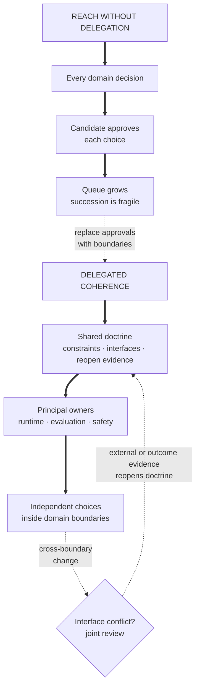

Level is a scope and evidence contract, not a translation of a title. A senior candidate owns an ambiguous project area. A staff candidate chooses problems across teams. A principal candidate sets durable direction across organizations. A senior-principal candidate creates coherence across several principal-owned directions.

Strategic language does not prove level. Interview evidence must show specific decisions, technical mechanisms, failed paths, influence, adoption, and measured outcomes. Company labels vary, so calibrate against the expected scope rather than a number alone.

## Use five axes instead of a title map

Compare roles on five observable axes.

| Axis | Senior | Staff | Principal | Senior principal |
| --- | --- | --- | --- | --- |
| Problem ownership | Owns an ambiguous project area | Chooses problems for a team or sub-organization | Shapes a multi-organization problem portfolio | Connects several portfolios through shared constraints |
| Technical direction | Selects and delivers an approach | Sets architecture or scientific direction across teams | Creates durable technical constraints and options | Defines doctrine above several principal-owned directions |
| Time horizon | One or two planning cycles | Several quarters | Multiple years, with explicit checkpoints | Multiple horizons under external and organizational change |
| Influence | Aligns direct partners | Changes roadmaps and interfaces across teams | Changes investment, standards, and direction across organizations | Delegates authority while preserving cross-portfolio coherence |
| Evidence | Shipped outcome and sound decisions | Repeated adoption, recovery, and operating leverage | Durable leverage, portfolio judgment, and succession beyond one person | Principal leaders, adaptable standards, reversal evidence, and institutional durability |

Scope is not headcount. A technically difficult project used by one team can be senior work. A small interface decision used by many teams can be staff work if it changes delivery and risk. Principal and senior-principal work add portfolio choices, delegated authority, and durability rather than scale alone.

## Senior owns the project area

A senior ML candidate should show that they can turn an ambiguous goal into a reliable result without waiting for detailed instructions.

Evidence usually includes:

- a clear user or scientific objective;
- an explicit baseline and success measure;
- ownership of data, modeling, evaluation, and launch decisions;
- alternatives considered and rejected;
- one failed approach and a measured recovery;
- operational outcomes after deployment;
- bounded personal contribution within the team.

The strongest senior stories expose the decision chain. They do not list everything the team built.

For example:

> I owned ranking quality for a new market. The existing model failed because interaction data was sparse and position-biased. I chose a content baseline, added a small exploration bucket, and delayed the neural ranker until we had support. The launch improved successful sessions without increasing latency or narrow-result complaints.

The level signal comes from autonomous project judgment. The candidate does not need to claim the market strategy, platform roadmap, or work of adjacent teams.

### Common senior failure

The answer describes implementation accurately but never identifies why the problem, metric, or approach was chosen. Interviewers can see execution but cannot see autonomous ownership.

## Staff chooses problems and creates leverage

A staff ML candidate should show repeated impact beyond one project. The work changes how several teams make decisions, build systems, or evaluate models.

This is an individual-contributor scope, not line management. The candidate leads through technical decisions, evidence, interfaces, and influence rather than owning performance reviews or reporting lines.

Evidence usually includes:

- choosing a problem rather than receiving a complete brief;
- identifying duplicated effort or a shared risk across teams;
- defining a technical boundary, standard, or platform contract;
- persuading teams with different incentives;
- keeping a useful escape path for valid exceptions;
- recovering from a wrong strategic or architectural bet;
- measuring adoption through delivery or reliability outcomes;
- remaining technically credible below the architecture diagram.

Staff influence is not meeting attendance. The story needs a mechanism. Perhaps the candidate built a temporal data contract that removed leakage across three products. Perhaps they changed the release process so every high-risk model carried comparable evidence and a tested rollback.

The candidate should explain why teams adopted the change. Mandates, executive support, and platform usage are incomplete signals. Strong evidence includes less duplicated work, faster diagnosis, lower incident rate, or a decision that became safer.

### Staff depth test

After the broad story, an interviewer may choose one detail:

- How did the point-in-time join handle late records?
- What state transition made deployment retries safe?
- Which evaluation slice blocked promotion?
- Why did one team need an exception?
- How did the cost model change the architecture?

A staff candidate should answer precisely. If every detail belongs to another person, the strategic claim loses technical support.

### Common staff failure

The answer adds “alignment,” “strategy,” and “stakeholders” to a senior project. It never shows another team's decision changing, a shared technical constraint, or an operating result.

## Principal manages direction and option value

A principal ML candidate should show judgment across several important investments. The work changes technical direction while preserving the organization's ability to respond when assumptions fail.

Evidence usually includes:

- identifying a constraint that several organizations were treating as separate problems;
- choosing which capabilities should become shared and which should remain specialized;
- balancing near-term delivery, platform work, research, migration, and retirement;
- setting multi-quarter decision checkpoints;
- defining evidence that would expand, narrow, reverse, or stop the strategy;
- influencing leaders and technical owners without taking their accountability;
- creating interfaces and decision processes that survive reorganization;
- developing other technical leaders who can carry the direction;
- remaining capable of a deep technical challenge in the primary domain.

Principal scope is not staff scope with more teams. The added responsibility is portfolio judgment under uncertainty.

Consider a fragmented ML platform. A staff candidate can design the control plane, migration, and ownership model across eight teams. A principal candidate must also decide whether platform consolidation deserves investment compared with product delivery, specialized research systems, and retirement of old infrastructure.

The principal answer states what evidence will revisit that allocation. It also protects exit paths if the platform, vendor, or organizational assumption changes.

### Common principal failure

The answer presents a grand architecture with no checkpoints, migration cost, or stop condition. Breadth becomes theater when the candidate cannot explain the first useful slice or the decision that can be reversed.

## Senior principal creates coherence across directions

“Senior principal,” “distinguished,” and equivalent labels vary sharply. Use this as a scope archetype, not a universal mapping to one company number.

A senior-principal ML candidate should show that several principal-level owners can make independent decisions inside a coherent technical direction. The candidate defines shared constraints, decision rights, evidence, and reversal without becoming the approver for every change.

Evidence usually includes:

- a durable technical doctrine above changing implementations;
- several principal-owned domains with real decision authority;
- portfolio choices across products, research, platform, safety, migration, and retirement;
- response to vendor, regulatory, market, or scientific change;
- standards that permit justified regional or domain variation;
- explicit evidence that reopens major decisions;
- succession across leadership or organizational change;
- direct depth in at least one contested technical boundary.

Consider an enterprise agent program. A principal candidate can choose the shared authority, tool, state, evaluation, and migration contracts. A senior-principal candidate also defines how principal owners of runtime, tools, security, evaluation, and regional products make coherent decisions without waiting for one central architect.

The contribution is a technical operating system for direction. It includes interfaces, decision rights, compatibility, incident authority, and evidence. A committee or vision statement does not provide these properties.

Learning objective

Distinguish company-wide reach from senior-principal leverage by tracing which decisions principal owners make independently, which conflicts cross a shared interface, and which evidence reopens the doctrine.

<!-- visual:senior-principal-delegated-coherence -->

<strong>Read it this way:</strong> count the decisions that require the senior-principal candidate. In the first path, every choice queues behind one approver, so broad reach hides weak delegation. In the second, principal owners decide within explicit boundaries; only interface conflicts require joint review, and named evidence can reopen the shared doctrine. The higher-level signal is coherent independent leadership, not more approvals. Original synthesis informed by the <a href="https://dropbox.github.io/dbx-career-framework/">Dropbox Engineering Career Framework</a> and <a href="https://staffeng.com/guides/staff-archetypes/">StaffEng's Staff-plus archetypes</a>.

### Senior-principal depth test

An interviewer may ask:

- Which decisions can each principal owner make independently?
- Which interface change requires cross-domain review?
- What external change invalidates the doctrine?
- Which standard should remain internal rather than become an industry interface?
- How does a successor reopen a decision without repeating years of debate?
- Which technical mechanism have you personally inspected recently?

The candidate should answer with owners, contracts, evidence, and consequences. “I align the leaders” is too vague.

### Common senior-principal failure

The answer uses company-wide scale as proof. It cannot identify delegated authority, independent principal leadership, external adaptation, or evidence that reverses the direction.

## The interview still tests the role's technical core

Level changes the scope of evidence. It does not remove the domain bar.

| Role | Retained technical depth |
| --- | --- |
| Applied Scientist | Modeling assumptions, experiment validity, causal threats, calibration, and product decisions |
| Machine Learning Engineer | Software contracts, data correctness, serving, observability, failure recovery, and cost |
| Research Scientist | Claims, derivations, baselines, ablations, uncertainty, and research alternatives |
| Research Engineer | Implementation, distributed execution, performance, reliability, and scientific validity |

An upper-IC candidate may spend less interview time implementing routine code. They still need enough depth to identify unsafe abstractions and challenge a weak technical premise.

Prepare one area where you can move from strategy to mechanism in three steps:

1. state the organization or product decision;
2. explain the architecture or scientific approach;
3. inspect one algorithm, invariant, experiment, or failure trace.

If the third step becomes vague, repair it before adding another strategy story.

## How the main interview rounds change

### Project deep-dive

A senior answer explains one hard project. A staff answer explains a shared capability through one concrete project. A principal answer explains a direction through several investments. A senior-principal answer shows how several technical leaders carried and adapted related directions.

Expect follow-ups on:

- why this problem deserved attention;
- which option was rejected and what it cost;
- what the candidate personally decided;
- what another team changed because of the work;
- what failed and when the candidate updated;
- how the outcome was measured;
- what remained unresolved;
- who could operate the result after the candidate left.

Do not begin with organization charts. Begin with the decision and stakes. Add scope only when it changes the technical or operating problem.

### ML system design

A senior candidate connects data, training, evaluation, serving, monitoring, and rollback for one product.

A staff candidate also covers:

- shared versus product-owned interfaces;
- migration from current systems;
- reliability and blast radius across tenants;
- ownership of data and model semantics;
- paved paths and justified exceptions;
- adoption and support evidence.

A principal candidate also covers:

- the investment portfolio around the system;
- build, buy, and exit decisions;
- multi-year constraints and checkpoints;
- standards that should outlive current implementations;
- evidence that would narrow or reverse the direction.

A senior-principal candidate also covers:

- doctrine shared across several principal-owned domains;
- technical decision rights and interface review;
- regional, regulatory, vendor, or ecosystem change;
- succession across organizational change;
- which standards should remain local or internal;
- evidence that reopens the doctrine itself.

Use the [multi-team ML platform case](/questions/design-multi-team-ml-platform/) and [enterprise agent-platform case](/questions/design-enterprise-agent-platform/) to practice these layers.

### Technical strategy

Technical strategy is a linked set of choices under a constraint. A list of aspirations is not a strategy.

A defensible answer states:

1. the constraint or opportunity;
2. the current evidence;
3. the capabilities to strengthen;
4. the work to stop or defer;
5. the order of investment;
6. decision checkpoints;
7. risks and exit paths.

At senior-principal scope, add who owns each direction, which decisions are delegated, and how external change can reopen the shared constraints.

For example, “standardize all ML tooling” is an aspiration. “Standardize artifact identity and promotion evidence while keeping specialized runtimes behind adapters” is a strategy choice. It allocates standardization to shared risk without forcing premature runtime consolidation.

### Behavioral and influence

Senior stories show direct collaboration and conflict. Staff stories show influence across teams. Principal stories show durable decisions across organizations. Senior-principal stories show principal leaders adapting a coherent direction through external or organizational change.

Prepare cases where influence was difficult because incentives differed. Agreement among people who already wanted the same outcome reveals little.

Useful evidence includes:

- a roadmap that changed;
- a shared interface another team adopted;
- a project that was stopped;
- a risk accepted with explicit ownership;
- an exception that improved the standard;
- a disagreement where your own view changed;
- a successor who carried the work.

Influence does not require winning every disagreement. The signal is better decisions with clear evidence and preserved working relationships.

## Build an evidence portfolio

Prepare evidence by function, not by memorized question.

### One architecture story

Choose a system where boundaries mattered. Be ready to explain workload, alternatives, interfaces, state, failure recovery, migration, and operating ownership.

### One problem-selection story

Show why you chose this work over credible alternatives. Include the information available at the time. Hindsight should not make the decision look obvious.

### One wrong-bet story

Explain the original hypothesis, the disconfirming signal, the cost of delay, and the recovery. Staff and principal candidates need evidence that judgment improves after failure.

### One stopped-work story

Show how you recognized that continued investment had lower value than the alternative. Explain how you handled commitments, people, and residual risk.

### One influence story

Choose a case with real disagreement. State each party's incentives and the evidence that changed the decision.

### One operating story

Show what happened after launch. Cover incidents, adoption, support, cost, or quality drift. Strategy without operation can hide weak accountability.

### One technical deep dive

Prepare an algorithm, experiment, performance trace, or distributed invariant from one broad story. The detail should be work you understand directly.

### One delegated-authority story

Show how several senior technical owners made real decisions without routing every choice through you. Explain the shared contracts, decision rights, interface conflicts, and evidence that kept their directions coherent.

### One external-change story

Show how a vendor, regulation, market, or scientific shift invalidated part of a multi-year direction. Explain what stayed durable, what changed, and why the response did not become a complete reset.

## Partition ownership precisely

Use first-person verbs for your decisions. Credit collaborators for theirs.

A useful ownership statement has four parts:

> I identified the shared failure and proposed the contract. The platform team built the control plane. Two product leads defined their migration requirements. I owned the boundary decision, pilot criteria, and review that changed the rollout after the first incident.

This is stronger than “I led the platform.” It is also more credible than claiming every result.

Prepare three layers of follow-up:

1. What did you personally decide?
2. What did another person own?
3. Which outcome can reasonably be attributed to your decision?

If those answers conflict, fix the story or choose another one.

## Distinguish leverage from scale

Large numbers do not automatically show seniority. Evaluate the mechanism that produced impact.

Weak scale claims include:

- hundreds of engineers used the tool because it was mandatory;
- the model served billions of requests but the candidate owned one routine component;
- the program lasted two years because migration stalled;
- several teams attended a review but changed nothing.

Stronger leverage claims include:

- a contract removed repeated point-in-time bugs across products;
- a promotion policy reduced unsafe launches while preserving a fast path;
- a shared evaluator made two research claims comparable;
- a cost model stopped an expensive architecture before migration;
- a successor expanded the program without the original author.

State both reach and mechanism. Then name a measured outcome.

## Avoid down-leveling and inflation

### Underclaiming

Candidates often hide the decision inside “we.” This is common in collaborative cultures and research teams.

Do not remove collaborator credit. Partition the work:

- “I proposed” for your proposal;
- “I decided” for your authority;
- “I recommended” when another person decided;
- “we built” for shared implementation;
- “the product team owned” for another team's outcome.

Specific ownership reads as senior. Inflated ownership fails under follow-up.

### Inflation

Vague leadership language cannot convert execution into strategy. Interviewers will ask for the exact decision, alternative, evidence, and owner.

Use a lower-level story honestly when it contains strong technical depth. Then choose a different story for scope evidence.

### Title anchoring

Do not argue that a prior title proves the target level. Titles and level numbers differ across companies. Map the actual work to the target rubric and let evidence carry the claim.

## Run the upper-IC practice path

Keep the role-specific path for technical coverage. Add the level path only when targeting staff, principal, or senior-principal scope.

1. Calibrate stories on the five scope axes.
2. Attempt the multi-team platform case closed-book.
3. Attempt the enterprise agent-platform case with different constraints.
4. Study the annotated mock, then repeat without its wording.
5. Defend one problem-selection decision.
6. Defend one wrong bet and one stopped project.
7. Practice delegated authority and external change.
8. Descend from one strategy claim into technical detail.
9. Run the level-appropriate simulation with an experienced observer.
10. Reduce the result to three repairs and repeat after spacing.

Open the [staff through senior-principal level path](/prep/level-paths/staff-principal/) for the full sequence.

## Score the evidence before the interview

Score each dimension from 0 to 2.

| Dimension | 0 | 1 | 2 |
| --- | --- | --- | --- |
| Problem selection | Received the problem | Compared options | Chose and revisited an important portfolio decision |
| Technical depth | Names components | Defends one design | Moves from strategy to mechanism under challenge |
| Cross-team influence | Shares information | Gains agreement | Changes roadmaps, interfaces, or operating behavior |
| Recovery | Mentions a failure | Fixes a project | Changes direction and prevents repeated failure |
| Leverage | Reports reach | Shows reuse | Connects a mechanism to durable measured outcomes |
| Ownership | Uses vague “we” | Names personal work | Partitions authority, contribution, and attribution |
| Time horizon | Describes one launch | Plans several quarters | Sets checkpoints that preserve multi-year options |
| Succession | Candidate remains central | Documents operation | Other leaders carry and improve the direction |
| Delegated authority | Coordinates contributors | Names domain owners | Principal leaders hold explicit decision rights |
| External adaptability | Ignores outside change | Adds a contingency | Preserves doctrine while reopening invalid assumptions |

A staff target needs strong evidence in technical depth, influence, recovery, leverage, and ownership. A principal target also needs strong portfolio, time-horizon, and succession evidence.

A senior-principal target also needs delegated principal authority, external adaptability, and evidence that can reopen the shared doctrine.

Do not average away a missing critical dimension. A broad principal story without technical depth remains a risk. A deep technical story without cross-organization direction does not prove principal scope.

## Company variation and evidence limits

“Senior,” “staff,” “principal,” “senior principal,” “distinguished,” and level numbers do not transfer cleanly. Some firms use principal below staff. Others reserve principal for rare organization-wide scope. Research labs may use broad titles with private influence bands.

Ask the recruiter or hiring manager:

- What scope does this level own in the first year?
- Which rounds contribute to the level decision?
- Is architecture, research direction, or organizational influence evaluated separately?
- What evidence distinguishes the target level from the one below?
- Can the company share a role or level rubric?

Current official interview material supports a general progression toward architecture, scope, impact, and leadership at higher levels. It does not support one universal mapping across employers.

Useful public references include the [Uber ML and AI Engineering interview guide](https://jobs.uber.com/en/uber-interview-guide/ml-ai-engineering-interview-guide/) and [Uber Sciences interview guide](https://jobs.uber.com/en/uber-interview-guide/sciences-interview-guide/). Treat every company-specific claim as dated and role-specific.

---

*Related: [choose what to work on](/questions/decide-what-to-work-on/), [multi-team ML platform design](/questions/design-multi-team-ml-platform/), [enterprise agent-platform design](/questions/design-enterprise-agent-platform/), [annotated upper-IC mock](/guides/annotated-upper-ic-agent-platform-mock/), and the [senior-principal simulation](/prep/simulations/#senior-principal).*
