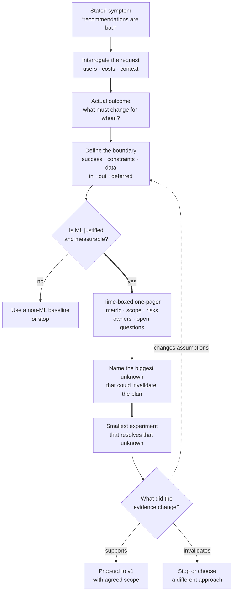

> *Asked in: behavioral and ML system design rounds at every senior level.*

The L4 candidate jumps to solutions. The L6 candidate has an explicit scoping process that they apply consistently.

## What "scoping an ambiguous problem" means

Open-ended business problem ("we need better recommendations," "the agent isn't reliable enough," "users complain about response quality") arrives at your desk. Your job is to turn it into a tractable ML problem with:
- A clear success criterion.
- A defined scope (what's in, what's out).
- A measurable plan.
- Identified risks and unknowns.

The senior signal is whether you can do this *before* writing code.

## What an L4 answer sounds like

> "I'd start prototyping a solution and iterate based on what works."

Reasonable for L4 (execution within someone else's scope). Failure at L5+ where you're expected to set scope.

## What an L5 answer sounds like

> "My process:
>
> 1. **Talk to the requesters.** What are they actually trying to achieve? What does success look like in business terms? What's the cost of failure?
>
> 2. **Reframe in ML terms.** What's the prediction or decision? What's the input, the output, the ground truth, the evaluation metric? Sometimes the answer is 'this isn't an ML problem,' and that's a valid output.
>
> 3. **Identify the data.** What data exists, what would we need, what's the quality? Often the available data determines what's possible.
>
> 4. **Sketch a baseline.** What's the simplest reasonable solution? Sometimes a heuristic or a small model is enough; that's a useful answer.
>
> 5. **Identify risks.** What could make this not work? Data quality, distribution shift, label noise, regulatory constraints, cost, latency.
>
> 6. **Write a one-pager.** Document the framing, the metric, the proposed approach, the risks. Get sign-off before investing significantly.
>
> The output of scoping is a one-pager, not code."

This is L5. Process is named, output is documented, the 'this isn't an ML problem' option is on the table.

Learning objective

How does an ambiguous request become an evidence-backed v1 decision?

<!-- visual:ambiguous-problem-scope-loop -->

<strong>Read it this way:</strong> do not turn the first request directly into a model. Move from the stated symptom to an agreed outcome and explicit boundary, then allow “non-ML” or “stop” as valid decisions. If ML remains justified, the first build is not v1: it is the smallest time-boxed experiment that can retire the plan’s biggest unknown. Its evidence either supports proceeding to v1, changes the scope, or ends the approach. Original synthesis checked against the <a href="https://www.gov.uk/service-manual/agile-delivery/how-the-discovery-phase-works">GOV.UK discovery guidance</a>, the <a href="https://www.gov.uk/service-manual/agile-delivery/how-the-alpha-phase-works">GOV.UK alpha guidance</a>, and <a href="https://developers.google.com/machine-learning/problem-framing/problem">Google’s ML problem-framing guidance</a>.

## What an L6 answer adds

> "...practical things:
>
> **Distinguish the stated problem from the actual problem.** Requesters often state symptoms ('the recommendations are bad') when the actual problem is something else (the *category* of recommendations is wrong, the metric they're using is wrong, the user expectation is mismatched). The first conversation usually surfaces this; sometimes it takes several. The skill is asking the questions that distinguish.
>
> **Time-box the scoping.** Scoping can expand to consume the project. I commit to producing the one-pager by a specific date and force convergence even if some questions are still open. The one-pager names the open questions explicitly; some can be deferred until the prototype answers them.
>
> **Negotiate scope explicitly.** The default outcome of an unscoped project is scope creep. The one-pager should say what's in v1, what's in v2, and what's explicitly out. Get sign-off on each.
>
> **Build in measurement before the model.** A scoped project specifies how you'll measure success before you build the solution. If you can't measure it, you can't ship it.
>
> **Identify the smallest experiment that resolves the biggest unknown.** Often the dominant risk is one specific question (will the model generalize to this distribution? does the data even contain the signal we think it does?). The first prototype should target that question, not the full system."

## Tells that get you a strong-hire vote

- You have an **explicit, repeatable process**.
- You bring up **'maybe this isn't an ML problem'** as a valid scoping output.
- You write a **one-pager** as the deliverable.
- You distinguish **stated vs actual problem**.
- You **time-box** the scoping itself.
- You target the **biggest unknown** with the first experiment.

## Tells that get you down-leveled

- Jumping to model architecture.
- No discussion of measurement.
- Treating scoping as the requesters' problem.
- No mention of risks or unknowns.
- Not knowing when to *stop* scoping and start building.

## Common follow-up

"How do you handle a stakeholder who wants you to commit to a quality bar before you've scoped the problem?"

The L6 answer:

> "Push back productively. The honest answer is 'I can give you an estimate after a week of scoping; if I commit to a quality bar without understanding the problem, I'll either over-promise and miss, or sandbag and waste opportunity.' If they insist on a number, I'll provide a range with explicit assumptions ('if the data has X property, we can hit Y; if not, we may only hit Z'). Bad: committing to a number you don't believe to look responsive. Worse: doing the scoping invisibly while saying yes externally; you build a debt you can't pay."

---

*Related: [The 5 things every applied scientist interview is testing for](/guides/five-things-as-interview-tests/), [senior through senior-principal ML scope](/guides/l5-vs-l6-faang-ml/), [How do you decide what to work on?](/questions/decide-what-to-work-on/).*
