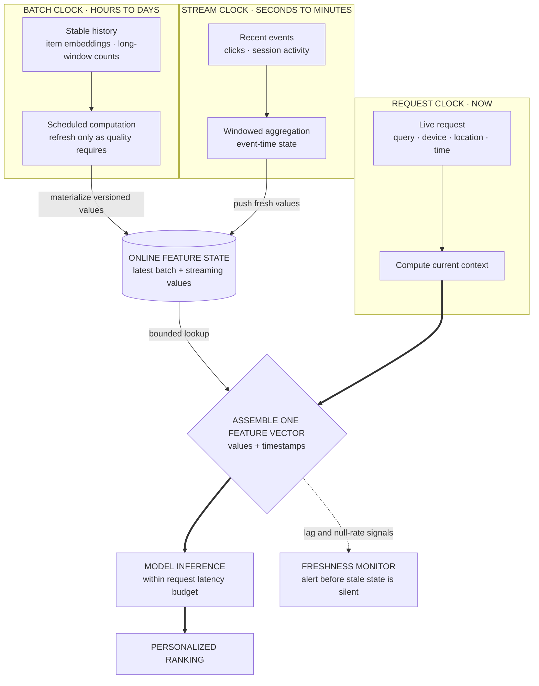

> *Asked in: recsys, search, and platform-ML interviews.*

The L4 candidate jumps to model architecture. The L6 candidate first asks how fresh "real-time" needs to be, where the latency budget goes, and how the feature pipeline ensures consistent training/serving features.

## Define "real-time" first

"Real-time" can mean any of:
- **Per-request**: features computed at request time from current state. Latency budget is tight (~100ms total).
- **Streaming-fresh**: features updated within seconds of an event (e.g., session-aware recommendations).
- **Near-real-time**: features updated within minutes (e.g., page-view aggregations).
- **Daily-batch**: stale by hours but still called "real-time" by some teams.

Each has very different infrastructure costs and use cases. Scope first.

Learning objective

Assign each feature the least-fresh clock that meets its product need, then trace all three clocks into one online prediction.

<!-- visual:personalization-three-feature-clocks -->

<strong>Read it this way:</strong> follow the two left clocks into stored online state before following the request clock. Stable history can be hours old, session activity seconds old, and query context current; they become “real-time” together only when the bounded serving path assembles them for this request. Promote a feature to streaming only when measured quality needs that freshness, and carry timestamps so a delayed pipeline cannot fail silently. Original synthesis checked against <a href="https://developers.google.com/machine-learning/guides/rules-of-ml">Google's Rules of ML</a>, the <a href="https://docs.feast.dev/getting-started/architecture/model-inference">Feast serving contracts</a>, and <a href="https://nightlies.apache.org/flink/flink-docs-stable/docs/concepts/time/">Flink's time model</a>.

## What an L5 answer sounds like

> "Architecture, in three pieces:
>
> **Feature pipeline.**
> - **Batch features** (computed daily or hourly): user history aggregates, item embeddings, graph features. Stored in a feature store.
> - **Streaming features** (computed seconds to minutes after event): session activity, recent-clicks features, real-time engagement counts. Computed in a stream processor (Flink, Spark Streaming, Kafka Streams) and written to the feature store.
> - **Request-time features**: context features (time, device, location), query embeddings. Computed at request time.
>
> **Online serving.**
> - Request comes in, fetches batch + streaming features from the feature store, computes request-time features, calls the model, returns predictions.
> - Latency budget allocation: feature fetch (10-30ms), model inference (20-50ms), application logic (10-30ms), network (10-20ms). Total p99 around 100-150ms.
>
> **Training pipeline.**
> - Joins logged production features with delayed labels (e.g., did the user click the recommended item).
> - Critical: training and serving must use *exactly* the same feature pipeline. Skew between them is the dominant production failure mode. Use the feature store for both, or generate from a shared library.
>
> **Eval**: offline (held-out logged data, counterfactual estimators), online (A/B test). Plus monitoring: feature staleness, feature null-rates, model score distribution drift."

This is L5. Three layers, latency budget allocated, training-serving skew called out.

## What an L6 answer adds

> "...practical things:

> **Training-serving skew is the dominant production failure mode.** Same feature computed differently in training and serving (different aggregation window, different null handling, different units) produces a model that works offline and fails online. The fix is mechanical: shared feature definitions, validation that feature distributions match between training and serving, alerting on divergence.
>
> **Feature freshness vs cost trade-off.** Streaming features (sub-second freshness) cost orders of magnitude more than batch features. Most features don't need streaming freshness; reserve it for features where freshness directly drives quality (session-aware ranking, just-clicked items).
>
> **Caching at multiple levels.** User feature vectors cached per request session. Model predictions cached for popular request signatures. Each cache adds staleness; tune the TTL based on the cost of staleness vs the cost of the request.
>
> **Embedding update strategies.** Item embeddings change as the model retrains. Online inference might use embedding version V1 in candidate generation and V2 in ranking; this breaks. Either pin the version per request or update everything atomically.
>
> **Cold-start in real-time.** New users / items don't have batch features ready; serving must handle missing features gracefully. Default values, fallback models, or a separate cold-start path.
>
> **Monitoring**: feature freshness lag, feature null-rate, model score distribution per-slice. The most common silent failure is a streaming pipeline falling behind; the model still serves but with stale features and quality degrades silently. Alert aggressively on staleness."

## Tells that get you a strong-hire vote

- You **scope 'real-time'** first.
- You name **training-serving skew** as the dominant failure mode.
- You allocate the **latency budget** explicitly.
- You discuss **caching** at multiple levels.
- You insist on **freshness monitoring**.
- You bring up **embedding-version atomicity**.

## Tells that get you down-leveled

- Model-first design.
- No latency budget.
- Treating "real-time" as one thing.
- No mention of training-serving skew.

## Common follow-up

"What if your streaming feature pipeline is down for an hour. What does the system do?"

The L6 answer:

> "Three patterns. (1) Serve stale features with monitoring: model still works, quality degrades by an amount you can quantify (depending on which features were stale). (2) Fall back to a model variant trained without those features (graceful degradation). (3) Worst-case fallback: serve cached predictions or simple heuristics (popularity-based recommendations). The right choice depends on which is least bad for the use case. Plan all three before launching; test each in chaos exercises before they're needed."

---

*Related: [delayed and selective labels](/concepts/delayed-labels-selective-labels-feedback-loops/), [point-in-time correctness](/concepts/data-leakage-point-in-time-correctness/), [YouTube recommendation design](/questions/design-youtube-recommender/), and [personalized search ranking](/guides/personalized-search-ranking/).*
