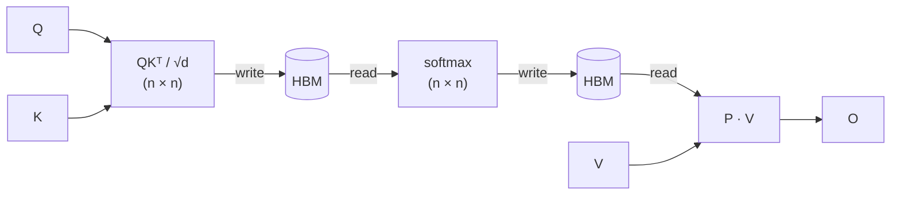

## Why it matters

Attention is **memory-bound**: not compute-bound, on modern GPUs. The bottleneck for long sequences is moving the n×n attention matrix between HBM and SRAM, not the matmuls. The n×n matrix never goes to HBM; only n-sized output and statistics are stored.

Result: same numerical output as standard attention, but **2-4&times; faster wall-clock and O(n) memory** instead of O(n²).

Essential in modern transformer training/inference. Every serious framework uses it or a close variant. Knowledge of FlashAttention is expected for 2026.

## The mechanism

Standard attention reads and writes the n×n attention matrix to HBM at every step:



Standard attention does this:

1. Compute S = QKᵀ / &radic;d (size n&times;n) → write to HBM
2. Read S, compute P = softmax(S, axis=-1) → write to HBM
3. Read P, compute O = PV → write to HBM

HBM traffic: **O(n² + nd)**. For n = 8192, d = 128, the n² term dominates by ~500&times;.

FlashAttention restructures it:

- Tile Q into blocks Q&#7522; of size B&#7479;&times;d. Tile K, V into blocks K&#11388;, V&#11388; of size B&#7580;&times;d.
- Outer loop over Q&#7522; (output rows). Inner loop over K&#11388;, V&#11388; (key blocks).
- Per Q&#7522;, maintain three running statistics in SRAM:
  - **m&#7522;** = max-so-far across processed key blocks (numerical-stable softmax)
  - **&#8467;&#7522;** = denominator of the partial softmax
  - **O&#7522;** = running weighted sum of values
- On each new tile (Q&#7522;, K&#11388;, V&#11388;):
  - compute S&#7522;&#11388; = Q&#7522;K&#11388;ᵀ / &radic;d entirely in SRAM
  - update statistics using the streaming log-sum-exp identity:

```
m_new = max(m_i, max(S_ij))
ell_new = exp(m_i - m_new) * ell_i + sum(exp(S_ij - m_new))
O_new   = (exp(m_i - m_new) * ell_i * O_i + exp(S_ij - m_new) @ V_j) / ell_new
```

The final O&#7522; is **exact** (mathematically identical to the standard implementation; no approximation). The n&times;n matrix S is never materialized; only the n-sized (m, &#8467;) statistics are saved for the backward pass.

## Backward pass: trade memory for compute

Standard backprop needs the attention matrix P stored from the forward pass, that's the O(n²) memory cost.

FlashAttention discards P and recomputes the relevant tile S&#7522;&#11388; on the fly during backward, using the saved (m&#7522;, &#8467;&#7522;). Extra FLOPs spent recomputing attention are far cheaper than the HBM reads they save. **Memory drops from O(n²) to O(n).**

This is the same idea as gradient checkpointing applied at kernel level.

## What an interviewer expects you to say

If asked to explain FlashAttention:

1. Frame the problem as memory-bound, not compute-bound. (This is the key insight; everything else follows.)
2. Mention HBM vs SRAM and that the n&times;n attention matrix is the bottleneck.
3. Describe tiling + streaming softmax + recomputation in backward.
4. State the result: exact, 2-4&times; faster, O(n) memory.
5. Bonus: mention FlashAttention-2 (better warp scheduling) and FlashAttention-3 (FP8 support, async overlap).

Explaining why streaming log-sum-exp works (numerical stability via running max) marks senior-level depth.

## Common confusions

- **"FlashAttention is approximate."** No. It is **bit-exact** with standard attention (modulo floating-point reordering). The win is purely from I/O reduction.
- **"It's a sub-quadratic attention algorithm."** No. The compute is still O(n²d). It's the *memory* that drops from O(n²) to O(n), and the *wall clock* improves because the operation was memory-bound. Sub-quadratic attention (BigBird, Linformer, LongNet) is a separate axis.
- **"It only helps long sequences."** It helps any non-trivial sequence (n &geq; 256 or so) but the gain grows with n. At n = 64 it's roughly the same as standard attention; at n = 8K-128K it's transformative.
- **"It saves FLOPs."** No, it does *more* FLOPs in backward (the recomputation). The wins are I/O and memory.

## Why interviewers care

Knowing FlashAttention shows you understand:
1. GPU memory hierarchy and arithmetic intensity (what makes an op memory-bound vs compute-bound).
2. The difference between exact and approximate optimization.
3. The recompute-vs-store trade-off at kernel level (same logic as activation checkpointing).

Foundational for large-model training/inference work. Explains KV-cache, paged attention, and inference optimization reasoning.

## Reading list

- *FlashAttention: Fast and Memory-Efficient Exact Attention with IO-Awareness* [(Dao et al., 2022)](https://arxiv.org/abs/2205.14135)
- *FlashAttention-2: Faster Attention with Better Parallelism and Work Partitioning* [(Dao, 2023)](https://arxiv.org/abs/2307.08691)
- *FlashAttention-3: Fast and Accurate Attention with Asynchrony and Low-precision* [(Shah et al., 2024)](https://arxiv.org/abs/2407.08608)
- Tri Dao's blog posts, the clearest explanations of the algorithm

---

*Related reference: [Speculative decoding](/reference/speculative-decoding/), [LayerNorm vs BatchNorm](/reference/layernorm-vs-batchnorm/). Related interview question: ["Walk me through how you'd serve an LLM with low latency"](/interviews/) (coming soon).*
