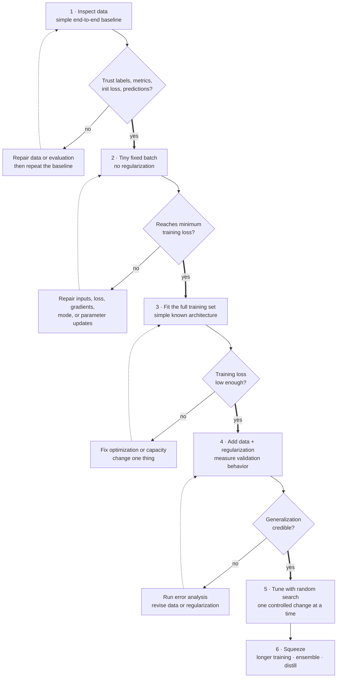

## Summary

A repeatable, ordered procedure for training neural networks: **become one with the data → build a dumb baseline end-to-end → overfit a tiny set → regularize → tune → squeeze**. The discipline is in the *order* and in changing **one thing at a time**.

Most failed training runs aren't caused by a bad architecture; they're caused by silent bugs, mis-scaled data, or skipping verification steps. This recipe (popularized by Karpathy's "A Recipe for Training Neural Networks") is what an interviewer is probing when they ask *"your model isn't learning, what do you do?"* It complements the interview-framed answer in [How would you debug a model that's not learning?](/questions/debug-model-not-learning/); this page is the procedural checklist.

The governing principle: **neural net training fails silently.** A wrong label map, an off-by-one in masking, or unnormalized inputs won't crash; they just quietly cap your accuracy. So the recipe is built around *verification at every step*, not speed.

**Learning objective:** use each training phase as an evidence gate, and return to the earliest failed assumption instead of tuning around an unverified pipeline.

<!-- visual:training-recipe-evidence-gates -->

<strong>Read it this way:</strong> follow the heavy “yes” spine downward. Every gate earns the next kind of work: trustworthy data earns a tiny-batch test, memorizing that batch earns full-set fitting, fitting earns regularization, and credible validation earns tuning. A “no” loops locally to repair evidence; it never skips ahead to hyperparameter search. Original synthesis checked against <a href="https://karpathy.github.io/2019/04/25/recipe/">Karpathy’s training recipe</a>, <a href="https://www.deeplearningbook.org/contents/guidelines.html"><cite>Deep Learning</cite>’s practical methodology</a>, and <a href="https://jmlr.org/papers/v13/bergstra12a.html">Bergstra and Bengio’s random-search paper</a>.

## Step 1: Become one with the data

Before writing a model, **look at the data**. Scroll through hundreds of examples, check label distributions, look for duplicates, corruption, and leakage. Search for patterns the model could exploit. Write simple filters to find outliers. Most of the eventual error analysis is foreshadowed here. Do **not** touch model code yet.

## Step 2: End-to-end skeleton + dumb baseline

Build the full training/eval pipeline with a trivial model, and establish trustworthy baselines. Key checks:

- **Fix the random seed.** Reproducibility first.
- **Disable augmentation/regularization** initially; you're verifying the pipeline, not generalization.
- **Verify the loss at init.** A softmax over $C$ classes should start near $-\log(1/C)$. If it doesn't, your init or loss is wrong.
- **Init the final-layer bias** to the data's marginal (e.g. log base rate) so the model doesn't waste the first epochs learning the prior.
- **Overfit one batch.** A correct model with enough capacity should drive a single batch's loss to ~0. If it can't, you have a bug; stop and find it.
- **Visualize predictions** on a fixed batch across training to watch them evolve.
- **Use a baseline** (human, simple model, or input-independent) to know what "good" even is.

## Step 3: Overfit

Get a model big enough to **overfit the training set** (drive training loss low), proving the architecture + optimization can fit the signal. Pick a well-known architecture for the task rather than inventing one. Use **Adam at lr ≈ 3e-4** as a safe default early; complexify **one piece at a time**. Don't trust learning-rate-decay schedules copied from other settings yet.

At this point you've separated the two problems: **can it fit** (step 3) and **does it generalize** (step 4).

## Step 4: Regularize

Now trade some training fit for validation performance. In rough order of leverage:

- **Get more data** (by far the best regularizer).
- **Data augmentation** (and aggressive/synthetic augmentation if needed).
- **Pretraining / transfer learning** where applicable.
- **Smaller model / bottleneck**, **weight decay**, **dropout**, **early stopping**.
- Reduce input dimensionality / remove leaky features.
- Prefer a **larger model with early stopping** over a perfectly-sized one; it usually generalizes at least as well.

## Step 5: Tune

With a working, regularized model, search hyperparameters:

- **Random search > grid search** (some hyperparameters matter far more than others; random covers them better).
- Tune learning rate and weight decay first; they dominate.
- Consider Bayesian optimization once the cheap wins are taken.

## Step 6: Squeeze the last drops

- **Ensembles** reliably add ~1–2%: average several independently trained models.
- **Train longer than feels reasonable**: models often keep improving well past where people stop.
- Knowledge distillation if you need the ensemble's quality in one model.

## What an interviewer expects you to say

1. Emphasize that **NN training fails silently**, so the method is *verify at every step*, not *change things fast*.
2. **Inspect the data first**; never start with the model.
3. Build an **end-to-end skeleton**, verify **init loss** and **overfit a single batch** before scaling.
4. Separate **"can it fit" (overfit first) from "does it generalize" (regularize second)**, and only then tune.
5. Change **one variable at a time**; use **random search**; the biggest regularizer is **more data**.

## Common confusions

- **"Just grid-search hyperparameters."** Premature: if you can't overfit one batch, no hyperparameter will save you. Find the bug first.
- **"A low training loss at init is fine."** Verify it equals the theoretical value ($-\log(1/C)$). A wrong value signals a bug.
- **"Regularize from the start."** Regularizing before you can overfit hides whether the model can fit the signal at all. Overfit first, regularize second.
- **"Bigger models overfit, so go small."** A larger model with early stopping usually generalizes as well or better; capacity isn't the enemy, lack of regularization is.
- **"Stop when the curve flattens."** Many models keep improving with much longer training; don't stop early by reflex.

---

*Related: [How would you debug a model that's not learning?](/questions/debug-model-not-learning/), [Debug this training loop](/questions/debug-training-loop/), [How to choose a learning rate](/questions/how-to-choose-learning-rate/), [Regularization](/concepts/regularization/), [Exploding and vanishing gradients](/concepts/exploding-vanishing-gradients/).*
