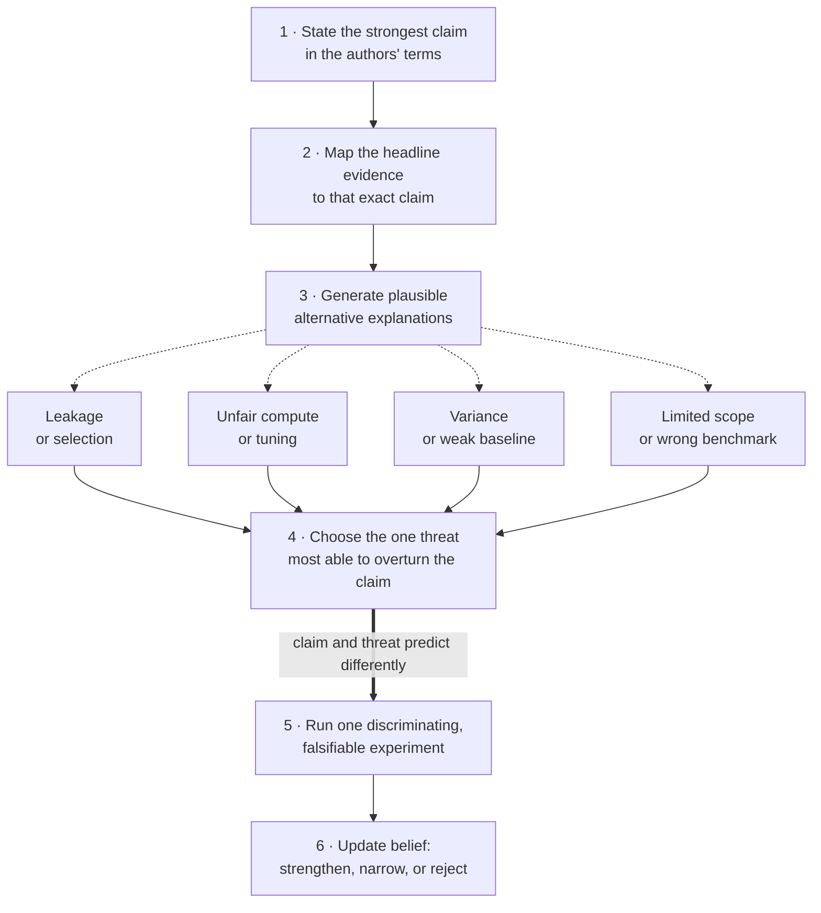

> You have ten minutes to read a paper's abstract, method figure, and main result table. Critique the work and propose the next experiment.

State the paper's strongest claim in the authors' own terms, then go after the single threat most likely to explain the headline result. Ten generic faults ("small gain, few datasets, more baselines") get you down-leveled; the signal is fair, prioritized, falsifiable judgment under incomplete information.

## A reading order

1. **Claim:** what does the paper say is new and true?
2. **Evidence:** which result supports each part of the claim?
3. **Comparison:** are the baselines strong, current, and fairly resourced?
4. **Validity:** could leakage, selection, tuning, or variance explain the result?
5. **Mechanism:** do the ablations isolate why it works?
6. **Scope:** where should the conclusion generalize, and where should it break?
7. **Value:** is the gain meaningful relative to compute and complexity?
8. **Next experiment:** what single result would most change your belief?

<!-- visual:paper-critique-prioritization-funnel -->

<strong>Read it this way:</strong> follow the solid spine from claim to evidence, then inspect the dashed candidate threats. Do not turn all four into generic requests for more work. Reconverge on the threat most capable of overturning the claim, and choose one experiment where that threat and the authors' explanation predict different outcomes.

## Be fair before you criticize

Open by stating the strongest contribution in the authors' own terms, then separate:

- A correct result with an overstated claim
- A useful engineering improvement without novel science
- A plausible mechanism with insufficient evidence
- A flawed evaluation that invalidates the headline

## What an L4 answer sounds like

> "The gain is small, there are not enough datasets, and they should compare to more baselines."

These may be true, but they are generic and never identify the highest-impact threat.

## What an L5 answer adds

An L5 answer ties each criticism to the claim. For efficiency, compare matched wall time and hardware use. For robustness, define the shift and uncertainty. For a mechanism, require a discriminating ablation. Compare small gains with seed variance and tuning budget, then propose one feasible experiment.

## What an L6 answer adds

An L6 answer also judges strategic value. It checks whether the benchmark matches real use, whether the method improves cost or reliability, and which result may survive scale. It identifies the capability needed to reproduce the work and classifies the contribution as a primitive, recipe, or local optimization.

## Tells that get you a strong-hire vote

- Criticism is prioritized by impact on the central claim.
- Baseline and compute fairness are explicit.
- You separate absence of evidence from evidence of failure.
- You propose a falsifiable next experiment.
- You name a real strength before the limitations.

## Tells that get you down-leveled

- Judging the venue or the authors rather than the evidence.
- Demanding more datasets without saying what they would test.
- Calling a small gain meaningless with no uncertainty or cost context.
- Missing leakage or matched-compute issues.
- Ten criticisms and no decision.

## Common follow-ups

- Would you spend a month reproducing this paper?
- Which claim would you narrow?
- What is the strongest alternative explanation?
- How would you test whether the result survives scale?
- What if the method is slower but easier to operate?

*Related: [design an ablation study](/questions/design-ablation-study/), [bias-variance of estimators](/concepts/bias-variance-of-estimators/), and [lessons from Marin 8B](/guides/lessons-from-marin-8b/).*
