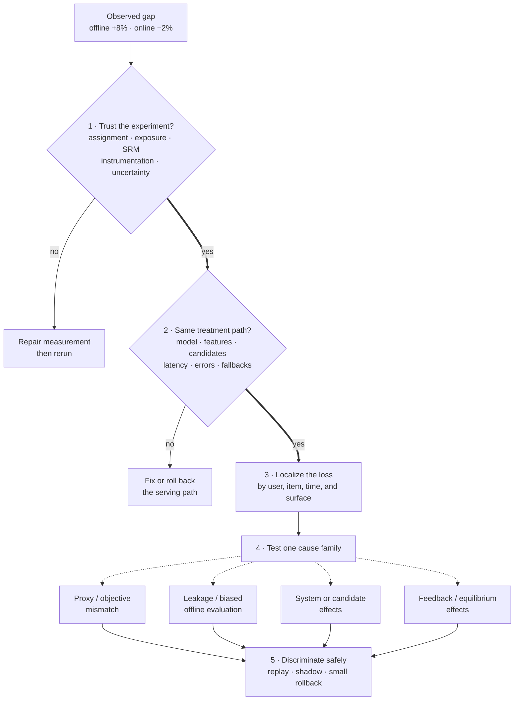

> A model improves the main offline metric by 8%, but the online primary metric declines by 2%. What do you do?

Order your measurements so each step rules out a class of causes. The weak answer free-associates explanations; the strong answer verifies the experiment first, then the serving path, then model quality, and reaches for "drift" only after the cheaper causes are gone.

## First: verify the observation

Before explaining the gap:

1. Validate assignment, exposure, sample-ratio, and metric instrumentation.
2. Confirm the online change exceeds normal variance and is not novelty or seasonality.
3. Check latency, error rate, fallback rate, and whether the treatment was actually delivered.
4. Reproduce the production feature and prediction path offline.

If the treatment was not delivered as intended, this is not yet a model-quality mystery.

**Learning objective:** Order the investigation so each check eliminates an entire layer of causes before you form a narrower model-quality hypothesis.

<!-- visual:offline-online-gap-diagnostic-order -->

<strong>Read it this way:</strong> follow the heavy “yes” spine downward. A failed validity or delivery gate is already an explanation, so repair it before blaming model quality. Only after both gates pass should you branch into cause families, then choose a replay, shadow comparison, or small rollback whose result separates those hypotheses.

## The main cause families

**Objective mismatch.** The offline label or metric is a proxy. Better NDCG, AUC, or accuracy need not improve the user outcome: the model may lift clicks while cutting satisfaction, or raise average relevance while hurting high-value slices.

**Data leakage or evaluation bias.** Time leakage, label leakage, repeated entities, biased negatives, or an unrepresentative test set inflate offline results.

**Training-serving skew.** Feature definitions, freshness, defaults, preprocessing, model version, or candidate sets differ in production.

**System effects.** The model may add latency, cut inventory diversity, overload a downstream service, or trigger more fallbacks.

**Feedback and equilibrium effects.** A ranking model changes what users see and therefore changes future labels; suppliers, fraudsters, or users adapt.

## What an L4 answer sounds like

> "I would check data drift and retrain the model."

Drift is one candidate, but retraining before you validate experiment and serving integrity only makes the diagnosis harder.

## What an L5 answer adds

An L5 answer builds a decision tree. First verify assignment and exposure, then compare production predictions with an offline replay. Find the slices that explain the regression. Check metric alignment, latency, fallbacks, and candidate coverage. Use a small rollback or shadow comparison to isolate the cause safely.

## What an L6 answer adds

An L6 answer questions the offline evaluation system. The benchmark may contain the old policy's selection bias or omit labels for unseen items. Proxy optimization may also create a predictable second-order effect. The answer considers counterfactual evaluation, randomized exploration, long-term holdbacks, and the process gap that missed the risk.

## Tells that get you a strong-hire vote

- You verify the experiment before debugging the model.
- You separate model quality from system delivery.
- You use slice and counterfactual analysis to test hypotheses.
- You propose rollback or containment before a broad investigation.
- You improve the eval pipeline once you find the mismatch.

## Tells that get you down-leveled

- Immediately retraining on more data.
- Listing ten possible causes with no diagnostic order.
- Assuming the online metric is wrong because the offline metric improved.
- Ignoring latency, fallback, or candidate-generation changes.
- Looking only at averages.

## Common follow-ups

- How do you compare online and offline predictions safely?
- What if the regression appears only for new users?
- What if the online primary metric is noisy and delayed?
- How would selection bias enter a recommender's offline dataset?
- When would you keep the model running despite the initial regression?

*Related: [delayed and selective labels](/concepts/delayed-labels-selective-labels-feedback-loops/), [point-in-time correctness](/concepts/data-leakage-point-in-time-correctness/), [causal inference](/concepts/causal-inference-for-ml-decisions/), and [A/B testing for ML](/concepts/ab-testing-for-ml/).*
