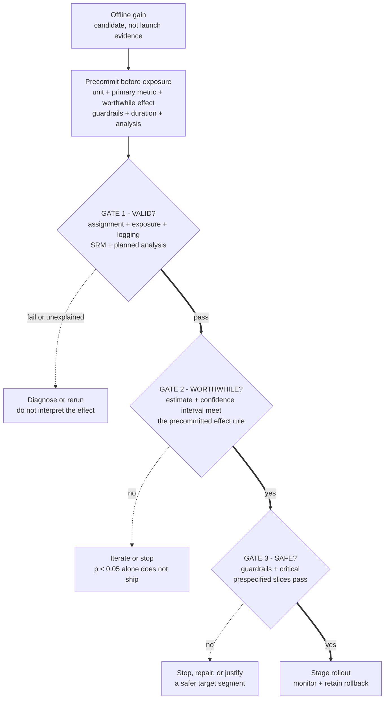

> A new ranking model improves offline NDCG by 6%. Design the online experiment and decide what result would justify launch.

Turn the offline gain into a launch decision: choose a randomization unit, one primary metric with guardrails, a minimum worthwhile effect fixed in advance, and a rule for what result ships. A p-value is not a decision, and a test that harms users to chase significance is a failed design.

**Learning objective:** Apply validity, practical-effect, and guardrail gates in order so a statistically significant result is not mistaken for a ship decision.

<!-- visual:ml-ab-test-launch-gates -->

<strong>Read it this way:</strong> follow the three numbered gates in order. Invalid assignment or telemetry blocks effect interpretation. Valid evidence must then clear the worthwhile-effect rule, not merely exclude zero, and any guardrail regression can still veto launch. Only the all-pass path reaches a monitored, reversible rollout.

## Start with the decision

Clarify before choosing metrics:

- What product behavior should improve, and through what mechanism?
- What is the minimum effect worth the engineering and serving cost?
- What user harms must not regress?
- Is launch reversible, staged, or permanent?
- Does the model change latency, content supply, or downstream systems?

## A test design that survives review

1. **Hypothesis:** what mechanism connects the model change to user value?
2. **Unit:** user, account, device, query, session, or geographic cluster?
3. **Assignment vs exposure:** when is treatment assigned, and when is the model actually seen?
4. **Metrics:** one primary outcome, a small set of guardrails, and diagnostic slices.
5. **Power and duration:** minimum detectable effect, variance, traffic, seasonality, and novelty.
6. **Validity threats:** interference, carryover, sample-ratio mismatch, instrumentation, peeking, and multiple comparisons.
7. **Decision rule:** ship, iterate, stop, or expand only to a safer segment.

## What an L4 answer sounds like

> "Randomly split traffic 50/50, compare click-through rate, and launch if the result is statistically significant."

It knows the shape of an experiment but leaves the decision, guardrails, exposure, and validity threats unspecified.

## What an L5 answer adds

An L5 answer defines the randomization unit and ties the primary metric to the product objective. It adds guardrails for latency, complaints, retention, diversity, safety, and cost. Power uses a minimum worthwhile effect. Exposure analysis catches assignment dilution, and the launch rule weighs practical significance against uncertainty.

## What an L6 answer adds

An L6 answer asks whether a user-level A/B test identifies the right effect. Marketplace or social interference may require cluster randomization. Ranking changes can alter future training data, novelty can fade, and heavy users can dominate aggregates. A positive engagement result may still harm ecosystem health.

## Tells that get you a strong-hire vote

- You distinguish assignment from exposure.
- You name the randomization unit and defend it.
- You fix a minimum worthwhile effect before seeing results.
- You include sample-ratio checks and instrumentation validation.
- You discuss heterogeneous effects and guardrails without fishing across dozens of slices.
- You state an operational rollout and rollback plan.

## Tells that get you down-leveled

- "Statistically significant means ship."
- CTR chosen because it is easy to move, not because it represents value.
- No treatment of latency or serving cost.
- No interference or carryover discussion.
- Peeking repeatedly and stopping when $p < 0.05$.
- Inventing new metrics after seeing the data.

## Common follow-ups

- What if assignment is user-level but users switch devices?
- What if only 30% of assigned users see the new model?
- What if CTR rises but seven-day retention falls?
- How would you test a model where users affect one another?
- What if the treatment changes the data used to retrain next month's model?

*Related: [A/B testing for ML](/concepts/ab-testing-for-ml/), [How would you A/B test a chatbot?](/questions/ab-test-chatbot/), and [precision, recall, and F1](/concepts/precision-recall-f1/).*
