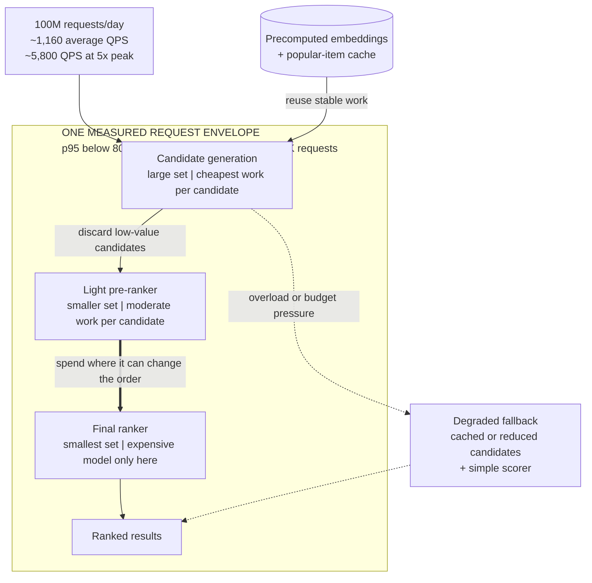

> Design a personalized ranking system for 20 million daily users. The serving budget is $3 million per year and p95 latency must stay below 80 ms. What do you ship?

The constraint is the question. A candidate who names the best model without estimating its cost has not designed the requested system, so do the arithmetic before picking hardware.

**Learning objective:** Trace how a narrowing ranking funnel reserves expensive scoring for fewer candidates while every request remains inside one end-to-end latency ceiling and one unit-cost ceiling.

## Clarify before calculating

- Requests per user per day, and peak-to-average traffic
- Candidate-set size and how many ranking stages
- Existing infrastructure and current hardware prices
- Quality target and the minimum gain worth shipping
- Batchability, cacheability, and freshness requirements
- Availability target and fallback behavior
- Whether the budget includes feature storage, logging, retraining, and on-call

## Build an order-of-magnitude model

Suppose 100 million ranking requests per day:

- Average QPS: roughly 1,160
- At a 5× peak factor: roughly 5,800 peak QPS
- Annual serving budget: about $8,200 per day
- Cost ceiling: roughly $0.08 per thousand requests before non-serving costs

The exact numbers will move. Writing them down is what stops you from proposing an architecture whose cost is off by an order of magnitude.

<!-- visual:fixed-budget-ranking-funnel -->

<strong>Read it this way:</strong> start with the request arithmetic, then follow the candidate set as it shrinks. Later stages may spend more per candidate only because earlier stages invoke them on fewer candidates; the complete path still has to clear the same measured latency and unit-cost ceilings. The dashed branch is the cheaper degraded path when normal ranking would exceed capacity.

## A defensible architecture progression

1. Start from a cheap heuristic or linear/tree baseline.
2. Go multi-stage: retrieval, a light pre-ranker, then the expensive ranker on a small set.
3. Precompute stable embeddings and cache popular candidates.
4. Batch where latency allows; quantize only after measuring the bottleneck.
5. Distill or simplify the expensive model if quality per dollar is poor.
6. Add graceful fallback and per-stage cost/latency monitoring.
7. Run an experiment that reports incremental value and incremental cost together.

## What an L4 answer sounds like

> "Use a two-tower model and autoscale GPUs."

Plausible technology, but nothing here proves the design fits the traffic, latency, or budget.

## What an L5 answer adds

An L5 answer estimates traffic and unit economics, proposes a baseline, allocates latency and cost across stages, and defines a quality-versus-cost experiment. It knows which numbers must be measured before committing.

## What an L6 answer adds

An L6 answer treats cost as a portfolio decision. It identifies segments that justify expensive ranking and varies spend by request value or uncertainty. It compares candidate generation with a larger ranker, controls cost drift, locates the flat part of the value curve, and weighs building infrastructure against buying capacity.

## Tells that get you a strong-hire vote

- Order-of-magnitude math before naming hardware.
- Cost per successful outcome, not cost per request alone.
- A quality/cost/latency frontier rather than one "best" model.
- Explicit fallback and overload behavior.
- Monitoring that attributes spend to stage, model, and traffic segment.

## Tells that get you down-leveled

- Ignoring peak traffic.
- Assuming quantization always improves latency.
- Spending the whole budget on model inference while omitting features and logging.
- No baseline and no staged rollout.
- Treating the annual budget as someone else's problem.

## Common follow-ups

- Traffic doubles with no budget increase. What changes first?
- The largest model adds 1% conversion but triples cost. Do you ship it?
- How do prefill and decode change the cost model for an LLM ranker?
- What if only 5% of requests need personalization?
- How do you detect that caching is silently harming freshness?

*Related: [reduce LLM inference cost 10×](/questions/reduce-llm-inference-cost-10x/), [GPU memory hierarchy](/concepts/gpu-memory-hierarchy/), and [quantization](/concepts/quantization/).*
