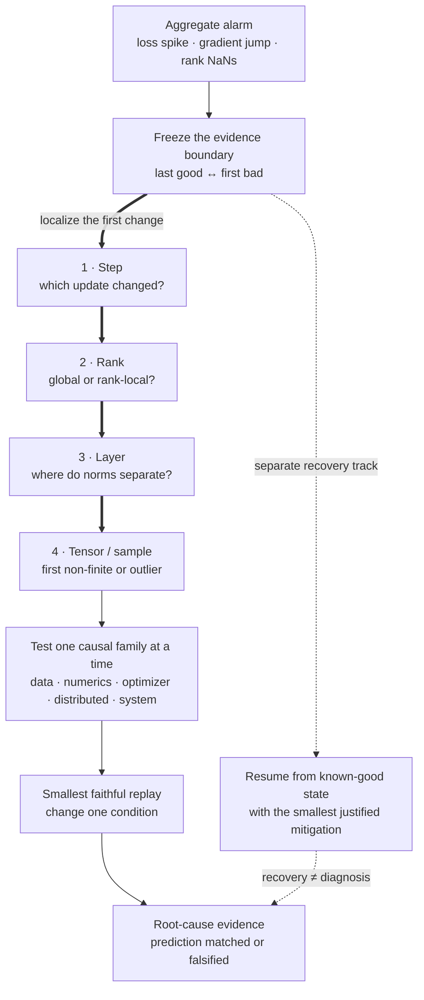

> A large language-model run is stable for 18,000 steps, then loss spikes, gradient norms jump, and two ranks report NaNs. What do you do in the first hour?

Freeze the evidence before restarting. A fast rollback that destroys the first bad batch, rank logs, optimizer state, and environment diff can turn a recoverable incident into an expensive mystery.

## The first-hour sequence

1. **Stop or quarantine the run.** Prevent more bad checkpoints and wasted compute.
2. **Preserve evidence.** Save the last good and first bad checkpoints, batch identifiers, rank-local logs, gradient norms, scaler state, learning rate, data shard, code revision, topology, and hardware events.
3. **Classify the symptom.** Did loss jump globally, on one rank, in one tensor, after a restart, or only in evaluation?
4. **Find the first divergence.** Compare the last good step and first bad step, then narrow by rank, layer, tensor, and sample.
5. **Reproduce cheaply.** Replay the offending batch and checkpoint on fewer devices where possible.
6. **Test one causal family at a time.** Data, numerics, optimizer state, distributed state, hardware, or code/config drift.
7. **Recover from a known-good state.** Apply the smallest justified mitigation and retain the original failure for root-cause work.

<!-- visual:frontier-training-divergence-zoom -->

<strong>Read it this way:</strong> start at the aggregate alarm, then follow the thick diagnostic spine to move backward from effect to the first bad transition: step, rank, layer, then tensor or sample. Only after localization should you replay one causal family. The dashed recovery path can restore progress, but its rejoining arrow explicitly does not count as proof of root cause.

## The failure families

### Data

Corrupt tokens, extreme sequence lengths, changed packing, bad loss masks, malformed labels, duplicated batches, or a sudden mixture shift can create a real gradient outlier. Check token counts, per-domain loss, sequence-length distribution, invalid IDs, mask density, and sample fingerprints.

### Numerical behavior

FP16 overflow, an incorrect loss scale, unstable normalization, softmax or log operations outside FP32, exploding activation norms, or a kernel regression can create Inf or NaN values. Find the first non-finite tensor. "NaNs in the loss" is the end of the chain, not the diagnosis.

### Optimizer and schedule

A bad resume can restore weights but not optimizer moments, scheduler step, gradient scaler, or RNG state. A learning-rate discontinuity, missing clipping, changed accumulation factor, or corrupted moment tensor can destabilize an otherwise valid batch.

### Distributed state

Rank desynchronization, a skipped collective, inconsistent data, stale parameters, partial checkpoint restore, or silent communication corruption can make one rank diverge before the aggregate exposes it. Compare checksums and key tensor statistics across ranks.

### Hardware and software

ECC events, a failing device, network errors, driver or compiler changes, and a new fused kernel belong in the incident timeline. Correlation is not proof, but a failure starting immediately after a topology or binary change deserves isolation.

## What an L4 answer sounds like

> "I would lower the learning rate, enable gradient clipping, and restart from the last checkpoint."

Those mitigations may resume training, but they can also hide corrupt data, a bad restore, or a rank-local failure. The candidate is treating a symptom as an optimization setting.

## What an L5 answer adds

An L5 candidate preserves evidence, identifies the first bad step, compares rank-local metrics, replays the batch, and checks data, numerics, optimizer state, and recent changes in a disciplined order. They distinguish recovery from root cause and validate the repaired run against the pre-incident trajectory.

They propose concrete probes:

- activation and gradient norm by layer;
- first non-finite tensor hooks;
- batch hash and sequence-length summary;
- optimizer moment checksums;
- cross-rank parameter checksums;
- replay with fused kernels disabled;
- replay in FP32 on a reduced model or batch.

## What an L6 answer adds

An L6 candidate runs the incident as a system problem. They assign an evidence-preservation owner, define a safe recovery path, estimate the cost of waiting versus resuming, and prevent the fix from contaminating scientific comparability.

They ask whether the run can continue without invalidating downstream conclusions. A changed data filter, clipping threshold, kernel, or schedule creates a new training regime. The checkpoint lineage and experiment record must say so.

They also turn recurrence into infrastructure:

- automatic finite checks at high-value tensor boundaries;
- rank-local anomaly capture before collective reduction;
- batch lineage sufficient to replay one step;
- checkpoint completeness validation;
- canary jobs for compiler or kernel changes;
- alerts on layerwise norm distributions, not only scalar loss;
- a recovery playbook with an explicit evidence-retention gate.

## Tells that get you a strong-hire vote

- You preserve the first bad transition before restarting.
- You distinguish global from rank-local divergence.
- You identify the first non-finite tensor rather than staring at final loss.
- Data, optimizer, distributed state, and software changes all enter the timeline.
- You reproduce on the smallest faithful setup.
- Recovery and root cause are separate decisions.
- You state whether the mitigation changes experimental validity.

## Tells that get you down-leveled

- "Lower the learning rate" as the opening move.
- Restarting before saving the offending batch and state.
- Looking only at aggregate metrics after reduction.
- Assuming every spike is a bad sample.
- Changing five stabilizers at once.
- Declaring success when the run no longer crashes.

## Common follow-up

"The offending batch trains cleanly when replayed on one GPU. What next?"

That result lowers the probability of a deterministic data or model bug and raises distributed, precision, topology, and timing hypotheses. Reproduce with the original world size, compare rank inputs and RNG, disable overlapping or fused paths, and bisect topology or software changes. Do not conclude that the batch was innocent merely because the reduced setup changed the failure conditions.

Try the [broken training lab](/prep/labs/broken-training/) before using this page as a checklist.

*Related: [train a 100B parameter model](/questions/train-100b-model/), [debug a model that is not learning](/questions/debug-model-not-learning/), and [loss spikes at scale](/concepts/loss-spikes-at-scale/).*
