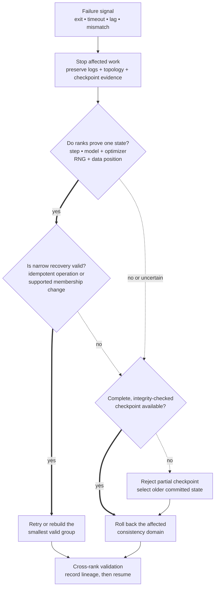

> A 2,048-GPU training job loses workers, stalls on collectives, and occasionally produces rank-local checksum mismatches. Design detection, recovery, and evidence preservation without corrupting the experiment.

Start with failure semantics. "Add retries" is unsafe until you know whether the failed operation is idempotent, whether ranks still agree on step and parameters, and whether a retry can duplicate or omit an update.

**Learning objective:** Choose the narrowest safe recovery scope by testing whether ranks share one proven training state before retrying, rebuilding a group, or rolling back.

<!-- visual:distributed-recovery-consistency-gate -->

<strong>Read it this way:</strong> move downward from the symptom, but do not choose a remedy until the consistency gate. Proven aligned state permits only an explicitly safe narrow action. Any disagreement or uncertainty sends the affected consistency domain back to a complete checkpoint; a half-written candidate is evidence to reject, not a recovery point.

## Four failure classes

### Fail-stop

A worker, process, node, or link fails visibly. Synchronous collectives generally require every rank in the group; one missing participant causes timeout or abort. Recovery usually restarts a consistent group from a complete checkpoint, unless the algorithm and runtime support elastic membership.

### Straggler

A rank remains alive but arrives late because of hardware degradation, data skew, checkpoint I/O, network contention, or thermal throttling. The slowest rank sets step time. Restarting the whole job may hide the symptom without identifying the bad component.

### State divergence

Ranks disagree on step, RNG, data position, optimizer state, or parameters. A skipped collective or partial restore can hang immediately or silently change training. Checkpoint completeness and cross-rank state validation matter more than process liveness.

### Silent corruption

A transfer or computation produces wrong values without an immediate error. Checksums, finite checks, range checks, redundant critical calculations, and anomaly detection provide evidence. Replication helps only when failures are sufficiently independent and the comparison itself is trustworthy.

## The recovery contract

A checkpoint is recoverable only if it defines:

- model, optimizer, scheduler, scaler, and RNG state;
- global step and consumed data position;
- sharding and parallel-group metadata;
- code, configuration, data, and environment versions;
- completeness and integrity checks;
- a commit protocol that cannot expose a half-written checkpoint as valid.

For large sharded checkpoints, each shard can write to a temporary location, report integrity metadata, then publish one manifest only after every required shard succeeds.

## What an L4 answer sounds like

> "Checkpoint every few minutes, detect failed GPUs, replace them, and restart. Use retries for network errors."

The answer treats all failures as visible and independent. It does not define consistent state, collective semantics, data replay, or corruption detection.

## What an L5 answer adds

An L5 candidate separates failure classes, defines timeouts and health signals, uses atomic checkpoint manifests, and restarts from a known-consistent state. They explain the cost trade-off for checkpoint interval:

- frequent checkpoints reduce lost compute but consume bandwidth and storage;
- infrequent checkpoints improve throughput but increase expected rollback;
- asynchronous checkpointing reduces pause time but adds memory pressure and consistency complexity.

They also instrument collective duration by rank and topology, checkpoint phases, data-loader position, hardware errors, and cross-rank checksums.

## What an L6 answer adds

An L6 candidate protects scientific validity. Replaying data, changing world size, replacing hardware, or switching kernels can change ordering and numerical behavior. The system records lineage and determines which changes preserve comparability.

They choose recovery scope from failure scope:

- retry a read only if the operation is idempotent and state remains aligned;
- rebuild a communication group after a fail-stop only if membership change is supported by the training decomposition;
- restart the affected parallel replica when state boundaries permit;
- restart the full job when optimizer or model consistency is uncertain;
- quarantine a device or link when recurrence follows topology.

They also design drills. A failure system trusted only after real incidents is untested infrastructure. Inject worker exits, delayed ranks, corrupt manifests, full storage, and network partitions in small canary jobs.

## Tells that get you a strong-hire vote

- You classify fail-stop, straggler, divergence, and corruption separately.
- Collective participation and timeout semantics are explicit.
- A checkpoint includes optimizer, RNG, data position, and sharding metadata.
- Half-written checkpoints cannot appear valid.
- Recovery scope follows state-consistency evidence.
- Data replay and world-size changes enter experiment lineage.
- Fault injection validates the design before a frontier run.

## Tells that get you down-leveled

- "Retry three times" without idempotency or state alignment.
- Checkpointing only model weights.
- Treating a slow rank as a failed rank.
- Assuming elastic membership preserves algorithm behavior automatically.
- No silent-corruption detection.
- Declaring recovery when the job resumes but the trajectory changed invisibly.

## Common follow-up

"Can we continue with 2,047 GPUs after one worker fails?"

Only if the parallel decomposition, optimizer semantics, batch construction, communication groups, and checkpoint state support a membership change. Tensor and pipeline partitions often require fixed group shapes. Even pure data parallelism changes global batch or per-rank work unless reconfigured. The right answer is conditional, not automatically elastic.

*Related: [fault-tolerant collectives](/concepts/fault-tolerant-collectives/), [all-reduce and collectives](/concepts/all-reduce-and-collectives/), and [train a 100B parameter model](/questions/train-100b-model/).*
