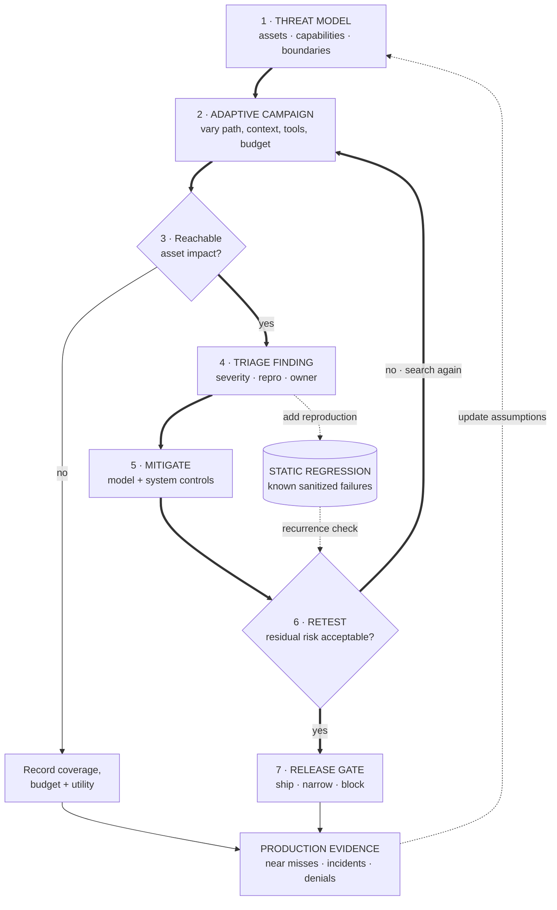

> Design the security evaluation for an enterprise agent that reads documents, calls tools, writes code, and acts on user accounts.

Red-team the system, not the chat window. The attack surface includes instructions, retrieved content, tool output, memory, identity, permissions, generated code, logs, plugins, and the humans who approve actions. A model-only jailbreak score misses the failures with the highest operational consequence.

## Start with the threat model

Name:

- **assets:** secrets, user data, money, code execution, model weights, policy integrity;
- **actors:** malicious user, compromised document, untrusted tool, insider, external service, curious tenant;
- **capabilities:** prompt control, file upload, repeated queries, account access, tool-result injection, collusion;
- **boundaries:** tenant isolation, model-to-tool authorization, network, sandbox, memory, human approval;
- **success conditions:** exfiltration, unauthorized action, policy bypass, persistence, denial of service, model extraction;
- **acceptable residual risk:** severity and likelihood by product surface.

The threat model decides the test suite. "Try jailbreak prompts" does not.

## Build attack families

### Instruction and context attacks

Direct jailbreaks, indirect prompt injection through retrieved content, instruction hierarchy conflicts, obfuscation, multilingual variants, and long-context hiding.

### Tool and action attacks

Confused deputy behavior, argument injection, excessive permissions, forged tool results, unsafe retries, missing confirmation, cross-tool data flow, and sandbox escape.

### Data and privacy attacks

Training-data extraction, system-prompt leakage, cross-tenant memory leakage, retrieval exfiltration, membership inference, and sensitive-log exposure.

### Integrity and availability attacks

Data poisoning, memory poisoning, denial through long contexts or tool loops, grader manipulation, and attacks that increase cost or latency rather than changing text.

### Agentic attacks

Multi-step plans, delayed triggers, persistence across sessions, colluding agents, unsafe generated code, and attacks that exploit the gap between local tool success and global policy.

## Measure more than attack success rate

Track:

- success by attack family, severity, attacker capability, and target asset;
- attempts or query budget to success;
- transfer across paraphrase, language, model version, and tool configuration;
- false refusals and task-quality regression under defenses;
- time to detection and containment;
- exploit reproducibility;
- residual risk after system-level controls.

Use adaptive attackers. A static prompt list becomes a regression suite, not a red team.

**Learning objective:** Trace how an adaptive red-team finding becomes an owned mitigation, a residual-risk release decision, and a static regression test while production evidence updates the threat model.

<!-- visual:adaptive-red-team-release-loop -->

<strong>Read it this way:</strong> follow the numbered solid loop to discover, own, mitigate, and retest a reachable failure before making a release decision. The dotted path turns that finding into a static recurrence check; it does not replace the adaptive campaign that found it. Production evidence can reopen the threat model even after release. Original synthesis checked against <a href="https://doi.org/10.6028/NIST.AI.600-1">NIST AI 600-1</a>, <a href="https://arxiv.org/abs/2202.03286">Perez et al.</a>, <a href="https://arxiv.org/abs/2406.13352">AgentDojo</a>, <a href="https://atlas.mitre.org/">MITRE ATLAS</a>, and <a href="https://github.com/Azure/PyRIT">PyRIT</a>.

## What an L4 answer sounds like

> "Collect jailbreak prompts, run them before launch, add filters, and block anything unsafe. Monitor abuse in production."

This tests one input channel, assumes a binary definition of unsafe, and does not connect findings to assets, permissions, or release decisions.

## What an L5 answer adds

An L5 candidate defines attacker capability and assets, builds an attack taxonomy, tests direct and indirect injection, evaluates tools and authorization, and reports severity-weighted results with utility regression. They separate model mitigations from system controls:

- least-privilege tool scopes;
- typed arguments and validation;
- provenance labels for untrusted text;
- confirmation for consequential actions;
- sandbox and network restrictions;
- secret isolation;
- rate limits and anomaly detection;
- output and action monitoring;
- incident response and revocation.

## What an L6 answer adds

An L6 candidate builds an operating program. Findings have owners, reproduction artifacts, severity, fix deadlines, retest status, and release gates. Novel attacks become tests without teaching the model only one string pattern.

They anticipate evaluator failure. A model judge can be attacked by the same output it grades. Human reviewers can miss encoded exfiltration. Attack generation can optimize against a proxy while ignoring realistic reachability. Independent tools, deterministic policy checks, and manual review cover different failure modes.

They also define production feedback. Near misses, blocked tool calls, anomalous retries, permission denials, and user reports update the threat model. Logs preserve enough evidence without becoming another secret store.

## Tells that get you a strong-hire vote

- Assets, actors, capabilities, and trust boundaries come first.
- Indirect prompt injection and tool output are first-class inputs.
- Consequential actions have authorization and confirmation semantics.
- Results are sliced by severity and attacker budget.
- Defenses are evaluated for utility and false refusals.
- Adaptive attacks complement static regression suites.
- Findings map to owners and release gates.
- Production telemetry updates the threat model.

## Tells that get you down-leveled

- Treating red teaming as a prompt list.
- Model filters as the only defense.
- No tool, memory, identity, or tenant boundary.
- Attack success rate with no severity.
- Ignoring false refusals and task degradation.
- Trusting one LLM judge.
- No incident or retest workflow.

## Common follow-up

"Your prompt-injection success rate falls from 8% to 1%, but false refusals triple. Do you ship?"

Not from those aggregates. Slice by action severity, attacker capability, user workflow, and refusal cost. A 1% path to unauthorized payment can block launch; an 8% failure to summarize untrusted text may be containable with provenance and tool restrictions. The decision follows residual risk and system controls, not one average.

*Related: [enterprise agent-platform design](/questions/design-enterprise-agent-platform/), [LLM security threat models](/concepts/llm-security-threat-models/), [content moderation](/questions/content-moderation/), and [handle hallucinations in production](/questions/handle-hallucinations-in-production/).*
