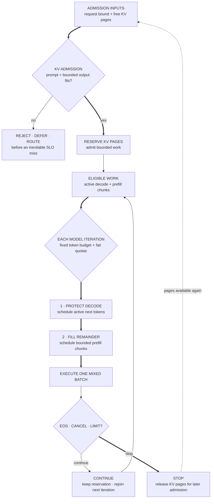

> Design a multi-tenant service for a 70B model. Traffic mixes 200-token chat prompts with 32K document prompts. Define the SLOs, capacity model, scheduler, overload behavior, and evaluation plan.

Start with the workload. "Use vLLM" is an implementation choice, not a design. The core decision is how the service allocates model compute and KV-cache memory while protecting time to first token, inter-token latency, throughput, fairness, and cost.

## Split the two phases

**Prefill** processes prompt tokens in parallel. Large prefills with efficient matrix shapes are often compute-bound and drive time to first token. Short prompts or small batches can be limited by memory traffic or launch overhead.

**Decode** produces one token per active sequence per iteration. Small decode batches are usually memory-bandwidth-bound because every step reads model weights and KV state for little new arithmetic. Large batches can reach a compute limit. Decode drives inter-token latency.

A scheduler that treats both as interchangeable work will let long prefills stall decode or will starve new prompts to protect active streams.

## Decide whether to separate prefill and decode

A shared worker pool is the simpler starting point. Chunked prefill lets one scheduler mix prompt work with active decode.

At larger scale, **disaggregated serving** places prefill and decode on separate worker pools. Prefill workers produce KV state and transfer it to decode workers. This can:

- isolate long-prompt work from inter-token latency;
- scale the two hardware pools independently;
- use different parallel layouts or accelerator types for each phase;
- keep decode batches full.

It also adds a queue boundary, KV transfer, failure states, and network load. Approximate transfer time as:

$$
T_{\text{transfer}} \approx \frac{\text{KV bytes for the prompt}}{\text{effective network bandwidth}}.
$$

Do not disaggregate when that transfer and queueing cost is larger than the scheduling interference it removes.

Measure accelerator-seconds of prefill and decode work on the real request distribution. At the same target utilization, the ratio of prefill workers to decode workers should start near the ratio of those two offered workloads. Then load-test tail latency and rebalance.

## Quantify before drawing

For a 70B model, start with:

- weight memory by precision;
- KV bytes per token;
- prompt and generation distributions, not only averages;
- arrival rate and burst factor;
- target time to first token and inter-token latency by traffic class;
- GPU topology and effective memory bandwidth;
- tokens per second by prefill and decode regime.

KV memory per request is approximately:

$$
2 \times L \times H_{kv} \times d_h \times T \times b,
$$

where $L$ is layer count, $H_{kv}$ is the number of KV heads, $d_h$ is head dimension, $T$ is cached tokens, and $b$ is bytes per element. This value, not free GPU percentage, should drive admission.

## The serving path

1. **Gateway:** authentication, quotas, model and latency class, request validation.
2. **Router:** choose replica or parallel group using queue state, KV capacity, prefix locality, and health.
3. **Admission controller:** reserve worst-case or policy-bounded KV blocks and reject, queue, or degrade before overload becomes universal timeout.
4. **Scheduler:** continuous batching with chunked prefill, decode priority, and fairness across tenants or classes.
5. **Model executor:** paged KV cache, fused kernels, tensor or pipeline parallelism as required.
6. **Streaming response:** backpressure, cancellation, usage accounting, and partial-failure semantics.
7. **Telemetry:** per-request phase timing, queue age, batch composition, KV occupancy, token throughput, requests or tokens that meet their SLO, errors, and quality version.

## Scheduling policy

A defensible baseline is:

- reserve KV capacity at admission using prompt plus bounded output length;
- split long prefills into chunks;
- serve active decode each iteration to protect inter-token latency;
- fill remaining token budget with prefill chunks;
- rotate across tenants within a class;
- cap per-tenant active sequences and reserved KV;
- release pages immediately on EOS, cancellation, or limit;
- reject or route elsewhere before queue age guarantees an SLO miss.

Priority without quotas becomes starvation. Fairness without class-aware SLOs can make interactive traffic wait behind batch jobs. State the policy and the sacrifice.

Learning objective

Trace how KV admission and the per-iteration token budget protect memory capacity and decode latency at the same time.

<!-- visual:llm-inference-two-budget-scheduler -->

<strong>Read it this way:</strong> read the two gates in order. First, reserve KV pages before work enters the scheduler. Then, in every iteration, give active sequences their latency-sensitive decode step before filling the remaining token budget with bounded prefill chunks. Continuing work keeps its reservation; only stopped work releases pages for later admission.

Original synthesis informed by the <a href="https://www.usenix.org/conference/osdi24/presentation/agrawal">Sarathi-Serve scheduler</a>, the <a href="https://arxiv.org/abs/2309.06180">PagedAttention paper</a>, and <a href="https://www.usenix.org/conference/osdi24/presentation/zhong-yinmin">DistServe</a>. No source figure or layout is reproduced.

## What an L4 answer sounds like

> "Put the model behind an API, add a queue, batch requests, cache prompts, autoscale GPUs, and monitor latency."

The components are plausible but disconnected. There is no phase model, memory budget, admission rule, or overload decision. Autoscaling cannot rescue a request already trapped behind a 32K-token prefill.

## What an L5 answer adds

An L5 candidate separates prefill and decode, computes KV pressure, uses paged caching and continuous batching, chunks long prefills, and defines time to first token and inter-token latency separately. They describe cancellation, quotas, health checks, and load shedding.

They connect metrics to diagnoses:

| Symptom | Likely evidence |
| --- | --- |
| High time to first token, healthy decode | Prefill queue age, prompt-token backlog, prefill utilization |
| Slow inter-token latency | Decode batch size, memory bandwidth, KV read volume |
| Low utilization with long queues | Scheduler gaps, synchronization, small batches, routing imbalance |
| Admission failures | KV blocks reserved, context distribution, fragmentation |
| One tenant degrades others | Active sequence share, reserved KV share, queue age by tenant |

## What an L6 answer adds

An L6 candidate designs the control plane around uncertainty. Output length is not known at admission, model versions have different KV footprints, prefix caching changes routing value, and speculative decoding changes the relationship between compute and delivered tokens.

They treat co-located versus disaggregated serving as a measured choice. Separate pools help only when phase isolation and independent scaling repay KV-transfer and queueing costs.

They define explicit overload stages:

1. stop admitting low-priority batch traffic;
2. cap output tokens or long contexts for degradable classes;
3. route to a smaller or quantized model when product policy permits;
4. reject early with a retry signal;
5. preserve capacity for health probes and critical tenants.

They also separate product quality from serving health. Quantization, speculative decoding, or a fallback model may change output distribution. A latency win is not free if task success or safety regresses on the traffic slices that trigger degradation.

## Tells that get you a strong-hire vote

- You model prefill and decode separately.
- Admission follows KV capacity and output policy.
- Long prefills are chunked so decode remains responsive.
- Co-located and disaggregated serving are compared with KV-transfer cost included.
- Time to first token and inter-token latency have separate SLOs.
- Tenant fairness and priority are explicit, not implied.
- Overload behavior starts before universal timeout.
- Cancellation releases compute and KV state.
- Performance changes have a quality evaluation path.

## Tells that get you down-leveled

- Starting with a serving framework name.
- One latency percentile for the entire request.
- Batching with no scheduler policy.
- Autoscaling as the answer to every burst.
- No KV-cache calculation.
- Letting the queue absorb overload indefinitely.
- Ignoring cancellation, multi-tenancy, or fallback quality.

## Common follow-up

"A 128K prompt arrives while hundreds of chat requests are decoding. What happens?"

Do not admit it merely because one replica has enough total memory. Route it to a long-context class or queue, reserve its KV budget, chunk prefill, and cap how much prefill work enters each iteration. If its predicted start time already violates the class SLO, reject or offer asynchronous processing. Protect active decode and disclose the product trade-off.

Try the [inference scheduler lab](/prep/labs/inference-scheduler/) before reading implementation details again.

*Related: [Transformer compute and memory accounting](/concepts/transformer-compute-memory-accounting/), [KV cache](/concepts/kv-cache/), and [continuous batching](/concepts/continuous-batching/).*
