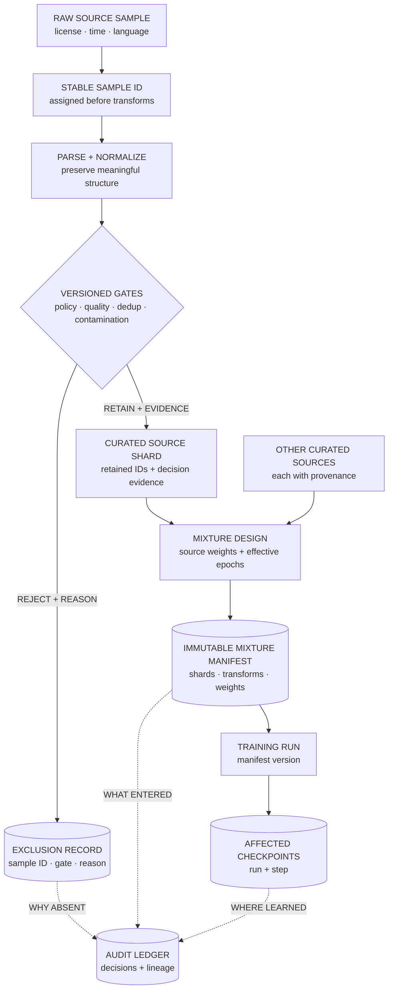

## Summary

Foundation-model data curation turns raw corpora into a versioned training distribution through provenance, policy, parsing, quality filtering, deduplication, contamination control, mixture design, and audit.

At large scale, data determines capability, memorization, bias, legal exposure, evaluation validity, and training stability. "More tokens" is not a neutral scaling variable. The source and repeated structure of those tokens change what the model learns.

A good pipeline can answer which source produced a sample, which transformations touched it, why it passed, which mixture version used it, and which trained checkpoints may contain it.

<!-- visual:foundation-data-curation-lineage -->

<strong>Read it this way:</strong> follow one sample downward. A gate never merely “drops” it: rejection produces a reasoned exclusion record, while retention carries evidence into a weighted, versioned mixture. The mixture manifest then links that sample to runs and checkpoints, so later audits can answer both why data was absent and where retained data was used. Original synthesis informed by <a href="https://arxiv.org/abs/2406.11794">DataComp-LM</a>, <a href="https://aclanthology.org/2022.acl-long.577/">Lee et al. on deduplication</a>, <a href="https://arxiv.org/abs/2303.03915">the ROOTS corpus</a>, and <a href="https://arxiv.org/abs/2203.15556">Hoffmann et al. on compute-optimal training</a>.

## Pipeline stages

### Acquisition and provenance

Record source, license or usage basis, collection time, language, content type, and access constraints. Preserve stable sample identifiers before transformations so removal and lineage remain possible.

### Parsing and normalization

Extract usable content, preserve meaningful structure, normalize encoding, identify language, and remove boilerplate. Aggressive cleaning can erase code formatting, tables, mathematical notation, or dialects that matter.

### Policy and privacy filtering

Detect secrets, personal information, disallowed content, malware, and source-specific restrictions. Classifiers need calibrated thresholds, human audit, and slice analysis because false positives reshape the data distribution.

### Quality filtering

Use heuristics and learned filters for duplication, incoherence, spam, low information, or domain quality. A model-based quality score can prefer prose that resembles its own training distribution and remove valuable unusual text.

### Deduplication

- **Exact:** hashes remove identical documents or spans.
- **Near duplicate:** MinHash, locality-sensitive hashing, suffix methods, or n-gram similarity remove templated variants.
- **Semantic:** embeddings can find paraphrases but risk collapsing distinct examples with similar meaning.

Deduplication unit matters. Document-level removal can discard one useful section because another section repeats.

### Decontamination

Search training data for benchmark prompts, answers, generated variants, and source overlap. Exact matching is insufficient when formatting or paraphrase changes. Decontamination reduces known leakage; it cannot prove a model has no related knowledge.

### Mixture design

Assign source weights by quality, capability value, diversity, and risk. Raw corpus size should not automatically determine training share. Track effective epochs so small high-weight sources do not repeat until memorized.

### Versioning and audit

Version raw snapshots, transformation code, filter models, thresholds, dedup indexes, mixture weights, tokenizer, and removal lists. Store aggregate and sampled audits by source and slice.

## Synthetic data

Synthetic data can target rare skills, create verifiable tasks, or distill a stronger model. It can also amplify generator errors, narrow diversity, leak benchmark style, and teach reward-model preferences rather than the target capability.

Use generation provenance, independent filters, verifier evidence, diversity controls, and held-out evaluation. The generator, filter, and student should not all share the same unchecked failure.

## Measuring curation

Track more than retained token count:

- source and language distribution;
- exact and near-duplicate rates;
- privacy and policy audit precision or recall;
- benchmark-overlap findings;
- perplexity or quality-filter distribution;
- effective repetitions by source;
- downstream capability and safety deltas;
- memorization probes;
- removal and lineage success.

A filter that improves average benchmark score while deleting low-resource languages may be a bad curation system.

## Common confusions

- **"Quality is one score."** Quality depends on target capabilities, users, and risk.
- **"Deduplication only saves compute."** It also changes memorization and source weighting.
- **"Decontaminated means fair evaluation."** Unknown overlap and related training examples remain.
- **"Synthetic data is free labels."** Generation, verification, diversity, and bias control carry real cost.
- **"Data mixture is a preprocessing detail."** It is a model-design decision.
- **"Deleting a raw file removes it from models."** Lineage must identify derived samples and affected checkpoints.

## In an interview

Start with target capabilities and constraints, then source, provenance, filtering, deduplication, contamination, mixture, synthetic data, versioning, and the downstream evidence that determines whether curation helped.

*Related: [design a foundation-model data platform](/questions/design-foundation-model-data-platform/), [ML data lineage and versioning](/concepts/ml-data-lineage-versioning/), [lessons from Marin 8B](/guides/lessons-from-marin-8b/), and [preference data and reward models](/concepts/preference-data-and-reward-models/).*
