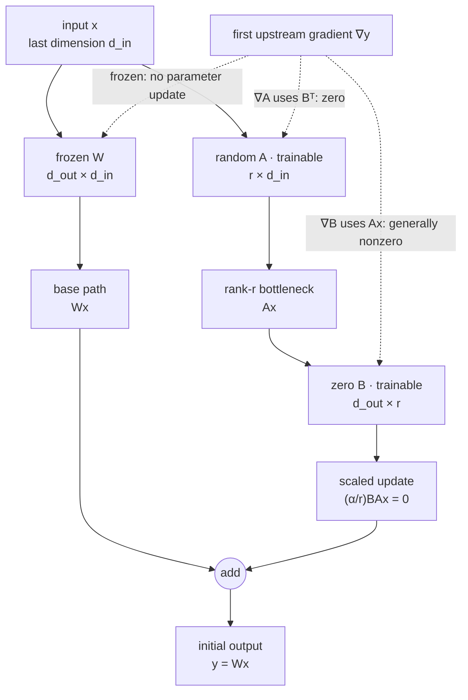

> Wrap a frozen linear layer with a trainable rank-$r$ update. At initialization, output must exactly match the base layer.

For base weight $W \in \mathbb{R}^{d_{out} \times d_{in}}$, LoRA learns:

$$
W' = W + \frac{\alpha}{r} B A,
$$

with $A \in \mathbb{R}^{r \times d_{in}}$ and $B \in \mathbb{R}^{d_{out} \times r}$. The base $W$ remains frozen.

## The implementation contract

1. Reject non-positive rank.
2. Freeze base parameters.
3. Initialize one adapter matrix randomly and the other to zero, so $BA = 0$ initially.
4. Compute the base output plus the scaled low-rank path.
5. Preserve arbitrary leading input dimensions.
6. Ensure gradients reach adapter parameters and not the base.
7. Expose only adapter state when saving an adapter checkpoint.

A direct forward pass is:

```python
base_output = self.base(inputs)
update = (inputs @ self.a.T) @ self.b.T
return base_output + self.scaling * update
```

The order computes the low-rank path without constructing a full $d_{out} \times d_{in}$ update.

## Why initialize one factor to zero

If both factors are random, attaching the adapter changes model behavior before training. If both are zero, both gradients begin at zero because each factor's gradient contains the other factor. Initializing $A$ randomly and $B$ to zero gives exact base behavior while allowing $B$ to receive a gradient on the first step. After $B$ moves, $A$ receives useful gradients.

<p class="visual-kicker">Learning objective</p>
<p class="visual-title">Follow the no-op forward pass and the asymmetric first backward pass</p>

<!-- visual:lora-zero-impact-first-gradient -->


<p class="diagram-caption"><strong>Read it this way:</strong> follow the solid arrows first. The random projection <em>A</em> creates a usable rank-<em>r</em> signal, but zero <em>B</em> blocks it, so the residual update is exactly zero and the output matches the frozen base. Then follow the dashed arrows: <em>B</em>'s gradient can use the nonzero <em>Ax</em>, while <em>A</em>'s gradient contains <em>B</em><sup>T</sup> and is zero on the first step. Once <em>B</em> moves, both adapter factors can learn. Original synthesis based on <a href="https://arxiv.org/abs/2106.09685">Hu et al.'s LoRA formulation</a> and the <a href="https://huggingface.co/docs/peft/main/package_reference/lora">PEFT initialization reference</a>.</p>

## What an L4 answer sounds like

The candidate adds a full trainable matrix, forgets to freeze the base, or initializes both low-rank factors to zero. They know LoRA means "fewer parameters" but cannot derive shapes or explain why the initial output should match.

## What an L5 answer adds

An L5 candidate gets shapes, scaling, initialization, and trainable state correct. They test:

- exact initial equivalence to the base layer;
- only adapter parameters require gradients;
- output shape for batched and sequence inputs;
- rank and alpha behavior;
- adapter save and reload;
- merge equivalence: explicit $W + (\alpha/r)BA$ matches the unmerged path.

They can calculate trainable parameters:

$$
r(d_{in} + d_{out})
$$

instead of $d_{in}d_{out}$ for a full update.

## What an L6 answer adds

An L6 candidate discusses where adapters attach and why. Attention projections, MLP projections, embeddings, and output heads have different leverage. Rank is a capacity choice, not merely a memory knob.

They cover serving choices:

- merge one adapter into weights for simple dedicated serving;
- keep adapters separate for multi-tenant swapping;
- batch requests with different adapters only if the serving stack supports efficient segmented adapter computation;
- version base and adapter together because an adapter is not portable across arbitrary base checkpoints;
- preserve quantization semantics in QLoRA, where base weights are quantized but adapter computation uses a higher-precision path.

They also resist an overclaim: low-rank updates can approximate many useful adaptations, but "intrinsic dimension is low" is not a guarantee that every behavior change fits a tiny rank.

## Tells that get you a strong-hire vote

- Matrix shapes are derived before code.
- Initial output exactly matches the base.
- Base parameters are frozen and absent from adapter-only checkpoints.
- The low-rank path avoids materializing a full update.
- Parameter count and scaling are explicit.
- Merge and unmerged paths are tested for equivalence.
- Base-version and multi-tenant serving constraints are discussed.

## Tells that get you down-leveled

- Training the base accidentally.
- Initializing both factors to zero.
- Applying the update with transposed shapes by trial and error.
- Saving the full model when the contract asks for an adapter.
- Claiming LoRA always matches full fine-tuning.
- Calling QLoRA a low-precision adapter rather than a quantized frozen base plus trainable adapters.

## Common follow-up

"Can you merge LoRA for inference?"

Yes. Compute $W' = W + (\alpha/r)BA$ once and use the ordinary linear layer. That removes adapter-path overhead but loses cheap adapter swapping and can complicate quantized weights. Validate merged output against the unmerged module before deployment.

Use the [LoRA starter](/prep/labs/implementation/) before reading the forward pass again.

*Related: [fine-tuning, the deep version](/questions/fine-tuning-deep/), [SVD and PCA](/concepts/svd-and-pca/), and [RLHF and DPO](/concepts/rlhf-and-dpo/).*
