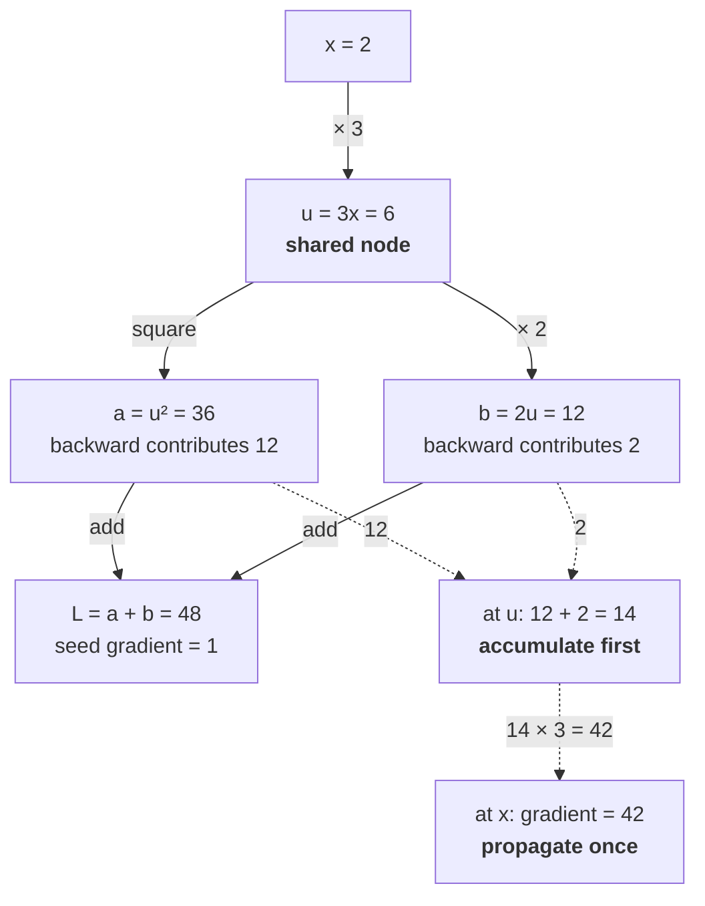

> Implement a scalar `Value` type supporting addition, multiplication, powers, tanh, and `backward()`.

The key is gradient accumulation on a directed acyclic computation graph. Backprop is not recursive symbolic differentiation. Each operation records its parents and a local backward function; one reverse topological pass composes those local derivatives.

## Build graph nodes during the forward pass

For $z = x + y$:

$$
\frac{\partial z}{\partial x} = 1, \qquad \frac{\partial z}{\partial y} = 1.
$$

The local backward function adds the upstream gradient:

```python
out = Value(self.data + other.data, (self, other), "+")

def _backward():
    self.grad += out.grad
    other.grad += out.grad

out._backward = _backward
```

Use `+=`, not assignment. A node can influence the output through multiple paths. For $y = x^2 + 2x$, both paths contribute to $\partial y / \partial x$.

<!-- visual:autograd-shared-node-accumulate-then-propagate -->


<p class="diagram-caption"><strong>Read it this way:</strong> follow the solid arrows forward to see one value, u, feed two branches. Then follow the dashed contributions backward: 12 and 2 must both arrive and add at u before u’s local backward rule runs once. Propagating 12 upstream immediately would produce 36 at x and miss the later branch; reverse topological order waits, then sends (12 + 2) × 3 = 42. Original example checked against the <a href="https://jmlr.org/papers/v18/17-468.html">automatic differentiation survey</a> and <a href="https://docs.pytorch.org/docs/stable/notes/autograd.html">PyTorch autograd mechanics</a>.</p>

For $z = xy$:

```python
self.grad += other.data * out.grad
other.grad += self.data * out.grad
```

The local derivative uses forward values and the upstream gradient.

## Reverse topological order

Before applying local backward functions, topologically order reachable nodes so every child contributes to a node before that node propagates further:

```python
ordered = []
visited = set()

def build(node):
    if node in visited:
        return
    visited.add(node)
    for parent in node._previous:
        build(parent)
    ordered.append(node)

build(self)
self.grad = 1.0
for node in reversed(ordered):
    node._backward()
```

Seeding the final scalar with gradient 1 encodes $dL/dL = 1$.

## What an L4 answer sounds like

The candidate implements operations but calls parent backward functions recursively as soon as each path is encountered. Shared nodes are processed in an unsafe order, gradients are overwritten, or the output is never seeded.

## What an L5 answer adds

An L5 candidate builds the graph in the forward pass, captures local derivatives, accumulates gradients, and executes one reverse topological traversal. They test shared subexpressions, not only chains.

Useful tests:

- $x^2 + 2x$ at a known point;
- a small neuron with tanh;
- one variable used three times;
- finite-difference comparison away from non-smooth points;
- repeated `backward()` semantics, either documented accumulation or explicit zeroing.

They distinguish leaf nodes from intermediate nodes and can explain why reverse mode fits many parameters and one scalar loss.

## What an L6 answer adds

An L6 candidate identifies what the scalar engine omits:

- tensors and broadcasting require reducing gradients over expanded axes;
- in-place mutation can invalidate saved forward values;
- dynamic graphs need lifecycle and memory management;
- custom operations need vector-Jacobian products, not full Jacobians;
- higher-order gradients require the backward computation itself to remain differentiable;
- checkpointing trades saved intermediates for recomputation;
- non-differentiable operations need a defined surrogate, subgradient, or stop-gradient behavior;
- parallel execution needs dependency-aware scheduling and accumulation.

They do not try to implement all of this in the timed baseline. They state the boundary after producing correct code.

## Tells that get you a strong-hire vote

- Operations create graph nodes during forward execution.
- Local derivatives multiply the upstream gradient.
- Gradients accumulate with `+=`.
- A reverse topological pass handles shared nodes.
- The output gradient is seeded to 1.
- Tests include branching and finite differences.
- You connect local scalar derivatives to vector-Jacobian products in real frameworks.

## Tells that get you down-leveled

- Treating backprop as numerical differentiation.
- Overwriting gradients at shared nodes.
- Recursing without dependency order.
- Constructing explicit Jacobians for every operation.
- Ignoring saved forward values.
- Explaining PyTorch internals instead of completing the scalar engine.

## Common follow-up

"Why does broadcasting require gradient reduction?"

If a value of shape `[d]` broadcasts across a batch of shape `[b, d]`, one original element influences $b$ output elements. The backward pass receives a `[b, d]` gradient and must sum over the broadcast batch axis to return shape `[d]`. Expansion in forward becomes reduction in backward.

Use the [autograd starter](/prep/labs/implementation/) for the timed attempt.

*Related: [explain backprop](/questions/explain-backprop/), [matrix calculus](/concepts/matrix-calculus/), and [activation checkpointing](/concepts/activation-checkpointing/).*
