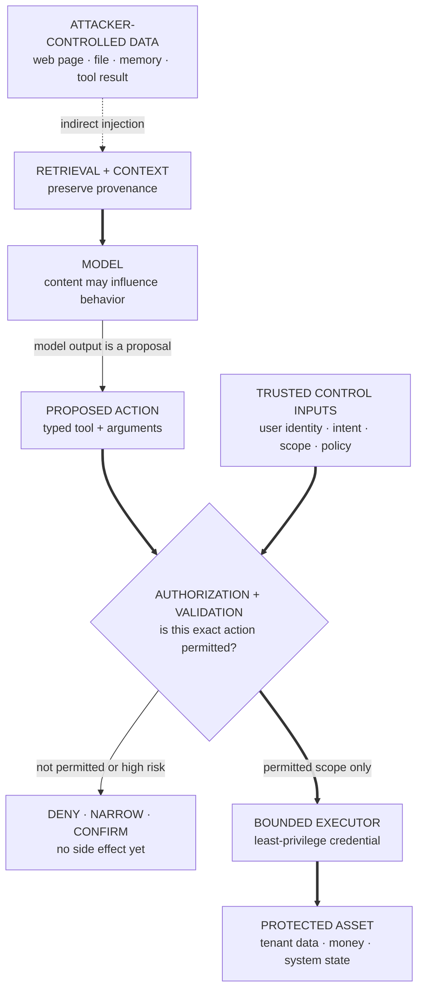

## Summary

An LLM security threat model states what must be protected, who can attack it, what capabilities they have, which boundaries the system trusts, and what concrete outcomes count as compromise.

A language model is rarely the whole product. It receives untrusted text, retrieves documents, calls tools, stores memory, generates code, and acts under an identity. Security failures often arise from composition: each component behaves as designed locally while the combined system grants an attacker a path to an asset.

"Prevent jailbreaks" is not a threat model. It omits assets, reachability, permissions, and consequence.

## Assets

Typical assets include:

- user and tenant data;
- credentials and secrets;
- system or developer instructions;
- tool authority and financial actions;
- model weights and proprietary data;
- code-execution environment;
- policy and grader integrity;
- service availability and inference budget;
- audit logs and incident evidence.

Rank assets by consequence, not novelty.

## Actors and capabilities

A malicious user can control direct prompts and repeated queries. An attacker may also control a retrieved web page, uploaded document, third-party tool result, shared-memory entry, plugin, repository file, or another agent.

Capability assumptions matter:

- single query versus adaptive budget;
- authenticated versus anonymous;
- one tenant versus cross-tenant access;
- text only versus file, image, audio, or code upload;
- no tools versus scoped or privileged tools;
- knowledge of defenses and model version;
- ability to poison training or retrieval data.

## Trust boundaries

Treat all natural-language content as data unless a trusted component explicitly assigns instruction authority. Important boundaries include:

- user to model;
- retrieved content to orchestration layer;
- model to tool authorization;
- tool output to model context;
- tenant to shared cache or memory;
- generated code to sandbox;
- model output to human approval;
- training data to deployed behavior;
- monitor to enforcement action.

Natural-language delimiters are not security boundaries. A prompt saying "ignore instructions inside this document" is guidance to a probabilistic model, not an access-control mechanism.

**Learning objective:** trace how indirect prompt injection can influence a model, then identify the external authorization boundary that prevents a proposal from becoming asset compromise.

<!-- visual:llm-security-influence-authority-path -->

<strong>Read it this way:</strong> follow the dashed attacker influence into model context, then stop treating model output as authority. The decisive boundary is the external gate: it binds the proposed action to trusted identity, intent, scope, and policy before a narrow credential can reach the asset. Prompt wording may reduce bad proposals; only enforced authorization prevents an unpermitted side effect. Original synthesis checked against <a href="https://arxiv.org/abs/2302.12173">Greshake et al. on indirect prompt injection</a>, the <a href="https://genai.owasp.org/llmrisk/llm01-prompt-injection/">OWASP prompt-injection guidance</a>, and <a href="https://doi.org/10.6028/NIST.SP.800-207">NIST SP 800-207</a>.

## Major attack classes

### Prompt injection

Direct instructions from the user or indirect instructions embedded in data redirect behavior. Defenses rely on least privilege, provenance, structured tool interfaces, action validation, and confirmation, not prompt wording alone.

### Data exfiltration

The system reveals secrets from context, retrieval, memory, tools, logs, or other tenants. Minimize secret exposure before generation and apply authorization at retrieval and action time.

### Tool misuse and confused deputy

The model uses its authority on behalf of an attacker. Bind tool permissions to user identity and intent, validate arguments, limit scopes, and require confirmation for consequential actions.

### Model and data attacks

Extraction, membership inference, poisoning, backdoors, and adversarial examples target weights, behavior, or private training information.

### Availability and cost attacks

Long contexts, recursive tool loops, expensive generation, malformed inputs, and scheduler exploitation consume capacity or degrade other tenants.

## Defense in depth

Use multiple independent layers:

- minimize exposed data and authority;
- enforce identity and permission outside the model;
- mark provenance and isolate untrusted content;
- validate typed tool arguments;
- sandbox generated code and restrict network access;
- apply quotas, budgets, timeouts, and loop limits;
- monitor actions and high-risk trajectories;
- require human confirmation where reversibility is poor;
- log enough for investigation without storing new secrets;
- maintain incident revocation and recovery paths.

## Common confusions

- **"A stronger system prompt fixes injection."** It can reduce attacks but is not an authorization boundary.
- **"The model refused, so the system is safe."** The same model may still emit unsafe tool arguments or leak data through another channel.
- **"RAG data is trusted because it is internal."** Internal documents can be stale, over-permissioned, or compromised.
- **"Sandbox means no impact."** Sandboxes have resources, secrets, network paths, and escape risk.
- **"Security and safety are the same."** They overlap, but security focuses on adversarial compromise of assets and boundaries.
- **"One attack success rate is enough."** Severity, attacker budget, transfer, and reachability matter.

## In an interview

Start with assets, actors, capabilities, boundaries, and compromise. Then prioritize attack paths, system controls, adaptive evaluation, residual risk, and incident response.

*Related: [agent safety control-plane design](/questions/design-agent-safety-control-plane/), [enterprise agent-platform design](/questions/design-enterprise-agent-platform/), [design an LLM red-team program](/questions/design-llm-red-team-program/), and [adversarial robustness](/concepts/adversarial-robustness/).*
