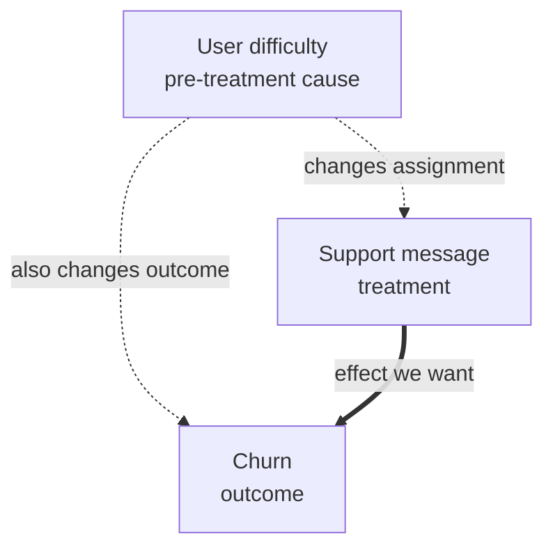

## Summary

Prediction asks what outcome is likely given observed data. Causal inference asks how an outcome would change under an intervention. A predictive association can be accurate and still give the wrong intervention decision.

A causal answer needs four parts: a target estimand, an assignment process, identification assumptions, and an estimator. Randomized experiments provide the clearest assignment process. Observational methods require stronger assumptions that cannot be verified from the data alone.

## Potential outcomes and estimands

For each unit $i$, define two potential outcomes:

$$
Y_i(1) \quad \text{and} \quad Y_i(0).
$$

They are the outcomes under treatment and control. The individual treatment effect is $Y_i(1)-Y_i(0)$, but only one potential outcome is observed for each unit.

A common target is the average treatment effect:

$$
\operatorname{ATE}=\mathbb{E}[Y(1)-Y(0)].
$$

Other targets include:

- average effect on treated units;
- effect for an eligible population;
- effect among compliers;
- conditional effects by user or context;
- policy value under a treatment rule.

State the population, intervention, outcome window, and aggregation before choosing a method.

## Why prediction can mislead

Suppose users who receive support messages have higher churn. A predictive model may learn that message receipt predicts churn. Sending fewer messages may still increase churn because the messages were triggered by earlier signs of user difficulty.

The treatment and outcome share a cause. This is confounding.

A directed acyclic graph can express the claim:

<!-- visual:causal-confounding-dag -->

<strong>Read it this way:</strong> difficulty opens a backdoor path from support messages to churn. The observed association mixes that path with the message's causal effect.

Conditioning on sufficient pre-treatment causes of both treatment and outcome may identify the effect. Conditioning on variables caused by treatment can instead introduce bias.

## Randomized experiments

Random assignment makes treatment independent of potential outcomes in expectation. Estimate the effect with a difference in group means, adjusted for the assignment design.

Check:

- assignment versus actual exposure;
- sample-ratio mismatch;
- interference between units;
- attrition and missing outcomes;
- novelty and long-term effects;
- heterogeneous effects;
- guardrail outcomes.

Randomization does not fix a vague intervention or wrong outcome. It identifies the effect of the treatment as implemented on the measured population and period.

## Backdoor adjustment

In observational data, a backdoor adjustment set blocks noncausal paths from treatment $T$ to outcome $Y$.

Under consistency, positivity, and no unmeasured confounding given covariates $X$,

$$
\mathbb{E}[Y(t)] = \mathbb{E}_X[\mathbb{E}[Y\mid T=t,X]].
$$

These assumptions mean:

- **consistency:** the observed outcome under the received treatment matches the defined potential outcome;
- **positivity:** each relevant covariate group has some chance of each treatment;
- **exchangeability:** after conditioning on $X$, treatment assignment contains no remaining outcome information.

Do not control for every available feature. Post-treatment variables, colliders, and proxies affected by treatment can create bias.

## Propensity scores and weighting

The propensity score is

$$
e(X)=P(T=1\mid X).
$$

Inverse-propensity weighting estimates a pseudo-population in which treatment is less associated with measured covariates. For the ATE, treated units receive weight $1/e(X)$ and control units receive weight $1/(1-e(X))$.

Large weights indicate weak overlap and high variance. Inspect propensity distributions, cap or stabilize weights when justified, and report the population for which overlap holds.

A propensity model balances measured covariates. It does not remove unmeasured confounding.

## Doubly robust estimation

A doubly robust estimator combines an outcome model with a propensity model. It can remain consistent when either model is correctly specified under the identification assumptions.

This does not protect against a wrong estimand, poor overlap, interference, or unmeasured confounding. Use cross-fitting for flexible ML nuisance models to reduce overfitting bias.

## Difference in differences

Difference in differences compares outcome changes over time between treated and comparison groups:

$$
(\bar{Y}_{T,after}-\bar{Y}_{T,before})
-
(\bar{Y}_{C,after}-\bar{Y}_{C,before}).
$$

The main assumption is parallel trends: without treatment, the average outcome paths would have changed similarly. Inspect pre-treatment trends and consider anticipation, changing group composition, and treatment timing.

## Regression discontinuity

Regression discontinuity uses a treatment rule with a cutoff, such as eligibility above a score threshold. Units near the cutoff can be comparable if they cannot precisely manipulate the running variable.

The estimate is local to the cutoff. Check sorting or manipulation, smooth covariates, bandwidth sensitivity, and alternative functional forms.

## Interference and feedback

Standard potential-outcome notation assumes one unit's treatment does not change another unit's outcome. This fails in social networks, marketplaces, auctions, and shared-capacity systems.

Possible designs include cluster randomization, switchback experiments, or explicit exposure models. In recommendation systems, treatment can also change future training data. The estimand must include the time horizon and policy feedback.

## Worked example

A ranking model shows premium content more often to users predicted to subscribe. Premium exposure and subscription are positively associated.

That association does not identify the effect of showing premium content because high-intent users receive more exposure. A randomized exposure change can estimate the intervention effect. If randomization is unavailable, the analysis needs a defensible assignment model, overlap, and sensitivity to unmeasured intent.

## In an interview

Use this order:

1. Separate prediction from intervention.
2. Define treatment, outcome, population, and estimand.
3. Draw the assignment process or causal graph.
4. Prefer randomization when feasible.
5. State every observational identification assumption.
6. Check overlap, interference, missing outcomes, and sensitivity.
7. Connect the estimate to a decision.

A strong answer says what cannot be learned from the available data. Method names do not replace identification.

## Common mistakes

- Interpreting feature importance as causal effect.
- Controlling for variables produced after treatment.
- Assuming propensity weighting removes all confounding.
- Ignoring overlap and extreme weights.
- Using difference in differences without checking pre-treatment trends.
- Generalizing a regression-discontinuity estimate far from the cutoff.
- Ignoring interference or policy feedback.

## Practice next

Apply this framework in [A/B testing for ML](/concepts/ab-testing-for-ml/), [ML experiment design](/questions/design-ml-ab-test/), [offline-online metric debugging](/questions/debug-offline-online-metric-gap/), and [personalized ranking](/guides/personalized-search-ranking/).

For deeper study, see [Causal Inference: What If](https://www.hsph.harvard.edu/miguel-hernan/causal-inference-book/) by Hernán and Robins.
