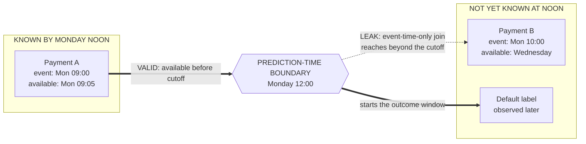

## Summary

Data leakage occurs when training or evaluation uses information that would not be available for the intended prediction. The model then learns from the target, the future, a related entity, or the evaluation set.

Point-in-time correctness is the operational test: for a prediction made at time $t$, every feature value must come from information available by $t$. This rule must hold in dataset construction, feature computation, splitting, tuning, and final evaluation.

## Start with the prediction contract

Define four items before building the dataset:

1. **Entity:** what receives the prediction?
2. **Prediction time:** when is the score produced?
3. **Outcome window:** which future interval defines the label?
4. **Feature cutoff:** which events are allowed to contribute?

Example: predict whether an account will default within 90 days, using information available at the end of each month. A payment posted after month end cannot appear in that month's feature row, even if the warehouse table now contains it.

## Target leakage

Target leakage gives the model a direct or indirect copy of the outcome.

Examples:

- a fraud feature records the result of a later investigation;
- a churn model includes an account-closure code;
- a hospital model uses a treatment ordered after diagnosis;
- a loan model uses a collection status created after default.

Leakage can hide behind a plausible column name. Trace how and when each field is produced.

## Temporal leakage

Temporal leakage moves future information into the past.

Common causes include:

- random train/test splits for time-dependent data;
- aggregates computed over the full table rather than up to prediction time;
- backfilled records with current values;
- joins that select the latest row instead of the latest eligible row;
- labels whose observation window overlaps the feature window.

Use chronological evaluation when the deployment problem is chronological. Training rows may use history before their own prediction times, not history before the date when the dataset was exported.

## Point-in-time joins

A point-in-time join selects the newest feature row whose event time and availability time are no later than the prediction time.

Two timestamps may matter:

- **event time:** when the real-world event occurred;
- **availability time:** when the system received and could use it.

A transaction may occur on Monday but arrive on Wednesday. A Tuesday prediction cannot use it. Joining only on event time still leaks information.

<!-- visual:point-in-time-availability-boundary -->


<p class="diagram-caption"><strong>Read it this way:</strong> Payment B happened before Monday noon, but nobody could know it then because it arrived Wednesday. A join that checks only event time pulls that future knowledge backward across the prediction-time boundary.</p>

A simplified rule is:

```text
feature.entity_id = example.entity_id
feature.available_at <= example.prediction_at
choose the latest eligible feature row
```

Test this rule with rows that arrive late, are corrected, or are backfilled.

## Group leakage

Related examples can leak identity or content across splits.

Examples:

- passages from one document appear in train and test;
- visits from one patient appear in both sets;
- near-duplicate images cross the boundary;
- future events from one user appear in training for an earlier test event;
- products with shared parent records cross a split.

Choose the split unit from the deployment claim. If the claim is generalization to new patients, split by patient. If the claim is future behavior for known users, use a temporal split within user.

## Preprocessing leakage

Fit learned preprocessing only on the training fold. This includes:

- normalization statistics;
- vocabulary and token frequency;
- imputation values;
- feature selection;
- dimensionality reduction;
- target encoding;
- synthetic oversampling.

A pipeline should fit each transform on training data and apply the frozen transform to validation or test data. Fitting once on the full dataset makes the held-out set influence training.

## Evaluation leakage

Repeated test-set use turns the test set into training information. Teams leak evaluation data when they:

- choose prompts or checkpoints from test results;
- inspect test errors and change the model repeatedly;
- publish the best of many unreported runs;
- train on benchmark solutions or near duplicates;
- let human raters see model identity or treatment.

Keep a validation set for iteration and a final test set for the last estimate. For long-running programs, rotate fresh held-out task families and record all evaluations.

## Worked example

A recommendation model predicts clicks at noon. Its seven-day item popularity feature is rebuilt overnight from the current warehouse table.

An offline row for Monday noon is exported on Friday. A naive query computes popularity from the seven days ending Friday and joins it to Monday. The feature includes events from Monday afternoon through Friday.

The correct query computes the aggregate using records available by Monday noon. Offline and online feature code should share this cutoff rule.

## Detection and tests

Use several checks:

1. Compare feature timestamps with prediction timestamps.
2. Remove suspicious high-performing features and measure the drop.
3. Train on past windows and evaluate on a later untouched window.
4. Search for columns created after the outcome.
5. Check duplicates and entity overlap across splits.
6. Replay online feature generation for historical examples.
7. Add unit tests for late arrival, backfill, and correction cases.

An unexpectedly large offline gain deserves a leakage review before model celebration.

## In an interview

Use this order:

1. Define entity, prediction time, outcome window, and feature cutoff.
2. Name target, temporal, group, preprocessing, and evaluation leakage.
3. Describe an as-of join using availability time.
4. Match the split unit to the deployment claim.
5. Add replay and boundary tests.
6. Explain how training and serving share feature definitions.

## Common mistakes

- Saying a random split is valid because rows are shuffled.
- Using event time when availability time controls deployment.
- Grouping by user but allowing future user events into past rows.
- Fitting scalers or vocabularies before cross-validation.
- Treating a feature store as automatic proof of point-in-time correctness.
- Reusing a benchmark until it no longer measures generalization.

## Practice next

Apply these rules in [cross-validation strategies](/concepts/cross-validation-strategies/), [feature-store design](/questions/design-feature-store/), and [debugging offline-online disagreement](/questions/debug-offline-online-metric-gap/).
