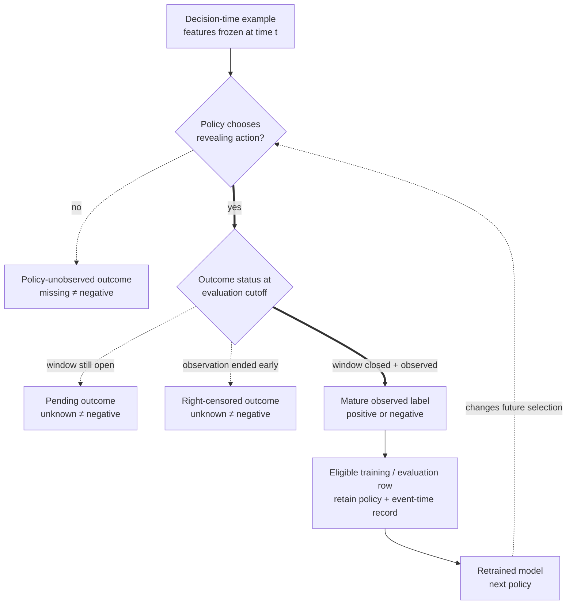

## Summary

Production labels are often delayed, missing, or created by the current policy. A recent example may look negative only because its outcome has not matured. An unapproved loan has no repayment outcome, and an item that was never shown has no click outcome.

Training on these records without the observation process creates bias. Define when a label becomes observable, why some labels remain missing, which action produced the data, and how deployment changes the next training set.

**Learning objective:** Distinguish a mature negative from a pending, censored, or policy-unobserved outcome, then trace how only the observed subset shapes the next deployed policy.

<!-- visual:policy-label-observation-loop -->


<p class="diagram-caption"><strong>Read it this way:</strong> pass both gates before calling an outcome negative. The policy must first take an action that can reveal the outcome, and the observation window must then close without censoring. Only the mature observed branch enters ordinary training; follow the dashed return edge to see why that selected evidence changes what the next policy will reveal.</p>

## Delayed labels

A delayed label arrives after the prediction and action.

Examples include:

- chargebacks reported weeks after a payment;
- churn observed after an inactivity window;
- loan default measured over months;
- long-term retention measured after a product change;
- safety incidents found during later review.

Define a maturity window. If fraud labels mature after 60 days, a transaction from last week is not a confirmed negative.

Use cohort-based evaluation:

1. Group examples by prediction date.
2. Evaluate only cohorts whose label window has closed.
3. Track partial maturity separately.
4. Backfill labels without changing the original features or prediction time.

The freshest fully mature cohort may be old. Report that delay as an operational limit.

## Right censoring

An outcome is right-censored when observation ends before the event or evaluation window completes. Treating censored examples as negatives biases duration and event estimates.

Survival analysis models event time while accounting for censoring. Simpler systems may use fixed mature windows, but they discard recent data and can hide changing hazards.

State whether censoring is independent after conditioning on observed features. Users who leave logging coverage for a reason related to the outcome violate that assumption.

## Selective labels

A selective label is observed only after a policy chooses an action.

Examples:

- repayment is observed only for approved loans;
- contraband is confirmed mainly for packages opened by inspectors;
- relevance feedback exists only for shown results;
- medical outcomes may be measured only for tested patients;
- abuse labels concentrate on accounts sent to review.

The unlabeled group is not a random sample. Training only on observed outcomes can reproduce the old policy and hide its blind spots.

A missing label is not a negative label. Preserve an explicit observation status.

## Safe ways to gain labels

Depending on the domain and risk, teams can use:

- randomized audits;
- limited exploration among actions with acceptable risk;
- shadow predictions followed by independent review;
- external adjudication samples;
- delayed manual review of allowed cases;
- positive-unlabeled methods with stated assumptions;
- causal weighting when action propensities are known.

Exploration is not acceptable when the action can create severe harm. Use simulation, expert review, conservative rules, or another safe source of information.

## Feedback loops

A deployed model changes which data the next model sees.

One loop is:

```text
model score -> action or ranking -> user exposure -> behavior -> label -> retraining
```

A recommender that promotes one topic collects more interactions with that topic. A fraud model that blocks transactions prevents some outcomes from being observed. A moderation model sends selected content to reviewers and improves label quality only in that region.

The model can narrow coverage, amplify popular items, or make offline labels increasingly dependent on past policies.

## Direct and indirect feedback

**Direct feedback** occurs when the model changes the measured label. A ranking changes clicks, and clicks become training labels.

**Indirect feedback** occurs when the model changes the population or environment. A strict approval model changes which applicants return. A safety model changes attacker behavior.

Monitor both the target metric and the data-generation process.

## Logging contract

For each decision, log:

- prediction time and entity;
- model and policy version;
- candidate set and available actions;
- chosen action or slate;
- score and threshold version;
- action propensity when randomized;
- feature snapshot or identifiers;
- outcome window and maturity state;
- later corrections or adjudication.

Without the candidate set and action policy, many counterfactual questions cannot be answered later.

## Worked example

A fraud model trains every night. Chargebacks can arrive for 45 days. The pipeline marks every transaction without a chargeback as legitimate after 24 hours.

The newest training rows contain many false negatives. The model learns from labels whose error rate depends on age.

A correct pipeline records label maturity, trains on closed cohorts, and reports performance by transaction date. It may use early proxy labels, but it must validate how well they predict mature chargebacks.

## Evaluation under policy change

When a policy changes, offline comparisons may fail because the new model would expose different items or approve different cases.

Use:

- randomized holdouts that preserve a stable policy;
- exploration logs with propensities;
- counterfactual estimators where support holds;
- long-term online experiments;
- fresh human labels independent of model action;
- policy-version slices.

Keep a stable control when long-term feedback is part of the risk.

## In an interview

Use this order:

1. Define the outcome window and label maturity.
2. Separate negative, missing, and censored outcomes.
3. Explain which policy selects observed labels.
4. Log candidate actions, policy version, and propensities.
5. Propose a safe source of labels outside the current policy.
6. Measure feedback over time and preserve a control.

## Common mistakes

- Marking recent unresolved outcomes as negative.
- Dropping unlabeled rows without explaining selection.
- Calling shown-but-not-clicked items universal negatives.
- Backfilling labels while recomputing features from the future.
- Evaluating a new policy only on data created by the old policy.
- Adding unsafe exploration only to improve labels.
- Monitoring the target while ignoring how the training population changes.

## Practice next

Apply these ideas in [point-in-time correctness](/concepts/data-leakage-point-in-time-correctness/), [counterfactual ranking](/concepts/position-bias-counterfactual-learning-to-rank/), [fraud-system design](/questions/design-fraud-detection/), and [offline-online metric debugging](/questions/debug-offline-online-metric-gap/).
