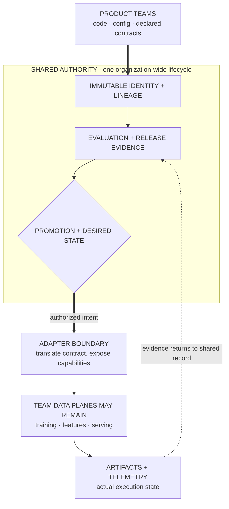

> *Asked in: staff and principal ML system design, platform architecture, and technical strategy rounds.*

A workable answer designs a path from trustworthy data to safe model releases. A staff answer also defines platform boundaries, migration, ownership, and adoption across teams. A principal answer decides which capabilities should become shared infrastructure, which should stay local, and how that decision can change without trapping the organization.

This page is a reference map, not a script for one interview. Use the 45-minute structure near the end, then study the detailed sections that exposed weak follow-ups.

## The prompt

You support an organization with eight product ML teams and about 50 scientists and engineers. They operate roughly 30 models across ranking, forecasting, classification, and language applications.

Each team currently owns separate notebooks, pipelines, deployment scripts, and dashboards. Common failures include:

- training data that cannot be reconstructed;
- features that differ between training and serving;
- experiments that cannot be compared fairly;
- manual releases with unclear approval state;
- duplicated infrastructure and idle accelerators;
- production regressions detected by customers;
- deletions that cannot be traced into derived datasets;
- platform work that product teams avoid because it slows delivery.

Design an ML platform for the next two years. The first useful release must reach production within one quarter. A large rewrite or forced migration is unacceptable.

## State the decision before drawing boxes

The platform should standardize contracts and evidence before it standardizes every implementation. Its first release should create a paved path for one repeated workflow: version data, run a reproducible training job, evaluate it, register the artifact, deploy it gradually, and roll it back.

Do not begin by promising a universal feature store, scheduler, registry, notebook environment, and serving runtime. That scope creates a long platform program with no early proof. It also assumes that all eight teams have the same bottleneck.

Start with three decisions:

1. **Shared contracts:** define identities, lineage, promotion evidence, and deployment state across the organization.
2. **Thin execution layer:** integrate existing storage, compute, and serving systems behind those contracts instead of replacing them immediately.
3. **Incremental adoption:** prove the path with two representative teams, measure delivery and reliability, then expand only where the shared capability beats local ownership.

This answer gives the architecture, migration, and operating model for that decision.

## Clarify the organization and workload

Ask questions that can change the platform boundary.

### Product and risk

- Which model decisions can directly harm users or move money?
- Which releases need human approval, audit evidence, or legal review?
- How quickly must each model be rolled back?
- Which teams already have reliable release processes worth preserving?
- Are failures isolated to one product, or can a shared feature affect every product?

### Workload

- How many training runs start per day?
- What fraction use accelerators, large memory, or distributed execution?
- Which models serve online, in streams, or in scheduled batches?
- What are the latency, freshness, throughput, and availability targets?
- How large are training snapshots, artifacts, and online feature reads?

### Organization

- How many platform engineers can operate shared services?
- Who owns source data quality and semantic definitions?
- Can product teams contribute components, or is the platform team the only writer?
- Which cloud, warehouse, orchestrator, and serving systems already have operational support?
- What previous standardization efforts failed, and why did teams route around them?

Assume the organization has one warehouse, object storage, a stream bus, container compute, and two serving patterns. Most models train daily or weekly. Five models need online features below 20 milliseconds. Four high-risk models require approval and an audit trail.

## Define success for the platform

A platform is successful when teams ship trustworthy changes faster. Component adoption alone is weak evidence because forced usage can increase while delivery gets worse.

Use outcome metrics in four groups.

### Delivery

- median time from an approved code change to a shadow deployment;
- setup time for a new model using the paved path;
- fraction of releases completed without a platform ticket;
- time required to reproduce a prior training run;
- time required to diagnose a failed release.

### Reliability

- rollback time and rollback success rate;
- training jobs recovered without corrupting output;
- feature freshness and availability by declared service level objective;
- incidents caused by training-serving skew;
- releases missing required evaluation or lineage evidence.

### Quality and safety

- critical slice regressions caught before production;
- online regressions caught during staged rollout;
- policy exceptions and their expiration rate;
- deletion requests proven across derived artifacts;
- models operating with expired or invalid evaluation evidence.

### Efficiency

- accelerator utilization by workload class;
- storage growth per retained model version;
- shared service cost by team and product;
- duplicate pipelines retired;
- platform engineering time spent on tickets versus reusable capabilities.

Set a first-quarter target around two pilot teams. For example, reduce setup and release time while preserving their existing quality and reliability. Do not promise organization-wide cost reduction before measuring migration and support costs.

## Establish invariants and service levels

The architecture follows from a small set of invariants.

1. **Every production model has an immutable identity.** The identity resolves to code, configuration, environment, training inputs, evaluation evidence, and artifact hashes.
2. **Every promotion is a state transition.** An authorized actor moves a model from evaluated to approved, staged, or production. The transition and evidence are recorded.
3. **Every online input has event-time semantics.** A feature definition states its source, transformation, entity key, event timestamp, availability timestamp, and freshness target.
4. **Retries do not create ambiguous output.** Jobs use attempt identifiers, idempotent writes, and atomic publication of completed artifacts.
5. **Rollback does not require retraining.** A compatible prior model and its serving contract remain available for the rollback window.
6. **Shared failures have bounded blast radius.** Tenants have quotas, isolated rollout controls, and degradation paths.
7. **Exceptions are explicit and temporary.** A team may leave the paved path when requirements justify it, but the owner, reason, and review date are visible.

Assign service levels by capability instead of claiming one platform-wide number.

| Capability | Example target | Failure behavior |
| --- | --- | --- |
| Metadata reads | 99.9% monthly availability | Show last known state; block unsafe promotion |
| Training submission | 99.5% acceptance within one minute | Queue locally; do not lose the request |
| Online feature read | Product-specific p99 and availability | Fall back to cached, default, or reduced model path |
| Model deployment | Start staged rollout within ten minutes | Leave current version serving |
| Rollback | Restore a compatible version within five minutes | Invoke product fallback if restoration fails |
| Lineage query | Complete common dependency query within seconds | Return partial results with missing edge state |

The targets are examples. The candidate should derive them from product risk and current baselines.

## Separate the control plane from data planes

The shared platform should own a small control plane. Existing systems can continue to execute data and model workloads behind adapters.

<p class="visual-kicker">Learning objective</p>
<p class="visual-title">Separate the lifecycle contracts that need one shared authority from the execution systems teams can retain behind adapters.</p>

<!-- visual:multi-team-platform-contract-boundary -->


<p class="diagram-caption"><strong>Read it this way:</strong> follow the solid path first: every team enters one lifecycle for identity, evidence, and promotion, then adapters translate authorized intent into each team's existing runtime. Follow the dashed path back: artifacts, telemetry, and actual state become shared evidence. Standardize the authority loop; do not require one universal executor. Original synthesis checked against <a href="https://research.google/pubs/hidden-technical-debt-in-machine-learning-systems/">Sculley et al. on ML system debt</a>, the <a href="https://mlflow.org/docs/latest/ml/model-registry/">MLflow lifecycle documentation</a>, and Google's <a href="https://developers.google.com/machine-learning/guides/rules-of-ml">Rules of Machine Learning</a>.</p>

The control plane stores desired state, identities, policy, and evidence. Data planes perform high-volume work such as scans, training, feature materialization, and inference.

This split has three benefits:

- teams gain one model lifecycle without an immediate compute migration;
- metadata remains available when a workload system is degraded;
- each execution system can evolve behind a stable contract.

The risk is adapter complexity. Avoid pretending that unlike systems have identical behavior. The contract should expose capability differences such as preemption, region, accelerator type, consistency, and rollback support.

## Use immutable identities and explicit lineage

A model version should reference immutable objects rather than mutable names.

```text
ModelVersion
  model_id
  version_id
  source_revision
  package_digest
  environment_digest
  training_run_id
  dataset_snapshot_ids[]
  feature_view_versions[]
  evaluation_bundle_id
  artifact_uri
  artifact_digest
  input_schema_version
  output_schema_version
  owner
  created_at
```

A friendly alias such as `fraud-primary` may point to a version. The version itself never changes.

Lineage is a graph of typed edges:

- source event to dataset snapshot;
- snapshot to feature materialization;
- feature version to training run;
- training run to model artifact;
- artifact to evaluation bundle;
- model version to deployment;
- deployment to predictions and observed outcomes.

Store high-cardinality data in the systems designed for it. The metadata service should keep identities, pointers, summaries, and graph edges. It should not copy every event or prediction into a relational metadata database.

### Reproduction levels

Define what reproducible means. The word can hide several different promises.

1. **Traceable:** the platform can identify every input and transformation.
2. **Re-runnable:** the platform can submit the same declared run again.
3. **Numerically close:** the new result falls within declared tolerance.
4. **Bitwise identical:** every relevant source of nondeterminism is controlled.

Most production ML needs the first three. Bitwise identity is expensive and may be impossible across accelerator or library changes. The platform should record the promised level per workload.

## Build the data and feature contract

The platform should not force every team to use online features. It should define one feature contract that supports offline, batch, stream, and online materialization.

A feature definition includes:

- stable name and owner;
- entity keys;
- data type and null policy;
- source identity;
- transformation revision;
- event-time field;
- availability-time field;
- freshness service level;
- retention and privacy class;
- default and degradation behavior;
- consumers and deprecation state.

### Point-in-time training data

Training assembly must join each label event to feature values that were available when the prediction would have occurred. Event time alone is insufficient when source data arrives late.

For each record, distinguish:

- **event time:** when the real-world event happened;
- **ingestion time:** when the platform received it;
- **availability time:** when a production prediction could have used it.

The historical join uses the latest valid feature whose availability time is no later than the prediction time. This prevents future information from leaking through corrected records or delayed upstream feeds.

### Batch and streaming consistency

Do not promise identical implementations by default. Batch SQL and streaming code can drift even when they express the same idea.

Choose one of three approaches per feature family:

1. run one portable transformation in both paths;
2. derive online state from the same versioned event log used by batch replay;
3. keep separate implementations and continuously compare sampled outputs.

The third option is often practical for existing systems. The platform should make the mismatch measurable rather than hiding it.

### Late and corrected data

A streaming feature needs a watermark and correction policy. Decide whether late events are ignored, applied to future state, or used to revise historical materializations.

Corrections should create a new dataset or feature snapshot. Mutating an old snapshot destroys the ability to explain why a model behaved differently on a later rerun.

## Make training runs reproducible and schedulable

A training submission should be a declarative run specification.

```text
TrainingRunSpec
  code_package
  environment
  command
  input_snapshots
  feature_versions
  parameters
  random_seed_policy
  resource_request
  retry_policy
  output_contract
  owner
  budget_tag
```

The orchestrator validates the specification, resolves immutable inputs, and assigns a run identifier. An execution adapter translates the request to the current batch or accelerator system.

### Retry semantics

A retry keeps the logical run identity but receives a new attempt identity. Each attempt writes to a private path. The platform publishes output only after validation succeeds.

Use an atomic metadata update or compare-and-swap operation to publish the winning attempt. A late attempt cannot overwrite a completed result.

Do not claim exactly-once execution. Distributed workers can run more than once. The required property is one unambiguous published result from idempotent or isolated attempts.

### Resource scheduling

Teams need quotas and priorities because shared accelerators create contention. A useful policy separates:

- interactive debugging;
- scheduled production retraining;
- bounded experiments;
- large research sweeps;
- emergency incident work.

Use per-team budgets, maximum job size, queue age, and preemption rules. Reserve capacity only for workloads with a measured need. Large jobs should expose gang-scheduling requirements and checkpoint support.

Report queue time separately from execution time. A platform can improve utilization while making scientist iteration slower. Both measurements are needed.

### Experiment comparison

A run record should capture the comparison contract:

- baseline run;
- changed variables;
- shared data and evaluation snapshots;
- resource budget;
- repeated seeds when variance matters;
- primary metric and guardrails;
- decision status.

The platform can detect obvious unfair comparisons. It cannot decide whether a scientific claim is meaningful. Keep that judgment with the owning team and reviewers.

## Treat evaluation as a versioned product

An evaluation bundle should be immutable and linked to the model version. It contains more than one scalar metric.

Include:

- evaluation dataset and slice definitions;
- metric code versions;
- confidence intervals or repeated-run summaries where relevant;
- baseline comparisons;
- calibration and threshold analysis;
- policy, safety, fairness, or robustness checks required by risk class;
- known exclusions and unresolved failures;
- reviewer decisions and expiration time.

### Promotion policy

Use policy as code for mechanical checks. For example:

- required metrics exist;
- no critical slice exceeds its regression limit;
- input and output schemas are compatible;
- lineage is complete;
- the evaluation is recent enough;
- required reviewers approved.

Do not encode every launch decision as a universal threshold. Teams need room to trade one metric against another. The platform should record the exception and its rationale when a human approves a bounded deviation.

### Evaluation expiration

Evidence can become stale when data, policy, or upstream systems change. Link evaluation validity to dependencies.

A new source schema, label definition, safety policy, or serving interface can invalidate earlier evidence. The control plane should mark affected models for review rather than silently treating an old green result as current.

## Design deployment as a state machine

A deployment controller should reconcile declared state with serving systems.

```text
registered -> evaluated -> approved -> shadow -> canary -> production -> retired
```

Transitions require evidence and authorization. The controller records who requested the transition, what changed, and which policy allowed it.

### Compatibility checks

Before traffic moves, verify:

- model input schema against produced features;
- output schema against downstream consumers;
- preprocessing and tokenization versions;
- runtime and hardware compatibility;
- model size against memory limits;
- fallback availability;
- regional and privacy constraints.

Use compatibility ranges instead of requiring every client and model to update together. A breaking contract should use dual reads, dual writes, or a versioned endpoint during migration.

### Release stages

1. **Offline validation:** run contract, quality, and policy checks.
2. **Shadow:** execute on production requests without affecting decisions.
3. **Canary:** expose a small bounded population with automatic stop conditions.
4. **Experiment:** randomize enough traffic to estimate product effects when needed.
5. **Progressive rollout:** increase traffic while checking system and product guardrails.
6. **Full production:** retain the prior compatible version for the rollback window.

Shadow results reveal serving errors and latency, but they do not prove user impact. Canary traffic limits blast radius, but small samples may miss quality regressions. A controlled experiment answers a different question.

### Rollback

Rollback should switch an alias or desired-state pointer to a compatible prior version. It should not rebuild an image or retrain a model.

Keep feature and schema compatibility in the rollback plan. Restoring an old model against a new incompatible feature view is not a rollback.

## Join model and system observability

Separate four telemetry layers.

1. **System:** latency, errors, saturation, queue time, resource use, and cost.
2. **Data:** schema, volume, freshness, nulls, category changes, and join coverage.
3. **Model:** score distribution, calibration, slice metrics, uncertainty, and drift indicators.
4. **Outcome:** delayed labels, product metrics, intervention rates, complaints, and downstream harm.

Every alert needs an owner, severity, response window, and playbook. A dashboard without a response contract creates visibility without control.

### Correlation identifiers

A prediction record should link request, model version, feature versions, and deployment stage. Sensitive raw features should stay out of general logs.

Use sampled traces for detailed debugging and aggregated metrics for broad monitoring. Retention should follow privacy and incident requirements.

### Delayed outcomes

Join outcomes by stable decision identifiers. Report metric maturity so teams can distinguish early partial labels from complete windows.

For selective labels, preserve exploration or audit samples where policy permits. Otherwise the monitoring loop can confirm only outcomes for actions the current model chose.

## Design for failure and degraded operation

List failures by boundary and define the safe response.

### Metadata service unavailable

Existing production deployments continue serving. New promotions stop because their evidence cannot be verified. Training jobs may queue locally if submission can be recovered without ambiguity.

### Feature freshness breach

The owning product chooses among cached values, defaults, a reduced feature set, a simpler model, or refusal to decide. The feature contract records which fallbacks are valid.

### Training worker loss

Restart from a checkpoint when the job supports it. Publish no partial artifact. Record the failed attempt and resource waste.

### Corrupt dataset snapshot

Quarantine the snapshot and every derived artifact. The lineage graph identifies affected training runs and deployments. Do not delete the evidence needed for the incident review.

### Bad shared transformation

Stop new materializations, mark dependent feature versions invalid, and identify deployed models by lineage. A shared feature has a wider blast radius than a team-local transformation, so its rollout needs stronger sampling and ownership.

### Region failure

Keep the control plane's recovery point and recovery time explicit. Online inference may use regional serving state while metadata recovery occurs elsewhere.

Avoid active-active control-plane writes until the organization needs them. Conflict resolution for promotion state is expensive and safety-sensitive. A simpler single-writer design with tested failover is often safer.

### Accidental duplicate deployment request

Use an idempotency key and compare desired state. Repeating the request should return the same deployment operation rather than create another rollout.

## Add security, privacy, and governance at the contracts

Security should follow artifact and data boundaries.

- authenticate users and workloads separately;
- authorize by team, environment, data class, and action;
- use short-lived workload credentials;
- sign packages and verify artifact digests;
- isolate secrets from training data and logs;
- record promotion, exception, and access events;
- restrict production data export;
- scan dependencies and runtime images;
- define retention for snapshots, logs, and artifacts.

### Privacy deletion

A deletion request starts from a subject or source identifier. The lineage system finds derived snapshots, features, training runs, and models.

The organization then applies its approved policy. Some artifacts may be deleted, rebuilt, expired, or proven unaffected. The platform should record the action and residual copies rather than claim that graph traversal automatically removes learned influence.

### Risk tiers

Do not apply the heaviest process to every model. Define risk tiers using user impact, reversibility, data sensitivity, regulatory exposure, and decision autonomy.

Higher tiers can require more evaluation, reviewers, retention, and rollout controls. Lower tiers keep a fast path. Uniform governance encourages teams to hide work outside the platform.

## Control multi-tenancy and cost

Shared platforms fail when one team can exhaust a global resource or when nobody can explain the bill.

Use:

- namespace isolation;
- per-team quotas and budgets;
- workload priorities;
- artifact retention policies;
- rate limits on shared APIs;
- capacity reservations with expiration;
- cost attribution by run, deployment, team, and product;
- noisy-neighbor tests for online systems.

### Chargeback versus showback

Start with showback: report cost and capacity use without transferring budget. It reveals bad attribution and gives teams time to change.

Move to chargeback only when measurements are stable and teams control the relevant decisions. Charging teams for platform overhead they cannot influence creates avoidance rather than efficiency.

### Unit economics

Track cost per useful unit:

- cost per completed training run;
- cost per accepted experiment decision;
- cost per thousand predictions;
- cost per retained artifact month;
- platform support cost per onboarded team.

A lower accelerator-hour price can coexist with more wasted experiments. Connect infrastructure efficiency to delivered outcomes.

## Decide what to build, buy, or keep local

Evaluate each capability separately. A single build-versus-buy verdict for the whole platform is too coarse.

Use five criteria:

1. Does this capability differentiate the product or research process?
2. Do existing products meet the required scale, policy, and integration needs?
3. What is the migration cost from the current systems?
4. Can the organization operate the capability during incidents?
5. How reversible is the decision after two years of data and workflow accumulation?

A reasonable initial portfolio could be:

- buy or adopt commodity experiment tracking and artifact storage;
- build thin identity, lineage, policy, and deployment adapters around existing systems;
- keep specialized training runtimes owned by expert teams;
- standardize evaluation bundles and promotion evidence;
- defer a universal online feature service until pilot demand proves it.

### Exit costs

Keep metadata exportable. Store artifacts in open formats and stable object paths. Put policy and run specifications in versioned code.

Vendor abstraction should protect identities and evidence. Do not build a lowest-common-denominator wrapper over every vendor feature. That wrapper becomes another platform with worse capabilities.

## Migrate through representative slices

A big-bang migration fails because platform gaps appear only under real workflows.

### Phase 0: baseline and select pilots

Measure current setup time, release time, incident rate, reproducibility, and support load. Choose two pilot teams with different needs and willing owners.

Avoid selecting only the cleanest team. One pilot should exercise online deployment and one should exercise scheduled or accelerator training.

### Phase 1: identity and evidence

Introduce model versions, run specifications, artifact digests, evaluation bundles, and deployment records. Keep existing execution systems.

Success means a pilot can reproduce a run, inspect lineage, and roll back through the control plane.

### Phase 2: paved workflows

Add reusable templates, self-service project creation, policy checks, and adapters for the common training and serving paths.

Measure ticket-free completion and time to first shadow deployment.

### Phase 3: shared data and scheduling

Adopt feature contracts, point-in-time assembly, shared queues, and cost controls where duplication or reliability justifies them.

Do not migrate a reliable local pipeline merely to increase platform coverage.

### Phase 4: deprecate with evidence

Retire an old path only after the replacement meets its reliability target and every consumer has a tested migration. Publish the owner, deadline, compatibility period, and rollback plan.

### Migration safety

Use dual registration or shadow metadata before the platform controls production. Compare the platform's reconstructed lineage and deployment state against the current source of truth.

When confidence is high, move one authority at a time. Split authority creates incidents when two systems both believe they control production.

## Define ownership as part of the architecture

Each shared capability needs one accountable operator and clear consumer duties.

### Platform team owns

- control-plane availability and data durability;
- stable APIs and client libraries;
- common execution adapters;
- policy engine mechanics;
- platform telemetry and incident response;
- migration tooling and documentation;
- deprecation process.

### Product ML teams own

- model objectives and labels;
- feature semantics;
- evaluation quality and slice definitions;
- product guardrails and fallback behavior;
- model-specific incidents;
- approval requests and exception rationale.

### Data owners own

- source contracts and quality;
- semantic changes;
- backfill and correction policy;
- privacy classification and retention input.

### Risk or review functions own

- policy requirements;
- approval authority for defined risk tiers;
- exception review;
- audit interpretation.

The platform can enforce declared policy. It should not silently become the owner of product quality, source semantics, or every model incident.

## Treat adoption as an engineering problem

A technically sound platform can fail because its local cost exceeds its local benefit.

### Build a paved path

The paved path should provide:

- a working project template;
- one command or pull request to create a run;
- automatic metadata and lineage capture;
- default evaluation and release workflows;
- observable errors with owner and recovery guidance;
- an escape hatch for unsupported needs.

The escape hatch is part of the product. Record why teams use it. Repeated exceptions reveal a missing platform capability or a boundary that should remain local.

### Measure user experience

Interview platform users and inspect workflow telemetry. Measure:

- time spent waiting for the platform;
- manual steps outside the recorded workflow;
- support contacts by failure class;
- abandoned onboarding attempts;
- local wrappers built around official clients;
- time from error to a useful diagnosis.

### Create contribution boundaries

Let domain teams contribute adapters, evaluators, and templates through reviewed extension points. Keep core identity, authorization, state transitions, and compatibility logic under stronger ownership.

This model scales expertise without turning critical control-plane behavior into an unreviewed plugin collection.

### Avoid mandatory adoption too early

Mandatory use can hide poor product fit. Teams comply through manual workarounds while dashboards report adoption.

Earn adoption with faster delivery and safer releases. Make a capability mandatory only when shared risk requires one source of truth, such as production promotion records or artifact identity.

## Make the staff-level decisions explicit

A staff candidate should identify the decisions that determine whether this program works.

1. **Contract before consolidation:** standardize lifecycle evidence while preserving working execution systems.
2. **Two representative pilots:** use real workloads to expose missing capabilities within one quarter.
3. **One authority per state transition:** avoid dual control of deployment or model identity.
4. **Risk-tiered policy:** protect high-impact systems without burdening every experiment.
5. **Paved path with escape hatches:** optimize the common case and learn from justified exceptions.
6. **Outcome-based adoption:** measure delivery, reliability, and support, not component usage alone.
7. **Reversible vendor choices:** retain portable artifacts, metadata, and workflow specifications.

Staff scope appears in the integration details, migration sequence, and ownership model. Merely naming a platform architecture is a senior answer.

## Add the principal-level portfolio view

A principal candidate should reason across several platform investments and multi-year constraints.

### Choose the shared boundary

Centralize capabilities whose inconsistency creates organization-wide risk or repeated cost:

- artifact identity;
- production promotion state;
- lineage contracts;
- access policy;
- cost attribution;
- common release evidence.

Keep capabilities local when teams need materially different semantics or when a shared service would erase useful specialization:

- frontier training runtimes;
- domain-specific label systems;
- specialized evaluators;
- product-specific fallback logic;
- early research workflows.

This boundary can move. The principal design records what evidence would justify further consolidation.

### Balance the portfolio

Do not fund only the central platform. Reserve capacity for:

- migration and reliability work;
- product-team enablement;
- specialized workloads;
- retirement of old systems;
- experiments that test the next shared capability.

A platform creates negative value if every team must pause roadmap work for migration while old systems still require full support.

### Define decision checkpoints

At each quarter, decide whether to expand, repair, narrow, or stop a platform capability. Use predefined evidence:

- two teams reduce release time without reliability loss;
- support load declines after onboarding;
- exceptions cluster around a coherent missing capability;
- shared incidents stay within the declared error budget;
- duplicated local systems are actually retired;
- users can leave or downgrade a vendor without losing lineage.

### Plan for organizational change

Teams, products, and compliance requirements will change during a two-year program. Stable contracts should survive ownership changes.

Avoid designs that depend on one expert approving every release. Build delegated authority, review policy, runbooks, and succession into the operating model.

### Preserve option value

The principal question is not only whether the proposed platform works. It is whether the organization can still change direction after thousands of runs and hundreds of models depend on it.

Portable identities, explicit contracts, bounded adapters, and staged authority transfers preserve that option.

## Walk through one model lifecycle

Use a concrete example to prove the pieces connect.

A fraud team updates a transaction model with a new device-risk feature.

1. The source owner publishes a versioned event schema.
2. The feature definition declares entity key, event time, availability time, freshness, fallback, and privacy class.
3. The pipeline materializes a new offline feature snapshot and shadows the online value.
4. A consistency job compares sampled batch and online values.
5. The training specification references immutable data, feature, code, and environment versions.
6. The orchestrator runs three seeds under the approved budget and publishes one evaluation bundle.
7. Evaluation compares the current production model on the same snapshot and reports cost-aware thresholds, calibration, critical slices, and delayed-label maturity.
8. Policy checks lineage, schema compatibility, required evidence, and reviewer approval.
9. The deployment controller shadows the model, then canaries it on a bounded traffic slice.
10. System telemetry checks latency and errors. Product telemetry checks intervention volume and early guardrails.
11. Mature chargeback labels later join to decision identifiers.
12. The experiment owner makes the ship decision with the risk team.
13. Progressive rollout increases traffic while the prior compatible model remains available.
14. A device-pipeline freshness breach triggers the declared fallback and pages the source owner.
15. If calibration regresses, rollback changes the production alias to the prior model and preserves incident evidence.

This walkthrough reveals missing boundaries. It also gives the interviewer several places to change a condition.

## Compare rejected alternatives

A strong design explains what it did not choose.

### One universal runtime

A single runtime simplifies operations but can block specialized workloads and create a large migration. Use common run contracts with several adapters first. Consolidate only after workload evidence supports it.

### Metadata captured after execution

Post-hoc scraping is easy to add but misses failed runs, manual changes, and exact inputs. Make identity allocation and run submission part of the normal path. Use scraping only during migration.

### Platform-owned model quality

Central ownership sounds consistent but removes domain accountability. The platform should enforce evidence contracts. Product teams retain decisions about labels, metrics, and acceptable trade-offs.

### Strict mandatory path

A strict path reduces variation but can freeze research and encourage hidden workarounds. Require shared production identities and promotion records. Allow explicit exceptions for execution and evaluation needs.

### Immediate active-active control plane

Active-active writes improve theoretical regional availability but add conflict and state-transition complexity. Begin with a single writer, durable replicas, and tested failover unless business requirements demand more.

## Structure the 45-minute interview

A complete answer cannot explain every subsystem at equal depth. Allocate time deliberately.

### Minutes 0 to 5: clarify and frame

- identify platform users and risk classes;
- quantify workloads and current failures;
- state the first-quarter constraint;
- propose contracts before consolidation.

### Minutes 5 to 12: define success and invariants

- choose delivery, reliability, quality, and cost metrics;
- define immutable identities and promotion state;
- state rollback and blast-radius requirements.

### Minutes 12 to 22: draw the architecture

- separate control and data planes;
- connect data, training, evaluation, registry, deployment, and telemetry;
- explain where existing systems remain.

### Minutes 22 to 32: take one deep dive

Choose the area most relevant to the interviewer:

- point-in-time data and batch-stream consistency;
- training retries and resource scheduling;
- evaluation and promotion policy;
- deployment compatibility and rollback;
- lineage, deletion, and audit;
- multi-tenancy and failure recovery.

### Minutes 32 to 39: migration and ownership

- select pilots;
- transfer authority one state at a time;
- define platform and product-team ownership;
- measure adoption through outcomes.

### Minutes 39 to 45: principal trade-offs and follow-up

- explain shared versus local boundaries;
- identify build, buy, and exit decisions;
- state quarterly checkpoints;
- close with residual risks.

## Distinguish answer levels

### Mid-level answer

Names common components and technologies. It may explain a training pipeline or model registry correctly, but the pieces do not form an operating system for several teams.

> “I would add experiment tracking, a feature store, a model registry, and a shared serving service. Teams would use the same tools for consistency.”

### Senior answer

Connects versioned data, reproducible training, evaluation, deployment, monitoring, and rollback. It defines interfaces and important failure modes for one product area.

> “I would define immutable run and model versions, require comparable evaluation, and deploy through shadow and canary stages. The previous compatible model remains available for rollback.”

### Staff answer

Chooses a narrow platform boundary, plans migration across teams, defines ownership, and makes adoption measurable. It can descend into retry semantics, temporal data, compatibility, or control-plane state without losing the organization-wide decision.

> “I would standardize identity, lineage, promotion evidence, and deployment state first. Two representative teams keep their current executors behind adapters. We expand only if release time and reliability improve without a growing support queue.”

### Principal answer

Chooses which capabilities should become organization standards and which should remain specialized. It balances platform, migration, retirement, and product investment over several quarters. It also preserves future choices through portable identities, explicit contracts, and decision checkpoints.

> “I would fund shared lifecycle contracts, two pilot migrations, and retirement work while leaving specialized runtimes local. Each quarter can expand, narrow, or stop the capability using delivery, reliability, support, and exit-cost evidence.”

Level labels vary by company. Judge the scope and evidence rather than the number attached to the title.

## Observer scorecard

Score each dimension from 0 to 2 before discussing the answer.

| Dimension | 0 | 1 | 2 |
| --- | --- | --- | --- |
| Framing | Starts with tools | Names users and scale | Changes platform scope from workload and risk |
| Architecture | Lists disconnected components | Connects the lifecycle | Defines control, data, state, and failure boundaries |
| Technical depth | Uses platform slogans | Explains one subsystem | Defends invariants and changed conditions precisely |
| Migration | Assumes a rewrite | Suggests pilots | Transfers authority safely and retires old paths |
| Ownership | Platform owns everything | Names team roles | Aligns responsibility with semantics and incidents |
| Adoption | Measures component usage | Mentions developer experience | Uses workflow outcomes, escape hatches, and support evidence |
| Strategy | Proposes a roadmap | Prioritizes capabilities | Balances portfolio, reversibility, and stop decisions |
| Communication | Wanders through details | Uses a clear structure | Preserves the decision while changing depth on demand |

A staff target should score 2 on migration, ownership, and technical depth. A principal target should also score 2 on strategy and shared-boundary decisions.

## Strong signals

- Starts with platform users, failures, risk, and current systems.
- Standardizes identities and evidence before replacing every executor.
- Distinguishes control plane from high-volume data planes.
- Defines event time, availability time, retries, publication, and rollback precisely.
- Chooses a first-quarter slice and a safe authority migration.
- Makes product teams responsible for model semantics and outcomes.
- Uses risk tiers instead of one heavy process.
- Measures adoption through delivery and reliability outcomes.
- Explains build, buy, exit, and portability separately by capability.
- Names evidence that would narrow or stop the program.

## Weak signals

- Draws every popular ML tool without a scoped user problem.
- Treats a feature store as the whole platform.
- Promises exact reproducibility without defining the level.
- Claims exactly-once distributed execution without publication semantics.
- Uses a model registry as a mutable file catalog.
- Makes the platform team responsible for every source, feature, and model outcome.
- Forces migration before the replacement proves reliability.
- Reports adoption while teams still require tickets and manual workarounds.
- Adds active-active complexity without a recovery requirement.
- Describes principal scope as staff scope with more teams.

## Changed-condition follow-ups

1. The company acquires a business in another cloud. Which contracts remain shared, and which execution layers stay separate?
2. A regulator requires deletion evidence within 30 days. How do lineage, retention, and retraining policy change?
3. One research team needs a runtime the platform does not support. When do you add an adapter, permit an exception, or reject the workload?
4. A shared feature causes three product incidents. Do you centralize more control or return ownership to teams?
5. Accelerator utilization rises from 35% to 70%, but experiment cycle time doubles. Is the scheduler successful?
6. A vendor doubles its price after two years. What can move without losing run history or production safety?
7. Product teams adopt deployment controls but reject the training path. Is partial adoption acceptable?
8. The metadata database loses a region during a rollout. What continues, what stops, and who has authority?
9. A principal engineer wants one universal serving runtime. What evidence would support or reject that direction?
10. After two quarters, neither pilot ships faster. What do you repair, narrow, or stop?

Practice answering one follow-up without redrawing the entire system. State which invariant changed, which component absorbs the change, and which trade-off becomes worse.

---

*Related: [enterprise agent-platform design](/questions/design-enterprise-agent-platform/), [ML data lineage and versioning](/concepts/ml-data-lineage-versioning/), [design a feature store](/questions/design-feature-store/), [design ML monitoring](/questions/design-ml-monitoring/), and [senior through senior-principal ML scope](/guides/l5-vs-l6-faang-ml/).*
