## Summary

An evaluation is valid when its score supports the decision or claim being made. Benchmark contamination occurs when test content, answers, or close variants influence training or model selection.

## Why AI labs care

A model can improve on a benchmark without improving the intended ability.

Possible causes include:

- test examples appeared in training data;
- the team tuned prompts or checkpoints on the test set;
- a format change made the test easier;
- the grader rewards style instead of correctness;
- the benchmark covers only a narrow part of the task;
- the score no longer predicts production or research outcomes.

A high score is useful only when the evaluation supports the target claim.

## Start from the claim

Write the claim before choosing the metric.

Examples:

- "The model can solve new algebra problems."
- "The coding agent can repair unfamiliar repositories."
- "The assistant refuses unsafe requests without blocking normal help."

Each claim implies a data distribution, allowed tools, failure cost, and level of generalization.

A test of memorized textbook questions cannot support a broad claim about new problem solving.

## Main forms of validity

### Task validity

Does the test contain the work named in the claim? A code benchmark that measures only final unit tests may miss unsafe edits, weakened tests, or excessive patch scope.

### Population validity

Do test users, languages, domains, and difficulty levels match the target use? An English-only average does not support a multilingual claim.

### Grader validity

Does the scoring rule reward the intended behavior? A model judge may reward length or polished style. A unit test may miss an important invariant.

### Predictive validity

Does the offline score predict later human, production, or research outcomes? Track this relation over time.

## How contamination happens

### Training contamination

Exact test items, answers, source documents, or generated variants enter pretraining or fine-tuning data.

### Selection contamination

The team repeatedly checks the same test set while choosing data, prompts, checkpoints, and methods. The test set becomes part of development.

### Grader contamination

A model or policy learns details of the grader. It may exploit those details without learning the target ability.

### Source overlap

Train and test items come from the same repository, author, template, benchmark family, or generated source. Exact deduplication may miss this link.

**Learning objective:** distinguish an evaluation that provides independent confirmation from one that has become part of development through repeated feedback.

```mermaid
flowchart TB
	accTitle: Independent confirmation compared with adaptive benchmark reuse
	accDescr: In the independent path, development data is used to choose a system, then the chosen system is scored once on a hidden evaluation from fresh sources. That score supports only the matching target claim. In the contaminated path, a public benchmark produces scores and inspected errors that drive changes to prompts, data, or checkpoints. A dashed arrow sends each change back to the same benchmark, so its later score is development feedback rather than independent confirmation and cannot by itself support a broad claim.
	subgraph INDEPENDENT["INDEPENDENT CONFIRMATION"]
		D["Development data<br/>train + tune"] --> S["Freeze the chosen system"]
		H["Hidden evaluation<br/>fresh sources"] --> E["Score once"]
		S --> E
		E ==>|"evidence matches target"| C["Supported claim<br/>within tested scope"]
	end
	subgraph REUSED["ADAPTIVE BENCHMARK REUSE"]
		B["Public benchmark"] --> R["Score + inspect errors"]
		R --> T["Change prompt, data,<br/>or checkpoint"]
		T -. "try again on the same benchmark" .-> B
		R -. "development feedback,<br/>not untouched confirmation" .-> U["Broad claim<br/>not supported by this score alone"]
	end
	class D,H viz-input
	class S,E viz-focus
	class C viz-output
	class B,R,T,U viz-warning
```

<!-- visual:independent-confirmation-vs-adaptive-reuse -->

<strong>Read it this way:</strong> the benchmark changes roles when its results influence the next system choice. Keep iteration on development data, freeze the system, and use fresh hidden sources once for confirmation; otherwise limit the claim and confirm the gain on an independent evaluation. Original synthesis informed by <a href="https://arxiv.org/abs/1506.02629">Dwork et al. (2015)</a> on adaptive holdout reuse and <a href="https://arxiv.org/abs/2005.14165">Brown et al. (2020)</a> on benchmark contamination.

## Reduce contamination risk

1. Track source and transformation history for training and evaluation data.
2. Remove exact and near duplicates.
3. Split by source, time, repository, author, or task family where needed.
4. Keep a final set hidden from model and prompt development.
5. Use fresh examples after major tuning cycles.
6. Record every use of a test set.
7. Check suspicious gains on an independent evaluation.
8. Report known overlap instead of claiming perfect removal.

No decontamination method proves that a model has never seen related knowledge.

## Benchmark saturation

A benchmark is saturated when many systems score near its ceiling or when common development choices have been tuned to it.

Signs:

- small score changes depend on formatting;
- rankings change across prompt templates;
- most examples are easy for all models;
- errors cluster in ambiguous or broken items;
- benchmark gains do not move human or production outcomes.

Keep useful old tests for regression. Add harder and more representative tests for model selection.

## Small example

A coding agent improves pass rate on a public benchmark.

Before claiming better repository repair:

1. Check whether benchmark repositories appeared in training data.
2. Split evaluation by repository age and source.
3. Review whether the agent changed or removed tests.
4. Measure patch scope and regression failures.
5. Test private tasks from different repositories.
6. Ask humans to review a sample of passing patches.

If the gain disappears on new repositories, the broad claim is not supported.

## Adaptive evaluation

As models improve, evaluators add harder tasks. This keeps the test useful and introduces a risk: task writers may choose examples based on known model failures.

Keep separate sets for:

- stable regression tracking;
- current frontier comparison;
- final independent confirmation.

Version the evaluator and state which version supports each result.

## In an interview

Use this order:

1. State the exact claim and decision.
2. Define the target population and task.
3. Explain the grader and its failure modes.
4. Check training, selection, source, and grader contamination.
5. Use held-out task families or sources.
6. Confirm important gains on fresh data.
7. Track whether offline scores predict the real outcome.
8. Report limits on the claim.

## Common mistakes

- Treating a public benchmark as an independent test after repeated tuning.
- Using exact deduplication as proof of no contamination.
- Reporting one aggregate score.
- Ignoring broken or ambiguous benchmark items.
- Changing the prompt and calling the result a model gain.
- Letting the model under test grade itself without validation.
- Claiming general ability from one narrow task family.

*Related: [foundation-model data curation](/concepts/foundation-model-data-curation/), [LLM-as-judge evaluation](/concepts/llm-as-judge/), and [critique an ML paper](/questions/critique-ml-paper/).*