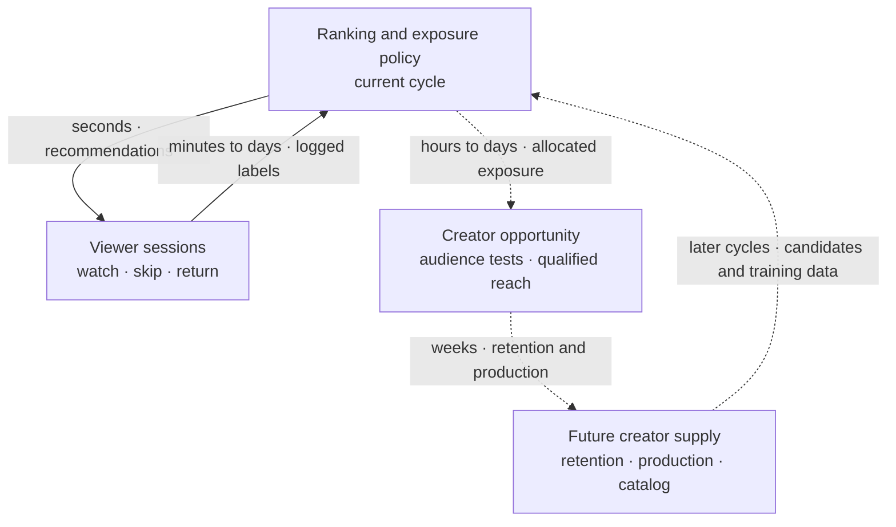
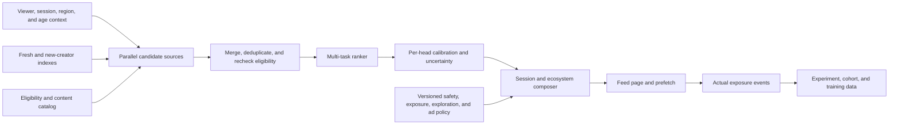

A senior-principal answer keeps product policy, causal evidence, technical mechanisms, and organizational authority coherent under pressure. The candidate should protect a two-sided ecosystem without hiding every conflict inside a ranking score.

> **Synthetic teaching example:** Every company, metric, result, and exchange below is invented. This is not a company transcript, hiring report, or claim about any real platform. Practice the decisions, then change the conditions and answer in your own words.

The mock has ten challenged turns. A watch-time gain appears first. Creator-retention damage arrives after the relevant cohort matures. The candidate must diagnose, contain, and govern the conflict without claiming that hypothetical evidence proves real career scope.

## How to use this mock

Pause after each interviewer challenge. Give a two-minute response before reading the candidate answer.

Then compare six questions:

1. Did the candidate answer the new condition?
2. Did the answer preserve the objective hierarchy?
3. Did it include a technical mechanism?
4. Did it separate evidence from policy judgment?
5. Did it name an owner and a reversible action?
6. Did its scope match staff, principal, or senior principal?

Use the annotations to inspect reasoning. Do not memorize the response wording. A copied answer often fails when the interviewer changes one assumption.

## Synthetic scenario

ClipStream has 600 million monthly viewers, 18 million active creators, and a growing advertising business. Viewers swipe through a personalized full-screen feed. Twenty million videos arrive each day.

The current feed uses several retrieval sources, a multi-task ranker, and a rule-based list composer. Product leadership asks for more daily watch time without weakening content quality or creator supply.

A new model wins a two-week viewer A/B test. Daily watch time rises 5.2 percent, rapid skips fall 1.1 percent, and next-day return rises 0.4 percent. The team expands from 10 percent to 80 percent of viewers.

Eight weeks later, mature creator cohorts show damage. Thirty-day retention among new creators falls 12 percent relative. The fraction reaching 10,000 qualified viewers falls 15 percent. The top 1 percent of creators gain seven points of impression share.

The candidate must address both periods. The later result does not erase the viewer gain. The earlier viewer gain does not erase delayed creator damage.

**Learning objective:** Trace how one ranking policy creates an immediate viewer-feedback loop and a delayed creator-supply loop, so evidence from the first loop does not settle the second.

<!-- visual:ecosystem-delayed-feedback-loop -->

<strong>Read it this way:</strong> follow the solid two-edge viewer loop first: a short A/B test can measure session responses quickly. Then follow the dashed creator path back to policy: exposure changes retention and production over weeks, which changes later candidates and training data. The 5.2 percent watch-time gain closes the fast loop; it cannot close the delayed loop. Original schematic informed by <a href="https://arxiv.org/abs/1710.11214">Chaney et al. on recommender feedback</a> and the <a href="https://doi.org/10.1007/s11257-019-09256-1">multistakeholder recommendation survey</a>.

## Scorecard

Score each dimension from 0 to 2 after every turn.

| Dimension | 0 | 1 | 2 |
| --- | --- | --- | --- |
| Framing | Treats ranking as item prediction | Names several participants | Defines a coupled attention and supply system |
| Objective hierarchy | Chooses watch time | Lists many metrics | Separates constraints, outcomes, guardrails, and diagnostics |
| Architecture | Lists models | Connects retrieval and ranking | Defines source, rank, composition, policy, and evidence boundaries |
| Technical depth | Uses broad terms | Explains one method | Preserves assumptions through bias, calibration, and serving probes |
| Creator system | Promises more reach | Adds creator metrics | Defines qualified opportunity, cold start, concentration, and supply response |
| Causal judgment | Trusts observed movement | Mentions confounding | Chooses estimands, designs, maturity, and interference limits |
| Operations | Says monitor and rollback | Names a prior model | Contains by manifest, traces mechanism, and repairs affected cohorts |
| Governance | Says align stakeholders | Names teams | Assigns metric, policy, experiment, and incident decision rights |
| Portfolio | Gives a roadmap | Orders projects | Prices opportunity cost, delegates owners, and defines reversal evidence |
| Communication | Gives a component tour | Uses a clear structure | Keeps decisions explicit while changing depth under challenge |

The score tracks this design answer. It does not establish that the candidate has delivered comparable outcomes in a real organization.

## Turn 1: frame the coupled system

**Interviewer:** Design recommendation for ClipStream. Leadership wants more watch time, and the feed must support a healthy creator ecosystem.

**Candidate:**

> I will treat the feed as an attention-allocation system with delayed supply effects. A viewer decision changes immediate satisfaction. The same exposure changes creator learning, production, earnings, and the next training set.
>
> Before choosing a model, I need four clarifications. What viewer outcome represents durable value? What creator transition is currently failing? Which content and advertiser constraints are hard? How long can we wait before declaring an ecosystem result mature?
>
> I will assume the primary viewer outcome is incremental satisfied active days over 28 days. New creators need qualified audience tests, not guaranteed reach. Safety, age policy, privacy, and severe brand-safety rules are hard constraints. Creator retention matures after 30 days.
>
> My design will separate prediction, exposure policy, and governance. That lets a model improve response estimates without silently changing who may receive attention or which guardrail can be traded away.

### Annotation

The candidate defines a causal system before drawing architecture. The response identifies two time scales and separates qualified opportunity from equal distribution.

The assumption block keeps the interview moving. It gives the interviewer clear points to correct.

**Level signal:** principal framing. Senior-principal evidence has not appeared because no portfolio or delegated authority choice exists yet.

**Score movement:** Framing moves from 0 to 2. Objective hierarchy moves from 0 to 1. Communication moves from 0 to 1.

### Weak alternative

> I would build a two-tower model for retrieval and a transformer for ranking. We can optimize watch time while adding creator diversity as a secondary feature.

This is technically plausible, but it treats creator health as an item feature. It never defines durable viewer value, qualified creator opportunity, or policy authority.

### Retry drill

Answer the opening in 90 seconds. Name both feedback directions, one maturity delay, one hard constraint, and one assumption you need the interviewer to confirm.

## Turn 2: reject the request for one north-star score

**Interviewer:** The chief product officer wants one number. Teams move slowly when every launch has a committee and twenty metrics. What score do you optimize?

**Candidate:**

> I would give the company one primary viewer decision metric for a defined horizon, but I would not put every policy conflict into one scalar. The hierarchy is more useful than a dashboard vote.
>
> First, legal and severe safety constraints block ineligible exposure. Second, viewer, creator, advertiser, and reliability guardrails define acceptable operation. Third, the product optimizes incremental satisfied active days within those bounds. Model metrics explain movement.
>
> For creator health, I would use a small contract: first qualified test coverage, transition to 10,000 qualified viewers, and 30-day activity across all eligible new creators. Retention by predeclared exposure band is a pathway diagnostic. Concentration becomes a guardrail when movement exceeds an approved range.
>
> The chief product officer owns the cross-domain tradeoff. Viewer, creator, trust, ads, and experiment owners each own their metric definition and can block invalid evidence. The policy record states which ranges were approved and when they reopen.

### Annotation

The candidate addresses the executive concern about indecision without offering a mathematically tidy fiction. One primary outcome can guide an experiment while hard constraints and guardrails retain independent authority.

The response also distinguishes concentration from an automatic moral verdict. A live event can produce legitimate temporary concentration. The team needs cohort and mechanism evidence.

**Level signal:** principal product judgment. The decision-right structure begins to support senior-principal scope.

**Score movement:** Objective hierarchy moves from 1 to 2. Governance moves from 0 to 1. Communication moves from 1 to 2.

### Weak alternative

> I would optimize a weighted score with 70 percent watch time, 20 percent creator diversity, and 10 percent safety. Leadership can tune the weights each quarter.

The percentages lack common units, causal interpretation, and policy authority. Severe safety events can disappear inside average watch gains. Quarterly weight changes also make historical comparisons unstable.

### Retry drill

Take four conflicting metrics. Classify each as a hard constraint, guardrail, primary outcome, or diagnostic. Name who may change its threshold and what evidence they need.

## Turn 3: draw the request path and ownership boundary

**Interviewer:** Fine. Show the architecture. You have 120 milliseconds at the 99th percentile and twenty million new videos each day.

**Candidate:**

> I would use source-aware retrieval, calibrated multi-task ranking, and constrained session composition. New supply must have a route that does not depend on prior creator exposure.

> Candidate sources include personalized embeddings, recent sequence continuation, follows, content matching, fresh uploads, new creators, regional trends, and bounded exploration. Each source has a quota range, recall target, owner, and fallback.
>
> The ranker predicts qualified watch, duration, completion, rapid skip, save, share, follow, hide, report, survey response, and return. The composer enforces eligibility, creator repetition, topic fatigue, freshness, exploration budget, and ad-load constraints.
>
> Ranking science owns prediction and calibration. Creator product owns opportunity policy. Trust owns eligibility. Ads owns auction policy. Feed infrastructure owns latency and degradation. A deployment manifest binds compatible versions for rollback.

### Annotation

The diagram contains a fresh-content route and an evidence loop. It also places policy after prediction while rechecking eligibility before final exposure.

The candidate gives ownership with the architecture. This prevents the recommendation team from silently owning policy, creator economics, and ad allocation.

A deeper follow-up could ask for exact candidate counts or latency allocation. The current answer leaves room for that probe.

**Level signal:** strong principal architecture. The source contracts and manifest are staff-level mechanisms used inside a wider ownership choice.

**Score movement:** Architecture moves from 0 to 2. Creator system moves from 0 to 1. Operations moves from 0 to 1. Governance remains 1.

### Weak alternative

> I would retrieve 10,000 videos with approximate nearest neighbors, score them with a large transformer, and apply a diversity re-ranker. We can cache user embeddings to meet latency.

This path can serve traffic, but it has no dedicated route for new supply, no policy boundary, no source degradation, and no full-manifest rollback.

### Retry drill

Draw the serving path in eight boxes or fewer. For each box, state its owner, latency budget, fallback, and one version needed for reconstruction.

## Turn 4: defend calibration and exposure correction

**Interviewer:** Your watch head is accurate offline. Why spend time on calibration and propensities when the online test will decide?

**Candidate:**

> Offline accuracy does not make task heads comparable. Watch, report, survey, and return labels have different prevalence, sampling, and maturity. I would calibrate each decision-facing head on deployment-like data by duration, region, traffic source, and cold-start state where support allows.
>
> I would also log the candidate set, retrieval source, final position, actual exposure, and assignment probability. The current policy chose which videos earned labels. Raw engagement therefore carries exposure and position bias.
>
> For supported policy changes, inverse propensity or doubly robust estimates can improve offline comparison. I would report effective sample size and weight tails. A feed slate has interactions, so an item-factorized estimator needs validation against randomized traffic.
>
> The online test remains authoritative for its estimand. It does not repair invalid logging, explain the mechanism, or estimate every policy we did not randomize. Calibration helps composition interpret estimates, while propensities support diagnosis and limited counterfactual work.

### Annotation

The candidate gives different jobs to calibration, counterfactual evaluation, and online experiments. None replaces the others.

The answer also states support and slate-interaction limits. This avoids presenting inverse propensity scoring as a universal answer.

**Level signal:** retained technical depth. The candidate can move from policy framing into statistical assumptions.

**Score movement:** Technical depth moves from 0 to 2. Causal judgment moves from 0 to 1.

### Weak alternative

> A/B tests remove bias, so I would focus on ranking AUC and online watch time. Calibration matters only if the score is shown to users.

Randomization estimates a defined treatment effect when the test is valid. It does not make raw task outputs comparable inside the composer. It also does not reveal outcomes for unsupported actions.

### Retry drill

Explain calibration, position bias, and experiment randomization without treating them as synonyms. Give one failure each method can detect and one limit it retains.

## Turn 5: allocate creator cold-start exploration

**Interviewer:** New creators say the system never gives them a chance. Product proposes reserving 20 percent of impressions for new accounts. Do you approve it?

**Candidate:**

> I would not approve a global 20 percent reserve without audience-fit and risk evidence. I would guarantee an eligible learning path, then estimate the budget response.
>
> A new upload passes technical and policy checks, receives multimodal content features, and enters a content-matched test pool. The controller selects a small relevant audience under a logged propensity. The item can expand through several evidence stages if qualified watch, negative feedback, and integrity checks remain within calibrated ranges.
>
> I would measure the fraction of eligible new creators receiving a test within six hours, the time to enough evidence, transition across reach bands, and later production. Viewer rapid skips, reports, survey quality, and session abandonment constrain the budget.
>
> I would randomize several approved exploration rates across clusters or viewer cohorts. Viewer assignment identifies immediate viewer cost. Creator clusters or saturation variation give better supply evidence. The result should estimate a response curve, not only compare zero with 20 percent.

### Annotation

The candidate replaces an arbitrary global reserve with a qualified test contract. The response preserves a creator opportunity floor without promising distribution independent of content or audience.

The proposed parameter experiment gives leadership more useful evidence than a binary test. The candidate still needs to account for creator spillovers, which appears in the next causal challenge.

**Level signal:** principal ecosystem design with staff-level exploration mechanics.

**Score movement:** Creator system moves from 1 to 2. Causal judgment remains 1. Portfolio moves from 0 to 1 because the candidate prices an exploration budget.

### Weak alternative

> I would boost every new creator until they get 10,000 impressions. After that, normal ranking can take over.

The threshold ignores audience fit, category scale, safety, and information quality. It can create poor viewer sessions and teach creators from irrelevant exposure.

### Retry drill

Design a cold-start ladder with four stages. For each stage, state eligibility, audience selection, exposure cap, expansion evidence, and stop condition.

## Turn 6: interpret the short-term watch-time win

**Interviewer:** The new ranker completes a two-week viewer test. Watch time rises 5.2 percent, rapid skips fall 1.1 percent, and next-day return rises 0.4 percent. No safety guardrail moves. Do you ship?

**Candidate:**

> I would ship only to the next staged boundary. The viewer result is useful, but the experiment has not matured creator retention or supply response.
>
> First I would validate assignment, actual exposure, sample ratios, latency, and model-policy compatibility. I would inspect whether the gain comes from broader qualified watches, longer videos, deeper sessions, or repeated high-propensity creators.
>
> If those checks pass, I would expand from 10 percent to perhaps 30 percent while preserving a stable control. I would freeze unrelated creator and moderation policy changes for the diagnostic window where practical.
>
> The release board should state what we know now and what remains open. Viewer short-horizon evidence supports cautious expansion. New-creator reach transitions, 28-day viewer satisfaction, creator retention, category supply, and advertiser effects remain immature.
>
> I would predeclare the mature review date and guardrail margins. Broad global rollout waits unless leadership explicitly accepts that unresolved risk through the policy process.

### Annotation

The candidate does not dismiss a clear product win. The answer gives it bounded authority and preserves later identification.

A stable control becomes valuable once supply feedback and retraining begin. Freezing every concurrent change may be impossible, so the candidate says where practical rather than promising laboratory conditions.

The candidate could mention creator-cluster contamination more directly. The score keeps causal judgment below its maximum for now.

**Level signal:** principal launch judgment. The candidate manages evidence horizons rather than treating launch as a binary event.

**Score movement:** Causal judgment stays 1. Operations moves from 1 to 2. Portfolio stays 1.

### Weak alternative

> All three viewer metrics improved and no guardrail failed, so I would launch to 100 percent. We can watch creator metrics after launch and tune a diversity weight if needed.

This discards the control before delayed effects mature. It also assumes a later score change can repair an unidentified mechanism.

### Retry drill

Build a maturity board with hour, week, month, and quarter rows. For each row, list evidence available, rollout authority, and one reason to stop.

## Turn 7: respond when creator damage matures

**Interviewer:** The team ignored your staged recommendation and expanded to 80 percent. Eight weeks later, 8,000 mature new-creator records show 30-day retention down 12 percent relative, with a 95 percent interval from 8 to 16 percent down. The approved guardrail allowed at most 5 percent down. The fraction reaching 10,000 qualified viewers is down 15 percent. The top 1 percent gain seven points of impression share. What happened?

**Candidate:**

> Those movements are serious, but they do not prove one mechanism. I would open an ecosystem incident, stop further expansion, preserve logs, and validate the metric contract before changing ranking again.
>
> I would trace the allocation path in order. Did fresh and new-creator sources return fewer candidates? Did the ranker favor established-account history? Did a calibration change make sparse new-item predictions conservative? Did the composer lose source floors? Did trend expansion or ads displace tests?
>
> I would compare exposure transitions and creator survival by treatment dose, category, language, region, acquisition channel, and moderation state. I would also check concurrent creator incentives, acquisition mix, and policy changes.
>
> The original viewer randomization has interference. Creators exposed to treatment viewers may change production for everyone. I would use the retained control and any cluster or saturation variation to bound the effect. Raw creator exposure dose remains diagnostic because predicted quality affects dose. I would not claim exact creator causality from the viewer test alone.
>
> If the manifest trace shows the new ranker suppressed cold-start candidates across most cells, that is enough operational evidence to contain. A precise long-run causal estimate can follow after known behavior is restored.

### Annotation

The candidate treats delayed ecosystem damage as an incident while keeping causal claims calibrated. Operational containment does not require courtroom-level proof when a reversible launch aligns with a plausible mechanism.

The trace starts at retrieval rather than assuming ranking caused every exposure change. This matters because a source outage or composer policy can produce the same aggregate pattern.

Interference appears explicitly. The candidate states what the original viewer experiment can and cannot identify.

**Level signal:** strong principal response with senior-principal potential. The candidate coordinates product, causal, and operational reasoning.

**Score movement:** Causal judgment moves from 1 to 2. Operations remains 2. Framing remains 2.

### Weak alternative

> The model became too exploitative. I would add a creator-diversity penalty and increase exploration until retention returns to baseline.

The diagnosis may be right, but the response changes two policies before locating the failure. It can mask a candidate-source bug or expose more low-quality inventory.

### Retry drill

Take one aggregate ecosystem regression. Write a five-stage fault tree across retrieval, ranking, calibration, composition, and policy. Add one confounder outside recommendation.

## Turn 8: contain, roll back, and repair

**Interviewer:** The viewer gain is worth tens of millions in annual revenue. The chief product officer refuses a full rollback. Give a narrower response by tomorrow.

**Candidate:**

> I would ask incident command for authority to restore the affected allocation path, not erase every viewer gain. The deployment manifest lets us isolate source, ranker, calibrator, composer, and policy versions.
>
> Suppose the trace shows an established-creator history feature shifted rank scores, while retrieval and moderation stayed stable. I would disable that feature or restore the prior ranker for cold-start and low-history inventory. Established inventory can remain on the new model if its viewer and creator guardrails hold.
>
> I would also restore the previous new-creator source floor and expansion thresholds. I would not add a new boost beyond the known prior policy during containment.
>
> The repair ships as a small canary with four checks: new-creator test coverage recovers, viewer rapid skips remain bounded, exposure concentration moves toward the prior range, and latency stays healthy. The stable control remains intact.
>
> Affected creator cohorts may need a separate recovery test. We can re-enter eligible videos into matched test pools, but we should cap replay and avoid flooding viewers. Creator communication should acknowledge distribution instability without promising a reach amount.

### Annotation

The candidate negotiates with business value rather than presenting rollback as all or nothing. The manifest makes narrow containment credible.

The response separates restoration from compensation. Restoring known policy reduces uncertainty. Replaying affected inventory is a new action with its own viewer and fairness effects.

A weaker candidate might agree to keep the full release because revenue is large. Another weak response might demand a global rollback without using component evidence.

**Level signal:** principal incident leadership. The candidate preserves product value while controlling a delayed externality.

**Score movement:** Operations remains 2. Governance moves from 1 to 2 because incident authority and product decision rights are explicit. Portfolio moves from 1 to 2.

### Weak alternative

> Keep the new model because the revenue gain is proven. Add a five percent new-creator boost and monitor retention next month.

Revenue is estimated under a damaged allocation policy. The boost has no diagnosed target, and another month creates more affected cohorts.

### Retry drill

Given a full deployment manifest, practice three rollback scopes: one feature, one inventory cohort, and one policy. State what evidence makes each scope safe.

## Turn 9: redesign governance after the failure

**Interviewer:** Several teams saw the early creator warnings, but nobody could stop expansion. Who owns the decision now?

**Candidate:**

> I would separate metric authority, launch authority, and incident authority.
>
> Creator ecosystem science owns the retention and opportunity contracts, maturity rules, and validity objections. Feed product owns the primary viewer outcome. Trust owns safety eligibility. Ads owns auction and brand-safety contracts. Experimentation owns assignment and exposure validity. Infrastructure owns serving health.
>
> The chief product officer remains accountable for approved cross-domain tradeoffs. That role cannot redefine a creator metric during a launch review or waive a severe safety rule. Material exceptions need a written decision, expiration, and mature review date.
>
> Incident command can stop or narrow exposure when a predeclared threshold breaches. It does not need a fresh business negotiation for every request. Restoration requires the affected metric owners and the system owner to confirm evidence health.
>
> I would add a release ledger. It binds model, policy, guardrails, maturity schedule, owner acknowledgments, and rollback scope. Monthly reviews inspect mature cohorts. Quarterly reviews can change objectives or investment, but daily launch meetings operate within approved policy.

### Annotation

The candidate fixes an authority failure rather than asking teams to communicate better. Domain experts own metric meaning. A cross-domain executive owns accepted tradeoffs. Incident command owns urgent containment.

The design avoids a central technical council that approves every model release. Routine launches stay fast inside reviewed bounds.

**Level signal:** senior-principal organizational design. The candidate creates decision rights that several principal and staff owners can operate.

**Score movement:** Governance remains 2. Portfolio remains 2. Senior-principal evidence strengthens through durable authority, though the scorecard records portfolio rather than title.

### Weak alternative

> Create a weekly ranking council with representatives from product, creators, safety, ads, and infrastructure. Require unanimous approval for launches.

A council can share information, but unanimous approval creates delay and blurred accountability. It also does not define who may stop an active incident.

### Retry drill

For one launch, write four columns: metric definition owner, tradeoff owner, incident owner, and restoration owner. Ensure no committee owns all four.

## Turn 10: change the business model and portfolio

**Interviewer:** Six months later, three conditions change. Half of uploads are generated by models. A competitor pays creators for raw views. A regulator requires an explanation when reach drops sharply. What do you fund, stop, and delegate?

**Candidate:**

> These changes weaken the original assumptions about supply cost, authenticity, and creator response. I would reopen the objective and portfolio review rather than append three ranking features.
>
> I would fund three directions. First, provenance, originality, and coordinated-network integrity become part of eligibility and trend expansion. Second, creator audience formation needs causal measurement beyond raw upload retention because cheap generated supply can inflate activity. Third, exposure explanations need stable reason codes, policy records, and an appeal path.
>
> I would slow a planned larger ranker if its expected gain depends mainly on richer engagement history. That feature family may amplify generated volume and established accounts. I would move some compute and science capacity into content understanding, supply economics, and creator-cluster experiments.
>
> I would delegate integrity architecture to one principal owner, creator causal measurement to another, and exposure explanation contracts to a third. Shared event identity, policy versions, and deployment manifests constrain their interfaces. Each owner gets a quarterly evidence checkpoint and authority within an approved budget.
>
> I would stop any creator incentive that pays raw views without quality and invalid-traffic correction. I would preserve local regional implementation where regulation differs. The durable company rule is that attention decisions remain reconstructable, policy constraints remain explicit, and participant effects use mature evidence.
>
> If generated content proves high quality, viewers remain satisfied, and opportunity broadens without integrity damage, the portfolio can expand it. If provenance cannot control abuse or human creator supply collapses in valuable categories, we narrow distribution and revisit incentives.

### Annotation

The candidate changes investment, not only model weights. One planned ranker loses priority because the environment changed its expected value.

The response delegates real technical domains to principal owners while preserving shared contracts. It also gives evidence that could support either expansion or restriction of generated content.

The regulatory response is operational. Reason codes and appeal records must exist before an explanation promise is credible.

**Level signal:** senior-principal scope. The candidate coordinates several portfolios, retains reversibility, delegates authority, and responds to external change without claiming ownership of every implementation.

**Score movement:** Portfolio remains 2. Creator system remains 2. Governance remains 2. The answer reaches the intended upper-IC pattern.

### Weak alternative

> Add an AI-generated-content penalty, increase creator payments to match the competitor, and use a language model to explain ranking changes.

This acts before measuring content quality or incentive abuse. A generated explanation without decision evidence can mislead creators and regulators.

### Retry drill

Change three external assumptions in one design. Remove one planned project, fund two new capabilities, delegate three owners, and state evidence that reverses each choice.

## Final scorecard for the synthetic answer

| Dimension | Final score | Evidence from the mock | Remaining gap |
| --- | ---: | --- | --- |
| Framing | 2 | Coupled attention, supply, and delayed outcomes | Could quantify advertiser feedback earlier |
| Objective hierarchy | 2 | Separate constraints, guardrails, primary outcome, and diagnostics | Exact margins remain case-specific |
| Architecture | 2 | Source-aware retrieval, calibrated ranking, composition, and manifest | Candidate counts and storage scale were not probed |
| Technical depth | 2 | Calibration, propensity, slate limits, cold-start control | No detailed training-loss derivation |
| Creator system | 2 | Qualified tests, opportunity transitions, concentration, and retention | Creator earnings model remains unspecified |
| Causal judgment | 2 | Maturity, interference, saturation, support, and bounded claims | Network spillover may still defeat clean estimation |
| Operations | 2 | Incident opening, narrow rollback, canary, and cohort repair | Recovery communication needs legal review |
| Governance | 2 | Separate metric, tradeoff, incident, and restoration authority | Real company reporting lines may constrain this model |
| Portfolio | 2 | Reallocated investment, stopped work, delegated principal owners | Budget size and staffing were assumed |
| Communication | 2 | Explicit decisions under each changed condition | A live interview may require shorter responses |

The reference answer scores 20 out of 20 for teaching purposes. That does not imply a real candidate should sound perfect. Interviewers often prefer a clear tradeoff and a defensible omission over a compressed tour of every section.

## Score movement across turns

| Turn | New evidence | Cumulative interpretation |
| --- | --- | --- |
| 1 | Coupled-system framing | Strong principal opening |
| 2 | Objective and decision hierarchy | Principal product judgment |
| 3 | Architecture and ownership | Principal system boundary |
| 4 | Calibration and counterfactual limits | Retained staff-level depth |
| 5 | Cold-start exploration policy | Ecosystem mechanism |
| 6 | Staged response to early win | Launch judgment under delayed evidence |
| 7 | Causal diagnosis of mature damage | Strong principal incident reasoning |
| 8 | Narrow containment and repair | Cross-domain operating judgment |
| 9 | Durable decision rights | Senior-principal authority design |
| 10 | Portfolio change and delegated leaders | Senior-principal strategy pattern |

Score movement should follow demonstrated decisions. Mentioning company scale in turn one does not earn senior-principal credit. Delegated authority, portfolio sacrifice, external adaptation, and reversal appear only in later turns.

## Staff, principal, and senior-principal calibration

### Strong staff version

A strong staff candidate can give an excellent answer by focusing on one feed path across several teams.

Expected evidence includes:

- source-aware retrieval and fresh-content indexing;
- multi-task loss balance and calibration;
- event-time data and label maturity;
- propensity logging and limited counterfactual evaluation;
- session-aware list composition;
- cold-start experiments;
- latency, degradation, and manifest rollback;
- coordination with creator, moderation, and infrastructure partners.

The staff candidate does not need to redesign company governance. A precise technical response with clear partner boundaries can score strongly.

### Principal version

A principal candidate should add choices across organizations and product horizons.

Expected evidence includes:

- an objective hierarchy across viewer, creator, ads, safety, and platform health;
- a decision on which exposure rules belong outside the ranker;
- investment ordering among models, exploration, labels, integrity, and serving;
- causal strategy for interference and delayed supply effects;
- ownership across product and technical domains;
- a repair or reversal decision after the creator regression;
- development of staff-level owners for major mechanisms.

Principal scope becomes visible when the candidate declines one attractive investment or limits a launch to protect a wider product contract.

### Senior-principal version

A senior-principal candidate should coordinate several principal-owned directions without becoming their manager or approval queue.

Expected evidence includes:

- durable rules above specific models;
- delegated decision rights for ranking, creator measurement, integrity, ads, and infrastructure;
- multi-year portfolio movement after business, regulatory, or supply change;
- standards for exposure evidence and policy versions across products or regions;
- succession and an operating review another leader can run;
- conditions that reopen centralization, incentives, and model strategy;
- retained depth in one disputed mechanism.

Titles vary widely. Some employers call this scope principal, distinguished, or fellow. Calibrate against expected authority and evidence rather than a title translation.

## What the hypothetical evidence cannot prove

This mock contains invented numbers selected to exercise reasoning. They cannot prove that the proposed architecture would improve a real platform.

The scenario does not establish:

- the causal effect of exposure on creator retention;
- the correct creator exploration budget;
- whether concentration is harmful in a specific market;
- the relationship between watch time and viewer satisfaction;
- the quality of generated content;
- advertiser response to the ranking change;
- legal sufficiency of the explanation system;
- implementation cost or staffing capacity.

The candidate should label assumptions and ask for local baselines. In a real interview, uncertainty is a reason to design evidence and reversibility. It is not permission to avoid a decision.

The mock also cannot prove senior-principal career evidence. A hiring loop still needs real examples showing:

- repeated portfolio choices across years;
- other technical leaders carrying delegated domains;
- a major direction changed after contrary evidence;
- a standard surviving organization or market change;
- measurable participant and business outcomes;
- current technical depth in the target domain.

Hypothetical system design tests judgment. Project and behavioral rounds test whether the candidate has exercised comparable judgment with real constraints.

## Common response failures

### Component tour

The candidate lists embedding stores, feature stores, transformers, and caches. No participant objective or policy boundary appears.

**Repair:** state what attention allocation changes and who owns each constraint before drawing the path.

### Metric democracy

Every metric gets equal status, so no launch decision can be made.

**Repair:** separate hard constraints, guardrails, one primary outcome for the test, and diagnostics.

### Scalar policy

The candidate adds every concern to one score and promises to tune weights.

**Repair:** keep severe constraints and approved exposure ranges in a versioned composer policy with named owners.

### Creator charity framing

New creators receive reach because it sounds fair, without audience fit or quality checks.

**Repair:** define a qualified learning opportunity, logged propensity, viewer budget, and expansion ladder.

### A/B test certainty

The candidate treats viewer randomization as proof of creator supply effects.

**Repair:** state the estimand, interference path, maturity delay, and need for cluster, saturation, or retained-control evidence.

### Rollback theater

The candidate says rollback but cannot name the compatible unit.

**Repair:** bind retrieval, ranker, calibration, composer, policy, and features in a deployment manifest. Practice a component-scoped restoration.

### Committee governance

The candidate creates a council whenever metrics conflict.

**Repair:** assign metric definition, accepted tradeoff, incident stop, and restoration authority to explicit roles.

### Scope inflation

The candidate calls a ranking-model launch company strategy.

**Repair:** show a portfolio sacrifice, delegated principal owners, external change, and evidence that reverses direction.

## Observer follow-up bank

Use these probes when the candidate gives a broad answer.

### Objective probes

- What exact viewer outcome is primary for this test?
- Which creator metric can block expansion?
- Can revenue compensate for a safety regression?
- Who may change the exploration budget?
- When does a concentration increase become actionable?

### Technical probes

- How does a new upload enter retrieval within five minutes?
- Which task heads require calibration?
- What is logged for inverse propensity scoring?
- How do you prevent prior exposure from dominating creator features?
- Which list constraint runs when session state is missing?
- What happens if eligibility changes after prefetch?

### Causal probes

- What is the randomization unit?
- Which creators appear in both treatment and control supply?
- When is the creator label mature?
- What does a saturation experiment estimate?
- Which result remains unidentified?
- What concurrent policy could explain the movement?

### Operating probes

- Which manifest version is restored?
- Can you disable one candidate source without replacing the ranker?
- Who can stop a creator guardrail incident?
- How quickly does a moderation removal reach caches?
- What evidence allows restoration?
- How do affected creators receive another test without flooding viewers?

### Scope probes

- Which project loses funding?
- Which principal owner gets independent authority?
- What remains local by region?
- What condition makes you abandon the shared policy?
- How does the system operate after you leave?
- Which mechanism can you still defend at implementation depth?

## Spaced transfer plan

The goal is transfer to new conditions, not recall of this transcript.

### Attempt 1: cold 60-minute answer

Use the original scenario without reading the candidate responses. Record the answer and score every dimension.

Choose only three repairs:

- one technical mechanism;
- one causal or metric issue;
- one scope or authority issue.

Do not rewrite the whole answer after one attempt.

### Attempt 2: mechanism repair after one day

Spend fifteen minutes on the lowest technical dimension. Draw one trace end to end.

Possible traces include:

- new upload through content-based retrieval and a qualified test;
- impression through propensity logging and mature label join;
- policy removal through index, cache, and prefetch invalidation;
- model timeout through fallback and decision evidence;
- ranker rollback through the deployment manifest.

Explain assumptions aloud. Stop when every state transition and owner is clear.

### Attempt 3: causal transfer after three days

Repeat the case with creator-level treatment instead of viewer-level treatment. Decide whether to use creator clusters, markets, switchbacks, saturation, or another design.

State:

- estimand;
- randomization unit;
- exposure definition;
- interference path;
- maturity horizon;
- emergency stop rule;
- remaining unidentified effect.

Compare the new design with the original viewer test.

### Attempt 4: business transfer after one week

Remove advertising and introduce subscriptions. Creators receive a share of subscription revenue based on qualified viewing and member retention.

Rebuild the objective hierarchy. Decide which metrics disappear, which become primary, and which incentive loops become more dangerous.

### Attempt 5: policy transfer after two weeks

Add regional chronological-feed regulation, stricter youth policy, and a creator right to appeal reach restrictions.

Keep shared event identity and evidence contracts. Let policy and serving vary where required. Explain who owns conflicts between global and regional rules.

### Attempt 6: evidence transfer after one month

Use a real project from the candidate's history. Map its facts to the scorecard without borrowing ClipStream claims.

For each strong dimension, provide:

- the decision personally made;
- authority actually held;
- partners and dissent;
- technical mechanism;
- measured outcome;
- failure or surprise;
- later owner;
- evidence that changed the direction.

If the real story lacks creator economics, use its actual two-sided or cross-team constraint. Do not invent a marketplace analogy.

## Changed-condition retry set

Choose one condition at random during each practice session.

1. The product becomes subscription-only and removes ads.
2. New creators grow, but high-quality educational supply declines.
3. A region mandates a user-selectable chronological feed.
4. Teen users show higher watch time and worse survey regret.
5. A celebrity event doubles legitimate concentration for one week.
6. The fresh-content index fails during a major cultural event.
7. Creator appeals restore 30 percent of reach restrictions.
8. A large market has weak content-moderation coverage.
9. Generated videos reach 70 percent of uploads.
10. The competitor guarantees every creator 20,000 impressions.
11. The new model reduces reports but increases silent hides.
12. Viewer retention rises while satisfied-session surveys fall.
13. Creator retention recovers, but advertiser brand safety worsens.
14. A privacy rule removes cross-session viewer histories.
15. Serving cost doubles because the ranker uses a larger sequence model.
16. Policy propagation takes twenty minutes during an incident.
17. A creator cohort has no clean control because every video can go viral.
18. Product leadership wants to remove the stable holdout.
19. A new acquisition changes creator identity and ownership rules.
20. The senior-principal sponsor leaves during the repair program.

For every retry, make one architecture change, one metric change, one ownership change, and one portfolio change. Name what remains stable and what evidence could reverse the new choice.

## Final self-review checklist

Before using an ecosystem answer in an interview, verify that it includes:

- a pyramid opening with the product and ecosystem decision;
- separate viewer, creator, advertiser, and platform contracts;
- hard safety and policy constraints outside average utility;
- candidate sources for fresh and new-creator content;
- multi-task calibration and exposure bias;
- session-aware constrained composition;
- qualified cold-start exploration with propensities;
- concentration and virality mechanisms;
- point-in-time data and mature labels;
- interference and long-horizon experiment limits;
- leading indicators tied to mature cohorts;
- manifest rollback and incident authority;
- metric and policy ownership;
- a staff mechanism, principal boundary, and senior-principal portfolio choice;
- limits on what hypothetical evidence can establish;
- one changed condition answered without repeating the original script.

A complete answer can still be concise. Choose two technical mechanisms for depth and state where the remaining sections fit. Clarity about an omitted detail is stronger than hurried coverage without a decision.

---

*Related: [design short-form video recommendation for ecosystem health](/questions/design-short-form-video-ecosystem/), [choose metrics for an ML product](/questions/choose-ml-product-metrics/), [design an A/B test for a new ML model](/questions/design-ml-ab-test/), [position bias and counterfactual ranking](/concepts/position-bias-counterfactual-learning-to-rank/), and [senior through senior-principal ML scope](/guides/l5-vs-l6-faang-ml/).*
