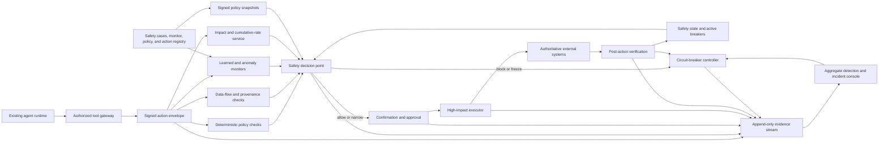

> *Asked in: agent safety architecture, ML system design, control, reliability, and principal technical-strategy rounds.*

A basic answer validates tool arguments and adds a block rule. A senior answer combines pre-action checks, observed-outcome checks, rate limits, monitors, evidence, and recovery. A staff answer operates those controls across several products without making one team approve every action.

A principal answer chooses the shared safety boundary, calibrates the false-allow and false-block frontier, separates product and control authority, and funds incident readiness. A senior-principal answer defines safety doctrine across business units while preserving local action semantics, independent evidence, succession, and credible authority reduction.

Assume identity, delegated permissions, versioned tool contracts, and durable agent execution already exist. Add an independent safety control plane around high-impact actions. It can narrow, pause, challenge, or revoke granted authority. It cannot expand authority, replace product evaluation, or make a risky action safe through a monitor score alone.

## The prompt

A company operates agents in finance operations, customer accounts, internal infrastructure, healthcare administration, and enterprise support. Product teams already use a governed agent platform. Every tool call has a workload identity, user or service delegation, typed arguments, an idempotency key, and an audit event.

The existing platform prevents calls without permission. It does not catch every harmful authorized action. One agent recently applied a valid account operation to a much larger population than its product owner intended. Each call satisfied static authorization. The dangerous pattern appeared in the arguments, cumulative rate, and downstream state.

A second product used a learned monitor before sensitive actions. The agent and monitor came from closely related model training. Both accepted the same unusual plan. The product team had treated monitor agreement as independent evidence.

Design a runtime safety control plane for already-governed high-impact actions. It must support deterministic policy, learned monitors, human escalation, circuit breakers, tamper-resistant evidence, degraded operation, incident command, red-team evaluation, and staged deployment. It must not become the general agent runtime or the enterprise tool platform.

## State the boundary first

Place an independent decision point between an authorized action proposal and the high-impact executor. Feed it structured action context, recent trajectory facts, cumulative impact, data-flow labels, product policy, and current safety state.

The control plane returns one of a small set of decisions:

- allow under the existing authority;
- allow with narrower arguments or lower limits;
- require fresh user confirmation;
- require a qualified human approval;
- delay for more evidence or an authoritative state read;
- route to a safer fallback;
- block this action;
- freeze the execution, agent version, tool action, tenant, or broader class.

The control never turns a denied or absent permission into an allow. The existing authorization layer runs first or as a required input. Safety policy can only preserve or reduce the permitted action envelope.

The design has three enforcement times:

1. **Pre-action:** evaluate before an external effect can occur.
2. **Post-action:** verify authoritative outcome and detect divergence after dispatch.
3. **Aggregate:** observe rates, sequences, cohorts, and incidents across actions.

Deterministic controls own enforceable invariants. Learned monitors add semantic and anomaly evidence where rules are incomplete. Human reviewers decide cases that require contextual judgment. Circuit breakers reduce authority when local decisions no longer keep cumulative risk within bounds.

## Keep it distinct from the enterprise agent platform

The enterprise platform answers broad questions:

- Who is the user and agent workload?
- Which tool contract and permission apply?
- How is workflow state stored?
- How are retries reconciled?
- Which runtime, model, memory, and region are active?

The safety control plane answers narrower runtime questions:

- Is this authorized proposal safe enough under current conditions?
- Do its arguments, data flows, rate, sequence, or observed effects violate an invariant?
- Has cumulative behavior crossed a product or portfolio limit?
- Which authority should be reduced now?
- Which independent evidence supports release, escalation, or recovery?

Do not rebuild agent planning, memory, tool discovery, or general orchestration here. Consume their signed events and contracts. Return enforceable safety decisions through a stable interface.

This boundary supports independent ownership. A product team can improve its agent runtime without replacing safety controls. The safety team can reduce authority without deploying new model weights or changing every product workflow.

## Clarify consequence, timing, and authority

Ask questions that change control behavior.

### Consequence

- Which actions move money, alter access, change medical or legal workflow, publish externally, delete data, or modify production systems?
- Which effects are reversible, compensatable, delayed, or irreversible?
- What is the harm unit: one account, one record, one dollar, one deployment, or a cumulative portfolio?
- Which actions become high impact only at certain arguments or rates?
- What downstream state proves that the intended outcome occurred?

### Execution

- Which actions are synchronous, asynchronous, batch, or multi-step?
- Can the executor perform a dry run or estimate impact?
- Does the tool support idempotency and authoritative status lookup?
- What latency can pre-action checks consume?
- Can an action be paused safely after dispatch?

### Evidence

- Which labels are deterministic and which require human or model judgment?
- How delayed are true harm outcomes?
- Can the team construct realistic counterfactual blocked cases?
- Which protected incidents, near misses, and simulations exist?
- What evidence must an auditor, customer, or regulator receive?

### Authority

- Who defines product invariants?
- Who owns the company safety floor?
- Who may approve a high-risk exception?
- Who can activate a circuit breaker?
- Who can restore authority after an incident?

### Operating scale

- How many action proposals arrive per second?
- Which products share tools, users, models, or data sources?
- What are peak rates during incidents or batch windows?
- How many human reviews can finish within the action deadline?
- What control-plane outage duration must the system tolerate?

Assume 40,000 total agent tool proposals per second. About 2,000 per second can alter consequential state. Fewer than 20 per second enter the highest-risk class. Most deterministic decisions need less than 30 milliseconds at p99. Selected learned checks may use 150 milliseconds or an asynchronous approval path.

Assume 25 product teams and 120 high-impact action types. Product owners define action semantics. A central safety-control team has ten engineers and three applied researchers. Security, reliability, compliance, and incident-response groups remain separate authorities.

## Define success without hiding trade-offs

Safety and usefulness need separate views. A system that blocks every action has few false allows and no product value.

### Safety outcomes

- unauthorized or invariant-violating effects that reached executors;
- severe harmful outcomes after apparently valid actions;
- cumulative impact beyond product or portfolio limits;
- actions allowed while required evidence was missing;
- monitor and policy bypasses;
- time from anomaly onset to authority reduction;
- blast radius before containment;
- recurrence after recovery.

### Usefulness outcomes

- valid actions completed automatically;
- valid actions delayed, narrowed, or blocked;
- added latency by action class;
- user abandonment after confirmation or escalation;
- product fallback success;
- review queue wait and expiration;
- manual work created by safety controls.

### Control quality

- false allow rate by severity, action, context, and attacker or failure family;
- false block rate by product task and user population;
- calibration of learned risk estimates;
- deterministic policy coverage;
- post-action detection delay;
- circuit-breaker precision and containment time;
- reviewer agreement and override outcomes.

### Operating quality

- decision-point availability and tail latency;
- signed-policy freshness;
- event loss, ordering gaps, and reconciliation lag;
- evidence completeness;
- degraded-mode entry and recovery time;
- drill success for revocation, failover, and forensics.

Do not combine these measures into one safety score. A small number of severe false allows can outweigh many harmless correct decisions. A high false-block rate can drive teams toward unsafe bypasses. Report frontiers and slices instead.

## Build a safety case for each action family

A safety case is a structured argument connecting claims, assumptions, controls, evidence, and remaining risk. It is more useful than a checklist because changed assumptions become visible.

```text
SafetyCase
  action_family
  consequence_model
  top_hazards[]
  safety_claims[]
  assumptions[]
  deterministic_invariants[]
  learned_monitor_roles[]
  human_decision_roles[]
  pre_action_controls[]
  post_action_controls[]
  circuit_breaker_scope
  degraded_mode
  evaluation_evidence[]
  incident_and_recovery_plan
  residual_risks[]
  owners_and_approvers[]
  review_trigger
  version
```

An example claim might state that one workflow cannot modify more than a bounded number of accounts without a fresh qualified approval. Evidence can include policy tests, impact-estimator validation, replay on historical traffic, fault injection, approval-path drills, and production shadow results.

Every claim should name assumptions. The impact estimator may depend on an up-to-date target count. The executor may need an atomic limit. The event stream may need bounded lag. If an assumption fails, the system narrows or removes authority rather than keeping the old claim silently.

### Hazard analysis

Start from harmful outcomes and work backward:

- action targets the wrong resource or population;
- amount, scope, or duration exceeds intent;
- individually valid actions become harmful in aggregate;
- untrusted data influences a sensitive argument;
- required confirmation does not match final arguments;
- action succeeds differently from the predicted effect;
- monitor and agent share a blind spot;
- evidence is missing or altered;
- control outage leaves broad authority active;
- human review becomes a routine rubber stamp.

Map each hazard to prevention, detection, containment, and recovery. One control can cover several hazards, but one correlated failure should not defeat every layer.

### Review triggers

Update the safety case after:

- a new action or materially changed argument schema;
- a model or monitor family change;
- a new data-flow path;
- a policy or regulatory change;
- a severe incident or near miss;
- a changed rate or population;
- evidence that calibration or reviewer behavior drifted;
- a control-plane architecture or vendor change.

A yearly review alone is too slow for active agent products. Use event-driven review plus a periodic confirmation cadence.

## Establish runtime safety invariants

1. **Safety controls cannot expand delegated authority.** An allow is valid only inside the existing permission envelope.
2. **Every high-impact proposal has a stable logical action ID.** Retries and monitor calls refer to the same proposed effect.
3. **Policy evaluates structured final arguments.** Free-form intent text cannot substitute for the exact target, amount, resource, and scope.
4. **User confirmation binds to what will execute.** Material argument changes require fresh confirmation.
5. **Cumulative limits apply across calls and retries.** Splitting an effect into smaller calls cannot evade a total bound.
6. **Untrusted data keeps provenance labels through argument construction.** A model cannot relabel retrieved or tool-supplied content as trusted policy.
7. **Learned monitors can reduce or request authority, never create it.** Their confidence does not override a deterministic deny.
8. **High-impact effects receive authoritative post-action verification.** A model's final statement is not completion evidence.
9. **Unknown external state stays unknown until reconciled.** It does not become failure and trigger an unsafe retry.
10. **Circuit breakers have bounded activation delay and tested scope.** Products cannot disable the company safety floor locally.
11. **Control-plane failure enters a declared degraded mode.** Stale or absent policy does not silently preserve broad action rights.
12. **Evidence is tamper-evident and privacy-limited.** Investigators can reconstruct decisions without turning logs into a new sensitive-data store.
13. **Restoring authority requires explicit recovery evidence.** Process restart alone does not clear an incident state.
14. **No learned monitor is treated as independent merely because it is a separate endpoint.** Training ancestry, data, provider, and objective affect correlation.

These invariants apply to the safety boundary. Product teams still need task-quality, fairness, user-experience, and domain evaluations.

The company safety floor is the subset no product can lower alone: controls cannot expand delegated authority; high-impact actions use typed final arguments; irreversible effects require authoritative verification; evidence is tamper-evident; and active breaker state remains independent from product deployment. Domain owners can add stricter constraints.

## Architecture



### Safety policy control plane

The control plane owns safety-case versions, invariant definitions, monitor and threshold versions, circuit-breaker state, rollout state, approval rules, and signed policy publication. It does not process every model token or own the product workflow.

### Distributed decision points

Decision points sit close to executors. They verify the action envelope, evaluate cached signed policy, query bounded state, call selected monitors, and return a decision. High-impact tools accept calls only from a decision point with valid evidence.

### Detection plane

A stream processor computes cross-action rates, sequences, cohort changes, monitor drift, denied-action patterns, and post-action divergence. It can request circuit-breaker activation under defined rules. Detection does not edit policy history.

### Evidence plane

An append-only stream captures proposals, facts used, decisions, approvals, dispatch, observed outcomes, breaker transitions, and operator actions. Sensitive payloads remain in classified stores. Evidence events contain protected references and digests.

### Independence boundary

Operate signing keys, policy publication, breaker authority, and evidence retention separately from product deployment credentials. A product release should not be able to rewrite its safety decision or erase the record that produced it.

## Define the action envelope

The action envelope is the stable interface between the existing platform and safety controls.

```text
ActionEnvelope
  logical_action_id
  execution_id
  tenant_and_region
  user_or_service_principal
  agent_workload_identity
  agent_model_and_runtime_versions
  model_release_manifest_ref
  tool_action_and_contract_version
  final_structured_arguments
  argument_provenance_labels
  purpose_and_product_context
  delegated_authority_ref
  confirmation_ref
  idempotency_key
  predicted_effect
  cumulative_impact_summary
  recent_action_summary
  requested_deadline
  policy_snapshot_hint
  envelope_signature
```

The envelope includes references rather than every raw prompt or document. A monitor can request limited evidence through an access-controlled interface. That interface enforces data region, purpose, and retention.

### Bind facts to versions

The decision records exact policy, monitor, feature, impact-estimator, data-label, and model-release versions. The release manifest links evaluation and training-data provenance from the governed data platform. A later policy change should not rewrite why an earlier call was allowed. Investigators need both the historical decision and the current assessment.

### Reject ambiguous arguments

High-impact actions should expose typed resources, units, scope, and preconditions. A target expressed only as free-form text cannot support deterministic controls. The gateway can require the product to resolve text into a previewable target set before safety evaluation.

### Predict and observe effect

The envelope can carry an estimated count, amount, changed fields, or resource set. The executor later reports the authoritative effect. Large differences become post-action anomalies and can activate a breaker before the next batch.

An estimate is never the final fact. It supports prevention and planning. Observed target state supports completion and incident scope.

## Put deterministic policy on enforceable facts

Deterministic controls are the primary layer for known high-impact invariants. They are testable, explainable, and resistant to changes in model wording.

Each rule records its assumption, evidence source, owner, review trigger, and last review. Deterministic execution does not make an outdated threshold correct. A changed product population, incident, or tool contract can reopen the rule.

### Schema and type checks

Validate required fields, units, ranges, enum values, resource types, target count, time windows, region, and contract version. Reject unknown fields for sensitive actions unless the schema explicitly permits them.

Canonicalize before policy. Currency, time zone, identifiers, and list semantics should not depend on model formatting. Preserve the original proposal for evidence, but execute only the canonical structured form.

### Resource and population limits

Bind allowed resources to the principal, tenant, purpose, and action. Enforce maximum amount, record count, geographic scope, duration, and cumulative exposure.

Check both per-call and rolling windows. A daily cap needs reliable aggregation across retries, replicas, and related workflows. Reserve impact before dispatch where races could exceed the limit.

### State preconditions

Read authoritative state before sensitive transitions. Examples include current account status, expected version, approval state, or deployment health. Use compare-and-swap, version checks, or transactional guards when the underlying system supports them.

A stale read can invalidate the safety claim. Record freshness and require a new read after its allowed age.

### Confirmation and approval binding

Hash or otherwise bind confirmation to human-readable final arguments and the action contract. If target, amount, destination, or consequence changes materially, invalidate the approval.

A generic “approve agent action” button provides weak evidence. Show expected effect, uncertainty, alternatives, and the reason for escalation.

### Data-flow policy

Arguments carry provenance and sensitivity labels from user input, retrieved content, memory, tool results, and system facts. Policy defines which labels may influence which sinks and fields.

For example, untrusted retrieved text may inform a draft explanation while being prohibited from selecting a destination or expanding resource scope. A trusted system lookup can provide the actual destination after independent validation.

Labels can be lost through string concatenation, summarization, or model rewriting. Track data dependencies at the orchestration layer and require typed resolvers for sensitive fields. Treat unknown provenance as restricted rather than trusted.

### Conflict and separation rules

Some actions need two independent roles. The requester cannot approve their own exception. A product owner cannot unilaterally change the company safety floor for their release.

Encode separation rules in identity and policy. Avoid relying on a written process that the runtime cannot verify.

## Use learned monitors for semantic and distributional evidence

Rules cannot represent every mismatch between user intent, product context, action sequence, and proposed effect. Learned monitors can estimate risk and uncertainty from structured context.

Useful monitor roles include:

- intent-to-action consistency;
- unusual argument combinations;
- anomalous sequence or plan shape;
- mismatch between predicted and normal effect;
- policy-relevant semantic categories;
- novel behavior relative to approved deployment data;
- reviewer prioritization;
- post-action narrative or record inconsistency.

### Bound monitor authority

A monitor can recommend allow, review, narrow, or block according to policy. It cannot override a deterministic deny or absent permission. For the highest-risk class, a learned allow should remain supporting evidence rather than the only gate.

Return a calibrated risk estimate or ordered score, uncertainty, applicable slice, reason codes, and model version. Do not ask the monitor for a persuasive essay and treat it as a policy decision.

### Calibrate on the decision population

Evaluate by action family, product, model version, language, region, consequence, and changed-condition family. A monitor trained on support agents may be unreliable for infrastructure changes even when inputs share a schema.

Monitor calibration can drift because product agents adapt, users change, or product teams route different cases into review. Recalibrate thresholds on representative held-out and recent audited data.

Trigger review when the action mix leaves validated support, audited false-allow or false-block bounds fail, or a material product, model, tool, or policy version changes. Recalibration is itself a release change and must pass held-out evaluation. Until then, narrow authority or abstain on affected slices.

### Preserve abstention

A monitor should abstain when evidence is missing or outside support. Policy then chooses a safer model, deterministic fallback, human review, or block. Forced confidence hides the cases that need additional control.

### Treat reasoning traces cautiously

Visible reasoning may add detection signal. It can be incomplete, optimized, or unfaithful. Compare trace-only, action-only, and combined monitors. Do not require hidden reasoning disclosure as the sole control for an external effect.

Action arguments, authoritative state, data flow, and outcome checks remain valuable even when traces change.

## Reduce correlated failure between agent and monitor

A separate monitor process can still share the agent's blind spots. Independence is an empirical property, not a deployment topology.

### Sources of correlation

- related base models or post-training data;
- shared synthetic generators;
- common policy prompts and examples;
- the same retrieval or memory context;
- the same provider outage or compromise;
- shared feature extraction;
- evaluation tuned to one monitor family;
- direct optimization of the agent against monitor feedback.

### Add different evidence channels

Use deterministic constraints, authoritative state reads, impact estimates, independent models, human review, random audits, and post-action verification. Each channel should fail differently where feasible.

A smaller monitor from another family may add useful diversity, but provider difference alone is not proof. Test error overlap on realistic failures and adaptive evaluations.

Record model and monitor training ancestry where it is known, including shared generators, policy labels, time windows, and human-judgment pools. When disjoint evidence is impossible, measure joint failure on challenge sets designed to expose shared blind spots and reduce the monitor's authority accordingly.

### Limit optimization pressure

If the product agent receives detailed monitor scores during training, it can learn the monitor boundary. Use held-out monitors, rotating audit channels, delayed aggregate feedback, and controls based on external state.

Do not rely on obscurity as the only defense. Deterministic invariants should remain sound even if their broad policy is known. Restrict exact detector internals when disclosure would make evasion easier.

### Measure joint failure

Report agent failure, monitor detection, and conditional miss rates. The important quantity for a proposed control is often:

$$
P(\text{monitor misses} \mid \text{agent proposes a harmful action}).
$$

Overall monitor accuracy can look high because harmful proposals are rare. Evaluate concentrated sets, realistic prevalence estimates, and uncertainty separately.

## Check before and after the action

### Pre-action controls

Pre-action checks can prevent effects. They should cover identity and permission reference, schema, argument bounds, confirmation, data flow, cumulative impact, active breakers, deterministic invariants, selected learned monitors, and approval policy.

The decision point writes durable evidence before dispatch. The executor verifies a short-lived signed decision bound to the action ID and final arguments. Reusing that decision for a different action must fail.

### Dispatch controls

The executor enforces idempotency, reservation, preconditions, and the approved action envelope. It reports accepted, committed, rejected, failed, or unknown state. A network timeout after dispatch stays unknown until status lookup or reconciliation.

### Post-action controls

Read authoritative state and compare it with predicted and approved effects. Verify target count, amount, changed fields, health, and any required compensation handle. Emit divergence with severity and confidence.

Post-action detection cannot prevent the first effect. It can stop the next action, limit accumulation, start compensation, and improve incident scope. For irreversible actions, prevention and narrow authority carry more weight.

### Delayed outcomes

Some harms appear after hours or weeks. Link later complaints, appeals, reversals, financial loss, outages, or clinical workflow outcomes to the original action and safety decision where policy permits.

Delayed labels are selective. Blocked actions lack natural outcomes, and reviewed actions differ from automatic actions. Avoid treating observed production outcomes as an unbiased estimate of what would have happened under another policy.

## Combine argument, data-flow, rate, and anomaly signals

### Argument signals

Inspect final typed values and relations:

- amount and target count;
- resource class and destination;
- scope and duration;
- unusual combinations;
- disagreement with user confirmation;
- mismatch with prior state;
- missing or stale preconditions;
- predicted effect outside the normal product envelope.

Argument validation should use domain units. A raw numeric threshold can be wrong when currencies, quantities, or risk tiers differ.

### Data-flow signals

Track which sources influenced sensitive fields. Important facts include trust class, tenant, region, recency, user ownership, consent, and whether a resolver independently verified the value.

A semantic monitor can flag suspicious influence. Deterministic policy should block known prohibited flows. Unknown lineage can trigger review or a typed re-resolution step.

### Rate and accumulation signals

Compute per execution, user, agent version, tenant, product, tool action, target cohort, region, and company portfolio. Use short and long windows.

Look beyond request count. Sum money, records changed, access grants, deployments, failed retries, and correlated target groups. Reserve capacity before concurrent actions where an eventual counter would allow overshoot.

### Anomaly signals

Compare against approved deployment distributions and safety-case assumptions:

- argument and effect distributions;
- action sequence transitions;
- denial and escalation rates;
- monitor disagreement;
- user confirmation cancellation;
- post-action divergence;
- product fallback use;
- novel combinations of tool, data source, and target.

An anomaly is evidence for investigation or narrowed authority. It is not proof of harm. Seasonal events and product launches can change normal behavior sharply.

### Cross-product signals

A model update, shared tool, data source, or policy change can affect several products. Preserve these shared identities so aggregate detection can group events and breakers can target the common cause.

Do not centralize raw customer context merely to compute cross-product signals. Use minimal classified features and protected references.

## Design circuit breakers and authority reduction

A circuit breaker changes what actions can execute while evidence is incomplete. It should be faster than a full product deployment and narrower than a company-wide shutdown.

### Breaker scopes

- one execution or logical action;
- one user or service principal;
- one agent or monitor version;
- one tool action or argument range;
- one tenant, region, or product;
- one data-source influence path;
- one model provider;
- one high-impact action class;
- every consequential write.

Use the narrowest scope that contains plausible harm. Escalate scope when identity or evidence is uncertain.

Choose scope from the suspected common cause, affected identities, and maximum remaining blast radius. Start with one action, principal, version, source, or tool when evidence supports it. Escalate when failures cross that boundary or the root cause belongs to a shared model, policy, data source, or executor.

### Authority-reduction ladder

1. lower per-call and cumulative limits;
2. require fresh confirmation;
3. route more cases to review;
4. disable batch or autonomous operation;
5. permit reversible actions only;
6. switch to read-only or recommendation mode;
7. block one action, version, or product;
8. freeze the broader class.

This ladder preserves useful low-risk work during an incident. A safety state machine makes transitions explicit.

```text
normal -> heightened_monitoring -> narrowed -> approval_only
       -> read_only -> frozen -> recovery_validation -> normal
```

Skipping directly from frozen to normal should require emergency authority and recorded evidence. Ordinary recovery moves through validation.

### Activation paths

Support automatic activation for well-tested deterministic conditions. Support operator activation for novel incidents. Support company incident command for broad scope.

Every activation records trigger evidence, scope, owner, time, policy version, and review deadline. Breakers should expire only through an explicit decision, not an unnoticed timeout for severe states.

### Test the actual path

A breaker that changes a dashboard flag but leaves cached executor credentials active is ineffective. Run drills that verify denied dispatch at each executor and region. Measure propagation time and identify actions already in flight.

## Choose the false-allow and false-block frontier

A false allow permits an action that violates the safety target. A false block prevents or delays an acceptable action. Costs vary by action and user context.

### Use action-specific operating points

Read-only research, reversible account drafts, financial transfers, access grants, and production changes should not share one threshold. Set operating points from consequence, reversibility, evidence quality, and review capacity.

For a calibrated harmful-action probability $p$, a simple comparison uses expected costs:

$$
\text{block when } C_{FB}(1-p) < C_{FA}p.
$$

Here $C_{FB}$ is the false-block cost and $C_{FA}$ is the false-allow cost. Real policies also include hard invariants, legal constraints, capacity, and uncertainty. The formula frames a trade-off rather than settling it.

False-block cost depends on the available fallback. A useful draft, read-only path, or delayed human path can reduce that cost; a fallback that misses the deadline or task does not. Estimate the operating point by action family and fallback mode.

### Report curves and constraints

Show false-allow recall against valid-action coverage, added latency, and human-review volume. Slice severe hazards separately. A policy can maximize automatic coverage subject to a severe-failure bound and a review-capacity limit.

A global average can select a threshold that performs poorly for one high-impact action. Use per-family calibration and a conservative default for unsupported cases.

### Include uncertainty

Rare severe failures yield wide intervals. Threshold comparisons near a release boundary should account for estimation error and distribution shift. If the upper bound remains unacceptable, gather more targeted evidence or reduce authority.

### Watch bypass pressure

Excessive false blocks create support burden and incentives to route around the gateway. Track direct-access attempts, exception requests, repeated retries, abandoned workflows, and product-local fallbacks. Fix policy or product design rather than normalizing bypasses.

## Make human escalation selective and usable

Human review is a limited control channel. It fails when reviewers lack context, receive too many low-value cases, or believe the model has already decided.

### Escalate the right cases

Use consequence, uncertainty, novelty, monitor disagreement, policy ambiguity, and expected review value. Deterministic hard denies usually do not need a human to restate the rule. High-impact exceptions and ambiguous intent often do.

### Present decision-ready evidence

The review view should show:

- proposed action and final arguments;
- expected effect and affected population;
- user confirmation and delegated authority;
- triggering rules and monitor outputs;
- argument provenance and sensitive data-flow summary;
- relevant prior actions and cumulative impact;
- alternatives, including narrower or read-only paths;
- time limit and consequence of no decision.

Do not expose unnecessary private context. Reviewers can request additional protected evidence with logged access.

### Bind approval narrowly

An approval names action ID, arguments, limits, executor, expiration, and approver authority. Material changes invalidate it. Batch approval can cover a defined manifest and cap, not an open-ended class.

### Measure approval fatigue

Track queue size, wait time, decision time, approval rate, overrides, agreement, after-the-fact reversals, and concentration by reviewer. Very high approval rates with falling review time can indicate rubber stamping or poor routing.

Rotate reviewers for sustained high-risk work. Use sampling and quality review. Give reviewers authority to narrow or request information, rather than forcing approve or deny on insufficient evidence.

### Plan for queue saturation

When capacity is exhausted, reduce automatic authority according to the safety case. Lower-risk actions can use a product fallback. High-risk actions wait or stop. Do not auto-approve because a service-level target is missed.

## Preserve tamper-resistant and privacy-limited evidence

The system needs evidence that product code, an agent, or one operator cannot silently rewrite.

### Event contents

Record:

- action and execution IDs;
- identities and versions;
- final argument digest and protected reference;
- authority and confirmation references;
- policy facts and versions;
- deterministic results and reason codes;
- monitor versions, scores, uncertainty, and abstention;
- human decisions;
- dispatch and authoritative outcome;
- breaker state before and after;
- operator actions and incident links.

### Integrity controls

Use append-only storage, per-event signatures or message authentication, hash chaining or immutable batch roots, trusted timestamps, monotonic producer sequence numbers, and independent retention. Protect signing keys outside product deployment credentials.

Replicate critical evidence under defined recovery targets. Periodically verify signatures, sequence continuity, and restore procedures. Tamper evidence is useful only if someone checks it.

### Limit sensitive retention

Do not place complete prompts, secrets, medical details, or account payloads in every safety event. Store minimal structured facts, classified references, redacted summaries, and digests. Keep sensitive payloads under source retention and access policy.

A digest can still reveal information for small value spaces. Use keyed constructions or protected lookup where needed. Deletion and legal-hold requirements should be explicit in the safety case.

### Support forensic reconstruction

Investigators should reconstruct the policy decision from historical versions and verify the executed effect. They should also see evidence gaps. A missing post-action read must appear as missing, rather than an assumed success.

## Operate through control-plane outages

Separate policy authoring from local enforcement. Decision points consume signed, versioned snapshots and active-breaker state.

### Cached policy

A local decision point can use a recent signed snapshot within its time-to-live. The snapshot includes permitted degraded behavior by action class. It cannot be edited locally.

High-impact revocations need a faster push channel than ordinary policy publication. Decision points check breaker epochs or signed revocation lists before dispatch.

### Degraded modes

Use consequence-based behavior:

- low-risk reads may continue with cached policy;
- reversible writes may continue at reduced limits if the safety case allows;
- actions requiring fresh global rate state may pause;
- irreversible or regulated actions fail closed without current policy and evidence;
- products can fall back to draft, recommendation, or read-only mode.

Each action contract declares whether current global state is required. Actions that consume a shared budget, depend on fresh revocation, or can conflict with another region pause when that state is unavailable. Cached policy cannot substitute for missing authoritative state.

Do not describe every outage as fail closed. That can create operational or user harm. Do not fail open because availability is valuable. Predefine safe degradation for each action family.

### Split-brain and stale state

If regions disagree on breaker epoch or cumulative reservations, choose the more restrictive state until reconciliation. Global limits may require a quorum, partitioned budget allocation, or regional caps that cannot exceed the total.

Record when cached policy was used. After recovery, reconcile decisions, reservations, and outcomes before restoring normal limits.

### Emergency access

A break-glass path can support incident responders under narrow, time-limited, strongly authenticated authority. It should reduce harm, not restore normal product throughput. Require independent approval, visible alerting, and post-event review.

No product team should hold a permanent credential that bypasses safety decision points for routine use.

### Test outages

Inject policy-service loss, event lag, monitor timeout, stale breaker state, regional partition, and evidence-store unavailability. Verify actual executor behavior and fallback. Tabletop discussion does not establish the path.

## Handle a runtime safety incident

Assume an account-maintenance agent begins proposing valid updates for a much larger cohort than normal. An upstream segmentation change expanded the target. The agent's permission allows the operation, and each individual argument fits its per-call bound.

### Detection

The impact service sees a rapid rise in cumulative target count. A distribution monitor flags a novel cohort composition. Post-action verification shows the first small batch matched its proposed effect, so the problem is scope rather than executor corruption.

A deterministic portfolio cap activates before the next batch. The decision point moves the agent version to approval-only mode. The product fallback generates drafts without applying changes.

### Incident command

The on-call safety engineer declares a high-impact incident and becomes initial commander until the designated incident lead arrives. The command record names product, tool, model, segmentation source, affected tenants, actions in flight, and current breaker scopes.

Product, data, executor, safety, security, compliance, and communications owners join according to the incident matrix. The commander coordinates decisions. Domain owners retain responsibility for facts and recovery in their systems.

### Containment

The breaker freezes the affected agent and target-source combination. Other account actions remain available at reduced limits. Executors reject old signed decisions by checking the new breaker epoch.

The team reconciles every logical action ID against authoritative account state. Unknown outcomes stay in a separate queue. No retries or compensation start until the state is known.

### Forensics

Investigators retrieve the signed action envelopes, policy decisions, segmentation version, target estimates, approvals, dispatch records, and observed effects. They verify event sequence and evidence signatures.

The trace shows that the product safety case assumed a maximum cohort size far below the new segmentation output. That assumption existed in documentation but lacked an enforced pre-action target cap for the batch manifest.

The learned monitor had seen each small call separately. It lacked the stable batch identity needed to connect them. This was an interface and invariant gap rather than a request for a larger monitor.

### Recovery

The product creates a reviewed target manifest with an explicit count and cohort summary. Deterministic policy binds every child action to that manifest and reserves cumulative impact before dispatch. The aggregate detector groups by batch identity.

The team replays affected traffic in shadow mode, tests stale and expanded segment cases, verifies breaker propagation, and conducts a limited canary with qualified approval. Authority moves from frozen to read-only, then approval-only, then bounded automation.

Each transition has evidence gates. Read-only requires corrected policy and reconciled affected state. Approval-only requires successful replay and breaker drills. Bounded automation requires held-out evaluation, current monitor calibration, verified post-action checks, and an authorized recovery decision.

Any required correction for affected accounts uses a separate approved action and evidence trail. Compensation does not erase the original event.

### Post-incident work

Update the safety case, product interface, test suite, action envelope, and company hazard library. Search other products for batch actions without parent identity or aggregate limits. Assign each action to an owner and deadline.

Do not declare the incident solved because the model prompt changed. The durable correction is an enforceable batch invariant, compatible evidence, and a tested recovery path.

## Evaluate controls against realistic and rare failures

Evaluation should test the full decision protocol, including product runtime, action envelope, policy, monitor, approval, executor, breaker, evidence, and recovery.

### Build evaluation families

Use safe abstract scenarios and controlled simulators for:

- excessive scope or amount;
- wrong resource or stale state;
- cumulative harm through individually valid calls;
- prohibited data influence;
- missing or mismatched confirmation;
- agent and monitor correlated error;
- deceptive or incomplete rationale without exposing operational attack payloads;
- monitor timeout and policy outage;
- approval fatigue and queue saturation;
- post-action divergence;
- breaker propagation failure;
- evidence loss or alteration;
- novel product and action combinations.

Keep detailed offensive artifacts in restricted evaluation systems. Public documentation can describe hazards and controls without publishing reusable exploit instructions.

### Use several data sources

- historical incidents and near misses;
- product failure analysis;
- simulator-generated boundary cases;
- expert red-team exercises;
- random production audits;
- model-generated proposals filtered and reviewed safely;
- fault injection into state, latency, and dependencies;
- held-out action and model families.

Do not let one synthetic generator define both training and evaluation failures. Preserve provenance and family holdouts.

### Evaluate the decision protocol

Measure whether the harmful action reached the executor, whether the control chose the correct scope, how much valid work it blocked, detection time, containment time, evidence completeness, and recovery quality.

A monitor benchmark alone cannot validate circuit breakers or human review. An end-to-end simulator should make authoritative state and cumulative effects observable.

### Treat rare severe tails carefully

If zero severe failures occur in $n$ independent representative trials, a rough 95 percent upper bound is about $3/n$. Independence and representativeness often fail for agent trajectories, so state those assumptions.

A million easy cases do not establish safety for a rare multi-step hazard. Concentrate tests on severe families, vary conditions, use adaptive red teams, and reduce deployment authority when evidence remains weak.

Report counts and uncertainty by family. Avoid multiplying uncertain severity and frequency estimates into one precise expected-harm number without showing assumptions.

### Test adaptive behavior

Static regression cases catch recurrence. Adaptive red teams search for new failure paths under a budget. Evaluate transfer across model versions, products, action schemas, and monitor families.

Rotate protected cases and retain final confirmation sets. If product or model training optimizes directly against a test, move that test into development evidence and create independent confirmation.

### Evaluate monitor independence

Measure joint error under shared and different model families, data sources, prompts, and feature paths. Remove one evidence channel at a time. If monitor value disappears when deterministic facts are hidden, it may be restating those facts rather than adding semantic evidence.

### Test recovery

Run drills for breaker activation, evidence reconstruction, unknown-outcome reconciliation, safe fallback, compensating action, policy rollback, and authority restoration. Recovery evidence belongs in release gates.

## Stage deployment by authority

### Stage 0: safety case and offline replay

Define hazards, invariants, control roles, evidence, degraded mode, and owners. Replay historical and simulated traffic. Fix missing action fields before training a complex monitor.

### Stage 1: shadow decisions

Run policy and monitors without changing execution. Compare decisions with existing outcomes and expert review. Measure latency, missing data, disagreement, and estimated false blocks.

Shadow mode cannot reveal every intervention effect. Blocked actions still execute, and reviewers may behave differently when decisions are real. Treat it as interface and measurement evidence.

### Stage 2: advisory and sampled review

Show decisions to operators without automatic blocking, except for pre-existing hard rules. Sample both flagged and unflagged actions. Verify that explanations help reviewers rather than anchor them blindly.

### Stage 3: bounded enforcement

Enforce deterministic invariants and selected high-confidence controls on one reversible action family. Keep low per-call and cumulative limits. Test breaker propagation and product fallback.

### Stage 4: approval-gated high impact

Enable the highest-risk actions only through fresh confirmation or qualified approval. Calibrate routing and queue capacity. Preserve read-only or draft fallback.

### Stage 5: limited automation

Automate supported slices with strong evidence, narrow limits, post-action checks, and active aggregate detection. Unsupported or novel cases continue to abstain or escalate.

### Stage 6: portfolio operation

Expand across products through versioned safety cases and common contracts. Run periodic red teams, incident drills, calibration review, and authority-reduction exercises. Retire old bypass paths only after product fallbacks and recovery are proven.

Each stage has stop and rollback conditions. A severe false allow, broken breaker, missing evidence, or saturated approval queue can reduce authority without waiting for a model release.

## Define release gates

1. **Safety-case gate:** hazards, claims, assumptions, controls, owners, and degraded mode are current.
2. **Contract gate:** action envelope and executor expose required typed facts and authoritative outcomes.
3. **Policy gate:** deterministic invariants pass tests at boundaries and under concurrency.
4. **Monitor gate:** calibration, abstention, slice performance, and joint-failure evidence meet the action-specific bar.
5. **Human gate:** reviewer authority, interface, capacity, fatigue measures, and escalation path are ready.
6. **Breaker gate:** activation, propagation, scope, in-flight behavior, and restoration are tested.
7. **Evidence gate:** historical decision reconstruction and privacy retention pass audit.
8. **Outage gate:** cached policy, revocation, split-brain behavior, and product fallback pass fault injection.
9. **Evaluation gate:** severe families, adaptive tests, rare-tail uncertainty, and utility regression are reviewed independently.
10. **Incident gate:** command roles, contacts, forensic queries, correction paths, and recovery drills are current.

An exception must name scope, owner, compensating controls, expiration, and recovery. The risk owner and an independent control owner approve action-specific exceptions. Company-floor invariants require the authority named in company policy and cannot be waived by a product schedule or one product leader.

## Choose build, buy, and integrate by trust boundary

Managed policy engines, event buses, immutable storage, key management, anomaly platforms, and incident systems can reduce operating burden. They still need action-specific semantics and verified integration.

Build or retain strong control over:

- safety-case and invariant representation;
- action envelope and decision protocol;
- authority-reduction state;
- circuit-breaker propagation;
- cross-product impact identity;
- monitor evaluation and threshold policy;
- evidence linkage and recovery decisions.

A vendor monitor can provide one signal. Require version pinning, region and data controls, calibration access, latency behavior, outage behavior, and exportable decisions. Do not let an unavailable external monitor cause an undocumented fail-open path.

A vendor policy engine can evaluate rules, but company authorities own rule meaning. Keep policy source, tests, signed snapshots, and decision records portable.

Build-buy analysis should include incident access, forensic export, signing-key boundaries, degraded operation, switch cost, and contract termination. Feature count and request price are incomplete comparisons.

## Assign ownership with separation from product teams

### Product teams

Own user intent, task quality, domain action semantics, product fallback, confirmation experience, and downstream outcomes. They propose safety-case facts and operate their product within the approved envelope.

They do not unilaterally lower the company safety floor or erase circuit-breaker evidence.

### Safety-control team

Owns shared decision-point software, policy distribution, breaker mechanisms, monitor infrastructure, evidence contracts, common hazard patterns, reliability, and integration support. It does not own every product's semantic risk decision.

### Independent safety and evaluation authority

Owns severe-failure evaluation, monitor validation, release challenge, and residual-risk review for designated classes. Reporting outside the product launch chain reduces pressure to reinterpret weak evidence as a pass.

Independence does not mean isolation. Evaluators need product facts, while product teams need findings early enough to repair design.

### Domain policy owners

Legal, compliance, security, privacy, clinical, financial, or infrastructure authorities define mandatory rules within their scope. The platform publishes their versioned decisions and prevents silent product overrides.

### Reliability team

Owns service-level objectives, capacity, failover, dependency testing, breaker propagation, and operational readiness with the safety-control team. Availability decisions must reflect action consequence.

### Incident response

A trained incident commander can reduce authority across products. Domain owners assess effect and recovery. Product leaders cannot restore automation alone after a severe control incident.

### Internal audit or assurance

Reviews evidence integrity, control operation, access, exceptions, and closure. It should be able to sample allowed actions without relying on product-generated summaries.

## Make staff, principal, and senior-principal decisions visible

### Staff decisions

A staff candidate defines the action envelope, deterministic checks, monitor interface, breaker state machine, evidence, and one product migration. They can explain rate reservations, confirmation binding, post-action reconciliation, or signed-policy caching precisely.

They align several product and domain teams on shared contracts. They measure false blocks, latency, and incident containment. They avoid turning the central team into the semantic owner of every action.

### Principal decisions

A principal candidate chooses which controls become company infrastructure and which stay product-specific. They centralize the safety floor, evidence, breaker propagation, and control protocol while leaving domain thresholds and product fallbacks with accountable owners.

They balance product capability, deterministic engineering, learned-monitor research, human operations, red teaming, and incident readiness. They fund evidence for severe tails rather than scaling automatic authority from average results.

They decide build, buy, and provider diversity per control. They set portfolio review points around incidents, false blocks, support burden, monitor correlation, and authority expansion. They can narrow the program when a common abstraction fails one domain.

### Senior-principal decisions

A senior-principal candidate defines durable doctrine across principal-owned product, safety, reliability, and policy directions. Examples include no safety-based authority expansion, enforceable action invariants, independent evidence for severe risk, consequence-based degradation, and explicit recovery before restoration.

They federate authority across regions and domains while preserving the company floor. They design succession so breaker authority, incident practice, model evaluation, and policy review do not depend on one expert.

They coordinate external providers, regulators, auditors, and customers without freezing product implementation. Stable action and evidence contracts can survive a model or policy-engine change.

They also state when to reverse centralization. A clinical domain may need a dedicated decision plane because latency, evidence, and authority differ. It can still retain common breaker, identity, and audit contracts.

Senior-principal scope still requires mechanism. The candidate should trace one action from proposal through policy, monitor, approval, dispatch, verification, incident, and recovery.

## Compare rejected architectures

### Put all safety logic in the agent prompt

Prompts guide proposals but cannot enforce external effects. Keep authorization and safety decisions outside the model process.

### Let a learned monitor make every decision

It covers semantic cases while creating correlated failure, calibration, outage, and explanation risks. Use deterministic invariants, abstention, independent evidence, and post-action checks.

### Require approval for every write

It reduces automation and creates fatigue. Match approval to consequence, novelty, uncertainty, and control support. Keep hard rules and narrow automatic slices.

### Use one global risk threshold

It hides action-specific costs and unsupported populations. Set operating points by action family and report frontiers.

### Fail open during control outages

It preserves throughput by discarding the safety claim. Use signed cached policy and declared degraded modes. Pause actions that require fresh global evidence.

### Fail closed for every outage

It can create business, operational, or user harm. Permit bounded low-risk or reversible behavior where the safety case supports it. Preserve read-only fallbacks.

### Give product teams local bypass credentials

It simplifies emergencies and defeats independent enforcement. Provide a narrow break-glass process for authorized responders with independent approval and evidence.

### Store complete context forever

It helps forensics while creating privacy and security exposure. Store minimal facts and protected references under classified retention.

### Treat zero observed failures as proof

Rare severe events need targeted tests, uncertainty, adaptive search, and bounded deployment authority. Sample size and representativeness limit the claim.

## Structure a 60-minute interview

### Minutes 0 to 7: scope and boundary

Clarify high-impact actions, reversibility, existing governance, scale, latency, evidence, and recent incidents. State the independent decision-point and authority-reduction design.

### Minutes 7 to 15: safety cases and invariants

Define hazards, claims, assumptions, deterministic rules, learned-monitor limits, post-action checks, degraded mode, and owners.

### Minutes 15 to 27: action path deep dive

Draw the action envelope, policy checks, monitor calls, confirmation, dispatch token, executor state, authoritative verification, and evidence. Explain unknown outcomes and cumulative limits.

### Minutes 27 to 37: monitor and decision frontier

Cover semantic monitor roles, calibration, abstention, correlated failure, argument and data-flow evidence, false allows, false blocks, and review capacity.

### Minutes 37 to 46: breakers and outages

Define breaker scopes, authority-reduction ladder, signed policy caching, stale state, split-brain behavior, and product fallback. Give one fault-injection test.

### Minutes 46 to 53: incident and evaluation

Walk detection, command, containment, forensics, recovery, rare severe tails, adaptive red teams, and release gates.

### Minutes 53 to 60: upper-IC judgment

Assign product and independent control ownership. Make build-buy, portfolio, federation, succession, and reversal decisions explicit.

## Distinguish answer levels

### Senior

Designs pre-action validation, post-action verification, monitoring, approval, breaker, evidence, and recovery for one high-impact agent product.

### Staff

Creates reusable action, policy, monitor, evidence, and degraded-mode contracts across several products. Preserves product semantics and can defend one control mechanism under failure.

### Principal

Chooses the shared safety boundary, separates product and control authority, balances false allows with false blocks, and allocates investment across rules, monitors, humans, incidents, and evaluation.

### Senior principal

Defines durable runtime safety doctrine across domains and regions. Delegates principal-level ownership, coordinates external constraints, preserves succession and provider options, and can reverse a central design when domain evidence requires it.

## Observer scorecard

Score each dimension from 0 to 2.

| Dimension | 0 | 1 | 2 |
| --- | --- | --- | --- |
| Boundary | Rebuilds the agent platform | Adds a filter gateway | Intercepts already-authorized high-impact actions without owning runtime semantics |
| Safety case | Lists risks | Names controls | Connects claims, assumptions, hazards, evidence, degraded mode, and recovery |
| Deterministic policy | Validates JSON | Adds thresholds | Enforces typed arguments, state, confirmation, data flow, accumulation, and separation |
| Learned monitors | Trusts one judge | Adds a classifier | Bounds authority, calibrates, abstains, slices, and tests correlated failure |
| Action lifecycle | Checks before call | Adds logging | Binds proposal, dispatch, unknown state, observed outcome, and delayed labels |
| Signals | Uses anomaly score | Adds rates | Combines arguments, provenance, rates, cohorts, sequences, and authoritative effects |
| Decision frontier | Maximizes blocking | Mentions false positives | Chooses action-specific coverage, severe-risk, latency, and review constraints |
| Human escalation | Sends uncertain cases | Adds approval | Routes by value, binds decisions, measures fatigue, and handles saturation |
| Circuit breakers | Adds a kill switch | Freezes a product | Defines scoped authority reduction, propagation, in-flight behavior, and restoration |
| Evidence | Stores transcripts | Adds audit logs | Uses tamper evidence, historical versions, minimal payloads, and forensic reconstruction |
| Outage behavior | Says fail closed | Caches policy | Defines consequence-based degradation, revocation, split-brain, and recovery |
| Evaluation | Runs jailbreak prompts | Adds red teams | Tests end-to-end controls, adaptive families, rare tails, utility, and recovery |
| Ownership | Product owns safety | Creates central review | Separates company floor, product semantics, independent evaluation, and incident authority |
| Principal scope | Adds more products | Gives a roadmap | Chooses boundaries, portfolio, build-buy, stop evidence, and authority allocation |
| Senior-principal scope | Says company-wide | Adds governance | Defines doctrine, federation, succession, external constraints, and reversal |
| Communication | Lists controls | Uses a request path | Preserves the boundary while tracing changed conditions across control layers |

A staff target should score 2 on deterministic policy, action lifecycle, breakers, and outage behavior. A principal target should also score 2 on ownership, decision frontier, and portfolio judgment. A senior-principal target adds doctrine, federation, succession, and reversal.

## Strong signals

- Assumes identity and tool governance already exist, then defines a narrower safety layer.
- States that safety controls can reduce authority but cannot expand it.
- Builds safety cases from claims, assumptions, hazards, controls, and evidence.
- Evaluates final typed arguments rather than model intent alone.
- Binds confirmation and approval to the executed action.
- Tracks cumulative impact across calls, retries, batches, and products.
- Preserves data provenance into sensitive arguments.
- Uses learned monitors as bounded evidence with abstention.
- Measures correlated failure between agent and monitor.
- Verifies authoritative state after dispatch.
- Treats unknown outcome separately from failure.
- Chooses action-specific false-allow and false-block operating points.
- Designs human review around capacity, decision value, and fatigue.
- Defines scoped circuit breakers and an authority-reduction ladder.
- Keeps evidence tamper-evident without copying every sensitive payload.
- Gives consequence-based behavior for control-plane outages.
- Walks incident command, forensics, correction, and staged authority restoration.
- Evaluates rare severe tails with uncertainty and adaptive search.
- Separates product ownership from independent safety authority.
- Makes staff, principal, and senior-principal decisions materially different.

## Weak signals

- Redesigns model routing, memory, and tool discovery instead of the safety boundary.
- Treats existing permission as proof that an action is safe.
- Puts policy only in prompts.
- Lets a monitor grant permissions or override hard denies.
- Calls two related models independent because they use separate endpoints.
- Evaluates request count without cumulative effect.
- Logs the final response but not final arguments and authoritative state.
- Retries a high-impact timeout as an ordinary failure.
- Sends every uncertain case to humans.
- Ignores reviewer fatigue and queue saturation.
- Uses one threshold across reversible and irreversible actions.
- Adds a global shutdown without scoped authority reduction.
- Leaves broad authority active when policy and breaker state are stale.
- Gives product teams a routine bypass credential.
- Stores sensitive context indefinitely for possible forensics.
- Claims zero observed severe failures establishes safety.
- Treats red-team attack success as a production probability without reachability assumptions.
- Calls central policy ownership senior-principal scope without federation, succession, or a reversal path.

## Changed-condition follow-ups

1. A product needs a 20-millisecond action deadline, while the learned monitor takes 120 milliseconds. Which controls stay synchronous?
2. An authorized action is safe per call but harmful above a weekly portfolio total. How do reservation and breakers change?
3. The agent and monitor move to the same new base model. Which release evidence becomes invalid?
4. A monitor catches more severe cases but triples valid-action review volume. Where do you set the operating point?
5. Reviewers approve 99 percent of escalations within five seconds. What evidence distinguishes good routing from approval fatigue?
6. The global rate service is partitioned across regions. Which high-impact actions continue, and under which allocated caps?
7. Post-action verification reports a larger effect than the executor's receipt. Which state is authoritative and what freezes?
8. A user confirms 100 records, but the final resolved target contains 104. Can the action proceed?
9. An untrusted document contributes to a destination field through two summarization steps. How does provenance survive?
10. The safety event store is unavailable, while policy and executors remain healthy. Which actions can dispatch?
11. A product team wants to lower a company threshold during a seasonal spike. Who can decide and what evidence is required?
12. A vendor monitor fails in one region. What is the declared fallback for each action class?
13. A severe incident has no known exploit path and cannot be reproduced. How do you contain and recover without false certainty?
14. Shadow mode shows many predicted false blocks, but blocked actions lack counterfactual outcomes. How do you estimate policy cost?
15. A deterministic rule conflicts with a domain expert's approval. Which authority wins and how is the rule changed?
16. One action is reversible for 24 hours and irreversible afterward. How do post-action monitoring and recovery deadlines change?
17. A model update reduces denials while increasing novel action sequences. Do you expand authority?
18. A breaker freezes a shared tool used by ten products. How do you preserve unaffected low-risk operations?
19. A product cannot expose authoritative post-action state. Can its irreversible action join automated execution?
20. A red team finds a monitor blind spot that requires restricted details to reproduce. How do evidence access and regression testing work?
21. Two independent monitor families disagree on a high-impact action. Does disagreement trigger review, block, or another check?
22. False blocks concentrate in one language, while aggregate metrics remain stable. Which release and rollback rules apply?
23. The company acquires a regulated business with its own safety system. Which contracts federate, and which controls remain separate?
24. A principal proposes centralizing every domain rule to improve consistency. What operating evidence would support or reverse that plan?
25. The executive sponsor leaves after a severe incident. Which authorities, records, and drills keep recovery credible?
26. The control plane reduces incidents but delays valid emergency work. Which product fallback and policy assumptions need review?

For each follow-up, state the affected safety claim, failed assumption, available authority, immediate action, evidence gap, product fallback, and conditions for restoring automation.

---

*Related: [enterprise agent-platform design](/questions/design-enterprise-agent-platform/), [LLM security threat models](/concepts/llm-security-threat-models/), [scalable oversight and AI control](/concepts/scalable-oversight-and-ai-control/), [decision thresholds and abstention](/concepts/decision-thresholds-asymmetric-costs-abstention/), [chain-of-thought monitorability](/concepts/chain-of-thought-monitorability/), [design an LLM red-team program](/questions/design-llm-red-team-program/), and [evaluate an agent](/questions/evaluate-an-agent/).*
