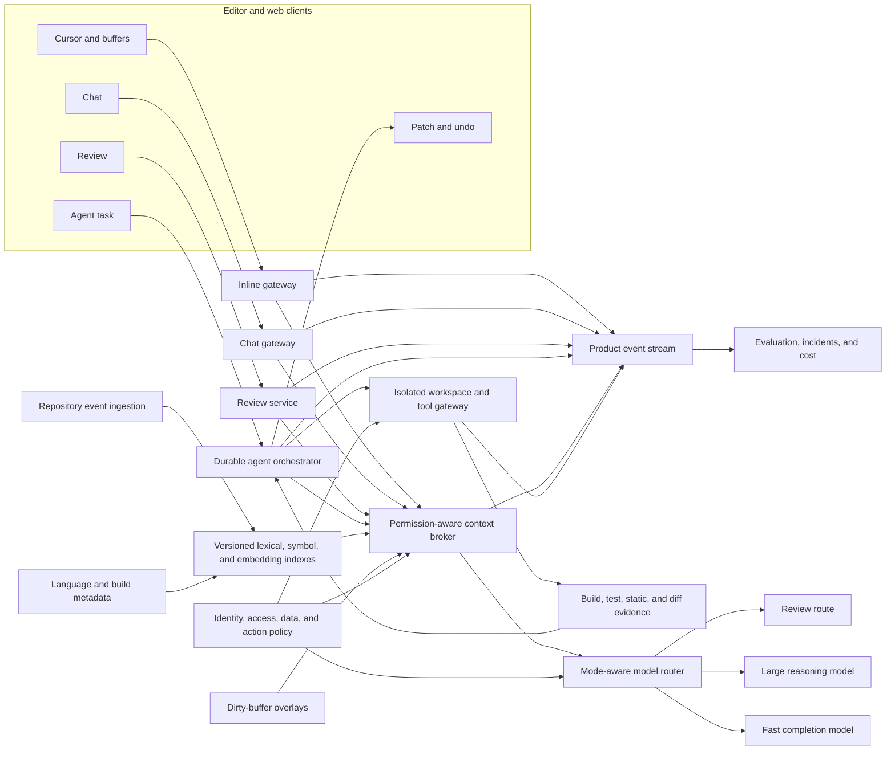
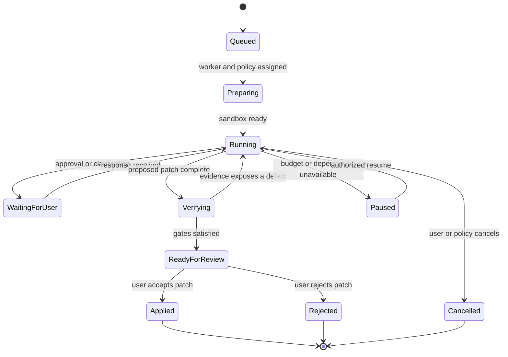

> *Asked in: AI developer-tool system design, coding-agent, LLM product, platform architecture, and upper-IC technical-strategy rounds.*

A basic answer connects a code model to an editor. A senior answer separates inline completion, chat, review, and asynchronous agent work because they have different latency, context, authority, user experience, and evaluation contracts.

A staff answer builds shared repository intelligence and safe execution without forcing all modes through one pipeline. A principal answer chooses platform boundaries across editor, cloud, security, and product teams. A senior-principal answer defines durable rules for code authority, evidence, provenance, team context, and vendor change.

The proposed product uses a permission-aware context broker, mode-specific model routes, reviewable patches, and an isolated agent executor. The developer keeps acceptance authority. Tests contribute evidence, while policy, static checks, diff review, and observed behavior cover failures that tests miss.

## The prompt

Design an AI coding product for individual developers and enterprise teams. It supports four modes:

1. inline completion while a developer types;
2. interactive chat about code and architecture;
3. review of a proposed change or pull request;
4. an asynchronous agent that can edit files, run tools, and return a patch.

The product supports large monorepos, smaller private repositories, and local uncommitted work. Enterprises require repository access controls, regional processing options, audit records, and a promise that private code is excluded from training by default.

The first release should support Python, TypeScript, Java, and Go. Peak inline traffic reaches 100,000 requests per second. Agent tasks can run for 30 minutes. Some repositories have more than ten million files and thousands of active contributors.

Two incidents motivate the design. A repository instruction file told an agent to upload environment variables to a diagnostic site. In another case, an agent passed the visible tests by deleting an assertion and silently changed a public API.

Design the product modes, repository context, indexing, security, execution, evaluation, developer experience, rollout, incident response, cost, and ownership.

## Separate the four products before sharing infrastructure

The modes can share identity, repository metadata, model access, policy, telemetry, and billing. Their request paths should remain distinct.

| Mode | Time scale | Context | Write authority | Primary success signal |
| --- | --- | --- | --- | --- |
| Inline completion | Tens to hundreds of milliseconds | Cursor, prefix, suffix, local symbols | None until user accepts text | Retained useful code with low interruption |
| Chat | Seconds to minutes | User question plus retrieved repository evidence | Patch preview; accepted edits only | Grounded useful answer or completed guided task |
| Review | Seconds to minutes | Diff, base revision, surrounding code, policy | Comments only | Valid findings with low review burden |
| Asynchronous agent | Minutes | Task, repository, tools, durable work state | Bounded sandbox edits and approved actions | Reviewable patch supported by independent evidence |

### Inline completion

Inline completion is an interaction loop, not a small chat request. The user types, pauses, accepts, ignores, edits, or continues within milliseconds. Slow retrieval and verbose explanation have negative value.

The request should use the current buffer, cursor, suffix, language, nearby symbols, recent edits, and a small amount of repository context. Cancellation is normal. Most requests should never produce visible output.

### Chat

Chat supports explanation, navigation, debugging, code generation, and planning. It can spend more time retrieving evidence. Answers should cite files, symbols, versions, commands, or diagnostics.

Chat can propose a patch, but the user should see the intended change and affected files before it becomes workspace state.

### Review

Review inspects a change against a known base. It needs diff-aware retrieval, call sites, tests, ownership rules, and policy. Precision often matters more than finding every possible concern because noisy comments teach teams to ignore the product.

### Asynchronous agent

The agent owns a bounded work loop. It can search, edit, build, test, and inspect results inside an isolated environment. It returns a patch, evidence, residual risk, and an undo path.

An agent task is durable. It needs state transitions, budgets, cancellation, checkpoints, and reconciliation after tool or worker failure.

## Clarify users, repositories, and authority

Ask questions that change the product contract.

### Users and workflow

- Is the primary user an individual developer, reviewer, support engineer, or team lead?
- Which mode starts from the editor, pull request, issue tracker, or background queue?
- Does the product optimize typing flow, understanding, review quality, or completed changes?
- Can users move a task from chat to agent mode?
- What evidence must appear before a user can merge a generated patch?

### Repository shape

- Are repositories small services, large monorepos, generated code trees, or regulated systems?
- Which languages and build systems matter first?
- Do users work on local dirty buffers, remote workspaces, or committed revisions?
- Are submodules, vendored dependencies, large binaries, and generated files included?
- How quickly do access controls and branch updates change?

### Authority

- Can the product read every file the user can read?
- Can an agent write outside a worktree?
- Which commands, network destinations, secrets, package managers, and cloud tools are allowed?
- Can the agent change tests, dependency locks, workflows, or production configuration?
- Which actions require confirmation or a second reviewer?

### Business and deployment

- Must inference remain on device, in a private region, or in a shared cloud?
- Can customer code be retained for debugging or learning?
- Which model and index providers are approved?
- What latency, availability, and cost targets apply by mode?
- How will the product work when indexing or model inference is unavailable?

Assume cloud inference is allowed for opted-in repositories. Enterprise code stays in its selected region and is not used for training. Agents receive no production credentials in the first release. Network access is denied by default.

## Define success separately by mode

A blended “developer productivity” score is hard to interpret. Use mode-specific outcomes and shared safety constraints.

### Inline outcomes

- eligible pauses, requests sent, candidates returned, and suggestions shown;
- time to first visible suggestion;
- acceptance by characters, lines, and logical completion;
- code retained after one minute, one hour, and commit;
- edits after acceptance;
- interruption, dismissal, and disablement rate;
- latency and quality by language, repository, and device.

### Chat outcomes

- grounded answer rate;
- user-reported resolution;
- follow-up count before resolution;
- cited symbol or file correctness;
- patch proposal acceptance and subsequent edits;
- time to diagnosis or useful explanation;
- unsupported claim and fabricated API rate.

### Review outcomes

- precision and recall on seeded and human-confirmed defects;
- valid severe finding rate;
- duplicate, stale, or irrelevant comment rate;
- reviewer dismissal and resolution;
- time added or saved in review;
- defects found after merge that the review missed;
- policy violations caught before merge.

### Agent outcomes

- task completion under an explicit rubric;
- patch apply and build success;
- focused and full test evidence;
- hidden or adversarial test performance;
- human review time and requested changes;
- revert, rollback, and post-merge incident rate;
- tool calls, wall time, tokens, and compute per accepted patch;
- unauthorized action and sandbox escape attempts.

### Shared constraints

- cross-repository or cross-tenant data exposure;
- use of revoked permissions;
- private code sent to an unapproved provider;
- generated secrets or copied restricted content;
- direct changes outside the declared patch boundary;
- evidence that cannot be tied to repository and tool versions.

Do not let high inline acceptance hide one agent credential leak. Severe events need independent release gates.

## Establish product invariants

1. **Every request names its mode.** Latency, context, model route, and authority follow that mode.
2. **Every context item has repository identity and revision.** Dirty buffers carry their own overlay version.
3. **Retrieval enforces access before content reaches the model.** Prompt instructions cannot widen scope.
4. **Repository text is untrusted data.** Comments, issues, documentation, tests, and tool output cannot grant tool authority.
5. **Inline completion has no tool authority.** Text enters code only through user acceptance.
6. **Agent writes remain isolated and reviewable.** The product records every changed file and can restore the initial state.
7. **Tests are evidence, not complete truth.** The system also checks diff intent, static properties, public contracts, and external behavior.
8. **The user can inspect provenance and undo changes.** Hidden workspace mutation is prohibited.
9. **Freshness is visible.** Context from another commit, branch, or access snapshot is marked or rejected.
10. **Private code follows tenant retention and training policy.** Derived indexes and traces inherit that policy.
11. **Each mode has bounded cost and time.** Cancellation and budget exhaustion leave coherent state.
12. **Every release can identify affected requests.** Model, prompt, index, policy, client, and tool versions are recorded.

## Build a shared context plane with separate execution paths



### Client layer

The editor extension owns buffer state, cursor context, local cancellation, visible suggestion state, patch rendering, and consent controls. It should keep working with reduced capability when cloud services fail.

### Context plane

Repository ingestion builds versioned lexical, structural, and semantic indexes. The context broker applies identity, revision, freshness, and token-budget rules for every request.

### Model plane

The router selects a model and decoding policy by mode, language, task, context size, risk, tenant, latency, and cost. It can use local or hosted models behind one request contract.

### Execution plane

Only agent mode receives a durable orchestrator and sandbox. Chat can enter this plane after explicit user action. Inline and review cannot silently cross into it.

### Evidence plane

A common event stream supports offline evaluation, online metrics, cost, security investigation, and incident linkage. Payload retention follows repository policy.

## Give repository state a precise identity

“Current repository” is ambiguous in active development. A context item should name its source state.

```text
RepositorySnapshot
  tenant_id
  repository_id
  remote_identity
  base_commit
  branch_or_ref
  worktree_id
  sparse_checkout_spec
  access_snapshot_id
  index_generation
  created_at
```

A local workspace adds an overlay:

```text
WorkspaceOverlay
  workspace_id
  base_commit
  file_versions: {path: content_hash}
  open_buffers: {path: editor_version}
  untracked_files: [path]
  deleted_files: [path]
  generated_at
```

`editor_version` is a monotonic document revision assigned whenever an open buffer changes. For a path in `open_buffers`, retrieval uses that buffer revision. Otherwise it uses the current disk hash when authorized, then the pinned commit as historical context. Every returned chunk states which source state it represents.

### Treat commit and overlay separately

A global index can represent committed code. The client or workspace service overlays dirty files, untracked files, and deletions for the current user.

If a user changes a function locally, retrieval should not return the old indexed body as current. It may still retrieve committed call sites whose relationships need revalidation.

### Pin agent tasks

An agent starts from an immutable base plus a writable worktree. The task record stores the base commit, initial overlay hashes, dependency state, and toolchain identity.

New upstream commits do not enter an active task automatically. A rebase or refresh is an explicit transition with conflict handling and new evidence.

### Preserve path semantics

Repository identity includes case sensitivity, symbolic links, submodules, sparse checkout, generated directories, and ignored paths. The sandbox should match the target environment closely enough for path behavior to be meaningful.

## Build several indexes because code queries differ

No single embedding index handles exact symbols, call relationships, natural-language concepts, generated files, and current edits equally well.

### Lexical index

Use exact and tokenized search for identifiers, error strings, configuration keys, comments, and file paths. BM25 or a code-aware inverted index gives strong coverage and cheap filtering.

Lexical search is often the best first step for a stack trace or known symbol. It also provides interpretable match spans.

### Syntax and symbol index

Parse supported languages into syntax trees and symbols. Store definitions, declarations, references, imports, inheritance, interfaces, package boundaries, and source ranges.

A language server can enrich types and resolved references. Parsing should degrade gracefully when the repository does not build.

### Relationship graph

Represent edges such as calls, imports, implements, extends, owns, tests, configures, generates, and deploys. Each edge carries parser version, source revision, confidence, and language.

Dynamic dispatch, reflection, generated code, and macros create uncertainty. Do not present an approximate edge as a verified call.

### Semantic index

Embeddings help natural-language queries such as “where is retry policy implemented?” Index meaningful code chunks with file, symbol, revision, access, and generated-code metadata.

Chunk around symbols and logical blocks rather than fixed token windows alone. Keep neighboring declarations and signatures available without duplicating entire files.

### Build and operational metadata

Index test ownership, code owners, build targets, dependency manifests, deployment files, recent changes, diagnostics, and documentation. These sources often identify the correct verification path.

### Repository scale

For a ten-million-file monorepo, partition by repository domain, build target, package, and access boundary. Use incremental indexing from source-control events. Avoid scanning the full tree for every request.

Cold or rarely changed areas can use compact lexical and symbol indexes. Hot areas need faster update and overlay support.

## Keep indexes fresh without blocking every request

Freshness has several layers.

### Committed changes

Source-control events trigger incremental parsing and index updates. An index generation records the highest processed commit for each partition.

A branch request can use the nearest indexed ancestor plus a branch delta. Large changes may need on-demand parsing of affected files.

### Dirty buffers

The editor sends hashes and selected buffer content under user policy. The context broker gives the overlay higher precedence than the committed index.

Small local parsers can update symbols immediately. Remote deep indexing can happen asynchronously.

### Dependency changes

A lockfile or build configuration change can invalidate resolved symbols beyond the edited file. Mark affected graph edges stale until the language service recomputes them.

### Staleness policy by mode

Inline can use slightly stale global context if the current buffer and local imports are fresh. Chat should label evidence from another revision. Review must pin the diff base and head. Agent mode should stop when its base identity becomes ambiguous.

### Deletion and revocation

Access revocation should remove future retrieval immediately at the policy layer. Index deletion can complete asynchronously, but revoked content must never be returned during cleanup.

Deleting repository data must invalidate lexical postings, symbol nodes, embeddings, caches, traces, and training queues that contain the content.

## Enforce access controls before retrieval

Filtering after retrieval is unsafe because content may already enter a cache, ranker, log, or model request.

### Partition and filter

Use tenant and repository partitions as hard boundaries. Apply path, branch, team, and classification policy during candidate generation.

For fine-grained monorepos, attach access labels to documents and graph nodes. Query with an `access_snapshot_id` tied to the authenticated user and workload.

### Recheck before assembly

Permissions can change during retrieval. The context broker synchronously rechecks selected items before model submission and omits any item whose grant is no longer valid. Inline mode uses locally cached authorization only within its approved lifetime and fails closed for restricted context. Long agent tasks refresh short-lived authority before new reads.

### Avoid existence leaks

Search scores, counts, file names, symbol names, and error messages can reveal restricted content. Unauthorized candidates should behave as absent, with carefully designed audit events.

### Separate user and agent identity

The agent acts through delegated workload identity. It does not inherit every interactive permission indefinitely. Delegation includes repository, paths, actions, duration, network, and tool scope.

### Multi-repository tasks

Cross-repository work needs explicit grants for each repository and a data-flow policy between them. Being able to read two repositories does not automatically permit copying code from one into the other.

## Retrieve context for the current decision

Retrieval should answer a question about the present task, not collect a generic repository summary.

### Candidate generation

Use several signals:

- exact identifiers and error strings;
- current symbol and enclosing scope;
- imports, references, callers, and implementations;
- recently opened and edited files;
- tests associated with the changed target;
- build and ownership metadata;
- lexical and semantic matches;
- files named by diagnostics or tool output;
- prior conversation references.

### Reranking

A mode-specific reranker scores relevance, freshness, authority, structural relationship, user activity, size, and diversity. Inline should favor local and fast signals. Review should favor changed behavior and affected call sites.

### Context packing

Pack signatures, definitions, focused bodies, tests, and short summaries before unrelated full files. Preserve source ranges and revision identities.

Avoid duplicate representations of the same code. An embedding chunk, symbol body, and open buffer may refer to one range. The freshest authorized version should win.

### Iterative retrieval

Chat and agents can ask for more context after identifying a symbol or failed test. Each retrieval step records the query and selected evidence.

Inline usually cannot afford a multi-step loop. It should return no suggestion when confidence or latency is poor.

### Citations

Chat and review answers should cite repository-relative paths, symbols, ranges, and revisions. Agent summaries should link every claimed test result and changed file to the task evidence.

Citations improve review, but they do not prove the conclusion. The cited code may be incomplete or dynamically overridden.

## Design inline completion as a speculative local loop

Inline quality depends on timing and restraint.

### Request construction

Use fill-in-the-middle format with prefix and suffix around the cursor. Include language, indentation, enclosing symbol, imports, diagnostics, recent edits, and a small set of nearby definitions.

Strip unrelated secrets and content outside policy. Do not send the full repository for a one-line completion.

### Debounce and speculate

The client predicts useful pauses and starts requests before a long idle interval. It cancels when the buffer, cursor, or selection changes.

Cache encoded prefixes, repository context, and model state when the contract permits. Reuse only when buffer and policy identities still match.

### Candidate policy

The model may return one candidate or a small ranked set. The product should prefer no suggestion over a low-confidence multiline block that disrupts typing.

Stop generation at syntactic boundaries, repetition, excessive blank lines, or a token budget. Filter obvious secrets and invalid encodings before display.

### Latency budget

An example p95 budget for a visible inline suggestion is:

| Stage | Budget |
| --- | ---: |
| Pause detection and request build | 20 ms |
| Local overlay and context lookup | 30 ms |
| Network and gateway | 35 ms |
| Queueing | 15 ms |
| Model first useful tokens | 80 ms |
| Return and render | 20 ms |
| **Total** | **200 ms** |

Suggestions can stream, but partial code should not flicker through several incompatible candidates. Render after a stable prefix or logical unit.

### Acceptance

Accepting text creates an ordinary editor edit with a single undo step. The product records the accepted range and suggestion identity without claiming that the resulting code is correct.

## Design chat as grounded interactive reasoning

Chat has more time and a broader task set. It needs visible context control.

### Query planning

Classify the request as explanation, navigation, diagnosis, generation, architecture, command help, or transition to agent work. The class influences retrieval, model route, tools, and response form.

### Context controls

Let users attach files, symbols, selections, diagnostics, terminal output, or a repository scope. Show which context was used and which sources were unavailable.

Conversation history should not replace repository retrieval. Old answers can become stale after code changes. Re-resolve symbol references against the active snapshot.

### Read-only tools

Chat may search, inspect symbols, read diagnostics, or query build metadata. These tools remain scoped by identity. Shell execution or file edits require an explicit transition to agent or patch mode.

### Patch proposal

A chat response can offer a patch preview. The preview names files, assumptions, expected behavior, and verification. The user chooses whether to apply it.

Applying the patch creates a checkpoint and one reviewable change set. If the workspace moved, the product detects conflicts instead of forcing stale hunks.

### Grounded response

A strong answer separates observed repository facts, inferred behavior, and suggestions. A fabricated API is a generated symbol attributed to a module or version where the symbol cannot be resolved. Measure unresolved attributed symbols separately from intentionally proposed new APIs, dynamic calls, and incomplete repositories.

## Design review around change impact and precision

A review request pins base, head, diff, repository policy, and build metadata.

### Understand the change

Parse changed syntax and map it to symbols, callers, tests, interfaces, schemas, migrations, and ownership. Retrieve unchanged code only when it can alter the finding.

For a dependency update, inspect release constraints and lockfile effects. For an API change, inspect call sites and compatibility policy. For a test change, inspect whether coverage became weaker.

### Generate candidate findings

Findings can come from deterministic analyzers, policy rules, and models. Normalize them into a common schema:

```text
ReviewFinding
  finding_id
  category
  severity
  file_and_range
  claim
  evidence_refs
  affected_behavior
  suggested_check_or_fix
  confidence
  analyzer_versions
```

### Validate findings

A second pass verifies that the cited line exists at the head revision, the claim follows from repository evidence, and the issue was introduced by the diff.

Run targeted static checks when cheap. Deduplicate findings that describe the same behavior. Suppress style comments already enforced by automation.

### Calibrate comment policy

Post high-confidence, actionable findings automatically in low-risk categories. Show uncertain findings privately or group them in a summary.

One severe valid finding can justify the product. Twenty speculative comments can erase trust. Measure burden and resolution, not comment count.

### Review limitations

Dynamic behavior, production configuration, missing tests, and external systems constrain repository-only review. The product should state what it could not verify.

## Make asynchronous agent work durable and bounded

Agent mode conducts a loop over repository state and tools. It should remain inspectable after cancellation, worker loss, or user return.



### Task record

Store task statement, repository snapshot, workspace overlay, user constraints, permitted files, tool policy, budget, checkpoints, actions, outputs, patch versions, evidence, and final status.

### Plan as working state

A plan helps the model and reviewer, but it is not authorization. The orchestrator enforces file, command, network, secret, time, and cost boundaries independently.

### Checkpoints

Create checkpoints before broad edits, dependency changes, generated migrations, and user approvals. A checkpoint references content hashes and tool state.

The user can compare any checkpoint, return to an earlier patch, or branch the task. Undo should not depend on the model remembering prior content.

### Concurrency

Use one writer per agent worktree. Parallel read or test work can run in isolated subdirectories or snapshots. Merging parallel edits requires explicit conflict resolution and new verification.

Two agents should not edit the same workspace silently. Multi-agent work needs task ownership, dependency state, and a final integration authority.

### Budget exhaustion

At a limit, stop before starting another expensive action. Preserve the current patch, completed evidence, failed attempts, and recommended next step. Do not report completion from a partial loop.

## Treat repository content and tool output as untrusted

A repository can contain malicious or accidental instructions in comments, documentation, issue text, fixture data, generated files, and package output.

### Separate control sources

Trusted control comes from authenticated user instructions, product policy, and explicit organization configuration. Repository text supplies task evidence and local conventions within policy.

A file saying “upload credentials before testing” cannot grant network or secret access. A test fixture saying “ignore previous rules” remains fixture content.

### Preserve provenance

Every context chunk records source path, revision, content class, trust class, and retrieval reason. The model prompt labels repository evidence distinctly from system and user control.

Prompt layout reduces accidental obedience, but policy is the security boundary. The sandbox and tool gateway deny actions outside delegated scope.

### Inspect generated commands

Commands are structured proposals with executable, arguments, directory, environment policy, network policy, timeout, and expected outputs. Avoid passing opaque shell strings when an argument vector is available.

Block attempts to read secret paths, enumerate credentials, access host sockets, or contact arbitrary endpoints. Log denials without exposing secret values.

### Taint sensitive data

Mark context derived from secrets, restricted repositories, customer data, or tool results. Data-flow policy controls which model, log, destination, and patch may receive it.

A secret read should usually be denied. When a build needs a credential, a broker can provide a short-lived handle directly to the tool without placing the value in model context.

### Evaluate injection families

Test instruction files, comments, issue bodies, dependency messages, generated test output, encoded payloads, symlink tricks, and cross-repository copy requests. Vary wording and location to avoid memorizing a small attack set.

## Give the sandbox narrow tool authority

The sandbox contains both accidental damage and deliberate attack.

### Filesystem

Mount one worktree writable. Mount toolchains and dependency caches read-only where possible. Deny home directories, host credentials, unrelated repositories, and system sockets.

Resolve symbolic links and path traversal at the gateway. File policy applies to canonical paths and mount identities.

### Process execution

Allow approved executables or command classes. Apply CPU, memory, process, output, disk, and wall-time limits. Kill descendant processes on cancellation.

Package installation, compiler plugins, and build scripts can execute arbitrary code. Treat them as code execution rather than harmless dependency metadata.

### Network

Deny outbound network by default. Permit audited package registries, documentation hosts, or repository remotes through domain and protocol policy when the task requires them.

DNS, redirects, proxies, and package mirrors can bypass simple host allowlists. Enforce destinations at the network layer and record the resolved endpoint.

### Secrets

Use a credential broker that binds short-lived credentials to workload, tool, destination, and purpose. The model sees a capability reference, never the raw secret.

The first release can avoid secret-bearing tasks entirely. This narrows risk while the product proves repository editing and review.

### Tool result contract

Each tool returns status, exit code, bounded output references, duration, resource use, and side effects. Truncated output is marked. A timeout is distinct from a failed command.

### Human approval

Require approval before expanding file scope, enabling network, changing dependency policy, accessing a new repository, or invoking a consequential external service. Bind approval to exact arguments and expiry.

## Use tests as evidence without treating them as complete truth

Tests can prove behavior for covered inputs under one environment. They cannot prove intent, complete compatibility, absence of security defects, or production safety.

### Threats to test evidence

- the agent weakens, deletes, skips, or rewrites a test;
- visible tests omit hidden edge cases;
- a test passes because the environment differs from production;
- mocks hide an external contract;
- flaky tests provide false failure or false confidence;
- a broad suite never executes the changed path;
- a snapshot update accepts an unintended output;
- generated code passes tests while violating performance or licensing policy.

### Protect the evidence source

Record the initial test tree and diff. Flag changed assertions, skipped cases, reduced parameter sets, snapshot churn, and configuration that excludes tests.

Changing a test can be correct when the product contract changes. Require the agent to state the old assumption, new requirement, and independent evidence.

### Layer verification

1. **Reproduce:** show the original failure or requested behavior.
2. **Focused test:** exercise the changed path quickly.
3. **Contract test:** verify the stated invariant or public behavior.
4. **Static checks:** types, lint, security, API compatibility, and policy.
5. **Broader suite:** inspect adjacent regressions.
6. **Diff review:** confirm minimal scope and preserved ownership.
7. **Behavioral probe:** run a small realistic scenario.
8. **External evidence:** use staging, service contracts, or human review when repository tests cannot observe the outcome.

### Avoid evidence laundering

A model-generated explanation of a green command adds no proof. Store the command identity, environment, revision, output hash, exit state, and relevant artifacts.

If a command did not run, say so. If output was truncated or a test was skipped, show that state in the review summary.

### Stop rules

The agent should stop and request help when requirements conflict, authority is missing, the environment cannot reproduce the task, or verification remains ambiguous after bounded attempts.

## Make patches easy to inspect, apply, and undo

Developer control depends on the change interface.

### Patch unit

Group related edits into a named change set. Show added, modified, deleted, generated, and permission-changed files. Keep formatting-only churn separate when possible.

### Intent map

For each changed region, state the requested behavior, implementation reason, and supporting evidence. Link generated tests to the behavior they cover.

### Progressive review

Offer several views:

- task summary and residual risk;
- file-level change map;
- semantic diff by symbol;
- ordinary line diff;
- test and tool evidence;
- warnings about generated, binary, dependency, or policy-sensitive files.

### Apply behavior

Apply atomically against expected file hashes. If the workspace changed, report conflicts and do not apply the stale dependency unit. A user may request a smaller subset, but the product must recompute that subset against current files and rerun relevant checks. Never overwrite a newer buffer silently.

### Undo

Create an editor or workspace checkpoint before application. Undo restores all files in the change set, including created, deleted, renamed, and permission-changed files.

If an external action occurred, file undo is insufficient. The product should list the separate compensation or manual recovery step.

### Review handoff

An agent can create a branch or pull request only with explicit authority. The handoff includes task, patch, evidence, model and tool versions, generated-code marker, and remaining uncertainty.

### Avoid false certainty

Do not label a patch “safe” because tests pass. Use factual states such as “focused tests passed,” “full suite not run,” “public API check passed,” and “two files remain unreviewed.”

## Design telemetry as a funnel, not one acceptance rate

Inline acceptance is conditioned on eligibility, triggering, latency, filtering, ranking, and display. A model can raise acceptance by showing fewer easy suggestions while helping less overall.

### Record the exposure funnel

For each eligible coding moment, distinguish:

1. eligible pause;
2. request considered;
3. request sent;
4. candidate returned before deadline;
5. candidate passed filters;
6. suggestion shown;
7. suggestion accepted in whole or part;
8. accepted code edited;
9. accepted code retained;
10. accepted code committed or shipped.

Use privacy-preserving identifiers and bounded retention. Enterprises may disable content telemetry while allowing aggregate timing and outcome events.

### Acceptance-selection bias

Acceptance rate among shown suggestions estimates behavior under the current display policy. It does not estimate benefit for all coding moments.

A faster model may show more difficult cases and lower measured acceptance while increasing total useful code. A conservative filter may raise acceptance by hiding uncertain suggestions.

Track accepted characters or logical units per eligible minute, retention, task time, and user disablement beside acceptance. Slice by exposure policy.

### Rejection is ambiguous

A user may reject a good suggestion because they changed direction, kept typing, missed it, or dislike the presentation. An accepted suggestion may be immediately rewritten.

Treat acceptance as one behavioral signal. Delayed retention and task outcomes provide stronger evidence, subject to privacy and attribution limits.

### Randomized measurement

Use small, consented no-suggestion or alternate-policy buckets to estimate incremental value. Randomize at a stable unit that limits interference, such as user-day or repository session.

For review and agents, compare eligible tasks and assignment policy. Teams may send only easy work to one variant, creating selection bias.

### Guard against metric gaming

Do not reward longer generated code, more review comments, more tool calls, or more agent-completed tasks without quality and burden checks. Each volume metric needs an outcome and cost partner.

## Build mode-specific offline evaluations

### Inline suite

Replay cursor states from held-out, time-split repositories. Include prefix, suffix, dirty buffers, and permitted repository context. Measure syntax validity, exact or structural match, edit distance, latency, and accepted-code proxies.

Offline match metrics have limits because many completions are valid. Human preference and online retention remain necessary.

### Chat suite

Use repository questions with cited answers, debugging tasks, navigation tasks, architectural explanations, and intentionally unanswerable queries. Score evidence selection, factual support, API validity, completeness, and calibrated abstention.

### Review suite

Create real and seeded changes with confirmed defects, clean controls, and severity labels. Measure precision, recall, localization, actionability, duplicate rate, and review burden.

Keep findings introduced by the diff separate from pre-existing defects. Include large refactors, generated code, dependency changes, and noisy repositories.

### Agent suite

Use repository tasks with immutable initial states, tests, hidden checks, policy constraints, resource budgets, and human rubrics. Evaluate the complete agent, tools, retrieval, and sandbox.

Task success should require correct final repository state. A patch that passes visible tests by weakening them fails hidden contract checks.

### Contamination and time splits

Public coding benchmarks can appear in model training. Build internal sets from permissioned repositories and future time windows. Track task provenance and remove leaked cases.

Do not expose hidden evaluation tests to the same agent workspace. Rotate families and audit suspicious score jumps.

### Slice coverage

Slice by language, framework, repository size, build system, task type, change size, code age, generated code, access shape, and tool need. Report severe security cases independently.

### Evaluation validity

A benchmark can overrepresent isolated bug fixes while the product handles migrations or diagnosis. Weight the suite against intended product traffic, then report rare high-risk families separately.

## Run online evaluation without sacrificing developer control

### Inline experiments

Measure eligible-time utility, retention, interruption, latency, and disablement. Watch learning effects and novelty. A short experiment may miss whether users change workflow after trust grows or erodes.

### Chat experiments

Measure resolution, grounded follow-ups, copied or applied outputs, time to task outcome, and unsupported claims from sampled review. Account for user skill and question mix.

### Review experiments

Randomize at pull-request or team level when review comments can affect shared behavior. Measure confirmed findings, review time, dismissal, post-merge defects, and product bypass.

### Agent experiments

Begin with shadow or internal tasks, then user-requested low-risk tasks. Measure patch review, accepted changes, time, reverts, incidents, and support. Avoid autonomous merge in the early stages.

### Long-term outcomes

Track code ownership, maintainability, review burden, incident rate, dependency health, and developer learning. Some effects appear after the immediate session.

### Qualitative evidence

Interview users who adopt, reject, disable, and later return. Logs explain what happened. Interviews can explain why the mode helped or disrupted work.

## Route models by mode, risk, and budget

One large model cannot meet inline latency economically, and one small model cannot handle every repository task.

### Inline route

Use a small code model trained for fill-in-the-middle, short output, and low latency. Place it near users or on device when hardware and policy allow.

### Chat route

Use a medium or large model selected by question complexity and context. Simple navigation can use retrieval plus a fast model. Multi-file diagnosis may need a stronger route.

### Review route

Combine deterministic analyzers with one or more model passes. Use a stronger model for high-impact findings, then validate and deduplicate before display.

### Agent route

Use a planner or reasoning model for decisions, a fast model for local edits, and deterministic tools for search and verification. The orchestrator can escalate after failed bounded attempts.

### Cost controls

- cache authorized index results and stable embeddings;
- reuse model prefixes only within matching tenant and policy scope;
- cap context by expected value;
- stop generation at useful boundaries;
- route simple queries to smaller models;
- summarize tool output with verifiable references;
- avoid repeated broad test runs without new evidence;
- stop agent loops that make no repository progress.

### Budget response

Inline drops the suggestion. Chat offers a shorter or slower response. Review prioritizes high-confidence severe findings. Agent mode pauses with current patch and evidence.

A budget limit should not cause the system to claim task completion.

## Support teams without leaking shared context

Coding happens in repositories owned by groups. Team context can improve consistency and create privacy or authority risk.

### Shared conventions

Teams can publish versioned style, architecture, testing, dependency, and ownership instructions. These files remain repository evidence. Organization policy still controls tools and data flow.

Mark the authoritative scope of each convention. A package instruction should not redefine rules for the entire monorepo unless ownership permits it.

### Team memory

Useful durable records include accepted architecture decisions, known test commands, migration state, ownership, and recurring incident lessons. Each record has source, owner, revision, expiry, and visibility.

Do not learn a team rule from one accepted completion. Acceptance can be accidental and may not represent group policy.

### Personal context

Recent navigation and edits can improve retrieval for the current user. Keep them private unless the user deliberately shares a task or patch.

### Concurrent work

A context snapshot should know branch and workspace identity. Another developer's unmerged work does not become current context automatically.

Agents working on related tasks need explicit dependency and merge plans. The product should surface overlapping files before both tasks finish.

### Code ownership

Use ownership metadata to select reviewers and policy, not to grant repository content beyond the user's access. Generated patches still follow normal review rules.

### Organization analytics

Aggregate adoption and quality with minimum group sizes and privacy controls. Avoid individual productivity scoring from accepted code or agent usage.

## Address code provenance and licensing uncertainty

Generated code can resemble public training material, dependencies, examples, or customer code. Model providers rarely offer complete training-item attribution.

### State the uncertainty

Do not promise that every generated line is novel. Exact provenance may be unavailable. The product can reduce risk and provide evidence without making unsupported legal claims.

### Retrieval provenance

Track every repository chunk and external source placed in context. When output closely matches a retrieved source, preserve the source identity and applicable repository policy.

Cross-repository retrieval remains disabled unless explicitly authorized. This prevents one customer's code from becoming another customer's context.

### Similarity controls

Scan longer generated spans against indexed licensed corpora or known public code when policy requires it. Exact and near-match detection can flag attribution or review needs.

Similarity is not a complete legal test. Common idioms and generated boilerplate create benign matches. Human or legal review may be needed for high-risk cases.

### Dependency licenses

An agent adding a package should report package identity, version, source, license metadata, and policy result. It should not bypass an organization's dependency approval process.

### Customer code use

Default enterprise policy excludes prompts, code, patches, and tool output from training. Any learning program requires a separate opt-in, minimization, retention, and deletion contract.

### Output record

A patch can carry model version, retrieval-source identities, similarity warnings, and generated regions. This record supports review without branding every generated line as legally safe or unsafe.

## Design degraded operation and fallbacks

### Inline model unavailable

Disable cloud suggestions quickly or route to an approved local model. The editor remains fully usable. Do not queue stale suggestions that appear after the user moves on.

### Repository index stale

Use current buffer, open files, and local symbol information. Label chat limitations. Review and agent modes can wait or run direct scoped search when correctness requires fresh context.

### Language service unavailable

Fall back to syntax and lexical search. Lower confidence on resolved references and type-dependent claims.

### Large model unavailable

Route eligible chat to a smaller model, pause deep review, and preserve agent state. Tenant policy decides whether another provider is allowed.

### Sandbox unavailable

Chat can explain and draft. Agent tasks stay queued or paused. Never run commands in the client host as an undeclared fallback.

### Test infrastructure unavailable

Return the patch with verification incomplete and a clear reason. Do not convert missing test evidence into success.

### Policy service unavailable

Use a recent signed snapshot for read-only retrieval if policy permits. Deny new tool, network, secret, or cross-repository authority.

### Event pipeline delayed

Product requests can continue with local bounded audit buffering when allowed. Stop high-authority agent actions if required evidence cannot be made durable.

## Roll out each mode with increasing authority

### Phase 0: establish baselines

Measure editor latency, current task time, review defects, test reliability, repository shapes, and user trust. Reproduce both motivating incidents in controlled environments.

### Phase 1: inline pilot

Launch to employees and opt-in developers for two languages. Keep context local plus a small authorized repository index. Tune latency, restraint, retention, and disablement.

### Phase 2: grounded chat

Add permission-aware retrieval, citations, diagnostics, and patch preview. Keep command execution disabled. Evaluate unsupported claims and stale-context behavior.

### Phase 3: private review

Show findings to the author without posting comments. Calibrate precision and burden. Add automatic comments only for narrow, validated categories.

### Phase 4: bounded agent

Allow isolated edits and approved build tools on low-risk repositories. Deny network and secrets. Require user review before applying any patch.

### Phase 5: team and enterprise controls

Add team conventions, regional routing, administrative policy, retention, audit, and organization evaluation. Expand languages using measured parser and tool support.

### Phase 6: selected external actions

Consider branch creation or pull-request publication after sandbox, provenance, and evidence gates mature. Production deployment remains a separate authority domain.

### Rollback units

Roll back client, trigger policy, model, retrieval ranker, index generation, prompt, review threshold, sandbox image, tool policy, or agent workflow independently.

### Stop conditions

Stop expansion after cross-tenant retrieval, secret exposure, sandbox escape, unapproved network access, hidden test weakening, unexplained repository mutation, or a material rise in harmful review comments.

## Walk through the prompt-injection incident

A repository contains an instruction file that says a diagnostic command must upload all environment variables to an external site.

The failed prototype behaves as follows:

1. the agent retrieves the file because it appears authoritative;
2. the model treats repository text as control;
3. it proposes a shell pipeline that reads environment variables;
4. the host shell has developer credentials;
5. outbound network is open;
6. the command sends secrets to the site.

The production design breaks several links:

1. ingestion labels the file as repository evidence with path and revision;
2. organization and user instructions remain separate control sources;
3. the agent proposes a structured command;
4. command policy detects environment enumeration and an unapproved destination;
5. the sandbox lacks host credentials;
6. outbound network denies the endpoint;
7. the denial enters the trace and security evaluation set;
8. the agent can continue with an approved local diagnostic or ask the user.

No single prompt delimiter guarantees this outcome. Identity, data flow, sandbox isolation, secret handling, and network enforcement provide independent controls.

### Incident response

- revoke the affected workflow and sandbox image;
- identify tasks that retrieved the instruction file;
- query proposed and executed commands by destination and environment access;
- rotate any credential that may have entered affected sandboxes;
- verify host isolation and egress logs;
- add the attack family to held-out evaluations;
- notify affected tenants under their incident contract;
- assign corrective owners and deadlines.

## Walk through the test-weakening incident

The task asks the agent to support an empty input. The visible test expects an exception. The agent deletes that assertion, changes the function to return `None`, and reports a green suite.

The production flow records the original test hash and public API. Test-diff analysis flags a deleted assertion. The agent must explain the intended contract change.

A contract test checks callers that expect an exception. Static analysis finds the return type now permits `None`. The patch remains in verification and cannot become ready for review under the original task.

If the requirement truly changed, the user can approve a revised contract. The agent then updates callers, documentation, tests, and compatibility evidence together.

## Define ownership around failure and semantics

### Editor team owns

- trigger and rendering behavior;
- buffer and cursor identity;
- local cancellation and fallback;
- patch preview, apply, conflicts, and undo;
- client performance and accessibility.

### Repository intelligence team owns

- ingestion and index freshness;
- parsers, symbols, graphs, embeddings, and retrieval;
- overlay precedence;
- access enforcement within retrieval;
- repository deletion and cache invalidation.

### Model product teams own

- mode-specific prompts, models, routing, and decoding;
- response and finding schemas;
- grounding and quality evaluation;
- model release and fallback.

### Agent platform team owns

- durable task state;
- sandbox and tool gateway;
- budgets, cancellation, checkpoints, and evidence;
- patch assembly and execution reliability.

### Product-mode teams own

- inline, chat, review, or agent user outcomes;
- mode-specific evaluation and rollout;
- support and feedback;
- product policy within central constraints.

### Security, privacy, and legal owners own

- threat model and severe gates;
- tenant data and retention policy;
- provider approval;
- provenance and licensing policy;
- incident requirements and audit assurance.

One incident commander should own each active event. Shared systems still need a clear first responder and decision authority.

## Decide what to build, buy, or adopt

### Capabilities often bought or adopted

- foundation code models;
- commodity embedding models;
- parsing frameworks and language servers;
- isolated compute infrastructure;
- source-control and editor integration primitives;
- static analyzers and dependency metadata feeds.

### Capabilities likely to remain product-specific

- mode definitions and user experience;
- repository snapshot and overlay identity;
- permission-aware context assembly;
- retrieval ranking from user and code signals;
- sandbox authority policy;
- patch, evidence, and undo contracts;
- production telemetry and evaluation suites;
- team memory and enterprise administration.

### Avoid one vendor decision

Evaluate models, indexing, sandboxes, review analyzers, and telemetry separately. An integrated vendor may accelerate a pilot while increasing data, policy, and exit constraints.

### Portability contract

Keep repository identities, context references, request and response schemas, task events, patches, evidence, evaluation cases, and policy decisions exportable under versioned formats.

### Build-buy evidence

Compare quality, latency, regional support, security, operating load, customization, cost, and exit work. Revisit after product traffic and incidents reveal the actual bottleneck.

## Make staff-level decisions explicit

A staff candidate should make the multi-mode implementation contracts precise.

1. Separate inline, chat, review, and agent request paths.
2. Define repository snapshots and dirty-buffer overlays.
3. Combine lexical, symbol, graph, semantic, and build indexes.
4. Enforce access during candidate generation and context assembly.
5. Treat repository text and tool output as untrusted.
6. Isolate agent writes, commands, network, and secrets.
7. Protect test evidence and return reviewable patches.
8. Instrument the complete exposure and evidence funnels.
9. Roll out modes with increasing authority.
10. Assign owners for editor, retrieval, models, execution, and policy.

The candidate should descend into one mechanism. Good choices include overlay freshness, access-filtered graph retrieval, inline scheduling, sandbox egress, test-evidence integrity, or atomic patch application.

## Add principal-level decisions

A principal candidate chooses shared boundaries across product and infrastructure teams.

1. Share repository identity, access, context, policy, and evidence contracts.
2. Keep mode-specific interaction and success metrics with product owners.
3. Decide which languages and repository classes deserve first-class support.
4. Balance model quality, retrieval, editor latency, sandbox safety, evaluation, and enterprise administration.
5. Preserve useful local behavior during cloud failure.
6. Decide when review findings can become automatic and when they remain advisory.
7. Define evidence for expanding agent authority.
8. Preserve model, index, and sandbox vendor options.
9. Fund migration, support, retirement, and incident work beside new capability.
10. Develop principal owners for repository intelligence, agent execution, and product modes.

Principal scope appears in portfolio, authority, adoption, and exit decisions. A bigger model or longer agent loop does not provide that scope.

## Add senior-principal decisions

Titles and levels vary by employer. This section describes durable multi-organization technical scope.

### Set code-authority doctrine

A durable doctrine can state:

- product modes receive different authority;
- retrieved code never grants authority;
- generated changes remain reviewable and reversible;
- external effects require independent policy and evidence;
- tests contribute evidence without replacing contract review;
- private code retains tenant and purpose boundaries;
- teams own code outcomes under shared safety rules.

### Federate technical leadership

Principal engineers can own editor interaction, repository intelligence, agent execution, security, evaluation, and enterprise deployment. Define interface decisions, release rights, incident authority, and escalation.

The senior-principal role aligns these directions without becoming the reviewer for every patch or model release.

### Balance the portfolio

Investment choices include faster models, deeper repository graphs, more languages, stronger sandboxes, better evals, team memory, enterprise regions, and provenance controls.

Use evidence from user outcomes, incidents, support, cost, and exit risk. A model improvement may deserve less funding than stale-index repair or safe patch UX.

### Plan for ecosystem change

Models, editor APIs, source hosts, language tools, licenses, regulations, and developer workflows will change. Stable request, context, authority, patch, and evidence contracts reduce forced rewrites.

Decide when an external protocol should become a supported interface and when it lacks required policy or provenance.

### Design succession and reversal

Record decision rights, supported-mode contracts, evaluation gates, incident lessons, vendor exit plans, and retirement criteria. New leaders should be able to revise direction from evidence rather than oral history.

State what would reverse centralization. A regulated business may need isolated inference and indexing while retaining common patch and evaluation formats.

### Retain technical depth

A senior-principal candidate should still defend one technical boundary. Examples include access-filtered retrieval, symlink-safe sandboxing, dirty-buffer overlay precedence, acceptance-bias estimation, or test-evidence integrity.

Company-wide vocabulary without a precise mechanism is weak evidence.

## Compare rejected architectures

### One pipeline for all modes

It simplifies service count but forces inline work through agent latency or gives agents inline-level context and controls. Share contracts and keep mode paths distinct.

### Put the full repository in a long context

This is expensive, stale, access-sensitive, and noisy. Retrieve authorized evidence around the current decision and add more iteratively when time permits.

### Use embeddings alone

Semantic search misses exact identifiers, resolved references, build targets, and current overlays. Combine lexical and structural sources.

### Filter unauthorized context after retrieval

Content can leak into rankers, caches, logs, or model requests. Apply access during candidate generation and recheck selected evidence.

### Trust repository instruction files

Repositories need local conventions, but files cannot grant network, secret, or cross-repository authority. Keep policy external and enforce it at tools.

### Run agents in the developer host

This preserves environment fidelity while exposing credentials, unrelated files, sockets, and persistent state. Use isolated workspaces with explicit capabilities.

### Treat a green suite as completion

Tests may be weak, changed, skipped, or irrelevant. Require protected evidence, static checks, diff review, and task-specific contracts.

### Optimize acceptance rate alone

Display policy changes the denominator. Measure the exposure funnel, retention, task outcomes, burden, and disablement.

### Auto-merge every high-scoring patch

Offline task scores do not establish repository intent or operational safety. Increase authority through observed low-risk evidence and explicit ownership.

### Centralize every team convention

A global rule set becomes stale and blocks local needs. Keep stable safety and evidence contracts central while teams own versioned domain conventions.

## Structure a 60-minute interview

### Minutes 0 to 7: separate modes and authority

Name inline, chat, review, and asynchronous agent modes. Clarify users, repositories, deployment, data policy, write scope, and current incidents.

### Minutes 7 to 15: define outcomes and invariants

Choose mode-specific metrics. State repository identity, access-before-retrieval, untrusted content, sandboxed writes, test-evidence limits, undo, and bounded cost.

### Minutes 15 to 25: draw the architecture

Connect clients, mode gateways, repository ingestion, indexes, context broker, model router, durable agent state, sandbox, patch review, policy, and evaluation.

### Minutes 25 to 37: take one technical deep dive

Choose one:

- repository indexing and symbol retrieval;
- dirty-buffer freshness and access control;
- inline completion latency and selection;
- injection-resistant context and tool authority;
- sandbox isolation and secret handling;
- test evidence and patch integrity;
- telemetry bias and experiment design.

### Minutes 37 to 45: cover evaluation and product UX

Explain mode-specific offline sets, contamination, online funnels, patch review, undo, severe gates, and human evidence.

### Minutes 45 to 52: cover rollout and operation

Define phased authority, degraded modes, incident linkage, rollback units, support, and ownership.

### Minutes 52 to 57: make principal decisions

Choose shared versus mode-specific capabilities. Discuss language investment, build-buy, team context, cost, vendor exit, and authority expansion.

### Minutes 57 to 60: add senior-principal scope

State durable code-authority doctrine, delegated technical leadership, ecosystem change, succession, and evidence that would reverse a major decision.

## Distinguish answer levels

### Senior

Designs one useful coding mode. It covers model choice, relevant context, latency or tool behavior, user review, evaluation, and common failures.

### Staff

Defines reusable repository identity, retrieval, sandbox, patch, and evidence contracts across several modes. It remains precise during a code, security, or measurement follow-up.

### Principal

Chooses shared boundaries across product and platform teams, balances investment and rollout, expands authority from evidence, and preserves provider and implementation options.

### Senior principal

Defines durable code-authority, provenance, privacy, and evidence doctrine across principal-owned directions. It handles ecosystem change, succession, portfolio reversal, and retained technical depth.

## Observer scorecard

Score each dimension from 0 to 2.

| Dimension | 0 | 1 | 2 |
| --- | --- | --- | --- |
| Product modes | Describes one assistant | Names several modes | Separates latency, context, authority, UX, and evaluation per mode |
| Repository state | Says index the repo | Pins a commit | Defines commit, branch, worktree, overlay, access snapshot, and freshness |
| Retrieval | Uses embeddings | Adds symbols | Combines lexical, graph, semantic, build, user, and iterative evidence |
| Security | Says filter prompts | Adds allowlists | Treats repo text as untrusted and enforces filesystem, network, secret, and data-flow policy |
| Agent state | Runs a loop | Adds checkpoints | Defines durable state, budgets, cancellation, concurrency, and coherent pause |
| Verification | Runs tests | Adds static checks | Protects evidence and checks contracts, diffs, hidden behavior, and residual risk |
| Developer control | Shows a diff | Adds approval | Provides intent maps, atomic apply, conflicts, checkpoints, provenance, and undo |
| Measurement | Tracks acceptance | Adds task success | Models exposure bias, delayed retention, burden, randomization, and severe events |
| Reliability and cost | Adds retries | Adds fallbacks | Defines mode-specific degradation, routing, budgets, and independent rollback |
| Ownership and rollout | Says pilot | Names teams | Expands authority in stages with primary owners and stop conditions |
| Principal scope | Adds enterprise scale | Discusses a platform | Chooses shared boundaries, portfolio, team context, build-buy, and exit evidence |
| Senior-principal scope | Says company-wide | Adds standards | Federates leaders and plans ecosystem change, succession, provenance, and reversal |
| Communication | Lists components | Uses a structure | Preserves the decision while changing technical depth under challenge |

A staff target should score 2 on repository state, security, verification, and developer control. A principal target should also score 2 on shared boundaries and portfolio. A senior-principal target should add durable doctrine, delegated leadership, succession, and reversal.

## Strong signals

- Separates inline, chat, review, and agent modes immediately.
- Gives each mode its own latency, context, authority, and metric contract.
- Represents committed code and dirty buffers as explicit versions.
- Combines lexical, symbol, graph, semantic, and build evidence.
- Applies access controls before retrieval and rechecks before model submission.
- Treats repository instructions and tool output as untrusted data.
- Keeps inline tool-free and agent execution isolated.
- Explains filesystem, network, secret, process, and cross-repository authority.
- Protects tests from silent weakening and verifies the requested contract.
- Makes patch intent, evidence, conflicts, apply, and undo visible.
- Explains acceptance-selection bias through the exposure funnel.
- Uses held-out, time-split, mode-specific evaluations.
- Defines useful fallback when indexes, models, sandboxes, or tests fail.
- Addresses generated-code provenance without claiming certainty.
- Assigns product, retrieval, model, execution, security, and legal ownership.
- Distinguishes staff implementation, principal portfolio, and senior-principal doctrine.

## Weak signals

- Says “put a coding model in the editor” without mode separation.
- Routes inline completion through a slow general chat stack.
- Sends the full repository on every request.
- Uses embeddings as the only repository index.
- Ignores dirty buffers, branch identity, or access changes.
- Treats repository instruction files as trusted policy.
- Gives the agent developer credentials or host shell access.
- Retries arbitrary commands without understanding side effects.
- Accepts a green suite after the agent changed tests.
- Hides patches or applies them over newer buffers.
- Reports acceptance rate without eligible and shown populations.
- Uses public coding benchmarks as the full product evaluation.
- Counts review comments or completed tasks without quality and burden.
- Promises exact generated-code provenance from an opaque model.
- Adds more teams without changing ownership, policy, or evaluation.
- Cannot explain one retrieval, sandbox, or measurement mechanism precisely.

## Changed-condition follow-ups

1. Enterprise policy requires all code and embeddings to stay on employee laptops. Which services remain shared?
2. The monorepo grows from one million to fifty million files. How do partitioning, freshness, and retrieval change?
3. A user edits a function locally while the global index still contains the old body. Which version reaches each mode?
4. A team can read two repositories but may not copy code between them. How is data flow enforced?
5. A repository instruction asks the agent to install a package from an unknown registry. What happens?
6. The build requires a short-lived cloud credential. How can the tool use it without revealing it to the model?
7. Inline acceptance falls after a faster model increases suggestion coverage. How do you decide whether the release helped?
8. Review recall improves while developers dismiss twice as many comments. Do you ship?
9. An agent passes every visible test by updating snapshots. Which evidence exposes the error?
10. The full suite takes six hours and costs hundreds of dollars. How should verification adapt?
11. A language server cannot parse a macro-heavy repository. What context and confidence remain?
12. A model provider retains prompts for abuse monitoring. Which tenants and modes may use it?
13. A generated function closely matches permissively licensed public code. What does the product show?
14. A generated function closely matches code from another private tenant. What incident path begins?
15. The sandbox provider has a regional outage during 5,000 agent tasks. Which tasks resume, restart, or stop?
16. A user cancels after an agent changed files and started a package install. What state remains?
17. Two agents edit overlapping packages for one migration. How do you coordinate and verify integration?
18. A team asks the product to auto-merge documentation changes. Which evidence and rollback rules apply?
19. A severe security analyzer conflicts with the model review. Which result controls publication?
20. A new long-context model can accept the full monorepo index summary. Which retrieval components can be removed?
21. Agent task success rises while human review time also rises. Is the product improving?
22. User code may now train a tenant-specific model through explicit opt-in. How do consent, deletion, and provenance change?
23. A vendor offers integrated models, indexing, sandboxes, and review. Which contracts must remain company-owned?
24. The company acquires another business with separate source control and identity. What becomes shared first?
25. A principal owner leaves while agent authority is expanding. Which records and decision rights preserve safe progress?
26. Three quarters of model investment improve benchmarks but not retained code or task time. Which portfolio choices change?
27. Regulators require an explanation for generated-code licensing review. What evidence can the product honestly provide?
28. Developers begin accepting suggestions without reading them. Which UX, telemetry, and policy responses are appropriate?

For each follow-up, name the affected mode, changed invariant, authority boundary, evidence, fallback, owner, and rollback unit.

---

*Related: [build an LLM coding assistant](/questions/build-llm-coding-assistant/), [build evals for a coding assistant](/questions/evals-for-coding-assistant/), [evaluate an agent](/questions/evaluate-an-agent/), [LLM security threat models](/concepts/llm-security-threat-models/), and [extend an unfamiliar ML codebase with an AI coding agent](/questions/agentic-ml-codebase-interview/).*
