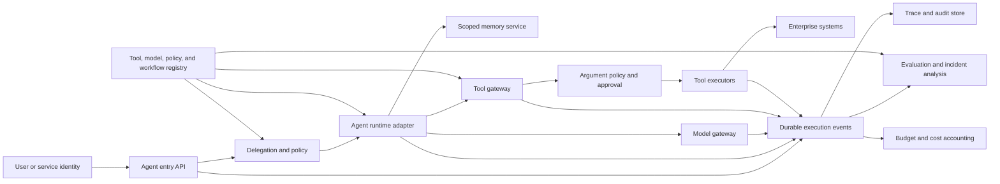

> *Asked in: principal and senior-principal agent architecture, ML system design, safety, and technical-strategy rounds.*

A workable platform executes bounded agent workflows and records what happened. A principal design also creates shared authority, safety, evaluation, and operating contracts across organizations. A senior-principal design decides which contracts should govern several agent products while preserving local innovation, regulatory variation, and a credible exit path.

The platform should centralize control over identity, delegated authority, tool contracts, execution evidence, and release policy. Product teams should retain task semantics, user experience, domain tools, and outcome ownership. One universal agent runtime is not the starting goal.

This page is a reference map. In an interview, state the authority model, draw the execution path, and take one or two technical boundaries deep.

## The prompt

A global company has 40 teams building agents for customer support, software engineering, sales operations, finance, research, and internal productivity. The agents use several model providers and about 300 tools.

Current systems evolved independently. They have incompatible tool schemas, permissions embedded in prompts, ad hoc memory, incomplete traces, and different retry behavior. Teams cannot compare evaluations or identify every product affected by a compromised tool.

A recent support agent retried an account-credit operation after a timeout. The first call had succeeded, but the response was lost. The retry issued a second credit. In a separate incident, an uploaded document persuaded a research agent to call an internal export tool with broader scope than the user expected.

Design a platform for the next two years. The first production release must arrive in one quarter. Existing agents cannot all migrate at once. Some regions require local data processing and different approval rules.

## State the boundary before choosing a framework

Build a shared agent control plane and tool gateway around several execution runtimes.

The first release should provide:

1. workload and user identity;
2. explicit delegated authority;
3. versioned tool contracts;
4. durable execution and tool-call state;
5. policy enforcement before side effects;
6. complete outcome and audit evidence;
7. budgets and termination controls;
8. evaluation and staged release gates.

Keep model planning and domain workflow implementations behind adapters at first. Teams can use different runtimes if they emit the shared events and call tools through the enforced gateway.

This choice addresses the two incidents directly. A retry cannot repeat an unknown side effect without reconciliation. Untrusted document text cannot grant authority because permissions come from identity and policy, not model-generated instructions.

## Clarify product, authority, and risk

Ask questions that change the platform contract.

### Users and products

- Are agents assisting a user, acting asynchronously, or operating without immediate review?
- Which products face customers, employees, or other software agents?
- Does the user expect advice, a draft, a reversible action, or an irreversible action?
- Which workflows cross product or organization boundaries?
- What fallback remains useful when action execution is unavailable?

### Tools and effects

- Which tools only read data?
- Which tools create reversible state?
- Which tools move money, publish content, delete data, change access, or execute code?
- Do existing tools support idempotency keys and status lookup?
- Can a tool describe its data classes, region, cost, and approval requirements?

### Identity and authorization

- Does the agent act as the user, as a service, or through delegated joint authority?
- Which permissions depend on tenant, purpose, time, amount, region, or resource?
- What authority can a team grant without a central review?
- Which actions require confirmation or a second approver?
- How quickly must a compromised tool or model version lose access?

### Data and memory

- Which context may cross sessions, teams, regions, or products?
- What retention and deletion rules apply to prompts, tool results, traces, and memory?
- Can untrusted retrieved content reach a tool argument?
- Which data may be sent to each model provider?
- What provenance must remain visible to users and auditors?

### Scale and reliability

- How many workflows start per second?
- How long can they run, and how many tool calls can they make?
- Which workflows need interactive latency versus durable asynchronous execution?
- What completion, recovery, and audit targets apply by risk class?
- What is the allowed cost per task and per tenant?

Assume 2,000 workflow starts per second at peak. Most finish within one minute and five tool calls. The long tail can last hours. Ten tools move money or alter access. Fifty tools read restricted internal data. The rest are lower-risk reads or reversible updates.

## Define success around safe useful work

The platform exists to help teams ship useful agent workflows with bounded authority and comparable evidence. Counted tool registrations or migrated agents are weak outcomes.

### Product outcomes

- task success under the product's real completion definition;
- user correction and escalation rate;
- time to useful completion;
- abandonment and repeated-attempt rate;
- reversible versus irreversible action outcomes;
- downstream errors discovered after the session.

### Safety and control

- unauthorized action attempts blocked before dispatch;
- high-risk actions with valid confirmation and approval evidence;
- duplicate or ambiguous side effects;
- policy bypass through direct tool access;
- cross-tenant or cross-region data exposure;
- time to revoke a tool, model, or credential;
- unresolved executions with unknown external state.

### Platform delivery

- time to register and safely expose a tool;
- time to move an existing agent into observe-only mode;
- fraction of workflows producing complete execution evidence;
- release time for a policy-compliant agent change;
- support tickets and manual approvals per workflow team;
- time to diagnose a failed or unsafe trajectory.

### Efficiency

- cost per successful task;
- model tokens and tool calls per successful task;
- p50, p95, and p99 workflow duration;
- queue delay by tenant and priority;
- wasted calls after a terminal outcome;
- shared gateway and trace-storage cost.

Do not combine safety and task success into one average. A workflow that completes through an unauthorized action fails even when the user receives the desired result.

## Classify actions by consequence

Risk belongs to the tool action, arguments, identity, and context. A tool name alone is too coarse.

Use a small action taxonomy.

| Class | Example | Default control | Completion evidence |
| --- | --- | --- | --- |
| Read-only | Search approved documents | Automatic within scoped authority | Authorized response tied to source versions |
| Reversible write | Create a draft ticket | Automatic with audit and undo window | Authoritative write ID and tested undo deadline |
| Consequential reversible | Change a reservation | Confirmation, limits, and compensation path | Committed external state and valid compensation action |
| Irreversible or regulated | Send funds, delete records, grant access | Strong authentication, explicit approval, and narrow policy | Authoritative commit ID, approval record, and immutable audit event |
| Code or infrastructure | Run code, deploy, change production state | Sandbox or controlled executor with reviewed scope | Executor result plus observed target state and health |

Arguments can raise risk. Reading one user's account differs from exporting every account. A transfer below a threshold differs from a large transfer. Policy should inspect structured arguments and resource scope before dispatch.

Each action contract should state whether it is reversible, compensatable, or neither. Compensation is a new action with its own failure modes. It does not erase the original event.

## Establish platform invariants

The architecture follows from invariants that remain true across models and runtimes.

1. **Authority comes from verified identity and explicit delegation.** Prompt text cannot add permission.
2. **Every tool call uses a versioned contract.** The contract describes schema, side effects, retry behavior, ownership, and policy metadata.
3. **Every consequential call has durable state before dispatch.** The platform can distinguish requested, authorized, dispatched, succeeded, failed, and unknown outcomes.
4. **Unknown is different from failed.** A lost response after dispatch must be reconciled before another side effect.
5. **Untrusted content remains untrusted.** Retrieved text, tool output, memory, and user uploads cannot silently become control instructions.
6. **Every execution has bounded resources and termination rules.** Loops cannot consume unlimited time, tokens, calls, or money.
7. **High-risk decisions produce independent evidence.** Model explanations do not replace policy checks or final-state verification.
8. **Tenants and regions have isolated data and authority.** A shared runtime does not imply shared memory or credentials.
9. **A release can be stopped without replacing every agent.** Policy, model, tool, and runtime versions can be revoked independently.
10. **The common contract can outlive the current framework.** Execution evidence and tool identities remain portable.

These invariants give teams freedom inside a bounded system. They also define what the platform team must operate reliably.

## Separate control, execution, and evidence planes



### Control plane

The control plane owns identities, versions, policy, desired state, release status, and revocation. It answers what may run and which contracts apply.

### Execution plane

Runtime adapters conduct model calls, context assembly, planning, and workflow transitions. Tool executors perform side effects within isolated credentials and environments.

### Evidence plane

An append-only event stream records execution state. Derived stores support product metrics, debugging, evaluation, cost, and audit.

Do not put high-volume prompts and tool payloads inside the transactional control database. Store references, hashes, redacted summaries, and required metadata there. Sensitive payloads belong in access-controlled stores with separate retention.

## Model identity and delegated authority

An agent acts with authority borrowed from a user, service, team, or approved automation policy. Represent that delegation explicitly.

```text
Delegation
  delegation_id
  principal_identity
  agent_workload_identity
  tenant_id
  purpose
  allowed_actions
  resource_scope
  argument_constraints
  region
  expires_at
  confirmation_policy
  approval_policy
  issuer
  policy_version
```

The user identity and agent workload identity are both required. A user may access a record directly while the agent workload is prohibited from exporting it to an external model.

### Short-lived capability

Issue short-lived credentials or capability tokens after policy evaluation. Bind them to the exact tool action, resource scope, tenant, purpose, and expiration.

Do not give a general database credential to the model or agent process. The tool executor receives narrow authority after the gateway approves structured arguments.

Refreshing a capability requires another policy decision. Refresh may preserve or narrow scope; expanding scope requires a new delegation and any required confirmation. Revocation blocks new dispatches within the declared propagation target. A consequential action reauthorizes immediately before dispatch. Revocation after dispatch cannot erase an external effect, so the executor records the timestamp and reconciles the authoritative state.

### Authorization versus instruction

The model chooses a proposed action. The policy service decides whether the action is authorized. The tool implementation performs it.

Keep these responsibilities separate. A system prompt can guide behavior, but it is not a security boundary.

Central security policy should define the minimum floor. Product, tool, and regional owners can add stricter rules within delegated authority. An exception needs an authorized owner, bounded scope, evidence, and expiration rather than an unrestricted override.

### Revocation

The control plane should revoke by:

- user or service identity;
- agent workload;
- model version;
- workflow version;
- tool or tool version;
- tenant;
- region;
- policy rule;
- credential issuer.

Propagate high-risk revocations quickly. Existing long workflows must reauthorize consequential actions instead of relying on authority captured hours earlier.

## Define a complete tool contract

A tool contract should be machine-readable and human-reviewable.

```text
ToolAction
  tool_id
  action_id
  version
  owner
  input_schema
  output_schema
  side_effect_class
  data_classes_read
  data_classes_written
  authorization_attributes
  idempotency_mode
  status_lookup
  timeout_semantics
  compensation_action
  rate_limit
  cost_model
  region_support
  logging_policy
  retention_policy
  deprecation_state
```

Use a common result envelope while keeping the result body tool-specific.

```text
ToolResult
  logical_call_id
  outcome  # succeeded | failed | partial | unknown
  result
  error_code
  external_operation_id
  observed_at
  retry_after
```

`unknown` means dispatch may have created an effect, so transport retry is unsafe until reconciliation. A `partial` result must identify completed effects and the available compensation path. The action contract defines which result fields prove authoritative completion.

### Schema

Use strict structured arguments. Reject unknown fields where safe. Validate types, bounds, enumerations, resource identifiers, and cross-field constraints.

A valid schema does not prove a safe request. A transfer amount can be syntactically valid and unauthorized. Policy evaluates semantics after schema validation.

### Side effects

Declare whether the action is:

- pure read;
- idempotent write;
- idempotent only with a supplied key;
- non-idempotent with status lookup;
- compensatable;
- irreversible.

The platform should not infer retry safety from an HTTP method or tool description.

Use an explicit retry mode:

- `safe_retry`: repeating the logical request converges without a key;
- `key_deduplicated`: the downstream system stores the key and prior result;
- `reconcile_before_retry`: status lookup must prove that no effect occurred;
- `no_automatic_retry`: an unknown outcome requires review or a separate approved action.

### Ownership and service level

The contract identifies an operating owner, escalation path, availability target, timeout meaning, and change policy. Product teams need to know whether a timeout means no work started or the result is unknown.

### Versioning

Compatible additions can remain within a version range. Breaking changes require a new version and a migration period.

Record the exact contract version on every call. A trace that says only `send_refund` cannot explain behavior after the tool changes.

## Enforce policy at the tool boundary

Place a policy enforcement point where every governed call passes before credentials are issued.

The decision uses:

- user and workload identity;
- tenant and region;
- workflow and model version;
- tool action and arguments;
- data classification;
- current delegation;
- prior execution state;
- budget and rate state;
- confirmation and approval evidence;
- policy version.

Return a structured decision:

```text
allow | deny | require_confirmation | require_approval | reduce_scope
```

Include a reason code and policy version. Do not expose sensitive policy details that help an attacker probe hidden boundaries.

### Fail behavior

High-risk actions should fail closed when policy cannot be evaluated. Low-risk read paths may use a narrow cached grant if the risk owner approves that degradation.

A global policy outage should not necessarily remove every assistant response. The runtime can switch to advice-only or draft-only mode while action execution is unavailable.

### Policy conflicts

Region, tenant, product, and central rules can conflict. Define precedence mechanically. A safe default is that the most restrictive applicable rule wins unless an explicit, authorized exception exists.

Exceptions need owner, scope, reason, evidence, and expiration. Permanent undocumented exceptions become another policy system.

## Treat untrusted content as data

Prompt injection is an authority and data-flow problem. It cannot be solved by asking the model to ignore malicious instructions.

Untrusted inputs include:

- user text;
- uploaded files;
- retrieved web pages;
- emails and tickets;
- tool results;
- shared memory;
- generated code;
- messages from another agent.

Tag provenance and trust class when content enters the system. Preserve those labels through retrieval and memory.

### Separate control context

Build context in typed sections:

- platform policy;
- product instructions;
- user request;
- retrieved evidence;
- tool results;
- working state.

The model still receives text, so separation is imperfect. It improves evaluation, filtering, and trace analysis. Security remains at tool authorization and data egress boundaries.

### Data-flow policy

Before a tool call or model call, evaluate whether each data class may flow to that destination. An internal document may be available for local summarization but prohibited from an external model provider or public messaging tool.

### Argument construction

Prefer typed selection from validated identifiers over free-form strings. Resolve a customer, repository, account, or file through an authorized lookup rather than letting untrusted text provide a raw resource path.

### Generated code

Run generated code in a sandbox with bounded filesystem, network, process, secret, time, and compute access. Treat test success as evidence of behavior within the sandbox, not proof of broad safety.

## Use a durable execution state machine

An LLM is nondeterministic. The workflow around it can still have explicit durable state.

```text
created
  -> running
  -> waiting_for_user
  -> waiting_for_approval
  -> waiting_for_tool
  -> completed
  -> failed
  -> cancelled
  -> exhausted
```

Each transition writes an event with expected prior state. Use optimistic concurrency or a compare-and-swap operation so two workers cannot advance the same workflow independently.

### Execution identity

```text
Execution
  execution_id
  tenant_id
  workflow_version
  model_policy_version
  delegation_id
  current_state
  step_number
  budget_state
  created_at
  deadline
  terminal_reason
```

A model response is one event, not the source of truth for workflow state. The runtime validates proposed actions and applies allowed transitions.

### Leases and workers

A worker obtains a time-bounded lease for an execution. If the worker dies, another can resume from durable events after the lease expires.

The resumed worker must not assume that the last external call failed. It reads the tool-call state and reconciles unknown outcomes.

### Cancellation

Cancellation should stop new calls and release leases. It cannot undo a dispatched side effect. The workflow may need compensation or human review before reaching a terminal state.

### Branching and replay

A debug replay can branch from a recorded checkpoint with a different model or policy. It should not repeat real side effects.

Use simulated tools, recorded outputs, or read-only environments. Mark replay events so they cannot contaminate production outcome metrics.

## Design tool-call state for ambiguous outcomes

A tool call needs its own state machine.

```text
proposed
  -> authorized
  -> dispatched
     -> succeeded
     -> failed
     -> outcome_unknown
outcome_unknown
  -> reconciled_success
  -> reconciled_failure
  -> manual_review
succeeded
  -> compensation_requested
compensation_requested
  -> compensated
  -> compensation_failed
```

Write the authorized request durably before dispatch. Include a unique call identifier and idempotency key when the tool supports one.

A partial or irreversible effect moves to manual review. A failed compensation is a new incident, not a successful rollback.

### Idempotency key

Scope the key to the logical action, not the network attempt. Retries of the same logical action reuse it. A later intentional action receives a new key.

The downstream tool must store or derive the result for that key. A client-side key alone does not make a non-idempotent tool safe.

### Unknown outcome

If dispatch may have reached the tool and no result returns, mark the outcome unknown. Then:

1. query tool status by call or idempotency key;
2. inspect authoritative downstream state;
3. retry only when the tool confirms no side effect;
4. escalate if state cannot be determined;
5. compensate only through an approved action.

Never convert unknown to failed merely because a timeout elapsed.

### Tools without safe retry support

Wrap the tool with an executor that maintains a request ledger and reconciliation, or prohibit automatic retry. For irreversible high-risk actions, require stronger confirmation and human handling when the outcome is unknown.

### Exactly-once language

Distributed execution can duplicate messages and workers. Promise one unambiguous logical outcome where contracts support it, not exactly-once physical execution.

Tools with idempotency keys and status lookup can support one logical outcome across repeated network attempts. Tools without those contracts need a reconciliation wrapper or no automatic retry after an unknown result. The runtime should know the declared class before it proposes recovery.

## Add human approval without creating theater

Human review is useful when a person receives enough information, authority, and time to change the decision.

An approval request should contain:

- requested action and target;
- user or service principal;
- agent and workflow version;
- relevant evidence and uncertainty;
- expected effect and reversibility;
- policy reason;
- expiration;
- alternative safe action.

### Confirmation versus approval

**Confirmation** asks the initiating user to verify intent. **Approval** asks an authorized reviewer to accept risk. They are different controls.

Do not ask users to confirm routine low-risk actions repeatedly. Alert fatigue can turn confirmation into an automatic click.

### Approval binding

Bind approval to exact arguments or a narrow range. If the agent changes the recipient, amount, repository, or scope, require a new decision.

### Delegated approval

At scale, central reviewers cannot approve every action. Policy owners define which roles can approve which classes. Product and regional owners can add stricter rules.

Record delegated authority and review it periodically. The platform team operates enforcement but does not own every domain decision.

## Partition working state and durable memory

“Agent memory” combines several stores with different semantics.

### Execution state

Current plan, completed steps, pending calls, budgets, and approvals belong to the durable workflow state. They expire with the execution unless policy requires longer retention.

### Conversation context

Recent user and agent messages support continuity. Keep an authoritative transcript separately from compacted context sent to the model.

### User preferences

Stable preferences require user visibility, correction, purpose, and retention controls. A model inference should not silently become a durable preference.

### Domain knowledge

Approved documents and structured records belong in governed retrieval systems. Memory should reference their identity and version rather than copy unrestricted content into a general vector store.

### Learned workflow knowledge

Teams may store successful plans, examples, or summaries. Validate provenance and prevent one tenant's material from entering another tenant's context.

### Audit evidence

Security and compliance traces have restricted access and independent retention. They should not become normal agent context.

## Make memory writes explicit

A memory write is a tool action with policy.

The contract should include:

- memory class;
- subject and tenant;
- source execution;
- provenance;
- confidence;
- visibility;
- retention;
- correction path;
- deletion behavior;
- permitted readers.

Do not let the model decide retention from prose alone. Product code selects a memory policy and the gateway enforces it.

### Poisoning

Untrusted content can poison memory and influence future sessions. Restrict which sources can create durable entries. Use review, confidence, provenance, and expiration for inferred knowledge.

Evaluate delayed attacks where a malicious document creates memory used days later.

For example, a document might create a false preference that suppresses future warnings. Inject the entry, start a later session, and verify that current delegation and required confirmation still win. A release fails if prior memory can weaken either control.

Deletion authority is separate from write authority. A user may request removal of a preference while a data owner controls governed knowledge. Record that deletion occurred without retaining the prohibited payload, then remove or invalidate derived memory according to policy.

### Deletion guarantees

A deletion first creates a tombstone that blocks the authoritative read path. Derived indexes, summaries, caches, and regional replicas invalidate the memory identity within a declared service level. Each store reports completion independently. Until every required store confirms, retrieval treats the entry as unavailable and the deletion remains pending.

A partial failure pages the memory owner and keeps the tombstone active. Verification queries test that the subject is no longer retrievable across tenants and regions. Removing memory and indexes does not remove influence from a trained model. Any model trained on the payload follows a separate lineage, retraining, approved unlearning, or retirement policy.

### Context compaction

Summaries reduce cost but can omit constraints or convert uncertainty into fact. Keep source links and important structured state outside the summary.

Test compaction across long tasks. Compare decisions before and after compaction, especially permissions, user intent, unresolved tool outcomes, and negative constraints.

## Route model calls through a gateway

A model gateway gives one place for provider policy, routing, budgets, telemetry, and revocation.

Record:

- provider and model version;
- request policy and region;
- context classes and token counts;
- tool schema version;
- latency, errors, and retries;
- usage and cost;
- safety settings;
- output identity;
- cache behavior.

### Routing

Choose models by task, risk, latency, cost, and data policy. A small model may route requests or extract structured fields. A stronger model may plan ambiguous work. Some high-risk decisions should use deterministic policy or human review rather than a larger model.

### Provider failure

Fallback to another model only when policy, tool-calling behavior, context size, and evaluation support it. A provider swap can change action distribution even when final text quality looks similar.

Evaluate each fallback pair. Reasoning-focused and instruction-focused models may propose different tool sequences, timing, and costs under the same workflow.

### Caching

Cache only when identity, context, tool state, and freshness make reuse valid. Never reuse a prior authorization decision after delegation, policy, or resource state changes.

### Model retries

A repeated model call can propose a different action. Treat it as a new attempt with its own output identity. Do not confuse model-call retry with safe tool-call retry.

## Isolate tool execution

The tool gateway should separate authorization from execution credentials.

### Credential broker

Issue narrow short-lived credentials to executors. Avoid placing reusable secrets in prompts, model context, traces, or general runtime environment variables.

### Network and data boundaries

Restrict egress and destinations by tool action. A database-read tool should not also reach arbitrary internet hosts.

### Code execution

Use ephemeral sandboxes with resource limits, clean base images, restricted mounts, controlled package sources, and captured artifacts. Separate build, test, and production deployment authority.

### Browser and user-interface tools

Bind browser sessions to the initiating user and origin. Protect against cross-site actions, hidden instructions, file uploads, and stale authentication.

### Tool composition

Two individually allowed tools can create an unsafe chain. Reading private data and sending a message may produce exfiltration.

Evaluate information flow across the trajectory. Policy can restrict destinations based on data classes observed earlier in the execution.

## Bound loops, concurrency, and budgets

Each execution needs limits on:

- wall-clock time;
- model calls;
- tool calls;
- tokens;
- monetary cost;
- concurrent branches;
- retries;
- data read or written;
- approval wait time.

A limit can stop a loop without declaring success. Use terminal reasons such as completed, user-cancelled, policy-denied, budget-exhausted, deadline-exceeded, or unresolved-side-effect.

### Loop progress

Detect repeated plans, identical failing calls, no state change, and oscillation between actions. A learned judge can help, but deterministic counters and state comparisons should enforce hard limits.

### Concurrency

Parallel reads can reduce latency. Parallel writes can violate order or invariants.

Declare dependencies and conflict keys. Serialize actions that modify the same account, document, repository, or resource unless the downstream contract supports safe concurrency.

### Tenant fairness

Use tenant quotas, weighted queues, burst limits, and priority classes. One team running long research agents should not starve customer support.

Reserve emergency capacity for incident and safety workflows. Review whether priority labels reflect real business needs instead of permanent privilege.

## Make multi-agent coordination explicit

Use multiple agents only when decomposition, specialization, or independent checking provides measured value.

Each agent needs:

- workload identity;
- role and allowed actions;
- input and output contract;
- budget;
- shared-state access;
- termination rule;
- parent execution;
- evidence requirements.

### Shared state

Use a structured task graph or event store. Do not rely on agents reading a shared chat transcript and inferring ownership.

### Delegation

A parent cannot grant authority it does not possess. Child agents receive a subset of the parent's capability and budget.

### Independent checking

A reviewer agent should use different evidence or constraints when possible. Two agents using the same prompt, model, and data can reproduce the same error.

### Deadlock and duplication

Tasks need explicit ownership, lease, and completion state. Detect two agents attempting the same side effect. Bound recursive delegation depth.

For example, an agent claims a “create ticket” task in the shared task graph with a lease and logical action ID. Another agent sees the claim and waits. After lease expiry, a replacement reconciles the tool-call state before reclaiming, so worker loss cannot create a second ticket.

Use the term **runtime delegation** for user, service, parent-agent, and child-agent capability transfer. Use **delegated technical authority** for decision rights held by principal engineers and domain owners. The two mechanisms solve different problems.

## Build observability for decisions and effects

Separate several views.

### Execution health

Track queue delay, workflow duration, step count, retries, lease loss, terminal reason, and unresolved state.

### Model behavior

Track model routing, token use, tool proposal rates, denied actions, repeated plans, and confidence or uncertainty signals where meaningful.

### Tool health

Track dispatch latency, outcome class, unknown results, reconciliation time, error codes, rate limits, and downstream saturation.

### Policy health

Track allow, deny, confirmation, approval, and exception rates by action and tenant. Sudden changes can indicate a model update, attack, or policy error.

### Product outcomes

Track task success, user corrections, escalations, downstream incidents, and delayed results.

### Cost

Track cost by execution, task class, tenant, model, tool, and outcome. Average cost hides runaway tails.

## Preserve useful traces without over-collecting

A trace may contain private prompts, credentials, tool output, customer records, source code, and model reasoning. More logging can increase risk.

Use tiers:

- event metadata for every execution;
- redacted structured arguments for governed calls;
- sampled payloads for approved debugging;
- restricted full evidence for incidents and high-risk audit;
- no storage for prohibited data classes.

Encrypt stores, separate access, and record trace reads. Use field-level redaction before general analytics.

### Reasoning traces

Do not require private model reasoning as the security record. Record proposed actions, observable outputs, policy decisions, tool effects, and user-visible rationale.

### Deletion

Deletion should remove or redact governed payloads while preserving enough structural evidence to explain that an event occurred. Record the deletion action without retaining prohibited content.

## Evaluate agents at several layers

A release gate should combine deterministic invariants, task outcomes, trajectory diagnostics, and adversarial tests.

### Final state

Did the workflow produce the correct external state? For support, inspect account status. For coding, inspect repository state and tests. For research, inspect artifacts and claims.

### Permission and side effects

Did every action stay within delegated authority? Were required confirmation and approval present? Did the agent create forbidden or unnecessary effects?

### Trajectory

Measure tool selection, argument correctness, recovery, repeated calls, step efficiency, and termination.

Do not enforce one ideal trajectory when several valid approaches exist. Use hard checks for invariants and softer analysis for efficiency or style.

### Product outcome

Measure whether users achieved the intended result, including delayed failures and corrections.

### Cost and latency

Report success at fixed cost, cost per success, and tail behavior. A higher success rate can be unacceptable if rare loops consume unbounded resources.

## Construct representative evaluation suites

Build scenario families across:

- task type and difficulty;
- tool availability and failure;
- user ambiguity;
- permission boundaries;
- data sensitivity;
- prompt injection channels;
- long context and memory;
- multi-turn correction;
- model and provider variation;
- tenant and region;
- consequential actions;
- unknown side effects.

Keep held-out families, not only held-out strings. A model can memorize one attack template or tool sequence.

### Deterministic checks

Use deterministic graders for:

- final database or repository state;
- authorization;
- schema and argument bounds;
- required approvals;
- forbidden data flow;
- duplicate effects;
- budget and termination;
- artifact integrity.

### Semantic graders

Use human or calibrated model judgment for usefulness, explanation quality, and ambiguous completion. Blind comparisons where possible. Measure agreement and inspect disagreements.

### Safety-utility frontier

Measure false allows and false blocks by action consequence. High-risk irreversible actions favor missed-harm reduction, while low-risk assistance may tolerate more permissive thresholds. Report blocked valid work separately so a safer policy does not hide unusable products.

### Stochasticity

Run repeated samples on a representative subset. Report uncertainty and failure probability, especially for rare severe outcomes.

A model that succeeds nine times and causes one severe unauthorized action is not summarized adequately by 90% success.

## Test the whole system adversarially

Threats can enter through users, retrieved content, tools, memory, another agent, generated code, or compromised infrastructure.

Test:

- direct and indirect prompt injection;
- tool argument injection;
- confused-deputy behavior;
- permission escalation;
- cross-tenant retrieval;
- data exfiltration through allowed tools;
- unsafe retry and duplicate effects;
- forged tool output;
- memory poisoning;
- delayed triggers;
- approval fatigue;
- sandbox escape;
- cost and denial-of-service attacks;
- policy downgrade during fallback.

Adaptive red teams should know the architecture and pursue actual assets. A static jailbreak list measures only one input channel.

Turn confirmed failures into regression tests without publishing sensitive exploit details. Track owner, severity, fix, retest, and residual risk.

## Use production evidence carefully

Production traces reveal real tasks and failures, but the deployed policy selected what occurred.

Sample:

- successes and failures;
- escalations;
- long and expensive tails;
- denied actions;
- unknown outcomes;
- low-volume high-risk tools;
- new tenants and regions;
- sessions with user correction.

Protect privacy and avoid training directly on sensitive traces without a valid purpose and review.

Offline replay cannot estimate every new policy. It can test deterministic policy, parser, and tool compatibility. It cannot reveal user reactions to actions never taken.

## Stage releases by risk and authority

A release sequence can be:

1. offline scenario and adversarial tests;
2. replay against recorded events with simulated side effects;
3. shadow planning without tool dispatch;
4. read-only tools on internal users;
5. reversible writes with confirmation;
6. narrow canary for consequential actions;
7. controlled product experiment where suitable;
8. progressive tenant and region rollout;
9. long-term monitoring and retained holdouts.

Do not jump from benchmark success to broad write authority.

### Release unit

Version model, workflow, tools, policy, memory behavior, and runtime together through a deployment manifest. Individual components can roll independently only within declared compatibility ranges.

### Stop conditions

Stop or reduce authority on:

- unauthorized effect;
- unexplained duplicate action;
- cross-tenant exposure;
- severe policy regression;
- unresolved high-risk outcome beyond its service level;
- cost or latency breach that removes safe review;
- critical evaluation evidence becoming invalid.

### Rollback

Rollback may restore a prior workflow or model, revoke one tool, tighten a policy, disable memory writes, or switch to advice-only mode. The safest response is often narrower than a full service rollback.

## Design for degraded operation

### Model provider outage

Queue durable asynchronous work, route only evaluated compatible tasks, or switch to a lower-capability advice mode. Do not expose a new provider to restricted data without policy.

### Policy service outage

Block high-risk tools. Use narrow cached grants only for approved low-risk actions. Continue text or read-only assistance if safe.

### Tool outage

Explain the unavailable action, preserve workflow state, and offer retry later or a manual path. Do not loop on the failing tool.

### Event store delay

Do not dispatch consequential calls when durable pre-dispatch evidence cannot be written. Low-risk stateless responses may continue if policy allows.

### Memory unavailable

Continue with explicit session context or ask the user to restate required information. Do not invent prior preferences.

### Budget service unavailable

Use conservative local limits. High-cost asynchronous work may queue until budget state is reliable.

## Isolate tenants, regions, and environments

### Tenant isolation

Partition execution state, memory, credentials, retrieval, traces, and quotas by tenant. Include tenant identity in every key and authorization decision.

Test missing-tenant and confused-tenant failures. A global cache must include every security-relevant dimension in its key.

### Regional processing

Route model, memory, tools, and traces according to data residency and product policy. A global control plane can distribute policy metadata while regional data planes retain payloads.

Avoid sending raw payloads through the global plane. Replicate only approved identities, versions, and aggregate health.

### Environment isolation

Separate development, evaluation, staging, and production credentials. Replays and tests cannot call production side effects.

A production tool contract may have a simulated evaluator implementation with the same schema but different authority.

## Attribute and control cost

Agent cost includes:

- repeated model context;
- planning and reflection calls;
- tool latency and usage charges;
- retrieval and memory;
- sandbox compute;
- approvals and support;
- trace storage;
- failed and abandoned work.

Track cost per successful task and tail percentiles. Set budgets by task class, tenant, and risk.

### Cost controls

- route simple steps to smaller evaluated models;
- compact context with provenance;
- cache stable read results within policy;
- stop repeated plans;
- cap branches and retries;
- batch compatible background work;
- reserve expensive review for uncertain or high-impact cases;
- require estimates for long asynchronous workflows.

A cheaper model can increase total cost if it needs more steps or causes more corrections. Compare complete workflow economics.

### Budget response

At a soft limit, ask the runtime to summarize progress and choose a bounded next step. At a hard limit, stop new calls and return a partial result or escalation.

Do not let the model raise its own hard budget.

## Decide what to build, buy, and standardize

Evaluate components separately.

### Common candidates to buy or adopt

- base model APIs and gateways;
- generic workflow execution;
- queueing and durable scheduling;
- secrets management;
- telemetry storage;
- policy language or engine;
- sandbox infrastructure.

### Common candidates for company-specific integration

- enterprise identity and delegation;
- tool contracts and ownership;
- data-flow policy;
- approval semantics;
- evaluation scenarios;
- release evidence;
- incident and revocation workflows;
- cost attribution.

The differentiating work is often the connection between enterprise authority and product outcomes. Building a new orchestration framework may provide little value if reliable open systems already exist.

### Portability

Keep tool contracts, execution events, evaluation cases, policy inputs, and deployment manifests independent from one runtime when practical.

Do not flatten every vendor capability into a weak common denominator. Use adapters at clear boundaries and allow a product to depend on a provider-specific feature explicitly.

### Exit test

Ask what must move if the model provider, orchestration runtime, policy engine, or memory store changes. Price the migration before adoption.

## Migrate existing agents incrementally

### Phase 0: inventory and baseline

Inventory agents, tools, direct credentials, risk classes, incidents, cost, and owners. Identify unsupported side effects and unknown retry semantics.

Select two pilots:

- one internal read-heavy assistant;
- one customer workflow with reversible actions and clear outcomes.

### Phase 1: observe-only evidence

Wrap tool calls or add adapters that emit common events. Do not enforce new policy yet. Compare the platform trace against current behavior.

Find direct calls that bypass the gateway. Measure missing identities, schemas, and outcome states.

### Phase 2: enforced low-risk gateway

Move read-only and reversible pilot tools behind schema validation, delegation, budget, and trace contracts.

Keep a tested escape path for incidents, with explicit owner and expiration.

### Phase 3: consequential actions

Add idempotency, status lookup, confirmation, approval, and reconciliation. Run simulated and canary traffic before broad authority.

### Phase 4: shared evaluation and release

Require deployment manifests and comparable evidence for migrated workflows. Introduce model and policy revocation.

### Phase 5: retire bypass paths

Remove direct production credentials only after the gateway meets reliability targets and each product has a degradation path.

One authority should control each action at a time. Dual enforcement can produce contradictory decisions and ambiguous incidents.

## Define ownership around semantics

### Central platform owns

- identity integration and enforcement mechanics;
- tool registry and gateway reliability;
- execution event contract;
- policy evaluation infrastructure;
- common budgets and telemetry;
- release and revocation mechanics;
- migration tooling;
- platform incident response.

### Product teams own

- task definition and user experience;
- agent workflow and prompts;
- domain outcome metrics;
- tool selection;
- product fallback;
- user confirmation design;
- product incidents and residual risk.

### Tool owners own

- action semantics;
- schema and compatibility;
- side-effect and retry contract;
- service level;
- downstream data policy;
- status lookup and compensation;
- tool incidents.

### Security and policy owners own

- risk classification;
- authorization requirements;
- approval rules;
- exception decisions;
- threat models;
- audit interpretation.

The platform team should not become the owner of every agent decision. It provides enforceable contracts and evidence.

## Make adoption reveal product quality

Offer a paved path:

- register a workflow and owner;
- select model and data policy;
- discover approved tools;
- generate typed clients;
- run local simulated tools;
- execute standard evaluation suites;
- deploy to shadow and canary;
- inspect cost and traces;
- request a bounded exception.

Measure time to first safe workflow, ticket-free releases, debugging time, and repeated bypass attempts.

Mandatory gateway use may be justified for consequential production actions. Do not mandate one planning framework when shared risk does not require it.

Exceptions are data. Repeated exceptions can reveal a missing capability, an overly broad policy, or a boundary that should remain product-owned.

## Walk through the duplicate-credit incident

A support agent proposes a $50 account credit.

1. The user and workload identities establish a valid delegation.
2. The tool gateway validates account, amount, reason, tenant, and region.
3. Policy requires user confirmation because the action moves value.
4. The confirmed request receives logical call ID `credit-123` and idempotency key `k-456`.
5. The platform writes authorized state before dispatch.
6. The executor sends the request with `k-456`.
7. The account system commits the credit and stores the result under `k-456`.
8. The network drops the response.
9. The executor marks outcome unknown instead of failed.
10. Reconciliation queries the account system by `k-456`.
11. The system returns the committed credit identifier.
12. The platform marks the original call succeeded and does not issue another credit.
13. The final response cites the completed action and audit identifier.

If the downstream system cannot query status or honor idempotency, automatic credits should remain disabled until a safe wrapper or manual process exists.

## Walk through the malicious-document incident

A research agent reads an uploaded report containing instructions to export internal data.

1. The ingestion service labels the report as user-provided untrusted content.
2. Retrieval preserves source and trust metadata.
3. The runtime places the passage in the evidence section, not the platform-policy section.
4. The model proposes an export call.
5. The gateway sees restricted source data in execution context and an external destination.
6. Data-flow policy denies the call before issuing credentials.
7. The denial event records policy version and reason class.
8. The runtime can explain that the requested export is not permitted and offer an approved internal summary.
9. The event enters injection and data-flow evaluation sampling.

The model may still follow the malicious instruction in its reasoning. The security outcome depends on enforced authority and data flow, not obedience to a prompt.

## Staff-level decisions

A staff answer should make the execution and migration contracts precise.

1. Put identity, delegation, tools, state, and evidence behind stable interfaces.
2. Treat unknown tool outcomes separately from failure.
3. Preserve trust and provenance through context and memory.
4. Add bounded budgets and tested degraded modes.
5. Pilot across two different workflows.
6. Align platform, product, tool, and security ownership.
7. Measure adoption through safe delivery and incident outcomes.

The candidate should descend into one mechanism such as policy evaluation, idempotency, state transitions, memory isolation, or evaluation.

## Principal-level decisions

A principal answer chooses the shared boundary across organizations.

1. Centralize delegated authority and consequential tool access.
2. Standardize execution evidence and release policy before planning runtimes.
3. Keep domain tools and product outcomes with their owners.
4. Define which low-risk capabilities can remain local.
5. Balance platform reliability, migration, product delivery, and retirement.
6. Preserve runtime and provider exit paths.
7. Establish evidence that expands, narrows, or stops each shared capability.
8. Develop technical owners who can carry policy, tool, runtime, and evaluation domains.

Principal scope appears in portfolio and authority choices, not the number of boxes in the diagram.

## Senior-principal decisions

“Senior principal,” “distinguished,” and equivalent titles vary sharply across employers. Treat this section as a scope archetype, not a universal level mapping.

A senior-principal answer shapes several durable technical directions and the system that lets principal engineers own them.

### Define a doctrine, not one implementation

The doctrine could be:

- authority is explicit and time-bounded;
- side effects are typed and reconcilable;
- untrusted content never grants authority;
- every governed action produces portable evidence;
- products retain outcome ownership;
- regional policy can become stricter without forking identity.

Specific runtimes, models, and stores can change under those constraints.

### Federate technical authority

Central architecture should not make one senior person the approval bottleneck. Delegate ownership to principal-level leaders for tool contracts, evaluation, runtime, policy, and regional implementation.

Define decision rights, interface review, incident authority, and escalation. The senior-principal contribution is the technical system that keeps those decisions coherent.

### Balance several portfolios

The company must invest in platform control, model capability, product workflows, security, migration, and retirement. Funding every central capability can starve product evidence. Funding only products preserves duplicated risk.

Set review points around measurable constraints. Reallocate when incident, adoption, cost, or model change invalidates the current balance.

### Coordinate external constraints

Model providers, regulators, enterprise customers, open standards, and tool vendors can change the design. Preserve regional and provider variation behind stable identities and evidence.

Decide when a company-specific contract should become an open interface and when external standardization would freeze an immature design.

### Design succession and reversal

The direction should survive executive or architecture leadership changes. Decision records, owners, compatibility policy, incident practice, and portable evidence reduce dependence on oral history.

State which assumptions would reverse centralization. For example, a regulated product may need a separate execution plane while retaining common tool and audit contracts.

### Retain technical depth

The senior-principal candidate should still defend one hard boundary. Examples include unknown side effects, capability-token scope, event consistency, cross-tool data flow, evaluator support, or regional failover.

Broad scope without a defensible mechanism sounds ceremonial.

## Compare rejected architectures

### One universal agent runtime

It simplifies onboarding but couples every product to one planning model and release cadence. Start with contracts around authority and evidence. Consolidate runtime only when operating evidence supports it.

### Permissions in prompts

This is easy to implement and impossible to enforce. Prompts guide model behavior. Identity and policy enforce authority.

### Direct tool credentials in each agent

This preserves team speed but prevents central revocation, consistent audit, and safe cross-tool data flow. Move consequential calls through the gateway.

### Retry every timeout

This improves apparent completion while creating duplicate side effects. Unknown outcomes need status lookup or reconciliation.

### Store every trace forever

This helps debugging while increasing privacy, security, and cost risk. Use classified retention and restricted evidence tiers.

### Human approval for every write

This appears safe but produces delay and approval fatigue. Match confirmation and approval to consequence, reversibility, and uncertainty.

### Central team owns all tools

This creates a queue and disconnects contracts from domain semantics. Tool owners retain semantics and operation under shared requirements.

## Structure a 60-minute interview

### Minutes 0 to 7: scope authority and incidents

Clarify users, action classes, identity, regions, scale, and current failures. State the control-plane and gateway thesis.

### Minutes 7 to 15: invariants and architecture

Define delegated authority, versioned tools, durable state, evidence, budgets, and tenant isolation. Draw control, execution, and evidence planes.

### Minutes 15 to 27: deep technical boundary

Choose one:

- policy and capability scope;
- tool-call idempotency and reconciliation;
- event-sourced workflow state;
- memory provenance and data flow;
- multi-agent coordination;
- regional and tenant isolation.

### Minutes 27 to 38: evaluation and rollout

Cover final-state checks, permissions, trajectories, adversarial suites, stochasticity, shadow mode, staged authority, stop conditions, and rollback.

### Minutes 38 to 48: migration and operation

Define pilots, observe-only integration, one authority per action, degraded modes, ownership, cost, and adoption evidence.

### Minutes 48 to 55: principal portfolio

Choose shared versus local capabilities, build versus buy, provider portability, retirement, and quarterly decisions.

### Minutes 55 to 60: senior-principal scope

Explain doctrine, delegated technical authority, external constraints, succession, and evidence that would reverse the direction.

## Distinguish answer levels

### Senior

Designs a reliable agent workflow for one product. It covers tools, state, evaluation, monitoring, and safe user confirmation.

### Staff

Defines reusable contracts, safe retries, migration, and ownership across several teams. It remains precise under a technical follow-up.

### Principal

Chooses the platform boundary across organizations, balances migration and product delivery, preserves provider options, and delegates ownership to technical leaders.

### Senior principal

Defines durable doctrine across several principal-owned directions. It coordinates region, provider, security, and product constraints while preserving local ownership, succession, and a path to reverse major choices.

## Observer scorecard

Score each dimension from 0 to 2.

| Dimension | 0 | 1 | 2 |
| --- | --- | --- | --- |
| Authority | Trusts prompts | Names permissions | Binds identity, delegation, arguments, and credentials |
| Tool contract | Names schemas | Adds side effects | Defines retry, status, policy, version, and ownership |
| State | Keeps a transcript | Adds checkpoints | Separates workflow and tool-call state with reconciliation |
| Security | Says filter injections | Adds allowlists | Enforces data flow, sandbox, tenant, and approval boundaries |
| Evaluation | Measures task success | Adds trajectories | Tests final state, authority, severe tails, and held-out families |
| Reliability | Adds retries | Adds fallback | Handles unknown effects, degraded modes, revocation, and rollback |
| Migration | Requires adoption | Suggests pilots | Transfers authority incrementally and retires bypass paths |
| Principal scope | Adds more teams | Gives a roadmap | Chooses shared boundaries, portfolio, owners, and exit evidence |
| Senior-principal scope | Says company-wide | Adds multi-year scale | Defines doctrine, federated authority, succession, and reversal |
| Communication | Lists components | Uses a structure | Preserves the decision while changing depth under challenge |

A principal target should score 2 on authority, state, migration, and principal scope. A senior-principal target should also score 2 on delegated authority, external constraints, succession, and reversal.

## Strong signals

- Starts with authority and consequence before model choice.
- Treats permissions in prompts as guidance rather than enforcement.
- Defines logical action identity and unknown outcomes correctly.
- Preserves provenance through retrieval, memory, and tool arguments.
- Evaluates final state, permission, trajectory, severe failures, and cost.
- Stages increasing authority instead of launching broad write access.
- Keeps product and tool semantics with domain owners.
- Measures platform value through safe delivery and operating outcomes.
- Preserves provider and runtime exit paths.
- Distinguishes principal portfolio ownership from senior-principal technical doctrine.

## Weak signals

- Starts with an agent framework and model provider.
- Gives the model direct broad credentials.
- Retries side effects after every timeout.
- Treats a transcript as durable workflow state.
- Stores untrusted memory without provenance or expiration.
- Uses another model as the only security or evaluation layer.
- Requires human approval for every write without considering fatigue.
- Forces one runtime before proving shared contracts.
- Calls company-wide scope senior-principal without delegated leaders or reversal criteria.
- Cannot descend from doctrine into one technical invariant.

## Changed-condition follow-ups

1. A region prohibits sending customer text to the primary model provider. What remains shared?
2. A tool reports success but the downstream state is inconsistent. Which record is authoritative?
3. A user revokes access while an asynchronous workflow is waiting for approval. What happens next?
4. A product needs a tool action that cannot support idempotency or status lookup. Can it join the platform?
5. A malicious tool result asks the agent to send prior context to an external endpoint. Where is it blocked?
6. A model update doubles denied-action proposals while task success improves. Do you ship?
7. A research agent needs broad read access for one week. How do you grant and review it?
8. One tenant consumes half the model budget during a customer incident. How does scheduling change?
9. A vendor offers an integrated runtime, memory, and tool gateway. Which contracts must remain portable?
10. Product teams bypass the gateway because policy evaluation adds 100 milliseconds. What do you change?
11. A regulator requires explanations for every denied financial action. What evidence is safe and sufficient?
12. Two principal engineers disagree on whether memory should be centralized. How does the decision proceed?
13. A new model can plan across 1,000 steps. Which platform limits should change, if any?
14. The platform reduces incidents but slows agent launches by 40%. Is the program succeeding?
15. The executive sponsor leaves. Which mechanisms keep the direction valid, and which decisions reopen?
16. An external tool standard gains adoption but omits your data-flow policy. Do you adopt, extend, or reject it?

For each follow-up, state which invariant changes, which authority decides, which evidence is required, and what remains reversible.

---

*Related: [agent safety control-plane design](/questions/design-agent-safety-control-plane/), [evaluate an agent](/questions/evaluate-an-agent/), [LLM security threat models](/concepts/llm-security-threat-models/), [design a multi-team ML platform](/questions/design-multi-team-ml-platform/), and [the annotated upper-IC agent-platform mock](/guides/annotated-upper-ic-agent-platform-mock/).*
