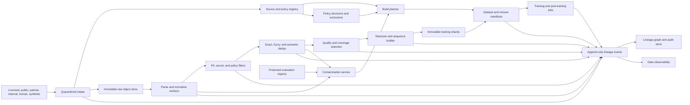
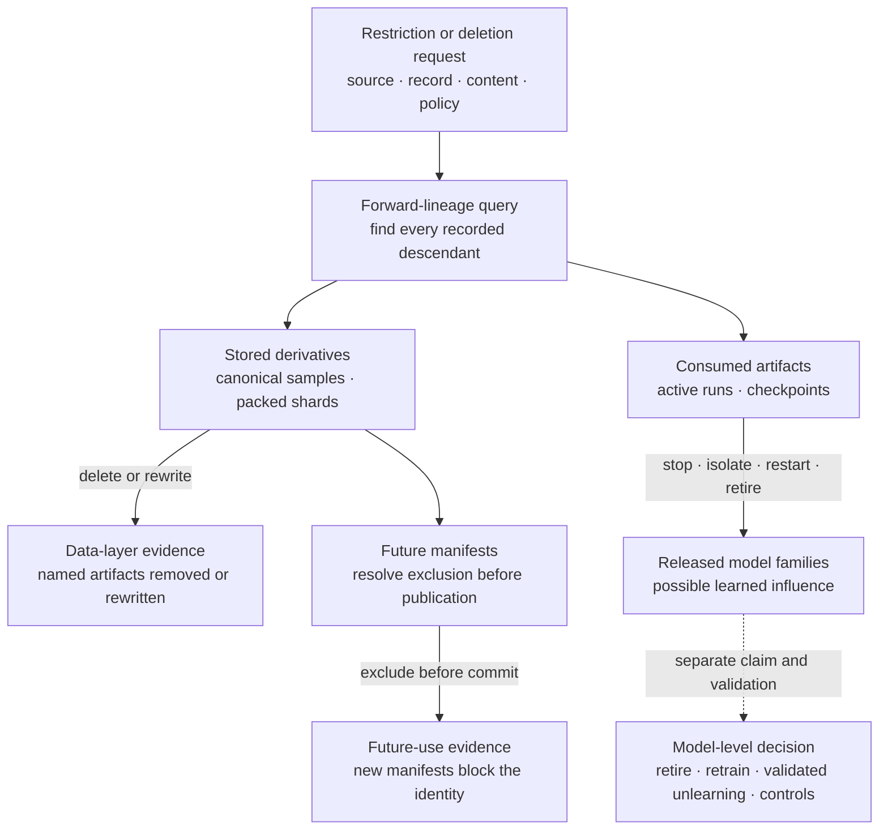

> *Asked in: foundation-model systems, research engineering, data platform, safety, and principal technical-strategy rounds.*

A basic answer moves documents through collection, cleaning, deduplication, and sharding. A senior answer makes every retained sample reproducible and every stage restartable. A staff answer adds policy, evaluation protection, ownership, deletion workflows, and adoption across research teams.

A principal answer treats data mixtures as versioned model decisions with explicit evidence and exit conditions. A senior-principal answer defines durable source, provenance, and release rules across several model programs while preserving independent research and regional constraints.

Build a governed data control plane around high-throughput processing planes. Keep raw evidence, policy decisions, transformation lineage, dataset manifests, and release state separate from the workers that scan bytes. Do not reduce data quality to one score or infer causality from correlations between mixture shares and model results.

## The prompt

A laboratory trains text and multimodal foundation models. It expects to prepare 10 trillion retained text-equivalent tokens over the next two years. Raw inputs come from licensed collections, public sources, partner deliveries, internal data, human annotation, model-generated examples, and task environments.

Today, research groups run separate scripts. Source terms live in spreadsheets. Parser versions are missing from many datasets. Exact duplicates are removed inconsistently. Benchmark owners cannot prove that held-out items stayed out of training. Privacy reviewers receive samples after processing has already started.

One model family uses pretraining data, supervised demonstrations, preference comparisons, and verified synthetic tasks. Teams need fast experiments, but a source restriction or deletion request can affect several mixtures and checkpoints. Rebuilding every dataset from the beginning takes weeks.

Design the platform. It must support rapid ablations, sustained petabyte-scale processing, reproducible releases, source-level restrictions, privacy controls, benchmark protection, incident response, and several research organizations. The first useful release must ship within one quarter.

## State the design before naming products

The platform should make five things authoritative:

1. a registry of sources and permitted uses;
2. stable identities for raw objects, logical records, and transformed samples;
3. append-only transformation and policy evidence;
4. immutable dataset and mixture manifests;
5. release gates that bind a training run to approved data evidence.

Processing workers may run on different engines. Researchers may use different tokenizers, filters, and sampling methods. Those choices remain valid when they emit the common identities, lineage edges, metrics, and manifests.

The first release should cover one text-pretraining path and one post-training path. It should register sources, produce restartable parsed shards, enforce exclusions, build immutable manifests, and answer forward-lineage queries. It should not replace every storage engine, annotation vendor, or research workflow in one quarter.

Three boundaries keep the program manageable:

- The platform records policy decisions. Legal, privacy, security, and source owners make those decisions.
- The platform provides data evidence. Model teams own capability claims and training decisions.
- The platform enforces approved gates. It does not promise that any filter or dataset is objectively high quality.

## Clarify the model program and authority

Ask questions that change the architecture rather than filling time.

### Training goals

- Which modalities, languages, domains, and context lengths are in scope?
- Which capabilities need broad pretraining, targeted continued training, or post-training data?
- How many mixture experiments run concurrently?
- Which model sizes are cheap enough for screening ablations?
- Which checkpoints can resume after a data change?

### Source and policy

- Which collections are licensed, public, partner-provided, internal, user-contributed, or synthetic?
- What evidence defines the approved training use for each source?
- Can approval vary by model, geography, purpose, modality, or release type?
- Which sources require consent, attribution, retention limits, or downstream deletion?
- Who can approve an exception, and when does it expire?

### Evaluation protection

- Which benchmarks are public, private, partner-owned, or generated internally?
- Who can access raw benchmark items and answer keys?
- Can a benchmark item appear in annotation instructions or synthetic generation prompts?
- How often does the laboratory create fresh confirmation sets?
- Which claims require an independent evaluation owner?

### Scale and latency

- How many raw bytes and objects arrive each day?
- Are inputs large archives, many small files, database exports, streams, or API records?
- Which stages need interactive turnaround for research?
- How quickly must a new exclusion reach every active build?
- What recovery point and recovery time apply to manifests and lineage?

### Organization

- Who owns source acquisition, policy interpretation, parsers, filters, mixtures, benchmarks, and training launches?
- Which teams can publish a dataset for other teams?
- What review is required before data crosses organizations or regions?
- Which platform interfaces must survive a storage or vendor change?
- Who commands a data incident that affects an active training run?

Assume 8 petabytes of compressed raw objects are active at a time. Candidate processing expands to about 25 trillion text-equivalent tokens. The release target retains 10 trillion tokens. Daily arrivals average 80 terabytes and can spike during partner deliveries.

Assume six model programs share the platform. Two require regional processing. A central evaluation group owns hidden benchmarks. A data platform group has twelve engineers, while source, research, privacy, legal, security, and evaluation teams retain separate decision authority.

## Define outcomes and non-goals

The platform should improve safe research throughput and confidence in model claims. Retained token count alone is an input measure.

### Research outcomes

- time from approved source arrival to a usable experimental manifest;
- time to create a controlled mixture variant;
- fraction of runs whose inputs can be reconstructed;
- experiment queue time caused by data preparation;
- cost to produce an additional useful training token;
- time to compare two mixtures on fixed training and evaluation settings.

### Data-control outcomes

- source records with complete rights and policy evidence;
- retained samples with valid backward provenance;
- source restrictions propagated before the declared deadline;
- deletion drills that find affected manifests and checkpoints;
- unapproved training uses blocked before manifest publication;
- benchmark families with documented isolation and overlap checks.

### Quality and coverage outcomes

- distribution by source, language, modality, domain, time, and content form;
- parser success and structural preservation by slice;
- duplicate concentration and effective repetition by source;
- privacy-filter precision and recall estimates from audited samples;
- downstream capability, safety, memorization, and calibration results by slice;
- performance on fresh evaluations that were outside data development.

### Operating outcomes

- bytes and records processed per resource-hour;
- worker retry rate and duplicate output rate;
- shard-size and token-count skew;
- lineage capture completeness;
- manifest publication latency;
- incident detection, containment, and forward-trace time.

Do not set “average document quality” as the primary objective. A mathematical proof, source-code file, dialogue, table, and low-resource-language document have different useful properties. A single learned score can erase that variation while appearing to improve its own average.

The initial program has clear non-goals. It will not determine unsettled legal questions automatically. It will not guarantee removal of information from already trained weights. It will not prove that benchmark contamination is absent. It will not force every research team to use one parser or one sampling strategy.

## Establish platform invariants

Use invariants to connect policy, data, and training.

1. **Every source has an owner and an approved-use decision before release.** Technical access does not imply permission to train.
2. **Raw evidence is immutable within its approved retention window.** Corrections create a new source snapshot or policy event.
3. **Every model-ready sample traces to one or more source records.** Deduplication preserves the origins and restrictions of all cluster members.
4. **Every transformation is versioned.** Parser code, normalization rules, filters, thresholds, dedup indexes, tokenizer, and sampling code belong in lineage.
5. **Policy can only narrow during a build.** Expanding permitted use requires a new review and manifest.
6. **Evaluation assets are isolated from training paths.** Access, copying, synthetic generation, and annotation use are controlled separately.
7. **A dataset release is an immutable manifest.** Friendly names may move, while a released manifest never changes.
8. **A worker retry cannot publish duplicate logical output.** Output identity and atomic publication make retries idempotent.
9. **A training run binds to exact mixture and shard manifests.** A mutable storage prefix cannot define a run.
10. **Deletion and exclusion claims state their technical limit.** Future-use suppression, artifact deletion, retraining, and weight-level mitigation are different actions.
11. **Release evidence remains queryable after workers and vendors change.** The control record outlives one execution system.
12. **Evaluation claims remain narrower than their evidence.** Mixture correlations and benchmark movement do not become causal claims by repetition.

These rules constrain publication rather than exploration. A researcher can test an unapproved or provisional source in an isolated environment if policy permits that experiment. The resulting data cannot enter a release manifest until its required evidence is complete.

## Separate control, processing, and evidence planes



### Control plane

The control plane stores source identity, approved uses, policy versions, exclusions, build specifications, benchmark fingerprints, manifest state, ownership, and release decisions. Its write rate is modest, but correctness and availability are strict.

### Processing planes

Processing planes scan, decode, classify, cluster, tokenize, shuffle, and write shards. Batch engines, stream processors, accelerator jobs, and vendor services can all participate. Each worker receives a versioned specification and emits typed events.

### Evidence plane

The evidence plane stores append-only stage events, lineage edges, aggregate metrics, sampled audit decisions, and release evidence. Sensitive raw payloads stay in classified storage. Evidence records contain references, digests, reason codes, and access labels.

Do not put petabyte payloads in the metadata database. Do not hide authoritative policy in worker configuration. The build planner joins approved policy with processing specifications and refuses publication when required evidence is missing.

## Design the source registry

A source is a governed collection with stable identity. It is not a URL string or bucket prefix.

```text
SourceRecord
  source_id
  source_version
  source_class
  provider_or_controller
  acquisition_method
  collection_time_range
  content_modalities
  languages_and_regions
  raw_snapshot_refs
  integrity_digests
  rights_evidence_refs
  consent_scope
  approved_purposes
  prohibited_purposes
  geographic_constraints
  retention_and_attribution_rules
  security_class
  privacy_risk_class
  benchmark_risk_class
  owner
  reviewers
  decision_version
  review_or_expiry_at
  revocation_channel
```

Store the evidence behind each assertion. A license label without the agreement version, review, and scope is weak. Terms can change after collection. Preserve the reviewed snapshot and acquisition facts without claiming that the platform has resolved the legal interpretation.

Source versions represent material changes. A new partner delivery, changed terms, new consent scope, or changed extraction boundary creates a new version. Small operational retries can refer to the same version when the bytes and policy remain identical.

The registry needs explicit states:

```text
proposed -> quarantined -> reviewed -> approved_for_named_uses
         -> rejected
         -> suspended
         -> revoked
         -> expired
```

Suspension blocks new publication while investigators gather evidence. Revocation adds an exclusion and starts forward tracing. It does not silently rewrite prior manifests.

### Preserve all origins after deduplication

The same content can arrive through a licensed archive, a public mirror, and an internal copy. A dedup cluster must retain all source memberships. The selected representative inherits the union of applicable restrictions unless policy owners resolve the conflict.

Choosing the least restrictive origin automatically is unsafe. Choosing the strictest forever can also discard a valid independently licensed copy. Record the conflict, its evidence, and the decision rather than encoding an undocumented shortcut.

Until that review completes, quarantine the conflicted representative from any use disallowed by a cluster member. A documented decision can split independently acquired records into separate policy identities when source evidence supports that conclusion.

### Model permitted use directly

“Approved” is too broad. Use decisions should cover purpose and context:

- exploratory statistics only;
- parser development in a restricted environment;
- pretraining for internal research;
- pretraining for released model weights;
- supervised post-training;
- preference or reward-model training;
- evaluation only;
- region-limited processing;
- no derivative redistribution;
- attribution required in a release record.

A build specification states its intended model, purpose, region, and release class. The policy engine matches those facts against source decisions. An exception has an owner, scope, rationale, evidence, and expiration.

## Handle rights, consent, and policy as data

Rights and consent are inputs to a technical gate, while accountable people own their interpretation. The system needs enough structure to apply reviewed decisions consistently.

### Separate access from authority

A crawler or partner credential proves that bytes can be fetched. It does not prove that they may be used for training. Intake places new material in quarantine until its source record reaches an approved state for the requested use.

Internal data also needs purpose limits. Customer support transcripts, employee documents, research logs, and public marketing text can sit in one company account while carrying different consent and confidentiality rules.

### Represent consent scope

When consent is the approved basis, record the scope that the reviewer needs:

- who or which process captured consent;
- what use was described;
- whether model training and weight release were covered;
- whether sensitive categories or minors require extra treatment;
- expiration or withdrawal behavior;
- region and controller;
- proof reference and policy version.

Do not copy identity details into broad metadata merely to prove consent. Keep minimal references in the registry and protect the evidence in a narrower store.

### Compile policy into build decisions

The policy service should evaluate source facts against a build context. It returns an allow, deny, or review result with reason codes and the policy version.

```text
BuildContext
  model_program
  training_stage
  release_class
  processing_region
  destination_region
  modality
  requested_retention
  downstream_distribution
```

A deny result stays visible in the build report. A review result cannot be converted to allow by a worker flag. Only an authorized decision event can change it.

### Avoid frozen policy in old shards

Store policy eligibility in the manifest and source lineage, not only as a bit written into a shard months earlier. Before training starts, resolve the manifest against current suspensions and exclusions. During long runs, a watcher can stop future reads or trigger incident review when policy changes.

The response depends on urgency and contract. Immediate credential exposure may stop a job. A disputed source term may freeze checkpoint promotion while the run completes in isolation. The policy owner and incident commander decide under a documented playbook.

## Give every object and sample stable provenance

Use identity at several levels because one identifier cannot support every query.

### Raw object identity

A raw object record includes the source version, original locator, acquisition event, byte digest, size, content type, encryption class, and retention state. Content addressing can identify identical bytes, but source membership remains separate.

### Logical record identity

An archive may contain documents, messages, pages, images, or table rows. Parsing assigns each logical record a stable ID based on the raw object and a parser-independent locator where possible. Examples include archive member path, database primary key, or byte range.

### Sample identity

A transformed sample records its parent records and transformation chain. Its content digest alone is insufficient because two samples with equal text can carry different rights, timestamps, labels, or modality context.

A practical identity can combine a lineage ID with a content fingerprint:

```text
sample_lineage_id = hash(source_record_ids, logical_record_ids, transform_spec)
sample_content_id = hash(canonical_content)
```

The lineage ID supports policy and deletion. The content ID supports exact duplicate discovery. Both use versioned canonicalization rules.

### Typed transformation edges

Record edges such as:

- extracted from;
- decoded by;
- normalized by;
- redacted by;
- split from;
- joined with;
- duplicate of;
- selected as representative of;
- generated from;
- judged by;
- tokenized by;
- included in shard;
- sampled by mixture;
- consumed by training run.

Each edge carries a stage version, timestamp, worker attempt, input and output digest, policy context, and relevant metrics. Forward tracing from a source should reach every manifest and run that consumed its descendants.

### Capture automatically

Workers should emit lineage as part of successful publication. A stage that cannot commit its output event cannot publish the output prefix. Human annotations can explain judgment and exceptions, but researchers should not reconstruct machine lineage by hand after a run.

## Detect personal data and secrets with layered controls

No detector gives complete privacy or secret protection. Use prevention, detection, restricted handling, sampling, and response together.

### Start at intake

Classify new sources before broad access. Restrict raw data by source risk, region, and purpose. Encrypt it, log reads, use short-lived credentials, and prevent raw payloads from appearing in ordinary job logs.

High-risk sources can enter a separate processing account with no general research access. Workers write redacted or approved outputs to the next zone. Reviewers see sampled records through a controlled interface.

### Combine detector families

Use several signals because their errors differ:

- structured patterns for identifiers and credentials;
- checksums and format validation where available;
- named-entity and sensitive-attribute models;
- high-entropy and secret-template detectors;
- source-specific rules;
- known internal secret fingerprints;
- document and neighborhood context;
- human audits on risk-weighted samples.

A pattern match can over-remove ordinary numbers. A learned detector can miss unfamiliar languages or code formats. A secret scanner can confuse examples and active credentials. Preserve reason codes so reviewers can estimate errors by detector and slice.

### Choose actions by risk

Possible actions include span redaction, record removal, source quarantine, restricted retention, or manual review. Avoid replacing every detected entity with the same marker when structure matters. Typed placeholders can preserve limited syntax without preserving the original value.

Some records become unusable after redaction. Others remain useful. The decision depends on capability goals, policy, and residual reconstruction risk.

### Estimate false negatives and false positives

Audit samples from both accepted and rejected sets. Rejected-only review estimates precision but says little about missed sensitive content. Accepted samples need oversampling from high-risk sources, languages, formats, and detector-disagreement regions.

Use discovery rates and confidence intervals by slice. Zero findings in a small sample is weak evidence. Maintain canary tests with synthetic identifiers and known detector edge cases, while keeping those canaries outside model-ready outputs.

Complete required privacy and secret audits before manifest commit. A detector or threshold change invalidates affected audit evidence and triggers a new scan or sampled review before another manifest can reference it.

### Respond to a live secret

Quarantine the object and descendants, revoke or rotate the credential through the responsible security process, block affected manifests, and forward-trace access. Removing text from a future build does not neutralize a credential that may already have been exposed.

Evidence logs should avoid copying the secret again. Store a protected incident reference or keyed fingerprint when policy allows it.

## Parse, normalize, and tokenize without erasing structure

Raw bytes should pass through distinct representations. Mixing these stages makes failures hard to locate.

### Preserve three layers

1. **Raw representation:** exact acquired bytes and source metadata.
2. **Canonical representation:** decoded records with meaningful structure, provenance, and redactions.
3. **Model-ready representation:** selected fields, tokenizer version, sequence boundaries, and loss masks.

A tokenizer change should not require fetching and parsing every source again. A parser correction should produce new canonical records and lineage rather than mutating old shards.

### Parsing

Route by detected media type and source contract rather than file extension alone. Parsers should emit content blocks with types such as paragraph, heading, code, table, caption, formula, transcript turn, image reference, and metadata field.

Record partial success. A document with one failed embedded image differs from a fully failed document. Emit parse status, warning codes, extracted-byte ratio, structural counts, and parser version.

Validate on source-specific golden samples. Generic parser tests miss layout, encoding, table, and language behavior found in one collection. Compare parser upgrades on both extraction recall and structural damage.

### Normalization

Normalize encodings and line endings carefully. Keep a reversible mapping or offsets when later deletion and audit require source location. Avoid broad whitespace collapse for code, poetry, tables, and mathematical text.

Language and script detection should return distributions or uncertainty for mixed documents. A single language label can misroute code-switching and multilingual pages. Boilerplate removal should preserve the relation between removed navigation and retained content.

### Tokenization

The tokenizer is part of the dataset version. It changes token counts, truncation, language efficiency, code representation, packing, and effective mixture weights.

Archive the exact tokenizer artifact and normalization contract with the manifest. A run cannot silently substitute a newer tokenizer. A tokenizer experiment creates a derivative manifest with new token counts, mixture realization, packing, and evaluation evidence.

Count mixture budgets after tokenization. A source weighted by documents may receive a different training share after a tokenizer change. Report bytes, characters, records, sequences, and tokens so researchers can see the shift.

Sequence construction needs its own contract:

- document boundaries and cross-document packing;
- begin and end markers;
- maximum length;
- long-document chunking and overlap;
- loss masks;
- multimodal placeholder rules;
- conversation role formatting;
- contamination and privacy exclusions applied before packing.

Packing can obscure lineage if a sequence includes spans from many records. Store a compact span map from token ranges to sample lineage IDs. That map supports audits without placing verbose provenance in the training stream.

## Deduplicate at exact, fuzzy, and semantic levels

Deduplication changes repetition, memorization, source balance, and compute. It can also remove valid diversity. Treat it as a set of policies with measured false positives.

### Exact deduplication

Compute hashes on clearly versioned representations:

- raw-byte hash for delivery integrity;
- canonical-document hash after safe normalization;
- span or paragraph hashes for repeated blocks;
- token-sequence hash for final training repetition.

Canonicalization choices can create collisions in meaning. Lowercasing may merge identifiers or code. Removing punctuation can merge different equations. Use modality-specific rules and retain the original digest.

Exact document removal is insufficient when repeated headers, license text, syndicated paragraphs, or copied code blocks dominate. Span-level counts can support removal, downweighting, or masking. The action should reflect the capability and source policy.

### Fuzzy deduplication

Use n-gram signatures, MinHash, locality-sensitive hashing, SimHash, suffix methods, or other candidate-generation techniques. At large scale, candidate generation narrows comparisons. A second similarity check confirms the relation before clustering.

Define the unit, features, and threshold. Near-identical documents can differ in one critical table cell, answer, software version, jurisdiction, or negation. A high global similarity does not prove interchangeability.

Cluster formation also needs deterministic rules. Connected components can chain documents through weak pairwise links, creating a cluster whose endpoints are quite different. Cap chaining, require stronger representative similarity, or record subclusters for review.

### Semantic deduplication

Embeddings can find paraphrases, translations, and reformatted examples that lexical methods miss. They can also merge distinct records that discuss the same topic. Two independently written proofs, safety policies, medical cases, or code solutions may be semantically close and still provide useful variation.

Use semantic similarity first as a candidate or audit signal. Apply source-aware thresholds and inspect high-impact clusters. Preserve independent origin, language, modality, and label differences. For many sources, downweighting a dense cluster is safer than deleting every non-representative member.

Record the scored edges and threshold decisions that caused cluster membership, together with the embedding and clustering versions. Recording every all-pairs score is unnecessary, but forward tracing must reconstruct why a retained or removed item joined the cluster.

### Choose the representative carefully

The selected record can depend on:

- approved-use scope;
- parse integrity;
- source authenticity;
- completeness;
- recency where facts change;
- language and formatting needs;
- privacy risk;
- attribution requirement;
- benchmark proximity.

Do not select only by a learned quality score. Keep cluster membership in lineage. If the representative is later revoked, the platform can reconsider an independently permitted member rather than losing the whole cluster blindly.

### Measure false-positive cost

Audit proposed duplicate pairs from score bands near and far from the threshold. Slice by language, code, mathematics, tables, legal text, and repeated templates. Estimate the rate at which removal would discard materially distinct information.

Also inspect false negatives through sampled nearest neighbors, known repeated corpora, and repetition statistics after tokenization. A lower duplicate rate can coexist with excessive loss of rare forms.

### Keep split integrity

Run cross-split and cross-purpose checks before publication. Training, validation, benchmark development, and final confirmation sets need source-family separation where the claim requires it. Removing exact overlap after random splitting does not repair shared author, repository, template, or generated ancestry.

## Protect benchmarks and evaluation validity

Benchmark contamination is an evaluation-control problem with data-pipeline support. Ordinary deduplication cannot establish independent evaluation.

### Register protected assets

The evaluation registry should record benchmark owner, access class, item family, answer-key location, allowed uses, creation process, source ancestry, release history, and fingerprint versions. Hidden item text should remain in a restricted store.

Training workers may receive protected fingerprints or a private contamination-check service. They should not receive raw hidden answers. Query results can return overlap class, confidence, and benchmark family without exposing the item.

### Check several overlap levels

- exact item and answer spans;
- normalized and token-level variants;
- n-gram or fuzzy overlap;
- translated or reformatted variants;
- same repository, document, author, template, or generator;
- synthetic descendants whose prompts used benchmark material;
- annotation examples copied from evaluation instructions.

A semantic match is evidence for review, not automatic proof of leakage. Common facts and standard problem forms can be legitimately similar. Conversely, no match does not prove independence.

### Prevent selection contamination

Track every evaluation use. If researchers repeatedly choose filters, mixtures, prompts, or checkpoints from one benchmark, that benchmark becomes development evidence. Keep separate sets for exploration, stable regression, and final independent confirmation.

A benchmark owner can issue aggregate results while hiding items. Fresh task families and time-based holdouts reduce repeated tuning risk. They still require provenance because a generator or source can reconnect them to training.

### Interpret suspicious gains carefully

A sharp benchmark gain after adding one source can come from contamination, domain match, format familiarity, genuine capability, evaluator variance, or another changed variable. Freeze claims, inspect lineage, and confirm on fresh independent tasks.

Do not call the source causal from the observed correlation. A controlled ablation with fixed training settings gives stronger evidence, but stochastic training and interaction effects remain. Report the design and uncertainty.

## Use multidimensional quality and audit selection bias

Quality depends on the intended capability, source, policy, and failure cost. Represent useful properties separately.

Possible dimensions include:

- parse and structural integrity;
- language confidence;
- coherence and completeness;
- information density;
- factual or executable verifiability;
- source authenticity;
- recency for time-sensitive domains;
- domain and task coverage;
- educational or reasoning structure;
- toxicity, privacy, and policy risk;
- duplication and memorization risk;
- uncertainty and reviewer disagreement.

A filter can use hard gates, source-specific rules, learned scores, and sampling weights. Do not add these dimensions into one permanent universal rank.

### Learned filters carry preferences

A classifier trained on polished reference prose may reject dialect, short technical answers, informal explanations, code comments, or low-resource languages. A model judge may favor text resembling its own pretraining and response style.

Record filter training data, model version, prompt or rubric, calibration set, threshold, and score distribution. Evaluate accepted and rejected samples. Compare human judgments across slices and preserve a controlled sample below the threshold for analysis.

### Selection changes the population

Filtering creates a new distribution. A higher accepted-set score does not establish that training will improve. The filter may remove hard, unusual, or safety-relevant examples that the scoring model dislikes.

Track retention by source, language, domain, format, time, author concentration where permitted, and risk class. Review large shifts against intended coverage. A filter release needs both positive evidence and a list of populations it reduces.

### Prefer controlled downstream evidence

Use small or intermediate model runs when possible. Hold model architecture, optimizer, token budget, tokenizer, and evaluation constant. Compare no-filter, candidate-filter, and threshold variants across several seeds or uncertainty estimates.

These ablations estimate effects under the tested setup. They do not prove the same effect at a much larger scale or with a different mixture. Keep observational dashboards for diagnosis, while reserving causal language for designs that support it.

## Version mixtures and run informative ablations

A mixture is an executable sampling specification over immutable components.

```text
MixtureManifest
  mixture_id
  parent_mixture_id
  component_dataset_ids[]
  eligibility_policy_version
  tokenizer_and_sequence_spec
  component_weights
  within_component_sampling
  temperature_or_cap_rules
  token_budget
  effective_epoch_limits
  curriculum_or_phase_schedule
  randomization_spec
  exclusion_snapshot
  benchmark_check_bundle
  owner
  approval_state
  created_at
```

Record both intended and realized composition. Worker failures, filtering, tokenization, and exhausted small sources can move realized shares away from configured weights.

### Track effective repetition

A small source with a large weight can repeat many times. Report effective epochs, duplicate concentration, and unique-token coverage for each component. Cap repetition where memorization or narrow style is a concern.

Sampling with replacement, temperature sampling, and source caps produce different training distributions. Put those mechanics in the manifest rather than an unversioned training script.

### Design ablations around decisions

A useful ablation changes one decision or a small planned set. Examples include:

- include versus exclude one source family;
- compare two filter thresholds;
- hold domain tokens fixed while changing source diversity;
- replace synthetic examples with verified real examples at equal token count;
- vary preference-pair selection while keeping prompts fixed;
- alter repetition caps for a small expert corpus.

Measure capability, safety, memorization, calibration, training stability, and cost. Slice results by the capabilities the component was meant to affect. An average can hide a useful gain and a severe regression.

### Handle interaction effects

Sources can interact. Code data may improve tool use only after instruction tuning. Multilingual data can change token efficiency and English results. A component that looks weak alone may support another component.

Use factorial or staged experiments for the few interactions with high decision value. Small proxy models help screen hypotheses, though scaling can change the result. Confirm important choices at a more representative scale before a major run.

### Avoid causal stories from mixture dashboards

Historical runs differ in model size, compute, code, optimizer, tokenizer, evaluation, and researcher attention. A plot showing higher mathematics share beside better reasoning scores is useful for hypothesis generation. It is not a causal estimate.

Record confounders and link controlled comparisons. If no controlled evidence exists, say that the relation is observational. Principal judgment includes funding the experiment that can reverse an expensive mixture belief.

A release record that attributes a capability change to a mixture component must link controlled evidence or label the claim observational. The platform can enforce evidence labeling; it cannot turn an uncontrolled run history into a causal result.

## Treat synthetic data as a verified source family

Synthetic data enters through the same registry and lineage system. It adds generator, prompt, environment, verifier, and sampling identities.

### Define the capability gap

Specify the task family, difficulty, language, state distribution, allowed tools, answer contract, and failure rules. “More reasoning data” cannot determine a verifier or coverage metric.

### Separate generation from verification

Prefer evidence that does not rely on the generator's opinion:

- program execution and hidden tests;
- symbolic or numerical solvers;
- simulator final state;
- trusted database lookup;
- consistency across independent methods;
- calibrated human review;
- a separately trained judge with audited limitations.

The generator, verifier, filter, and student can share training ancestry and blind spots. Shared agreement is weaker than independent evidence. Track model families and data ancestry where known.

### Control diversity and contamination

Measure unique task structures, source templates, answer distributions, difficulty, language, and semantic clusters. Surface variation can hide repeated underlying programs. Hold out repositories, generators, templates, or task families for evaluation.

Check generator prompts, retrieved context, teacher outputs, and verifier examples against protected benchmarks. A synthetic item can carry contamination even when its final wording is new.

### Preserve failed generations

Rejected samples and verifier disagreement are useful audit evidence. Store reason codes and controlled samples under appropriate retention. They reveal generator drift and verifier blind spots.

Do not feed every rejected example back into the generator automatically. That loop can optimize toward one verifier while narrowing the target behavior.

Any rejected-sample feedback policy must name which reason codes and sample classes can re-enter generation. Log the selected subset and keep protected evaluation families outside every feedback cycle. Compare diversity and held-out quality before expanding the loop.

## Support preference and post-training data explicitly

Post-training records have richer relationships than plain text documents. The platform should model them rather than flattening them into anonymous conversations.

### Data types

- supervised demonstrations with author and review state;
- prompt-response pairs;
- ranked or pairwise preferences;
- scalar rubric judgments;
- critiques and revisions;
- tool-use trajectories and environment states;
- safety-policy decisions;
- model-generated candidates;
- reward, verifier, and adjudication evidence.

A preference record needs prompt identity, candidate identities, presentation order, annotator or process class, rubric version, judgment, confidence, disagreement, and adjudication. Preserve raw judgments separately from derived consensus labels.

### Protect annotators and data subjects

Apply consent, privacy, access, and retention rules to annotation inputs and outputs. Minimize exposure to sensitive material. Route high-risk content to trained groups with appropriate support and access controls.

Annotator identity may be needed for quality analysis while requiring strict protection. Use pseudonymous worker IDs in research datasets and keep direct identity in a separate operational system.

### Measure disagreement

Disagreement can reflect ambiguity, poor rubrics, cultural variation, worker error, or legitimate plural values. Do not force all disagreement into one label silently.

Track inter-rater agreement by task and slice. Use adjudication for high-impact policy data. Keep distributions or confidence when the training method can use them. A consensus process and reward model should both name the rubric they implement.

### Keep train and evaluation labor separate

The same worker pool can learn benchmark patterns through repeated exposure. Separate protected evaluation projects, access, instructions, and exports. Track copied examples and shared templates.

Post-training selection can contaminate evaluation even when pretraining is clean. The lineage graph must reach supervised, preference, reward-model, and environment data.

## Publish immutable manifests and complete lineage

A dataset is released by atomically publishing a manifest that references immutable shards and evidence.

```text
DatasetManifest
  dataset_id
  build_spec_id
  parent_dataset_ids[]
  source_versions[]
  canonical_partition_refs[]
  shard_refs_and_digests[]
  sample_count
  sequence_count
  token_count
  tokenizer_version
  stage_versions
  exclusion_snapshot
  policy_decision_bundle
  privacy_audit_bundle
  dedup_report
  contamination_report
  coverage_report
  owner_and_approvers
  created_at
```

Write shards to attempt-specific locations. Validate counts, digests, lineage coverage, and policy evidence. Then commit one small manifest through a compare-and-swap or transactional state change. Readers consume only committed manifests.

Friendly aliases such as `pretrain-main-current` can point to a manifest. The training run resolves the alias once and stores the immutable ID. Later alias movement cannot alter the run.

### Support forward and backward queries

Backward queries answer:

- Which source and transformations produced this sequence?
- Which filter and policy versions admitted it?
- Which tokenizer and packer created this shard?
- Which evaluation evidence approved the mixture?

Forward queries answer:

- Which samples descend from this source or record?
- Which manifests contain them?
- Which runs and checkpoints consumed those manifests?
- Which released model families may carry their influence?

Test these queries through scheduled drills. A lineage graph that exists only on a diagram will fail during a real deletion or incident.

## Define deletion, exclusion, and retraining honestly

A request can mean several different technical actions. State which one the system completed.

<!-- visual:foundation-data-deletion-blast-radius -->

<p class="diagram-caption"><strong>Read it this way:</strong> trace the restricted identity forward before choosing an action. Stored derivatives can be removed or rewritten, and future manifests can prove that the identity is excluded. If a run or checkpoint already consumed those derivatives, the response becomes a model decision; file deletion alone does not prove removal from learned weights. Original synthesis informed by the <a href="https://www.w3.org/TR/prov-dm/">W3C PROV data model</a> and the primary <a href="https://arxiv.org/abs/1912.03817">Machine Unlearning paper</a>.</p>

### Future-use exclusion

Add source, record, content, or policy identities to a versioned exclusion snapshot. New manifests resolve exclusions before publication. Long-running jobs check for urgent updates at declared boundaries.

### Stored-artifact deletion

Delete or restrict raw objects, canonical records, shards, caches, samples, and annotation copies according to policy. Tombstones and protected audit events can record that an identity was removed without retaining prohibited content.

Future-use and file-removal evidence does not cover process memory, worker scratch space, job logs, optimizer state, intermediate checkpoints, or learned influence unless those layers are named and verified separately.

Derived shards may combine many samples. Fine-grained deletion can require shard rewriting. Plan shard size and span maps with that cost in mind.

### Checkpoint and model response

Deleting training files does not remove learned influence from existing weights. Options can include blocking release, retiring checkpoints, retraining from an unaffected checkpoint, targeted fine-tuning, approved unlearning methods, output controls, or risk acceptance.

The correct response depends on the legal or policy obligation, model risk, evidence, and technical feasibility. Do not promise exact weight erasure without a validated method and claim boundary.

### Retraining limits

Full retraining may cost months and substantial compute. Retaining periodic checkpoints and exact mixture boundaries can reduce recovery cost. Continuing from a checkpoint before the affected data entered is stronger than continuing from a later checkpoint after deleting files.

Data order can be interleaved, so one source may appear across many steps. Record shard order, sample counters, and checkpoint consumption ranges. This evidence supports a reasoned response even when perfect rollback is impossible.

### Verify completion

A deletion workflow should produce evidence for each required layer: source, derivatives, future manifests, active jobs, checkpoints, released models, and downstream copies. Failed or unsupported layers remain open with an owner and decision.

## Build high-throughput, restartable processing

At 8 petabytes, object enumeration and decompression can dominate compute. Design the unit of work, idempotency, and publication before tuning algorithms.

### Partition work deterministically

Create input partition manifests from immutable raw snapshots. Balance compressed bytes, estimated decoded bytes, object count, media type, and expected parser cost. A partition ID and build specification define the logical work.

Avoid assigning one giant archive to one worker. Split seekable formats or create indexed members during intake. Bundle tiny objects into immutable packs while preserving per-object offsets and digests.

### Use idempotent stage outputs

Each stage computes an output identity from input partition, stage version, policy snapshot, and parameters. A retry writes to a new attempt path, verifies output, and atomically selects one successful attempt.

Workers never append blindly to a shared final file. They emit metrics and lineage before the coordinator commits their partition result. Duplicate attempts can be garbage-collected after retention.

### Checkpoint at stage boundaries

A checkpoint should name completed partition IDs, output digests, exclusion snapshot, stage version, and coordinator epoch. Resume work from that record rather than listing an output directory and guessing.

Inside expensive partitions, parsers and embedding jobs can checkpoint record ranges. The checkpoint needs a stable input order and idempotent output chunks. A worker crash must not skip or repeat logical records silently.

### Size the scan path

Scanning 8 petabytes in 15 hours requires roughly 150 gigabytes per second before overhead. Storage, network, decompression, parsing, detector inference, and output writes must each support the planned bottleneck or use separate passes.

A full rescan for every filter experiment is wasteful. Persist canonical records and selected reusable signals when policy permits. New thresholds can operate on those records. Parser, redaction, or feature changes still trigger the affected upstream stages.

### Control sharding and shuffle

Training shards should be large enough for efficient sequential reads and small enough for replacement, distribution, and recovery. A range such as 1 to 4 compressed gigabytes can be a starting point, then measured against storage and trainer behavior.

Use deterministic random keys derived from sample identity and mixture seed. A two-level shuffle can randomize within component partitions and then assign samples across final shards. Record the algorithm and seed.

Changing the seed creates a new realized mixture and manifest unless shard assignments are explicitly frozen and reused. A training run binds to the exact shard manifest rather than reconstructing it from an informal seed note.

Balance tokens, sequences, modalities, and expected decode cost. Equal file size does not guarantee equal trainer time. Long sequences and media decoding can create stragglers.

### Handle backpressure

Daily arrivals can exceed one stage's capacity. Give each queue age, bytes, object count, source priority, and policy state. Stop admitting lower-priority work before queues exhaust storage.

Research experiments may use reserved capacity with explicit quotas. A large partner delivery should not starve urgent deletion rewrites or benchmark isolation checks.

### Recover from regional and service failures

Keep committed manifests and policy evidence replicated according to recovery requirements. Processing can restart elsewhere only when source policy permits that region. Regional restrictions may require separate raw and processing planes with a federated control record.

When the lineage service is unavailable, workers can buffer signed events locally for a bounded period. They cannot publish a final dataset manifest until evidence ingestion and validation succeed.

## Make data observability decision-oriented

Dashboards should reveal where the distribution or evidence changed.

### Intake and source health

- arrival bytes, records, lag, and integrity failures;
- source-version and policy-state counts;
- unexpected schema, media, language, or time shifts;
- access failures and expiring approvals;
- quarantine age and reviewer queue.

### Transformation health

- parser success, partial extraction, and structural counts;
- redaction and removal rates by reason and slice;
- detector disagreement and audited error estimates;
- exact, fuzzy, and semantic cluster distributions;
- tokens per byte, sequence length, truncation, and packing efficiency;
- stage throughput, retries, stragglers, and cost.

### Distribution health

- intended versus realized mixture shares;
- effective repetitions and unique coverage;
- source, language, domain, format, modality, and time composition;
- filter-score distributions without treating them as truth;
- benchmark-overlap findings and unresolved reviews;
- synthetic generator, verifier, and task-family shares.

### Evidence health

- lineage edges expected versus captured;
- forward-trace drill success;
- unapproved or expired source references;
- manifests using stale policy or benchmark bundles;
- missing shard digests or span maps;
- deletion deadlines and incomplete layers.

Alert on changes tied to action. A one-percent language shift may be expected after a planned source update. One unapproved source reference in a release manifest is a gate failure.

## Use explicit release gates

A release gate should consume versioned evidence and return pass, fail, or authorized exception.

1. **Source gate:** every source is approved for the build context.
2. **Integrity gate:** raw and shard digests, counts, and publication state are valid.
3. **Privacy and security gate:** required detector suites and accepted-set audits meet their slice criteria.
4. **Parsing gate:** critical sources meet extraction and structural-preservation thresholds.
5. **Dedup gate:** configured methods completed and false-positive audits remain within accepted bounds.
6. **Evaluation-isolation gate:** benchmark checks completed, unresolved high-risk overlaps are zero, and final sets remain protected.
7. **Mixture gate:** intended and realized shares, repetition caps, exclusions, and tokenizer version agree.
8. **Lineage gate:** required backward and forward edges are complete.
9. **Ablation gate:** the model program has the evidence required for this run's cost and claim.
10. **Operational gate:** read throughput, shard validity, rollback inputs, owners, and incident contacts are ready.

Risk determines the evidence depth. An exploratory small-model run can use a provisional manifest in isolation. A major released model needs independent review and stricter gates.

Exceptions should be rare, narrow, visible, and time-bound. An exception cannot alter protected benchmark access or bypass an explicit legal prohibition. The responsible authority must be named in policy.

## Work through an incident

Assume a new model shows an unusual jump on a private reasoning benchmark. The gain appears after a partner source and a parser upgrade entered the main mixture.

### Detection

The evaluation service flags the jump because it exceeds expected run-to-run variation and concentrates in one benchmark family. This signal is suspicious, not proof of contamination.

The release manager freezes promotion. Training can continue in an isolated state while investigators preserve evidence. The evaluation owner restricts further item access so repeated inspection does not widen exposure.

### Triage

Investigators compare the run against its parent mixture. They inspect changed sources, parser versions, synthetic generators, annotation projects, and evaluation uses. The contamination service finds fuzzy overlap between transformed partner documents and benchmark solutions.

Exact matching had missed the overlap because the parser converted tables and reordered answer explanations. Lineage shows that the partner source was approved for training, but its delivery included an evaluation-only subdirectory mislabeled by the provider.

### Containment

The source owner suspends the affected source version. The platform blocks new manifests that reference it. Active readers stop at the next declared safe boundary. Evaluation owners rotate exposed confirmation items where feasible.

Forward tracing identifies three dataset manifests, two small ablation runs, one large active run, and no released production model. The incident commander records that scope with confidence and known gaps.

### Correction

The source is split into training-eligible and evaluation-only versions. Path and content rules become source-specific intake checks. The parser's canonical table representation is added to contamination fingerprints.

Affected shards are rewritten through the exclusion snapshot. The large run restarts from a checkpoint before it consumed an affected shard range. Researchers rerun the candidate mixture and compare it on fresh independent tasks.

### Recovery and learning

The benchmark jump shrinks after exclusion, but some improvement remains on fresh tasks. The team reports that result without claiming a precise causal share. Training stochasticity and the parser change still limit attribution.

Release resumes only after source, contamination, lineage, and independent-evaluation gates pass. The post-incident review assigns work to the source owner, parser owner, benchmark owner, and platform team. It does not place every corrective action on one data engineer.

This incident exercises policy state, source structure, fuzzy matching, forward lineage, checkpoint ranges, and claim discipline. A dashboard of retained tokens would have explained none of it.

## Choose build, buy, and open components by control need

Use managed object storage, table formats, batch schedulers, stream systems, catalogs, and annotation tools when they meet scale, region, access, and export requirements. Commodity execution and storage rarely justify a custom rewrite.

Build or retain strong control over:

- source and permitted-use semantics;
- protected benchmark isolation;
- sample identity and cross-system lineage;
- exclusion and deletion propagation;
- mixture manifests and release gates;
- incident evidence and model-program decisions.

A vendor privacy detector or semantic-dedup service can be one stage. Calibrate it on relevant slices, record its version, preserve an exit path, and prevent it from receiving data outside its approved region.

Evaluate portability per capability. Can the laboratory export source decisions, manifests, lineage edges, detector reason codes, cluster membership, and annotation judgments? A low initial price can create a high incident or migration cost when evidence is trapped.

Do not claim full vendor independence. Define the expected switch cost and preserve the records that make a switch possible.

## Assign ownership and separate decision rights

### Data platform team

Owns source-registry interfaces, build planning, lineage capture, manifest publication, shared processing, reliability, quotas, and developer tools. It does not decide whether a source is legally approved or whether a model claim is scientifically supported.

### Source owners

Own acquisition facts, provider relationships, source-specific schemas, change notices, and retirement. They respond when delivery content differs from its declared boundary.

### Legal, privacy, security, and policy owners

Interpret obligations, approve uses, set required controls, decide exceptions within authority, and participate in incidents. The platform converts their versioned decisions into enforcement.

### Research and model teams

Own capability targets, mixture hypotheses, ablations, training configuration, model evidence, and residual research risk. They cannot publish around failed source or evaluation gates.

### Evaluation team

Owns protected benchmarks, claim validity, fresh confirmation sets, evaluator versions, and suspicious-gain review. Independence from the model team strengthens final release evidence.

### Post-training and human-data teams

Own task specifications, annotator operations, rubrics, worker protection, adjudication, and label-quality analysis. Shared data contracts connect their outputs to model runs.

### Incident command

A named incident commander coordinates containment and recovery. Source, security, privacy, evaluation, training, and communications owners retain domain authority. The commander controls the timeline and decision log rather than replacing those roles.

## Roll out in evidence-bearing phases

### Phase 0: inventory and one golden path

Inventory active sources, datasets, benchmark paths, and training entry points. Select one recurring text-pretraining build and one preference-data build. Define stable IDs and capture current turnaround, failure, and incident baselines.

### Phase 1: registry, quarantine, and manifests

Register pilot sources with approved uses. Build immutable raw snapshots, canonical partitions, and dataset manifests. Add atomic publication and bind two training jobs to manifest IDs.

Success means the team can reconstruct every pilot shard and block an unapproved source before publication.

### Phase 2: lineage, exclusion, and restartability

Emit typed stage events. Add forward tracing from source to run. Run a deletion drill and a worker-failure drill. Rewrite one affected shard set without rebuilding unrelated sources.

Success means the drill completes within the promised deadline and no duplicate logical output appears after retries.

### Phase 3: dedup, privacy, and benchmark protection

Integrate exact and fuzzy dedup, accepted-set privacy audits, and protected contamination checks. Keep the old path in parallel for comparison. Review distribution changes and false-positive slices.

Success requires complete evidence and understood distribution movement. A lower retained-token count alone is not success.

### Phase 4: mixture experiments and scale

Publish versioned mixture specifications, realized shares, effective epochs, and controlled ablation links. Scale throughput while preserving restart and lineage guarantees. Onboard additional model programs through adapters.

Expand only when experiment turnaround, reconstruction, and incident response improve without an unsustainable support queue.

### Phase 5: retirement and federation

Retire mutable prefixes and untracked scripts after owners migrate or accept explicit exceptions. Federate regional processing planes under shared source and manifest contracts. Review vendor exit costs and older data retention.

A quarterly decision can expand, narrow, or stop each capability. For example, semantic dedup may remain an audit service if automatic removal produces too many false positives.

## Make staff, principal, and senior-principal decisions visible

### Staff decisions

A staff candidate chooses a workable shared contract across teams. They define sample identity, idempotent stage output, manifests, lineage, and one migration path. They can defend a hard subsystem such as fuzzy deduplication, tokenizer-aware sharding, or deletion rewriting.

They align source, research, and platform owners around an interface. They measure whether the interface reduces rebuild and incident time. Their scope spans several teams, while the model portfolio can remain given.

### Principal decisions

A principal candidate chooses which data capabilities become organization standards. They may centralize source identity, policy evidence, benchmark protection, and manifests while leaving research filters and execution engines local.

They balance platform work, new data acquisition, annotation, synthetic generation, evaluation, training compute, and retirement. They state which ablation or incident evidence would change the allocation. They prevent a central platform from becoming the only route for every experiment.

They also choose build, buy, and exit per capability. A vendor parser can change while source identity and lineage remain stable. A semantic filter can stay experimental until downstream evidence supports wider use.

### Senior-principal decisions

A senior-principal candidate defines doctrine across several principal-owned programs. Examples include approved use before release, protected evaluation independence, immutable model-input manifests, explicit deletion limits, and evidence proportionate to claim risk.

They design federated authority. Regional, modality, post-training, and evaluation leaders can make local decisions within common contracts. The system remains coherent when teams reorganize or a vendor changes.

They preserve succession through decision records, owners, compatibility rules, incident practice, and review cadence. They can also reverse a major direction. If centralized canonical storage becomes incompatible with regional policy, processing can federate while identities and release evidence remain shared.

Broad policy language is insufficient. The candidate should still trace one sample, one exclusion, or one failed worker through concrete state transitions.

## Compare rejected architectures

### One mutable data lake prefix

It is easy to read but cannot define a reproducible model input. Use immutable objects and manifests. Keep aliases only for discovery.

### One universal quality score

It simplifies ranking while hiding capability, language, format, and policy trade-offs. Keep dimensions and source-specific decisions. Validate selection through audits and controlled training evidence.

### Delete every near duplicate

It reduces repetition while discarding independent expression and rare variation. Use calibrated levels, cluster lineage, source context, and downweighting where appropriate.

### Trust exact benchmark matching

It is cheap but misses formatting, paraphrase, source-family, annotation, and synthetic paths. Use layered checks and independent final evaluations without claiming perfect detection.

### Rebuild from raw for every experiment

It maximizes conceptual simplicity and destroys research turnaround. Reuse immutable canonical layers and signals when their versions and policy remain valid.

### Central team approves every mixture

It creates a queue and transfers scientific responsibility away from researchers. Central controls should enforce source, evaluation, and evidence floors. Model teams own hypotheses and capability decisions.

### Keep all raw data forever

It helps replay while increasing privacy, security, rights, and cost exposure. Set retention by source and evidence need. Preserve minimal audit records when content must be removed.

## Structure a 60-minute interview

### Minutes 0 to 7: scope and authority

Clarify model stages, sources, policy, benchmarks, scale, regions, and the recent failure. State the governed control-plane and high-throughput processing design.

### Minutes 7 to 15: invariants and architecture

Define approved use, immutable source evidence, sample provenance, manifests, evaluation isolation, retry safety, and deletion claims. Draw control, processing, and evidence planes.

### Minutes 15 to 28: first technical deep dive

Choose one boundary:

- source registry and policy compilation;
- provenance through parsing and packing;
- privacy and secret detection;
- exact, fuzzy, and semantic deduplication;
- benchmark contamination controls.

### Minutes 28 to 38: research distribution

Cover quality dimensions, selection bias, mixture versions, effective repetition, ablations, synthetic verification, and post-training data. State the limits of observational mixture evidence.

### Minutes 38 to 47: scale and failure

Explain partitioning, idempotent output, atomic manifests, checkpointing, shuffle, backpressure, observability, and one incident.

### Minutes 47 to 54: rollout and ownership

Give a first-quarter slice, deletion drill, migration path, release gates, decision rights, and build-buy choices.

### Minutes 54 to 60: upper-IC judgment

Separate staff, principal, and senior-principal decisions. Name evidence that would narrow or reverse centralization, filtering, vendor, or mixture choices.

## Distinguish answer levels

### Senior

Connects sourcing, parsing, filtering, deduplication, tokenization, sharding, and training. Defines retry-safe workers and reproducible dataset inputs for one model team.

### Staff

Creates shared source, identity, lineage, manifest, and deletion contracts across several teams. Plans migration and can defend one data mechanism under changed conditions.

### Principal

Chooses shared versus local data capabilities across model programs. Balances research speed, policy, evaluation, platform cost, and retirement with explicit experiments and stop conditions.

### Senior principal

Defines durable data and evidence doctrine across regions and model stages. Delegates authority to technical leaders, preserves evaluation independence and vendor exit paths, and makes major architectural choices reversible.

## Observer scorecard

Score each dimension from 0 to 2.

| Dimension | 0 | 1 | 2 |
| --- | --- | --- | --- |
| Framing | Starts with cleaning tools | Names sources and scale | Connects model claims, authority, risk, and research speed |
| Source policy | Treats access as approval | Adds license labels | Versions evidence, permitted use, consent scope, exceptions, and revocation |
| Provenance | Stores file paths | Adds dataset versions | Traces raw objects, samples, transformations, shards, runs, and checkpoints |
| Privacy and secrets | Says remove PII | Adds detectors | Audits accepted and rejected slices, restricts handling, and defines response |
| Parsing and tokenization | Converts text | Versions parsers | Preserves structure, representation layers, span lineage, and mixture effects |
| Deduplication | Removes hashes | Adds near duplicates | Balances exact, fuzzy, semantic, false positives, clusters, and split integrity |
| Evaluation protection | Runs decontamination | Adds fuzzy matching | Isolates assets, tracks selection use, checks ancestry, and narrows claims |
| Quality and mixtures | Uses one score | Adds source weights | Models dimensions, selection bias, repetition, ablations, and causal limits |
| Synthetic and post-training | Generates more data | Adds a judge | Defines independent evidence, ancestry, disagreement, and protected holdouts |
| Scale and reliability | Adds a batch job | Adds retries | Defines partition identity, checkpoints, atomic manifests, backpressure, and recovery |
| Deletion | Removes raw rows | Finds derivatives | Separates exclusion, artifact deletion, checkpoints, retraining, and claim limits |
| Principal scope | Says platform-wide | Gives a roadmap | Chooses boundaries, portfolio, owners, evidence checkpoints, and exit paths |
| Senior-principal scope | Says global standard | Adds governance | Defines doctrine, federated authority, succession, and architectural reversal |
| Communication | Lists stages | Uses a lifecycle | Keeps the main decision clear while taking challenged boundaries deep |

A staff target should score 2 on provenance, reliability, deletion, and communication. A principal target should also score 2 on mixture evidence, ownership, and shared-boundary decisions. A senior-principal target should add federated authority, succession, and reversal.

## Strong signals

- Starts from model claims, sources, authority, benchmark isolation, and scale.
- Separates technical access from approved training use.
- Preserves all source origins after deduplication.
- Defines raw, canonical, and model-ready representations.
- Treats tokenizer and sequence construction as dataset versions.
- Explains false positives for fuzzy and semantic deduplication.
- Tracks benchmark ancestry and selection use beyond exact matching.
- Rejects one universal quality score.
- Audits how filters reshape languages, domains, formats, and rare examples.
- Versions mixture mechanics and realized composition.
- Uses controlled ablations and labels observational correlations honestly.
- Requires independent evidence for synthetic data where feasible.
- Models preference judgments, disagreement, and rubric versions explicitly.
- Publishes shards through immutable atomic manifests.
- Separates future exclusion, stored deletion, retraining, and weight-level claims.
- Designs restartable high-throughput stages before naming a compute engine.
- Gives release gates, incident authority, and a first-quarter migration slice.
- Makes staff, principal, and senior-principal decisions materially different.

## Weak signals

- Begins with a crawler and object store without source authority.
- Calls public availability permission to train.
- Stores source terms in free text that workers cannot enforce.
- Uses file paths as provenance.
- Applies one English prose filter to every modality and language.
- Removes every semantic neighbor as a duplicate.
- Claims decontamination proves independent evaluation.
- Treats benchmark gains as proof that one source caused an improvement.
- Reports retained tokens without coverage or effective repetition.
- Lets a generator judge all its own synthetic examples.
- Flattens preference data and loses annotator, rubric, and candidate identity.
- Rewrites a mutable training prefix in place.
- Retries workers that append to shared outputs.
- Claims raw deletion erased a trained model's memory.
- Centralizes every parser, filter, mixture, and research decision immediately.
- Calls a multi-year storage migration senior-principal scope without doctrine or delegated owners.

## Changed-condition follow-ups

1. A major licensed source loses approval while a three-month run is halfway complete. What stops, what remains isolated, and who decides?
2. A semantic dedup pass removes many independently written low-resource-language documents. How do you measure and correct the error?
3. A tokenizer update reduces one language's token share despite unchanged document weights. Which manifest and evaluation fields change?
4. The privacy detector has high measured precision, but accepted-set audits find new misses in code files. How does the gate respond?
5. A partner cannot provide item-level deletion identifiers. Can the source join the platform, and under which limits?
6. A public benchmark appears in many legitimate educational documents. How do you separate contamination risk from common knowledge?
7. A synthetic generator and verifier agree on 99.9 percent of examples, yet humans find a systematic error. Which independence assumption failed?
8. One research team needs raw audio processing in a region where the central canonical store cannot operate. What remains shared?
9. A mixture component correlates with better reasoning across six historical runs. Which experiment would justify a larger allocation?
10. A filter improves average benchmark results while reducing dialect and informal technical text sharply. Do you release it?
11. Lineage ingestion is unavailable for two hours during a large parse job. What can continue, and what cannot publish?
12. A deletion request affects one sample packed into thousands of mixed shards. How do shard policy and rewrite cost change?
13. A vendor offers cheaper semantic dedup but will not export cluster membership. Which incident and migration capabilities are lost?
14. Small-model ablations favor one source, while a representative larger run shows no gain. How does the portfolio decision change?
15. A hidden benchmark owner accidentally exposes item text to an annotation project. Which training and evaluation artifacts become suspect?
16. Daily arrivals double, but full rescans already consume the weekly budget. Which reusable layers and priorities change?
17. A parser upgrade increases extracted tokens by 20 percent from scanned documents. What checks distinguish recovered content from duplicated boilerplate?
18. The company acquires a laboratory with incompatible source IDs and policy records. How do you federate without losing evidence?
19. Legal policy requires future exclusion, while a customer contract requires retraining. How does the same lineage graph support both responses?
20. The platform cuts rebuild time by half but doubles source-review backlog. Is the program succeeding?
21. A principal wants one common learned quality model for every program. What evidence would support a narrow use, and what remains local?
22. The executive sponsor leaves during regional rollout. Which doctrine, owners, and review mechanisms keep valid work moving?

For each follow-up, state the changed assumption, affected invariant, decision authority, required evidence, immediate containment, and reversible next step.

---

*Related: [foundation-model data curation](/concepts/foundation-model-data-curation/), [ML data lineage and versioning](/concepts/ml-data-lineage-versioning/), [evaluation validity and benchmark contamination](/concepts/evaluation-validity-benchmark-contamination/), [synthetic data generation and verification](/concepts/synthetic-data-generation-verification/), [preference data and reward models](/concepts/preference-data-and-reward-models/), and [design a multi-team ML platform](/questions/design-multi-team-ml-platform/).*
