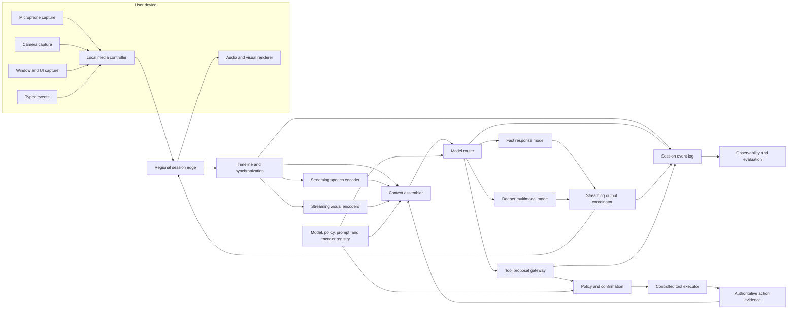
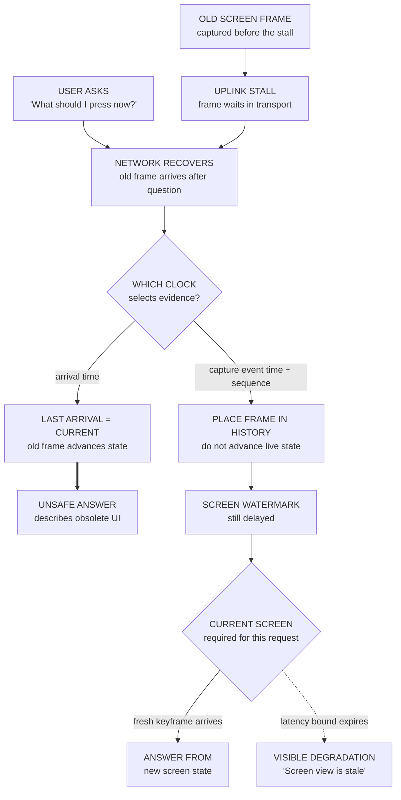
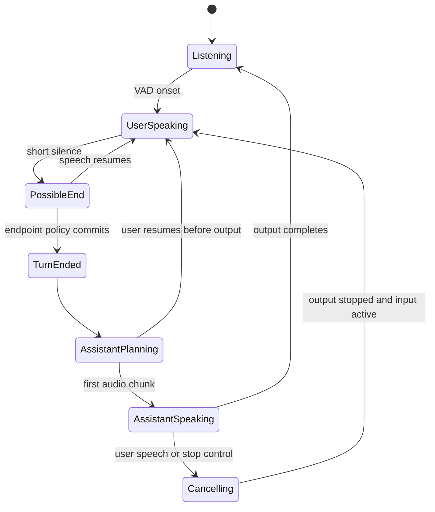

> *Asked in: multimodal ML system design, real-time LLM systems, product architecture, and upper-IC technical-strategy rounds.*

A basic answer streams microphone, camera, screen, and text into a multimodal model. A senior answer defines separate product modes, one event-time media timeline, bounded latency, interruption semantics, degraded operation, privacy, and measurable grounding.

A staff answer makes those contracts reusable across clients and teams. A principal answer chooses which capabilities become shared services. A senior-principal answer sets durable consent, evidence, authority, and ownership rules while models, devices, and product surfaces change.

The proposed system keeps fast media handling near the user, performs heavier reasoning in regional cloud services, and treats every modality as optional. It can continue safely when one stream becomes late, unavailable, untrusted, or disallowed.

## The prompt

Design a real-time assistant for laptops and phones. A user can speak, type, share a camera, or share one application window. The assistant answers by voice and text. With confirmation, it can operate approved tools.

The product supports four experiences:

1. a voice conversation while the camera shows an object;
2. guidance over a shared application window;
3. a meeting companion that answers questions about the current discussion;
4. an accessibility mode that describes visible content and accepts speech commands.

The first release serves 200,000 daily users in two regions. Peak concurrency is 20,000 sessions. Median sessions last eight minutes, while the p99 lasts two hours. Mobile networks are variable. Some enterprise tenants prohibit cloud video storage.

A recent prototype produced two failures. First, the assistant answered a question about an old screen frame after network recovery. Second, synthesized speech continued for 900 milliseconds after a user interrupted it. The user believed the assistant had ignored the interruption.

Design the product, architecture, synchronization contract, model path, latency budget, failure behavior, evaluation, rollout, and operating model.

## Choose product modes before components

The four experiences should share transport, identity, event schemas, model routing, and observability. They should not share one unrestricted context policy or latency target.

| Mode | Primary input | Expected output | Interaction target | Default authority |
| --- | --- | --- | --- | --- |
| Live conversation | Speech plus optional camera | Streaming speech and text | Natural turn exchange | Advice only |
| Screen guidance | Window frames, UI structure, speech | Grounded explanation or highlighted step | Fast reference to current state | Read-only unless confirmed |
| Meeting companion | Several speakers, shared content, text | Answers, notes, action drafts | Correct temporal and speaker context | Draft only |
| Accessibility control | Screen structure, camera, speech | Description and bounded commands | Predictable low delay | Narrow reversible actions |

### Live conversation

Speech controls the rhythm. The system should emit a useful audio response quickly, stop output when the user speaks, and avoid finalizing a turn during a natural pause. Camera evidence can enrich an answer, but late video should not block a simple spoken reply.

### Screen guidance

Freshness and grounding dominate. A correct answer about a stale window is still a product failure. Every claim about the screen should cite a frame sequence, structured UI snapshot, or optical character recognition result with a capture time.

### Meeting companion

Speaker attribution, consent, and temporal retrieval dominate. The assistant must distinguish live speech, prior transcript, chat, and shared slides. It should expose uncertainty when diarization or consent state is unclear.

### Accessibility control

Latency, predictable focus, and action confirmation dominate. The assistant should prefer accessibility-tree data over pixels when available. It must never infer that a visible button was activated unless the operating system reports the resulting state.

A candidate who merges these modes too early will hide incompatible requirements. Shared infrastructure is useful only when each mode can apply a stricter policy and a different degradation path.

## Clarify the user contract

Ask questions that remove architecture or change authority.

### Interaction

- Does the assistant need full duplex audio, or can output pause during user speech?
- May camera and screen inputs arrive together?
- Can the user switch modes during a session?
- Which response requires the latest visual state?
- How long may partial transcripts revise prior words?
- Does a visual pointer need pixel accuracy or semantic element accuracy?

### Action

- Is the assistant explaining, drafting, navigating, or committing an external change?
- Which actions are reversible?
- Which actions require confirmation on the same device?
- Can a meeting participant grant tool authority for another participant?
- What happens when the visible screen changes between proposal and confirmation?

### Privacy and consent

- Who can start camera, screen, or meeting capture?
- How do other participants learn that capture is active?
- Which media may leave the device or region?
- How long may raw media, derived features, transcripts, and summaries remain?
- Can the product learn from enterprise sessions?
- How are bystanders, children, and sensitive applications handled?

### Scale and reliability

- What are the target devices, codecs, languages, and network conditions?
- Which functions must work offline?
- What is the concurrent-session distribution by region?
- Which mode needs the strongest availability?
- What useful fallback exists when speech, video, or the model fails?

Assume full duplex audio is required. Screen sharing is limited to one chosen window. Camera sharing is explicit. Tool actions are reversible in the first release. Enterprise media stays in its selected region and is excluded from training by default.

## Define success by mode

One blended satisfaction score can hide severe regressions. Measure interaction, grounding, safety, reliability, and cost separately.

### Interaction quality

- time from user speech onset to stable partial transcript;
- time from detected turn end to first audible response;
- barge-in stop latency from user speech to inaudible output;
- false endpoint and missed endpoint rates;
- response abandonment and repeated-request rates;
- transcript revision distance after display;
- conversation overlap caused by late output.

### Multimodal grounding

- claims supported by the cited media interval;
- answer accuracy on current versus stale frames;
- temporal-order accuracy across audio and visual events;
- correct screen element, region, speaker, and application attribution;
- abstention when evidence is missing or too old;
- performance under conflicting text, speech, and visual evidence.

### Product outcomes

- task completion by mode;
- time to complete a guided workflow;
- user correction or manual takeover;
- accessibility command success and undo rate;
- meeting-answer usefulness after participant review;
- return usage without rising privacy complaints.

### Safety and privacy

- capture started without valid consent evidence;
- restricted media sent to a disallowed processor;
- sensitive application exposure outside the selected window;
- tool actions executed against stale visual state;
- harmful or unsupported advice from ambiguous media;
- deletion requests completed across raw and derived stores.

### Reliability and efficiency

- session setup success;
- reconnect success without timeline corruption;
- partial-modality availability by mode;
- p50, p95, and p99 latency for each response stage;
- compute and network cost per useful minute;
- thermal and battery cost on mobile devices.

Safety events should remain visible as counts and rates. Do not average an unauthorized capture event into general task success.

## Establish system invariants

The design follows from contracts that stay stable across model versions.

1. **Every media item has event time.** Capture time, sequence, source, and clock quality travel with the payload.
2. **Output cites an evidence horizon.** A response records the newest audio, video, screen, and text event it used.
3. **Late is different from current.** Recovered media cannot silently replace newer state.
4. **Every modality is optional.** The session declares which inputs are present, permitted, healthy, and required for the current request.
5. **Barge-in cancels output immediately.** Cancellation does not wait for semantic turn completion.
6. **A model proposal does not prove external state.** Tool execution and operating-system feedback provide action evidence.
7. **Raw media has bounded retention.** Derived memory inherits purpose, consent, tenant, region, and deletion scope.
8. **Consent changes apply during a session.** New media stops at capture or the first controlled boundary.
9. **Each stage has a latency budget.** Queueing cannot consume time reserved for endpointing or playback.
10. **Degraded operation is explicit.** The user can tell which modality is unavailable or stale.
11. **Shared services isolate sessions and tenants.** Context, credentials, budgets, and traces never cross by default.
12. **Incidents can identify affected outputs.** Versions and evidence intervals are queryable from every response.

These invariants define correctness more clearly than a list of model and storage products.

## Separate the media, reasoning, and action paths



### Device media controller

The device owns capture permissions, selected sources, echo cancellation, local voice activity detection, encryption, and immediate playback cancellation. It can reduce frame rate before transmission and expose a clear capture indicator.

### Regional session edge

The edge terminates the real-time transport, authenticates the session, applies tenant and region routing, and maintains short reconnect state. It should avoid semantic decisions that require the full context.

### Timeline service

The timeline service validates sequence numbers and timestamps, reorders within bounded windows, tracks watermarks, and marks gaps. It emits a common event stream for downstream encoders and the context assembler.

### Model path

Streaming encoders produce partial speech and visual features. The context assembler selects temporally aligned evidence. A router chooses a fast text or speech path, a deeper multimodal path, or a safe fallback.

### Action path

Tool proposals leave the generative path before execution. Policy checks identity, permission, arguments, evidence freshness, and required confirmation. The executor returns authoritative state, which can then enter the conversation.

## Give every event a common temporal envelope

Audio, video, screen, and text arrive at different rates. Arrival order is not event order. The shared envelope must preserve both.

```text
MediaEvent
  session_id
  source_id
  modality: audio | camera | screen | ui_tree | text | control
  sequence_number
  capture_time_monotonic
  capture_time_wall
  device_clock_epoch
  ingest_time
  duration_ms
  payload_ref
  codec_or_schema_version
  permission_version
  trust_class
  gap_before: true | false
  quality: {clock_error_ms, packet_loss, blur, audio_snr}
```

### Use a monotonic device clock

Wall clocks can jump after synchronization or manual changes. Order media with a monotonic device clock. Carry wall time for audit and cross-device correlation.

A new `device_clock_epoch` starts after restart or clock reset. Events from different epochs cannot be ordered by the monotonic value alone. The edge maps each epoch into session time and records uncertainty.

Epoch identifiers are opaque, not numeric ordering keys. After the edge authenticates and activates a new epoch for one source, late events from the prior epoch can repair history but cannot advance current state. A fresh keyframe or audio boundary establishes the new live baseline, and the trace records any unmapped gap.

### Estimate clock offset and drift

The device and edge exchange periodic timing probes. The service estimates network delay, device-to-edge offset, and clock drift. A robust filter should reject probes delayed by queue spikes.

The estimate produces an interval rather than a perfect timestamp. For example, a camera frame may map to session time 12.420 seconds with plus or minus 18 milliseconds. Context selection can then account for uncertainty.

### Preserve event time and arrival time

Event time describes when the user spoke or the screen changed. Arrival time describes when the service received it. Both are needed.

A video packet may arrive late because the mobile uplink stalled. Replaying that packet as current evidence recreates the prototype incident. The timeline marks it late and places it at its original event time.

<p class="visual-kicker">Learning objective</p>
<p class="visual-title">Trace why the last frame to arrive is not necessarily the current frame, then apply a freshness gate to the user's question.</p>

<!-- visual:multimodal-stale-frame-gate -->


<p class="diagram-caption"><strong>Read it this way:</strong> follow the recovered frame to the clock decision. Arrival order makes the old frame look newest; event time makes it a historical repair and leaves the live screen delayed. Because “now” requires current evidence, answer only after a fresh keyframe or state plainly that the screen is stale. Original synthesis checked against <a href="https://nightlies.apache.org/flink/flink-docs-stable/docs/concepts/time/">Apache Flink's event-time and watermark guidance</a>, <a href="https://www.rfc-editor.org/rfc/rfc3550.html">RTP timestamp and sequence contracts</a>, and <a href="https://www.rfc-editor.org/rfc/rfc8834.html">WebRTC media transport guidance</a>.</p>

### Define watermarks

A watermark states that the service expects no more events before a session time, within the configured lateness bound. Maintain it per source and modality. A request then applies its own freshness policy to those watermarks.

Audio can use a short lateness window because conversational delay is costly. Screen keyframes can tolerate a larger transfer delay, but an answer about the current screen may need to wait or abstain.

Use request-specific evidence rules:

- a spoken greeting can ignore late video;
- “What error is on my screen?” requires a fresh screen snapshot;
- “What did Alex say before the chart changed?” needs aligned transcript, speaker, and visual events;
- a confirmed click requires the exact UI state used when the action was proposed.

### Handle revisions explicitly

Partial automatic speech recognition can revise words. Optical character recognition can improve after a higher-quality frame arrives. A screen parser can replace a pixel-only guess with a structured element.

Emit revision events that reference prior hypotheses. Never overwrite history without an identity. Downstream responses record which hypothesis version they used.

If a revision invalidates a low-risk answer, the assistant may correct itself. If it affects a proposed action, the action must be revalidated before confirmation.

## Use adaptive jitter buffers

A jitter buffer trades completeness against delay. One fixed buffer cannot handle stable broadband and a variable mobile uplink well.

### Audio buffer

Packetized audio usually arrives in small frames. The edge estimates recent delay variation and chooses a target playout or processing delay. A common range might be 40 to 120 milliseconds, subject to measured network conditions.

When packets miss the deadline, the decoder can use packet-loss concealment. Waiting too long for a missing frame delays every later word. The system should expose loss and concealment to the speech encoder.

### Video buffer

Video can tolerate more reordering, but old frames have less product value. Prefer dropping dependent frames until the next decodable keyframe rather than building an ever-growing queue.

The session can request a fresh keyframe after a gap. Screen sharing can send semantic change regions or UI-tree deltas instead of full high-frame-rate video.

### Adaptive policy

The policy uses recent jitter, packet loss, bandwidth, mode, and device health. It should change slowly enough to avoid oscillation. It should shrink after recovery rather than preserving a large delay for the whole session.

Track the chosen buffer size as an event. Otherwise a latency regression may look like model slowdown even when the transport added the delay.

### Overload behavior

When the edge is overloaded, preserve audio and control events before redundant video. Drop intermediate camera frames while retaining keyframes and scene changes. Keep text and confirmation messages reliable.

Do not delay cancellation behind media processing. Barge-in and consent revocation use a high-priority control channel.

## Design voice activity, endpointing, and barge-in together

Voice activity detection (VAD) estimates whether speech is present. Endpointing decides whether the user's turn is complete. Barge-in stops assistant output when the user begins speaking. These functions share signals but have different costs.



### Run fast VAD on the device

The device can detect probable speech onset with very low delay. It should immediately lower or stop assistant playback and send a cancellation event. Cloud confirmation can follow.

Local VAD needs noise suppression, echo cancellation, and awareness of the assistant's own output. Otherwise the speaker output can trigger false barge-in.

### Combine acoustic and semantic endpointing

Silence alone is a weak end-of-turn signal. “Can you compare the first...” may contain a pause before the object name. A semantic endpoint model can estimate whether the partial transcript appears complete.

Use a layered policy:

1. a minimum silence prevents endpointing between phonemes;
2. acoustic evidence proposes an endpoint;
3. partial transcript and dialogue state adjust the wait;
4. a maximum wait bounds delay;
5. an explicit tap or command ends the turn immediately.

The policy can wait longer after conjunctions or incomplete questions. It can commit sooner after a direct command and a strong punctuation hypothesis.

### Keep endpoint decisions reversible for a short period

The system may start planning from a tentative endpoint. It should avoid committing audible output until confidence rises or a short hold expires. If the user resumes, cancel speculative work.

This approach hides some reasoning latency without forcing an early conversational interruption.

### Set a barge-in objective

Measure from detected user speech onset to the last audible assistant sample. A practical target may be below 200 milliseconds at p95 on supported devices. Measure device playback buffers, network cancellation, server cancellation, and already-buffered synthesized speech.

Stop sending new audio first. Flush or duck queued device audio next. Cancel text-to-speech and model generation after that. Preserve the partial assistant response in the transcript only if the product labels it interrupted.

### Resolve simultaneous speech

Some users say short acknowledgments while the assistant continues. The product may treat “yes” or “right” differently from a new question. Start with a simple rule that always yields to sustained user speech.

Later, add an overlap classifier with conservative thresholds. Users should have an explicit stop control that bypasses classification.

## Stream modality encoders with bounded state

A live session can last hours. Reprocessing all prior media after each packet is impossible. Each encoder needs bounded incremental state and a declared reset contract.

### Streaming speech path

The audio path performs echo cancellation, denoising, feature extraction, streaming encoding, decoding, punctuation, and optional speaker attribution.

A chunked encoder can cache prior attention or recurrent state. Limited lookahead improves recognition but adds visible delay. The decoder emits partial hypotheses with stability scores and token time ranges.

Keep final transcript words, timing, confidence, speaker hypothesis, and revision lineage. Do not retain raw audio longer than the consent and debugging policy allows.

### Camera path

Camera video contains heavy temporal redundancy. Use a cheap scene-change and quality model before the expensive visual encoder.

Possible outputs include:

- sampled frame embeddings;
- detected objects and tracks;
- text regions and optical character recognition;
- hand or pointer tracks;
- scene changes;
- safety-sensitive content labels;
- uncertainty and frame quality.

Use different sampling policies for a static document and a moving object. A user asking about a connector may need a sharp crop. A room-description request may need a wider scene sample.

### Screen path

Prefer structured sources when the platform exposes them:

1. accessibility tree and focused element;
2. application metadata and window bounds;
3. document object model for approved browser surfaces;
4. screen pixels and optical character recognition;
5. pointer, keyboard, and scroll events.

The accessibility tree gives semantic roles and state. Pixels cover custom canvases and remote desktops. Combining them needs spatial and temporal registration.

Every screen snapshot carries application identity, window identity, bounds, scale, and capture time. A crop without this metadata can point to the wrong element after resize or scroll.

### Typed text path

Typed text is reliable and low bandwidth, but its timing still matters. A correction sent after a spoken question should supersede the relevant phrase. Chat from another meeting participant needs speaker and consent metadata.

### Fusion path

The context assembler can represent evidence as temporally anchored segments:

```text
EvidenceSegment
  interval: [session_time_start, session_time_end]
  modality
  source_id
  semantic_content
  feature_ref
  provenance
  freshness
  confidence
  permission_scope
```

A multimodal model can attend to selected raw features while the language model receives compact semantic records. This hybrid avoids turning every video frame into a long token sequence.

### Reset and recovery

Encoder caches are performance state, not authoritative history. After failover, the service can rebuild from a bounded replay window and the latest stable summaries.

If cache reconstruction is too slow, mark that modality warming. Continue with other inputs and tell the user when the requested answer needs the missing context.

## Assemble context around the active question

The assistant should not place the entire session into every model call. Context selection uses the current turn, product mode, temporal references, evidence freshness, and memory policy.

### Use a layered context

1. **Control context:** policy, mode, allowed tools, consent, and response constraints.
2. **Current turn:** stable and partial transcript, typed corrections, and interaction state.
3. **Aligned media:** fresh frames, UI structure, visual features, and audio events near the turn.
4. **Session summary:** compact facts and unresolved references from the current session.
5. **Retrieved history:** older episodes selected for the present request.
6. **Tool evidence:** authoritative results with timestamps and source identities.

Untrusted visual text, transcripts, web content, and tool output remain evidence. They cannot alter tool authority or consent policy.

### Resolve temporal language

Words such as “this,” “that,” “before,” and “when I clicked” require event references. The system should bind them to candidate intervals and preserve uncertainty.

For “What changed after I clicked Save?”, retrieve the UI state before the click, the operating-system input event, the state after it, and any tool result. Do not answer from the newest frame alone.

### Budget visual detail

Start with semantic summaries and a small set of high-value frames. Add crops or raw features when the question requires fine detail. A second model pass can request more evidence through a read-only retrieval operation.

The request should state what evidence was absent. Silent omission makes a hallucinated visual answer look grounded.

### Prevent context races

The screen can change while context is assembled. Assign a `context_snapshot_id` with per-modality watermarks. The generated response cites that snapshot.

For ordinary advice, a newer event can wait for the next turn. For a tool proposal, any relevant newer screen or permission event invalidates the proposal and forces revalidation.

## Separate session state from durable memory

Memory should match the user's expectation and the product purpose.

### Ephemeral media state

Jitter buffers, encoder caches, partial transcripts, and temporary frame features expire quickly. They exist to complete the current interaction.

### Session record

The session record contains stable transcript segments, evidence references, model responses, interruption state, tool proposals, and action outcomes. Retention differs by product and tenant.

### User-approved preferences

Language, voice speed, accessibility preferences, and explicit personal facts can persist when the user opts in. Each item has source, creation time, purpose, confidence, expiration, and deletion identity.

### Meeting memory

Meeting summaries need participant and tenant scope. A later participant should not gain access because one attendee used the assistant. Retrieval checks current membership and the meeting's sharing policy.

### Learned product patterns

Aggregate quality improvements should use consented, minimized data. Enterprise sessions remain excluded unless the contract says otherwise. Raw media is a poor default training artifact because it carries bystander and background information.

### Memory writes

The model proposes a memory item. A memory policy decides whether the category is allowed, whether confirmation is required, and how long it lives. Sensitive inferred traits should not become durable memory.

### Deletion

A deletion request removes the authoritative item and invalidates transcript indexes, frame indexes, summaries, embeddings, and cached context that derive from it. The system records completion without retaining the deleted content.

Backups follow a bounded expiry policy. Evaluation sets and incident artifacts need separate legal and user-consent rules. A deletion verifier should test that authorized retrieval no longer returns the subject.

## Allocate an end-to-end latency budget

Users experience delay from capture through playback. Model runtime is one part.

Assume the user completes a spoken question on a healthy regional connection. A p95 target for first audible response might be about 850 milliseconds after the committed endpoint.

| Stage | Example p95 budget | Notes |
| --- | ---: | --- |
| Final audio transport and jitter | 80 ms | Adaptive by network condition |
| Endpoint decision after silence | 180 ms | Semantic policy can shorten or extend |
| Stable transcript finalization | 70 ms | Planning may begin from partial text |
| Context and media selection | 80 ms | Uses precomputed streaming features |
| Queue and route | 40 ms | Reserve capacity for interactive priority |
| Model time to first response token | 220 ms | Fast path for common conversational turns |
| Initial text-to-speech audio | 90 ms | Time to the first playable streamed chunk |
| Return transport and device playback | 70 ms | Includes device audio buffer |
| **Total** | **830 ms** | Budgets overlap through speculation |

The arithmetic total is a diagnostic bound. Some work overlaps. The system can retrieve visual context while endpoint confidence rises. Text-to-speech can start after a stable opening clause.

### Track several latency clocks

- speech onset to stable partial text;
- speech end to endpoint commit;
- endpoint commit to first model token;
- first token to first synthesized audio;
- audio produced to audio played;
- user barge-in to last audible output;
- screen change to queryable feature;
- reconnect to a current timeline.

### Protect interactive queues

Meeting summarization and background indexing should not delay live turns. Use workload classes, admission control, per-tenant quotas, and reserved interactive capacity.

A long context request can route to a slower path after acknowledging the user. A fast response can say that it is checking the shared screen, then provide the grounded result when ready.

### Define mode-specific targets

Screen guidance may accept a slower answer if it guarantees a fresh frame. Accessibility navigation may require lower action feedback latency. Meeting questions may tolerate more delay for speaker and temporal accuracy.

One service-level objective for every mode will pressure teams to hide either quality or delay.

## Split work across device, edge, and cloud

Placement follows privacy, latency, compute, battery, and update frequency.

### Device

Good device candidates include capture, permission enforcement, source selection, echo cancellation, fast VAD, playback cancellation, low-cost scene change, redaction, and a small offline speech path.

Device processing reduces media transfer and preserves basic function during outages. It also consumes battery, memory, and thermal budget. Older phones may need lighter policies.

### Regional edge

The edge handles transport, session authentication, clock mapping, adaptive jitter, reconnect state, traffic shaping, and nearby routing. It can host compact encoders when the latency and cost justify regional deployment.

### Regional cloud

The cloud hosts large multimodal models, durable event processing, retrieval, tool policy, shared memory, evaluation, and fleet management. Sensitive tenants can use dedicated regional deployments or approved private endpoints.

### Placement decision

Do not claim that all media should stay local or that all reasoning belongs in the cloud. Choose per stage.

For example, keep raw screen pixels on device for an enterprise tenant. Send a redacted accessibility-tree representation and selected encrypted crops only when the user asks about a visual detail.

### Model update trade-off

Cloud models update quickly and share accelerators efficiently. On-device models offer privacy and resilience but have slower fleet adoption. The contract should tolerate mixed encoder and model versions during staged rollout.

## Degrade by modality instead of failing the whole session

The session health record tracks each source independently.

| Failure | Continue with | User-visible behavior | Unsafe behavior to avoid |
| --- | --- | --- | --- |
| Microphone denied | Text, screen, camera | Show text input and permission recovery | Pretend voice is active |
| Audio packet loss | Partial ASR, text correction | Mark uncertain words and ask briefly | Commit a consequential command from weak audio |
| Camera unavailable | Voice, text, screen | State that camera evidence is unavailable | Describe an old camera frame as current |
| Screen capture frozen | Voice, text, camera | Show stale timestamp and request refresh | Execute against stale UI state |
| UI tree missing | Pixels and OCR | Reduce element confidence | Claim exact semantic role from pixels alone |
| Multimodal model down | ASR plus text model | Offer limited voice and text mode | Route visual questions to text priors silently |
| Speech synthesis down | Text output | Continue captions and controls | Block the full response |
| Memory unavailable | Current session context | Disable cross-session recall | Guess remembered preferences |
| Tool gateway down | Advice and drafts | Disable actions with clear status | Give model direct credentials |
| Region disconnected | Local commands and reconnect | Preserve local cancellation and capture controls | Buffer unlimited sensitive media |

### Freshness gates

Every modality has a freshness state: current, delayed, stale, warming, absent, or disallowed. The active request declares required states.

“What color is the object now?” should wait for current camera evidence or abstain. “Explain recursion” can proceed without camera input.

### Recovery

On reconnect, the device sends the current clock epoch, source states, highest acknowledged sequence, and a fresh keyframe. The edge rejects duplicates and does not replay stale media as current.

The assistant can summarize that some context was missed. It should not invent a continuous account of the gap.

## Put tool use behind fresh evidence and explicit authority

The assistant may propose a click, form edit, calendar draft, or device setting change. The action path must be stricter than the answer path.

### Bind proposals to observed state

A proposal includes:

```text
ActionProposal
  action_id
  tool_and_version
  structured_arguments
  user_identity
  delegated_scope
  context_snapshot_id
  required_evidence_ids
  newest_allowed_event_time
  reversible_until
  confirmation_policy
```

If the window, focused element, arguments, permission, or relevant media changes, the proposal expires. A new proposal can explain the updated state.

### Prefer semantic targets

Use stable element identity, application identity, and expected state instead of raw coordinates. Coordinates can change after scroll, zoom, resize, or remote rendering.

When only pixels are available, highlight the proposed target and require confirmation. After execution, read the operating-system or application result before reporting success.

### Keep tools narrow

A screen-guidance assistant does not need general shell or filesystem access. Each product mode receives a small action catalog with argument limits and rate limits.

The accessibility mode may receive bounded navigation operations. A meeting mode may create a draft action item without sending messages automatically.

### Handle unknown outcomes

A timeout after dispatch does not prove failure. Query tool state by action identity or pause for reconciliation. Never repeat a consequential action only because the response was lost.

## Make privacy and consent part of runtime state

Consent is not a setup screen that disappears after onboarding. It changes what the live pipeline may capture, send, store, retrieve, and learn from.

### Capture indicators

Show persistent, modality-specific indicators for microphone, camera, window, meeting recording, and tool action. A global “assistant active” light is too vague.

The device must stop capture when the user disables a source. Server policy should also reject packets created under an expired permission version.

### Window isolation

Use operating-system window capture when available. Avoid full-display capture followed by cloud cropping. The latter exposes notifications and other applications before filtering.

When a dialog opens outside the selected window, pause visual claims until the capture contract explains whether it is included.

### Meeting consent

The product needs a participant policy, jurisdiction policy, and visible notification. Joining late, changing rooms, or adding an external participant can change consent state.

If valid consent disappears, stop new capture and mark the timeline boundary. Existing retained data follows the declared retention contract.

### Bystanders and background data

Camera media can reveal faces, documents, homes, and health information. Use on-device redaction when possible. Avoid durable face identity unless the feature explicitly requires and authorizes it.

### Provider policy

The model gateway checks tenant, region, media class, and provider agreement before routing. A provider outage cannot justify sending restricted media to an unapproved fallback.

### Data minimization

Store semantic events or selected evidence instead of continuous raw media when the product can still work. Debug sampling needs explicit rates, access, expiration, and redaction.

## Add safety controls around perception and response

A multimodal assistant can make confident claims from weak or manipulated evidence. Safety depends on source quality, grounding, policy, and response behavior.

### Ground claims

Responses should carry internal evidence links. User interfaces can expose a frame thumbnail, transcript interval, or “screen last updated 4 seconds ago” when helpful.

The model should abstain from exact identity, medical interpretation, or hazardous physical guidance when evidence and policy are insufficient.

### Detect conflicting evidence

A screen message can instruct the assistant to ignore policy. Spoken instructions can conflict with typed corrections. A poster can contain text that resembles a command.

Source type and authority resolve the conflict. User-authenticated control events have a different role from text observed in an image.

### Protect high-risk domains

Medical, financial, legal, child-safety, and physical-control scenarios need narrower product behavior. The first release can restrict responses to information, emergency guidance, or approved workflows.

### Resist media attacks

Test adversarial audio, hidden text, rapid frame changes, replayed speech, synthetic participants, and manipulated timestamps. Transport authentication and sequence checks reduce replay risk. Policy must still limit any accepted instruction.

### Keep uncertainty visible

The product can say that audio was unclear, the screen changed, or the camera view is too dark. A short clarification is better than a fluent unsupported answer.

## Observe the full interaction timeline

The trace should explain delay, evidence, model behavior, interruption, and external effects without retaining unnecessary raw media.

### Correlation identities

Use session, turn, source, event, context snapshot, model request, output stream, tool action, and incident identifiers. Preserve parent-child relationships.

### Stage telemetry

Record:

- packet loss, jitter, selected buffer, and codec;
- clock-offset estimate and uncertainty;
- VAD onset, endpoint proposal, and endpoint commit;
- transcript revisions and stability;
- frame sampling, freshness, quality, and dropped frames;
- context evidence identities and token counts;
- model route, queue time, and time to first token;
- synthesis chunks, playback acknowledgments, and cancellation;
- tool proposal, policy result, confirmation, dispatch, and final state.

### Derived operational views

Build views for slow turns, late-frame answers, false endpoints, incomplete cancellation, privacy denials, modality outages, and action reconciliation. Slice by device, network, language, tenant, region, mode, and model version.

### Privacy-aware traces

Keep metadata broadly queryable and payload access narrow. Store hashes or redacted references when operators only need timing and version information. Access to raw sampled media should require an incident or evaluation purpose.

### Alert on user-visible failure

CPU and request-error alerts are insufficient. Alert when stale evidence supports current claims, barge-in misses its objective, endpoint errors spike, or a region sends media to an invalid processor.

## Evaluate the system at several layers

A single answer-quality judge cannot measure synchronization, cancellation, privacy, or external state.

### Component evaluation

Measure streaming speech error, partial stability, speaker attribution, scene detection, object tracking, optical character recognition, UI parsing, synthesis quality, and VAD accuracy.

Component scores help diagnosis. They do not prove that the complete assistant answers the right question at the right time.

### Temporal grounding evaluation

Build cases with controlled event order:

- an object moves after the user names it;
- the screen error changes during a network stall;
- a speaker corrects a number two seconds later;
- typed text supersedes a spoken phrase;
- an old camera packet arrives after a new keyframe;
- the user asks about an event before a click.

Score event selection, ordering, freshness, and supported claims. Include timestamp uncertainty and missing packets.

### Interaction evaluation

Use recorded and synthetic turn patterns with pauses, overlap, noise, backchannels, interruptions, and device echo. Measure endpoint decisions and audible cancellation directly.

Human raters can judge natural rhythm, but instrumentation should supply onset and playback times. Memory of conversational delay is imprecise.

### Task evaluation

Create mode-specific tasks. Screen guidance can use reproducible application states and expected elements. Accessibility tasks can verify focus and final application state. Meeting questions can use known speaker and event timelines.

### Safety and privacy evaluation

Test revoked consent, disallowed regions, hidden windows, background notifications, prompt-like visual text, synthetic voices, stale action proposals, and cross-tenant memory attempts.

A severe privacy failure should fail the release gate even if aggregate task success improves.

### Partial-modality evaluation

Remove, delay, corrupt, or forbid one modality. Verify that the system continues only when the request remains answerable. Check the user message and the absence of silent text-prior substitution.

### Long-session evaluation

Run sessions for hours. Test encoder-state growth, summary drift, speaker changes, clock epochs, device handoff, reconnect, memory deletion, and context retrieval after compaction.

### Stochastic evaluation

Repeat model-dependent cases. Report success probability, severe-tail count, latency distribution, and cost. Pin every component version and retain the evidence identities needed for replay.

## Connect offline evaluation to online evidence

Offline suites provide controlled coverage. Production supplies network diversity, real conversational rhythm, and new failure families.

### Online metrics

Track useful completion, correction, interruption, modality disablement, repeated questions, action undo, support reports, and privacy settings changes. Interpret them by mode and exposure.

A low camera-disable rate does not prove comfort. Users who dislike capture may never start the feature. Compare eligible, exposed, started, completed, and retained populations.

### Sample review

Review consented samples from failure buckets rather than random traffic alone. Useful buckets include high latency, stale evidence, repeated barge-in, user correction, action undo, and cross-modal disagreement.

### Counterfactual tests

Run shadow alternatives on recorded or consented sessions without changing user output. Compare endpoint policy, context selection, route, and safety decisions against the shipped path.

### Release gates

Require all of the following:

- no regression in severe privacy or unauthorized-action cases;
- temporal grounding above the mode threshold;
- latency within stage budgets for supported devices;
- partial-modality behavior that matches the product contract;
- no material regression on language, accent, disability, or device slices;
- cost within the rollout budget.

## Plan capacity and cost around live sessions

Peak concurrency drives state and accelerator demand. Average daily users do not size the interactive fleet.

### Session state

Keep small reconnect and routing state at the edge. Store durable events asynchronously with bounded buffering. Encoder caches live near the assigned worker and expire after the session.

### Model scheduling

Batch across active sessions for encoder and decoder efficiency, but cap waiting time. Continuous batching should respect interactive deadlines and cancellation.

Use a fast path for common turns and a deeper path for fine visual reasoning. The router can consider required modality, evidence detail, language, risk, device, queue, and tenant policy.

### Visual compute

Do not encode unchanged screens at camera frame rates. Change detection, structured UI deltas, region crops, and question-driven sampling reduce cost.

### Admission control

When capacity is scarce, preserve active turns and accessibility sessions before background meeting summaries. Reject or delay new expensive visual operations with a clear fallback.

### Unit economics

Track cost per useful session minute and per completed task. Break cost into transport, edge state, speech, vision, language model, synthesis, storage, and human review.

Optimization should preserve interaction and grounding gates. A cheaper route that answers from stale frames has poor unit economics despite lower compute cost.

## Roll out from observation to bounded action

### Phase 0: instrument the prototype

Add common event identities, playback acknowledgments, evidence horizons, and stage latency. Reproduce the stale-frame and late-barge-in incidents before changing the architecture.

### Phase 1: voice and text pilot

Launch full duplex speech with text fallback to employees and invited users. Keep camera, screen, and tools disabled. Validate endpointing, cancellation, regional routing, and long-session stability.

### Phase 2: read-only visual pilot

Add explicit camera and selected-window sharing. Answers expose freshness and can abstain. No visual state can trigger an external action.

### Phase 3: screen guidance

Add UI structure, temporal references, and reproducible application tasks. Pilot with a few applications whose semantics and capture behavior are understood.

### Phase 4: reversible tools

Allow narrow actions bound to context snapshots and explicit confirmation. Keep undo available and verify final state.

### Phase 5: enterprise and meeting expansion

Add regional policy, tenant retention, meeting consent, administrative controls, and audited support. Expand only after deletion and isolation tests pass.

### Rollback units

Roll back encoder, endpoint policy, model route, context selector, synthesis, tool policy, or client release independently. A global product rollback should be rare.

### Stop conditions

Stop expansion after any unauthorized capture, cross-tenant context, repeated stale-state action, unexplained tool effect, or material accessibility regression. Repair the relevant capability before increasing authority.

## Walk through the stale-screen incident

The prototype answered “Click Retry” after the application had already recovered and replaced the dialog.

1. A mobile uplink stalls for four seconds.
2. Audio continues through a lower-bandwidth path.
3. Several old screen frames queue on the device transport.
4. The user asks, “What should I press now?”
5. The network recovers and the old frames arrive before a fresh keyframe.
6. The prototype selects by arrival time and treats the last old frame as current.
7. The model describes the obsolete Retry button.

The production design changes the outcome:

1. Every frame carries capture time, sequence, and clock epoch.
2. The timeline places recovered frames in their original interval.
3. The question requires a current screen freshness state.
4. The screen watermark is delayed, so context assembly waits briefly.
5. The device sends a requested keyframe.
6. If it arrives within the response budget, the model answers from the new state.
7. Otherwise the assistant says the screen view is stale and asks the user to refresh sharing.
8. Any prior action proposal bound to the old snapshot expires.

The incident review queries all responses produced with the affected timeline version, transport condition, and freshness decision. It does not require searching raw video manually.

### Corrective actions

- add event-time ordering tests with delayed packet release;
- reject mixed clock epochs without a mapping;
- include freshness in the context snapshot contract;
- request a keyframe after a screen gap;
- add a stale-answer release gate;
- expose screen age in traces and selected user states;
- assign timeline correctness to one service owner.

## Walk through the barge-in incident

The user starts speaking while 900 milliseconds of synthesized audio remains queued on the device.

The server canceled generation quickly, but the client playback buffer continued. Server-only latency made the system look healthy.

The corrected flow is:

1. local VAD detects sustained user speech;
2. the client immediately ducks and flushes assistant playback;
3. a high-priority cancellation event reaches the edge;
4. the output coordinator stops new synthesis and model generation;
5. playback acknowledgment records the last audible sample;
6. the conversation marks the assistant turn interrupted;
7. the new user turn starts from the interruption point.

The service-level objective uses the last audible sample, not the server cancellation timestamp.

## Define ownership around user-visible contracts

### Client media team owns

- capture permissions and indicators;
- selected-source isolation;
- device preprocessing and echo cancellation;
- local VAD and playback cancellation;
- battery, thermal, and client compatibility;
- playback acknowledgments and offline fallback.

### Real-time platform owns

- transport and reconnect;
- clock mapping and jitter policy;
- timeline ordering and watermarks;
- interactive scheduling and session state;
- common event schemas and reliability objectives.

### Multimodal ML team owns

- speech, vision, fusion, routing, and synthesis models;
- context selection and evidence quality;
- model evaluations and slice performance;
- model release and fallback behavior.

### Product teams own

- mode semantics and task outcomes;
- user controls and explanations;
- action catalogs and confirmation experience;
- domain evaluation cases;
- support and feedback loops.

### Privacy, security, and safety owners own

- consent and retention policy;
- provider and regional constraints;
- threat models and severe release gates;
- incident review requirements;
- audit and deletion assurance.

Shared ownership cannot mean unclear incident authority. Each failure class needs one primary responder and tested escalation.

The real-time platform owns the end-to-end interaction SLO and assigns sub-budgets to client, model, synthesis, and transport owners. A miss is diagnosed across the full timeline rather than transferred between teams at component boundaries.

## Decide what to build, buy, and keep replaceable

### Likely external capabilities

- commodity real-time transport;
- speech or synthesis models for early releases;
- large multimodal model inference;
- device codec support;
- managed regional compute and object storage.

### Likely company-specific capabilities

- product-mode contracts;
- event-time synchronization and evidence horizons;
- context and freshness policy;
- consent integration;
- tool authority tied to observed state;
- evaluation suites and incident linkage;
- cross-device interaction experience.

### Stable interfaces

Keep media envelopes, context snapshots, evidence references, model requests, action proposals, and evaluation records versioned independently from a provider.

Provider portability does not require identical behavior. It requires measurable behavior, exportable state, and a bounded migration path.

### Build-buy review

Review quality, regional availability, latency, cost, data terms, failure behavior, observability, and exit effort per capability. Avoid one suite decision for transport, speech, vision, reasoning, and synthesis.

## Make staff-level decisions explicit

A staff candidate should make the reusable technical contracts precise.

1. Define one event-time envelope across modalities.
2. Set mode-specific freshness and latency policies.
3. Design adaptive jitter, endpointing, and barge-in as one interaction system.
4. Keep streaming encoder state bounded and recoverable.
5. Make partial-modality behavior explicit.
6. Bind tool proposals to current evidence.
7. Join transport, model, playback, and action traces.
8. Roll out through representative product slices.
9. Align service ownership with failure classes.

The candidate should defend one mechanism under pressure. Strong choices include clock epochs, watermarks, endpoint policy, context snapshots, playback cancellation, or stale action invalidation.

## Add principal-level decisions

A principal candidate chooses the shared boundary across products and organizations.

1. Standardize timeline, consent, evidence, and action contracts before standardizing every model.
2. Keep product-specific interaction and outcome semantics with product teams.
3. Decide which encoders and gateways need regional shared operation.
4. Balance live experience, privacy, accessibility, reliability, and model capability investments.
5. Preserve a useful text or local fallback when cloud multimodal reasoning fails.
6. Define evidence that expands or narrows each product mode.
7. Fund client, platform, ML, evaluation, and retirement work together.
8. Develop technical owners for synchronization, interaction, grounding, and privacy.

Principal scope appears in shared-boundary, portfolio, and authority decisions. Adding more modalities to one diagram does not demonstrate it.

## Add senior-principal decisions

Titles vary across companies. This section describes organization-wide technical scope rather than a universal title mapping.

### Set durable interaction doctrine

The organization can adopt rules that survive specific models:

- user control has a direct path to capture and playback;
- event time governs live evidence;
- missing modalities cause visible degradation;
- consequential actions require fresh, authoritative state;
- consent and purpose follow derived data;
- product outcomes stay with product owners.

### Federate technical authority

Principal engineers can own real-time transport, multimodal models, interaction policy, privacy, and product adoption. Define interface authority, release rights, incident command, and appeal paths.

The senior-principal role keeps those directions coherent without reviewing every model or product change.

### Balance a multi-year portfolio

Investments compete across on-device models, regional capacity, foundational models, accessibility, privacy infrastructure, evaluation, and new product modes. A model upgrade may be less valuable than fixing interruption or consent failures.

Use quarterly evidence to expand, narrow, or retire bets. Preserve budget for reliability and old-client retirement.

### Plan for external change

Device platforms can restrict capture APIs. Regulators can change consent rules. Providers can remove models or regions. Networks and accelerators can change cost.

Stable event, evidence, consent, and action contracts let implementation move without redefining every product.

### Design succession and reversal

Document decision rights, compatibility policy, incident lessons, quality thresholds, and retirement criteria. Another leader should be able to challenge and change the direction from recorded evidence.

State what would reverse centralization. For example, regulated tenants may require isolated execution while retaining the common timeline and evaluation formats.

### Retain technical depth

A senior-principal candidate should still reason precisely about one mechanism. They might derive a watermark policy, bound barge-in latency, explain context invalidation, or trace a cross-region consent change.

Broad organizational language without mechanism is weak evidence.

## Compare rejected architectures

### Send every stream directly to one model

This simplifies a demo but hides event time, cost, degraded modes, and source authority. Preprocess and align media before assembling question-specific context.

### Order media by arrival

This works on stable networks and fails after jitter or reconnect. Preserve capture time, clock epoch, sequence, and bounded lateness.

### Wait for every modality

This improves completeness while making conversation depend on the slowest stream. Declare request-specific required modalities and freshness.

### Use silence as the only endpoint

This clips pauses or adds excessive delay. Combine acoustic, semantic, dialogue, and explicit controls.

### Cancel only on the server

Queued device audio can keep playing. Stop playback locally and measure the last audible sample.

### Keep continuous raw media for debugging

This simplifies retrospective review while creating privacy, security, and cost exposure. Retain selected consented evidence with strict access and expiry.

### Execute screen actions from pixel coordinates

Coordinates become stale after layout change. Prefer semantic element identity and verify final application state.

### Make one team own every modality

Central ownership can disconnect product semantics from infrastructure. Use common contracts with clear domain and product ownership.

## Structure a 60-minute interview

### Minutes 0 to 7: define modes and user contract

Name the four product modes. Clarify full duplex, authority, consent, regions, devices, scale, and current incidents. State that media shares an event-time timeline while modes keep separate freshness and latency policies.

### Minutes 7 to 15: define success and invariants

Choose interaction, grounding, privacy, reliability, and cost metrics. Define event time, evidence horizons, optional modalities, cancellation, retention, and explicit degradation.

### Minutes 15 to 25: draw the architecture

Connect device capture, edge session handling, synchronization, streaming encoders, context assembly, model routing, output, action policy, event logs, and evaluation.

### Minutes 25 to 37: take one technical deep dive

Choose one:

- clock synchronization, jitter, and watermarks;
- VAD, endpointing, and barge-in;
- streaming encoders and context selection;
- screen freshness and action invalidation;
- long-session state and memory;
- partial-modality recovery.

### Minutes 37 to 45: cover evaluation and safety

Explain temporal grounding cases, interaction instrumentation, privacy tests, severe release gates, partial-modality evaluation, and online evidence.

### Minutes 45 to 52: cover operation and rollout

Define stage budgets, degraded modes, incident linkage, rollout phases, rollback units, and ownership.

### Minutes 52 to 57: make principal decisions

Choose shared versus product-specific capabilities. Discuss build-buy, regional placement, portfolio evidence, and technical ownership.

### Minutes 57 to 60: add senior-principal scope

State durable doctrine, federated authority, external change, succession, and evidence that would reverse a major platform choice.

## Distinguish answer levels

### Senior

Designs one reliable live assistant experience. It covers streaming media, a latency target, endpointing, grounding, fallback, and product evaluation.

### Staff

Defines reusable synchronization, context, degradation, action, and observability contracts across several modes. It remains precise during a transport, model, or interaction follow-up.

### Principal

Chooses shared capabilities across products, balances infrastructure and model investments, assigns technical ownership, and keeps regional or product variation behind stable contracts.

### Senior principal

Defines durable interaction, consent, evidence, and authority doctrine across principal-owned directions. It handles external change, succession, portfolio reversal, and retained technical depth.

## Observer scorecard

Score each dimension from 0 to 2.

| Dimension | 0 | 1 | 2 |
| --- | --- | --- | --- |
| Product modes | Treats all sessions alike | Names several modes | Gives each mode distinct latency, context, authority, and fallback |
| Synchronization | Uses arrival order | Mentions timestamps | Defines clocks, epochs, event time, lateness, revisions, and watermarks |
| Interaction | Says use VAD | Adds endpointing | Connects VAD, semantic endpointing, local cancellation, and playback evidence |
| Model path | Sends all media to one model | Adds encoders | Uses streaming state, temporal evidence, question-driven context, and routing |
| Latency | Gives one model target | Lists stages | Budgets capture through playback and protects interactive queues |
| Reliability | Retries streams | Adds fallback | Defines per-modality health, safe degradation, recovery, and stale-state gates |
| Privacy and safety | Mentions consent | Adds retention | Enforces live permission, source isolation, purpose, deletion, and severe gates |
| Evaluation | Uses answer ratings | Adds component metrics | Tests temporal grounding, interaction, external state, slices, and missing inputs |
| Ownership and rollout | Says pilot | Names teams | Transfers authority by mode with rollback, incident, and primary owners |
| Principal scope | Adds scale | Discusses platform | Chooses shared boundaries, portfolio, build-buy, and reversal evidence |
| Senior-principal scope | Says company-wide | Adds doctrine | Federates leaders and plans for external change, succession, and reversal |
| Communication | Lists components | Uses a structure | Preserves the decision while changing technical depth under challenge |

A staff target should score 2 on synchronization, interaction, reliability, and ownership. A principal target should also score 2 on shared boundaries and portfolio. A senior-principal target should add doctrine, delegated leadership, succession, and reversal.

## Strong signals

- Separates product modes before selecting a model.
- Uses event time and capture identity instead of arrival order.
- Explains clock epochs, bounded lateness, and request-specific freshness.
- Treats VAD, endpointing, playback, and barge-in as one measured loop.
- Uses streaming encoder state and question-driven visual sampling.
- Makes every modality optional and defines visible degraded behavior.
- Binds screen actions to a context snapshot and authoritative final state.
- Includes capture consent, window isolation, provider policy, retention, and deletion.
- Measures temporal grounding and audible cancellation directly.
- Allocates latency across transport, endpointing, models, synthesis, and playback.
- Connects incidents to versions and evidence intervals.
- Assigns client, platform, ML, product, and policy ownership.
- Chooses shared contracts before a universal implementation.
- Distinguishes staff execution, principal portfolio, and senior-principal doctrine.

## Weak signals

- Says “use a multimodal model” without defining product modes.
- Sends every frame and audio chunk into one growing prompt.
- Orders recovered packets by arrival time.
- Waits for all modalities before every response.
- Uses silence alone for turn completion.
- Measures cancellation at the server while device audio continues.
- Treats old visual evidence as harmless context.
- Claims a click succeeded because the model requested it.
- Stores continuous raw media by default.
- Uses one average quality score across severe privacy and ordinary task outcomes.
- Discusses latency without capture, endpoint, synthesis, and playback.
- Adds regions and teams without changing ownership or policy.
- Cannot explain one synchronization or interaction mechanism precisely.

## Changed-condition follow-ups

1. Enterprise policy now forbids raw audio and video from leaving the laptop. Which capabilities move on device?
2. The assistant must support a three-hour workshop with 20 speakers. How do state, diarization, memory, and consent change?
3. Camera packets arrive six seconds late after reconnect. What enters context, and what is discarded?
4. A user says “stop” while background speech plays from a television. How should barge-in behave?
5. The user asks about tiny text on a moving camera view. Which latency and sampling trade-offs change?
6. Accessibility users need screen navigation during a cloud outage. What must remain local?
7. A provider outage removes the only model that accepts video. How does the product degrade?
8. A screen application blocks accessibility-tree access. When are pixels sufficient for an action?
9. The user revokes screen consent while a model request is in flight. What output may still appear?
10. A meeting participant joins after recording started and declines consent. What happens to capture and prior memory?
11. The system improves final speech accuracy but doubles partial transcript revisions. Do you ship?
12. Barge-in p95 is healthy, but p99 exceeds two seconds on one phone family. How do rollout and ownership change?
13. A new model accepts an hour of raw video context. Which preprocessing and memory components can be removed?
14. A regional edge loses its timeline state while the model worker remains healthy. What continues?
15. Screen-guidance task success rises while stale-evidence answers also rise. Which metric controls release?
16. Two product teams demand different endpoint policies. Which layer owns the variation?
17. A vendor offers transport, speech, video, and reasoning in one API. Which interfaces and evidence must remain portable?
18. Privacy review permits 24-hour raw-media debugging for one incident. How do access and deletion work?
19. Visual processing cost triples after usage shifts to screen sharing. Which optimizations preserve product quality?
20. The assistant begins controlling a robot arm. Which assumptions, action classes, and latency guarantees no longer hold?
21. A principal owner leaves during regional expansion. Which records and decision rights preserve progress?
22. Three quarters of investment produce better models but no improvement in user interruption or grounding. Which portfolio changes follow?

For each follow-up, name the changed invariant, affected mode, required evidence, safe fallback, owner, and rollback unit.

---

*Related: [streaming automatic speech recognition](/concepts/streaming-asr/), [multimodal foundation models](/concepts/multimodal-foundation-models/), [automatic speech recognition](/concepts/automatic-speech-recognition/), [long-context LLMs](/concepts/long-context-llms/), and [production LLM inference design](/questions/design-production-llm-inference-service/).*
