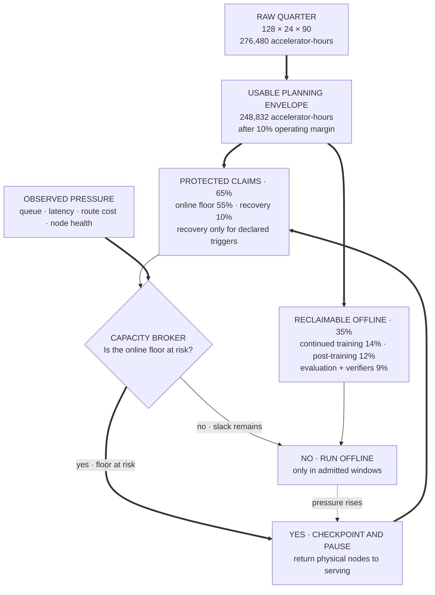
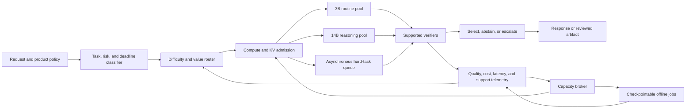

> *Asked in: staff, principal, and company-dependent senior-principal reasoning-model, LLM systems, research systems, and technical-strategy rounds.*

A basic answer estimates training and inference demand, divides the cluster, and proposes a model plus serving stack. A senior answer adds a measured quality-cost frontier, routing, verifier support, admission control, rollout, recovery, and explicit ownership.

The recommended plan starts from a capable dense base model rather than pretraining from random initialization. It reserves online capacity first, funds a staged continued-training and post-training program, and varies inference effort by task difficulty and risk. Every allocation has evidence that can expand, narrow, or stop it.

The cluster should never spend the maximum reasoning budget on every request. Extra samples or tokens help only on slices where the policy can generate better candidates and a supported verifier can select them. Longer reasoning can waste capacity, repeat an error, or create new errors.

## The prompt

A company wants a reasoning model for coding, quantitative analysis, structured research, and internal decision support. The model must improve difficult-task success without making routine requests too slow or expensive.

The company owns 128 H100-class accelerators with 80 GB of memory. They sit in 16 eight-accelerator nodes with fast links inside each node. The cluster cannot burst into public cloud during the first year because customer data and cost approvals are constrained.

The same cluster must support continued training, supervised tuning, reinforcement learning, verifier training, offline evaluation, canaries, and production inference. Capacity is the fixed budget. Power, storage, networking, and staff remain real costs, but buying more accelerators is outside this design.

At launch, the product expects 20 million requests per day and a four-times peak-to-average factor. Inputs have a 700-token median, a 6,000-token p95, and a 24,000-token p99. Outputs have a 220-token median and a 1,400-token p95 before any best-of-N expansion.

Interactive requests need a p95 time to first token below 700 milliseconds and a p95 inter-token gap below 60 milliseconds. Long research and hard coding tasks may run asynchronously for up to 60 seconds. The service must remain useful after losing one node.

The team has access to a licensed 14-billion-parameter dense base model and an existing 3-billion-parameter assistant. It has domain data, code sandboxes, exact quantitative checkers, partial task labels, and human reviewers. It does not have a universal correctness verifier.

Design the training and serving program for the next two quarters. Explain the first launch, the capacity allocation, and the evidence that changes the plan.

## Give the answer before the component tour

Use a portfolio with five capacity envelopes:

1. online serving;
2. continued training;
3. post-training and rollout generation;
4. evaluation and verifier work;
5. uncommitted recovery capacity.

Protect the online floor and recovery reserve. Run checkpointable offline jobs in the remaining windows. A capacity broker can pause those jobs at planned boundaries when production demand rises.

Ship two inference paths first. Routine supported tasks use the existing 3B model or one short 14B pass. Hard tasks can receive a larger token budget, tool use, or several candidates when measured value exceeds cost. Unsupported or consequential tasks abstain or route to human review.

Version the model, router, verifier bundle, generation budget, tool policy, and serving runtime as one release manifest. Roll back or narrow one component without assuming the entire system must change.

## State the goals and non-goals

The system should improve correct completion per accelerator-hour while respecting latency and risk limits. Raw benchmark accuracy is insufficient because a policy can buy a small gain with a large and unstable inference bill.

Use four launch goals:

- improve hard-task success by at least eight absolute points over the 14B single-pass baseline;
- keep routine-task regression below one point on representative held-out slices;
- stay within the quarterly accelerator-hour envelope at expected and peak traffic;
- keep severe verifier false accepts, policy violations, and unsupported claims below separate release thresholds.

Do not collapse those goals into one score. A severe unsafe action cannot be offset by many cheap correct summaries.

The first two quarters do not aim to build a frontier base model. They do not promise correctness for tasks without reliable evidence. They also do not promise that hidden model reasoning can be inspected or trusted as an operating control.

## Quantify the fixed capacity

The cluster has this raw quarterly capacity:

$$
128 \times 24 \times 90 = 276{,}480
$$

accelerator-hours.

Reserve 10% for maintenance, failed hosts, software upgrades, checkpoint movement, and scheduling fragmentation. The planning envelope becomes:

$$
276{,}480 \times 0.90 = 248{,}832
$$

usable accelerator-hours per quarter.

This 10% deduction is a planning assumption. Replace it with observed availability after the first month. Do not spend the same capacity twice by calling maintenance margin and incident reserve interchangeable.

A first quarterly allocation is:

| Envelope | Share | Accelerator-hours | Purpose |
| --- | ---: | ---: | --- |
| Online serving | 55% | 136,858 | Baseline inference, routed reasoning, online verifiers, canaries |
| Continued training | 14% | 34,836 | Scale studies, domain continuation, checkpoint selection |
| Post-training | 12% | 29,860 | Supervised tuning, preference work, RL rollouts, distillation |
| Evaluation and verifiers | 9% | 22,395 | Offline suites, human review, adversarial tests, verifier training |
| Recovery reserve | 10% | 24,883 | Node loss, traffic spikes, rollback overlap |

<p class="visual-kicker">Learning objective</p>
<p class="visual-title">Distinguish quarterly budget fences from physical partitions, then trace how offline work returns capacity without spending protected claims twice.</p>

<!-- visual:reasoning-fixed-budget-reclaim -->


<p class="diagram-caption"><strong>Read it this way:</strong> first account for all usable quarterly capacity exactly once: 55% online, 10% recovery, and 35% offline. Then follow the runtime loop. Normal slack admits checkpointable offline jobs; pressure makes them stop at a tested boundary and return physical nodes to serving. Recovery remains a protected incident claim, not ordinary training capacity.</p>
<p class="diagram-source">Original synthesis informed by the <a href="https://research.google/pubs/large-scale-cluster-management-at-google-with-borg/">Borg cluster-management paper</a> on admission, sharing, and isolation, <a href="https://slurm.schedmd.com/preempt.html">Slurm's preemption documentation</a> on bounded job transitions, the <a href="https://sre.google/sre-book/handling-overload/">Google SRE overload guidance</a> on resource-based capacity and deliberate degradation, and the <a href="https://docs.nvidia.com/deeplearning/performance/dl-performance-gpu-background/index.html">NVIDIA GPU performance guide</a> on measured rather than peak throughput.</p>

These are budget fences, not permanent hardware partitions. Production may use 56 accelerators overnight and 80 during peak windows. A six-node training job can use 48 accelerators when the service and reserve leave room.

Do not run a distributed training job that depends on instant elastic shrinkage unless the stack has proven it. A simpler policy checkpoints at short planned intervals. The scheduler stops the job at a boundary before production claims its nodes.

The serving allocation supports about 493 million accelerator-seconds in a quarter. At 20 million requests per day, the quarter receives about 1.8 billion requests. The average envelope is therefore about 0.27 accelerator-seconds per request.

That average is a portfolio constraint. It is not a per-request cap. Routine requests must cost much less so hard requests can cost more. The tail still needs a hard bound.

## Approximate dense-model training compute

For a dense transformer, start with the parameter-matrix estimate:

$$
C_{\text{train}} \approx 6ND,
$$

where $N$ is the parameter count and $D$ is the number of training tokens.

Suppose the continued-training candidate uses 120 billion tokens with a 14-billion-parameter model:

$$
6 \times 14 \times 10^9 \times 120 \times 10^9
= 1.008 \times 10^{22}\text{ FLOPs}.
$$

Assume each accelerator has about one petaFLOP per second of relevant peak BF16 throughput. If a 48-accelerator job reaches 35% model FLOPs utilization, its effective rate is:

$$
48 \times 10^{15} \times 0.35
= 1.68 \times 10^{16}\text{ FLOP/s}.
$$

The parameter-matrix estimate gives about 167 hours. Long-context attention, vocabulary work, checkpointing, data stalls, collectives, and restarts can raise the plan to roughly eight to ten days.

At 48 accelerators, that range consumes about 9,200 to 11,500 accelerator-hours. The continued-training envelope must also fund smaller experiments, checkpoint evaluation, and bounded recovery.

This estimate has several limits:

- $6ND$ omits quadratic attention-score work;
- the average packed sequence length can differ from the maximum context;
- FlashAttention reduces memory traffic and saved intermediates, not the mathematical attention work;
- measured utilization changes with batch shape, sequence length, topology, and checkpointing;
- embeddings and output projection can be material for a large vocabulary;
- failed runs, ablations, and checkpoint evaluation consume capacity outside the final run;
- post-training rollout generation behaves more like inference than supervised training;
- optimizer choice and numerical format change memory and throughput.

The plan should therefore use $6ND$ for an order-of-magnitude gate. A measured tokens-per-second result from the actual stack replaces it before the full run.

### Check training memory and placement

With BF16 weights and gradients plus two FP32 Adam moments, model state uses about 12 bytes per parameter. The 14B model therefore needs about 168 GB before activations, temporary buffers, and communication storage.

The weights alone use about 28 GB, so one accelerator can hold a full weight copy. A first layout can use 48 data-parallel ranks with optimizer and gradient sharding. Its rough persistent state per accelerator is 28 GB of weights plus about 3 GB of sharded gradients and moments.

That leaves substantial memory for activations, though long sequences can still exceed it. Start with activation checkpointing and the smallest useful micro-batch. If measured memory remains unsafe, test sequence parallelism, two-way tensor parallelism on local links, or full parameter sharding.

Use the lightest layout that fits with operating margin. Every added parallel axis changes communication and failure behavior. If the optimizer keeps separate FP32 master weights, add them to the estimate before choosing the sharding stage.

## Approximate inference compute separately

A dense forward pass through the parameter matrices costs roughly $2N$ FLOPs per processed token. This is another first estimate, not a serving prediction.

Input prefill can process many tokens in parallel. Decode processes one new token per active sequence at each step. The two phases have different batching, memory, and latency behavior.

Long prompts add attention work that grows with sequence length. Generated tokens repeatedly read model weights and key-value state. Low batch size can leave the accelerator limited by memory bandwidth or launch overhead rather than arithmetic.

Best-of-N multiplies candidate generation. A four-candidate route does not cost exactly four times a single request because prefixes may share cache pages and candidates may stop at different lengths. It still creates four decode branches and extra verifier work.

Use measured accelerator-seconds for every route. Token counts remain useful for prediction and attribution, but they are not a substitute for load tests.

## Allocate the training portfolio before the final run

The 14% continued-training envelope should contain an experiment ladder. One large run without smaller evidence makes the fixed budget fragile.

A defensible ladder is:

1. run data and tokenizer checks without a large job;
2. compare several mixtures on 1B to 3B models;
3. run short 14B continuations at several learning rates and data mixtures;
4. evaluate capability, forgetting, contamination, and stability;
5. promote one candidate to the 120B-token run;
6. keep capacity for one bounded recovery run or extension.

Use matched token budgets when comparing mixtures. Record data identity, order, deduplication, code version, optimizer state, random state, and evaluation version.

Continued training can improve domain knowledge and representations. It can also damage instruction following, increase memorization, or overweight easy synthetic text. Check general capability and domain slices at each checkpoint.

A checkpoint should not win because it used more evaluation-time reasoning. Compare base checkpoints first under the same inference policy. Then compare end-to-end release policies at equal total serving cost.

### Choose the continuation length from evidence

Do not treat 120 billion tokens as a commitment. Small-run scaling evidence may show flattening at 60 billion tokens or continued gains beyond 120 billion.

Use checkpoints along the curve. Measure held-out loss, downstream pass rate, calibration, memorization probes, and post-training responsiveness. Stop when the expected gain from the next token block is below its capacity opportunity cost.

The opportunity cost includes delayed post-training and serving experiments. A slightly better base checkpoint may be a poor choice if it removes the capacity needed to build a reliable verifier or serving policy.

### Protect recovery

Checkpoint model, optimizer, data cursor, scheduler state, random state, and training code identity. Test restoration before the promoted run.

Keep a known-good checkpoint outside the primary failure domain. Verify checkpoint hashes and run a small continuation after restore. A file that loads is not proof that optimizer and data state are correct.

## Design post-training as a measured program

Post-training should improve task behavior under the intended inference policy. Its budget includes data creation, supervised updates, preference or reward learning, rollout generation, reference-policy inference, verifier calls, and repeated evaluation.

A staged program can use:

1. supervised fine-tuning on high-quality worked tasks;
2. rejection sampling with supported verifiers;
3. preference optimization for ambiguous quality dimensions;
4. reinforcement learning with verifiable rewards on supported domains;
5. distillation from expensive successful trajectories into cheaper behavior;
6. targeted repair sets for observed failures.

Keep reward components separate. Correctness, format, tool policy, latency, and length should not be blended without knowing which term caused a change.

Exact checks are strong where their support is real. A compiler can check syntax. Protected tests can check observed code behavior. A symbolic solver can check some equations. None of these checks proves broad intent, security, or maintainability.

### Account for rollout cost

For group-based reinforcement learning, generation can dominate update compute. Eight candidates for one prompt create eight trajectories before a gradient step uses them.

Track:

- prompts sampled;
- candidates per prompt;
- input, output, and tool tokens;
- reference and policy passes;
- verifier calls;
- sandbox time;
- groups with mixed reward;
- groups where every candidate has the same reward;
- accepted trajectory length.

Groups with all equal rewards may provide little relative signal. Increasing group size can help only if it creates useful reward variation. It can also spend more capacity on correlated failures.

### Separate training and audit evidence

Do not use one editable verifier as reward, model-selection judge, and launch gate. The policy can adapt to its blind spots.

Keep protected audit tests and held-out task families. Rotate some human-reviewed cases. Evaluate changed formats and valid unusual solutions so the policy cannot pass by copying one surface pattern.

## Define an evaluation contract

The evaluation suite should mirror the product workload and the routing policy. Report results by task family, difficulty, risk, language, input length, output budget, verifier support, and traffic source.

Use several layers:

### Final outcome

Check whether the answer, code, analysis artifact, or external state is correct. Prefer direct state checks when available.

### Constraint compliance

Check format, tool permissions, data boundaries, resource limits, required citations, and prohibited side effects. These are separate from answer quality.

### Process diagnostics

Measure candidate diversity, repeated errors, tool use, revision count, stop reason, and wasted compute. Do not require one canonical reasoning path when several paths can work.

### Product result

Measure user correction, task completion, abandonment, escalation, repeated attempts, and delayed errors. Offline benchmarks cannot estimate every product response.

### Efficiency

Report accelerator-seconds, input and generated tokens, sandbox time, latency percentiles, queue delay, and cost per successful task.

### Severe tails

Report rare harmful outcomes and high-cost loops separately. An average can hide a route that occasionally consumes one hundred times its median budget.

The release report should compare at equal compute and equal latency classes. It should also show the unconstrained quality ceiling, because that reveals whether more capacity could help a narrow valuable slice.

## Route by difficulty and risk

Difficulty and consequence are different axes. A simple payroll question can be high consequence. A difficult puzzle can be low consequence.

Use a routing policy with task class, risk class, and estimated marginal value of more compute. Inputs can include:

- product endpoint and declared intent;
- prompt length and structure;
- required tools or output schema;
- retrieval coverage;
- first-pass verifier results;
- candidate disagreement;
- historical difficulty for similar tasks;
- user or workflow deadline;
- consequence of a wrong answer;
- remaining budget and queue state.

Do not rely only on the model saying a task is hard. Self-assessed difficulty can be miscalibrated and manipulated by input text.

A first routing table can be:

| Tier | Typical traffic | Policy | Maximum effort | Failure behavior |
| --- | ---: | --- | --- | --- |
| 0: deterministic or small | 35% | Rules, retrieval, or 3B model | One short pass | Escalate on parse or policy failure |
| 1: routine | 35% | 14B single pass | 384 generated tokens | Escalate on low support or failed check |
| 2: hard | 20% | 14B with tools or one revision | 1,500 generated tokens | Return partial result or queue |
| 3: verified search | 8% | Two to four candidates plus verifier | Fixed candidate and wall-time cap | Abstain if verifier cannot select |
| 4: consequential or unsupported | 2% | Specialist workflow or human review | Explicit product budget | No autonomous completion |

The percentages are initial hypotheses. Shadow routing should estimate the real mix before launch.

### Calibrate the router

Build labels from task outcomes under several budgets. A task is “hard” when additional supported computation improves expected utility, not when the prompt looks complex.

Measure router false negatives. These are tasks sent cheaply even though more effort would have helped. Measure false positives too. They waste compute on tasks that a cheap route already solves.

Send a small random sample of cheap-routed requests through a stronger shadow policy. This estimates missed gain. Also send some expensive-routed requests through the cheap policy to estimate wasted escalation.

Routing labels drift when the model improves. A task that needed four candidates last month may need one after post-training. Recalibrate with every promoted model and verifier bundle.

### Preserve fairness and access

A value-based router can over-allocate compute to well-measured customers or high-revenue products. Review budget and success by tenant, language, geography, and accessibility needs.

Set product policy for who may buy more latency or quality. Do not let the router learn an undisclosed priority rule from historical traffic alone.

## Use test-time compute with stopping rules

Test-time compute includes longer generation, sampling, search, revision, tools, execution, and verification. Each method needs a reason and a stop condition.

### Single pass plus check

Generate one answer and run a cheap verifier. This is often the best routine path. If the check passes within its support, return. If it fails, revise once or move to a stronger route.

### Iterative revision

Use failure evidence to make one bounded repair. Revision is useful when the feedback identifies a correctable defect. Repeated self-critique without new evidence can reinforce the original error.

### Best-of-N

Generate $N$ candidates and select one with a verifier. If independent samples each succeed with probability $p$, an oracle would see at least one success with probability:

$$
1-(1-p)^N.
$$

This is an optimistic ceiling. Real candidates are correlated, and the verifier is not an oracle. The selected answer can be worse than the first candidate when ranking errors are common.

Measure marginal gain from $N=1,2,4,8$ at equal task slices. Stop increasing $N$ when gain per accelerator-second flattens or latency breaks the product class.

Measure verifier selection error separately at each $N$. More candidates create more chances for one incorrect answer to receive an extreme score. Expand search only when the added probability of selecting a valid answer exceeds the added compute, latency, and consequence-weighted false-accept risk.

### Search

Search can maintain partial states, expand promising paths, and prune weak ones. It helps when intermediate states can be scored. Early scoring errors can prune the only successful path.

Track proposal diversity, branch width, depth, state reuse, verifier calls, and termination. A larger tree is not automatically better.

### Tools

Calculators, code runners, retrieval, theorem checkers, and structured databases can provide stronger evidence than extra free-form tokens. Tool latency and failures belong in the same budget.

The policy should prefer evidence-producing actions over repeated speculation. It should stop when the evidence is sufficient, the expected gain is too small, or a hard limit is reached.

## Treat the verifier as a product with bounded support

A verifier has a support set: the tasks, formats, environments, and conditions where its result has measured meaning. Outside that set, it should abstain or return low confidence rather than pretend to judge.

Define a support contract for each verifier:

```text
VerifierContract
  verifier_id
  version
  supported_task_families
  supported_formats
  required_environment
  accepted_equivalence
  known_exclusions
  false_accept_target
  false_reject_target
  calibration_dataset
  abstention_behavior
  operating_owner
```

Set false-accept and false-reject targets by task family and consequence. A verifier for consequential code should tolerate fewer false accepts than a verifier used to rank exploratory drafts. Validate each target on an independent audit set, monitor it after launch, and narrow support when production reversals exceed the approved bound.

A code verifier may support pure functions in a pinned sandbox with deterministic tests. It may not support network services, race conditions, performance claims, or security properties. The contract should say so.

### Measure verifier error types

**False accept:** the verifier approves an incorrect or unsafe candidate.

**False reject:** the verifier rejects a valid candidate. This wastes good samples and can bias the model toward narrow forms.

**Ranking inversion:** two candidates are both within support, yet the verifier prefers the worse one.

**Support error:** the system applies the verifier to a task outside its measured domain.

**Exploit:** the policy changes output to obtain reward without satisfying the intended task.

Report these errors by task family and consequence. A single aggregate accuracy hides a verifier that works on arithmetic and fails on stateful code.

### Combine verifiers carefully

Use direct deterministic checks before model judgment. A quantitative answer can pass a parser, unit check, and constraint checker. A model judge can then compare explanation quality among candidates that passed.

When checks disagree, preserve the disagreement. Do not average a hard failed test with a high model-judge score.

A cascade can be:

1. validate format and policy;
2. run exact or executable checks;
3. test final state where possible;
4. use calibrated semantic review for remaining ambiguity;
5. abstain or escalate when evidence is insufficient.

### Validate support over time

Production inputs drift. Track unsupported rate, parser failure, judge disagreement, and human reversal. Sample accepted and rejected outputs for human review.

Keep challenge sets with unusual valid solutions. Otherwise, a verifier may punish creativity and force one template.

Train verifiers on one set and audit them on protected families. When an exploit appears, repair the verifier and check whether prior model updates learned the exploit. A repaired gate does not remove behavior already reinforced.

## Do not use hidden reasoning as a safety control

Longer reasoning does not guarantee better answers. Models can repeat a flawed premise, rationalize a guess, or spend tokens without gaining evidence.

Private reasoning may be unavailable to the application. When it is exposed, it can be incomplete, unstable, or shaped by training. It should not be treated as a reliable detector of harmful intent or correctness.

Record observable evidence instead:

- inputs and provenance allowed by policy;
- proposed tool actions and structured arguments;
- verifier outputs and support status;
- external state changes;
- citations and executable artifacts;
- user-visible rationale;
- budgets, stop reasons, and escalations.

A separate safety system should enforce permissions, data flow, sandbox boundaries, and final-state checks. Reasoning text can support debugging or research under an approved retention policy. It is not the enforcement boundary.

## Design the serving path around two scarce resources

The serving service allocates accelerator compute and key-value cache memory. Both can bind before average traffic reaches the nominal throughput limit.



The request path contains:

1. authentication, tenant quota, and product policy;
2. task and risk classification;
3. route selection with a maximum budget;
4. compute and KV admission;
5. prefill and decode scheduling;
6. tools or candidate branches where allowed;
7. verifier cascade with support checks;
8. selection, abstention, or escalation;
9. usage, quality, and release telemetry.

### Separate prefill and decode

Prefill processes the prompt and drives time to first token. Long prompts can block interactive work if the scheduler admits them without chunking.

Decode produces new tokens and drives inter-token latency. It repeatedly reads weights and active KV state. Continuous batching improves throughput, but a large batch can increase latency or memory pressure.

Start with co-located prefill and decode plus chunked prefill. Consider separate pools only after traces show that phase interference exceeds KV-transfer and queueing cost.

### Calculate KV memory

For a grouped-query attention model, KV bytes per active sequence are approximately:

$$
M_{\text{KV}} = 2TLH_{kv}d_hb,
$$

where $T$ is cached tokens, $L$ is layer count, $H_{kv}$ is the number of KV heads, $d_h$ is head size, and $b$ is bytes per value.

Assume 40 layers, eight KV heads, head size 128, and BF16 cache values. KV storage is about 160 KiB per token before allocator overhead.

An 8,192-token sequence then uses about 1.25 GiB. A 32,768-token sequence uses about 5 GiB. Several best-of-N branches can add large decode-state demand after their shared prefix diverges.

Paged KV allocation reduces fragmentation and unused reservation. Prefix sharing can avoid copying common pages. Neither method makes generated branch tokens free.

Page metadata, partially filled blocks, copy-on-write state, and runtime workspaces add implementation-dependent overhead. Measure allocated bytes per active token under the real sequence-length and branch distribution before setting a hard admission limit.

### Admit before overload

Admission should reserve a bounded output length, branch count, deadline, and KV allowance. It should also estimate compute from the selected route.

A request can receive one of five decisions:

- admit now;
- queue within a deadline;
- reduce candidate or output budget;
- route to a cheaper supported policy;
- reject or offer asynchronous completion.

Do not accept every request and let queue time become the hidden admission policy. Rejecting early is better than starting work that cannot meet its deadline.

### Schedule by class and tenant

Use separate classes for routine interactive, hard interactive, asynchronous, evaluation, and emergency traffic. Within a class, rotate fairly across tenants and enforce active-sequence and KV quotas.

Reserve decode opportunities for active interactive streams. Chunk long prefills. Limit the fraction of each scheduling interval consumed by evaluation or low-priority branches.

Cancellation should release queued work, model slots, tool work, and KV pages quickly. A disconnected client should not leave four expensive branches running unless the product explicitly allows background completion.

## Build the quality-cost-latency frontier

For each task slice and route, measure a tuple:

$$
(Q, C, L, R),
$$

where $Q$ is task quality, $C$ is accelerator and tool cost, $L$ is latency, and $R$ is a vector of severe risks and verifier errors.

A policy is dominated when another policy is at least as good on every required dimension and better on one. Remove dominated policies from the serving menu.

Do not create one global frontier. Coding, arithmetic, research synthesis, and routine retrieval can have different curves. A route can be efficient on one slice and wasteful on another.

Useful comparisons include:

- 3B single pass;
- 14B short single pass;
- 14B long single pass;
- one revision after verifier feedback;
- best-of-2 and best-of-4;
- tool-assisted single pass;
- stronger model without search;
- human escalation for consequential tasks.

Report incremental quality per additional accelerator-second. Also report verifier false accepts, unsupported rate, p95 latency, and p99 cost.

A simple optimizer may choose the policy with the largest expected utility under hard constraints:

$$
\operatorname*{argmax}_j\; \mathbb{E}[Q_j \mid x]
- \lambda C_j - \mu L_j,
$$

subject to risk, support, and budget limits.

The coefficients express product trade-offs. They do not turn severe safety failures into ordinary costs. Some constraints remain hard blockers.

## Degrade in a deliberate order

When demand rises or a node fails, the service should preserve a smaller useful product. It should not let every request time out.

A staged overload policy is:

1. stop low-priority offline evaluation and pause checkpointable training at the next safe boundary;
2. stop shadow exploration above its protected minimum sample;
3. reduce best-of-N from four to two for degradable low-risk classes;
4. disable optional revision for routine tasks;
5. route supported easy work to the 3B model;
6. move long hard tasks to the asynchronous queue;
7. cap context or output only where product policy defines a valid reduced mode;
8. reject low-priority work early with a retry signal;
9. preserve capacity for health probes, critical tenants, and incident response.

Do not disable authorization, sandboxing, final-state checks, or verifier support checks to save latency. Consequential tasks should fail closed or move to review when required evidence is unavailable.

Every degraded response should record the applied policy. Product teams need to know whether quality changed because of a model release or an overload route.

## Monitor one system, not isolated dashboards

The operating view should connect capacity, routing, quality, verifier behavior, and product outcomes.

### Capacity and serving

Track:

- available and healthy accelerators by node;
- queue age and admitted work by class;
- prefill and decode utilization;
- time to first token and inter-token latency;
- active sequences, KV pages, and fragmentation;
- candidate branches and cancellation lag;
- accelerator-seconds per request and per success;
- rejection, downgrade, and asynchronous-routing rates.

### Router

Track route share, predicted difficulty, observed outcome, false escalation, missed escalation, and spend by tenant and task family. Compare the router with shadow counterfactual samples.

### Verifiers

Track support rate, false accept estimates, false rejects, abstentions, parser failures, disagreement, human reversals, exploits, and latency. Break every metric down by verifier version.

### Model quality

Use stable canary tasks, delayed product labels, user corrections, protected evaluations, and periodic human review. Separate base-checkpoint change from routing or verifier change.

### Training

Track loss by data source, gradient norms, learning rate, throughput, model FLOPs utilization, data stalls, checkpoint duration, node stragglers, and held-out capability. Trigger on abrupt cross-source changes, not loss alone.

### Budget

Show burn against each envelope and the forecast to quarter end. Attribute displaced work when one envelope borrows from another.

A serving incident that consumes the recovery reserve should create an explicit portfolio decision. Quietly stealing post-training capacity makes the next release late without revealing the cause.

## Roll out the release policy in stages

The release unit includes the model, router, verifier bundle, budgets, prompt or workflow version, and serving configuration.

### Stage 0: offline validity

Run held-out tasks, contamination checks, verifier audits, adversarial cases, capacity benchmarks, and node-loss drills. Confirm that the planned route mix fits the envelope.

### Stage 1: shadow routing

The production system keeps its current answer. The new router and model run on a sampled stream without affecting users. Estimate route mix, incremental quality, unsupported requests, and capacity.

Cap shadow traffic so it cannot consume the recovery reserve.

### Stage 2: internal and low-risk use

Enable employees and selected low-risk workflows. Return abstentions visibly. Review errors and high-cost tails daily.

### Stage 3: narrow canary

Send one percent of supported traffic. Hold tenant, language, task, and risk slices. Compare at equal total compute and inspect every severe failure.

### Stage 4: progressive expansion

Move through five, twenty-five, fifty, and one hundred percent only when quality, cost, latency, support, and incident gates pass. Expand task families separately when their verifiers differ.

### Stop and rollback conditions

Stop expansion for:

- a severe verifier false accept;
- an unsupported verifier applied as authoritative;
- a material routine-quality regression;
- unexplained high-cost loops;
- latency or admission breach beyond the declared window;
- cross-tenant data exposure;
- a training or serving manifest that cannot be reproduced;
- capacity burn that removes the recovery reserve.

Rollback may restore the prior model, router, verifier, or budget policy. It may also disable only best-of-N or one task family. Use the narrowest safe action.

## Recover from failures explicitly

### Training loss spike

Pause the run, preserve evidence, and compare with a known-good checkpoint. Inspect data batch identity, optimizer state, gradient norms, precision events, node health, and code changes.

Resume only after a small replay or branch confirms the diagnosis. Skipping suspicious data without recording it can hide corruption.

### Checkpoint corruption

Fail validation before promotion. Restore the prior verified checkpoint and data cursor. Run a short continuation and compare expected loss and optimizer statistics.

### Node loss during training

Stop at the distributed-job boundary unless the framework has proven membership changes. Restore on healthy nodes. The serving reserve remains protected.

### Node loss during serving

Remove the failed replica, reduce expensive route admission, and claim recovery capacity. Existing streams either continue on healthy workers or fail with a defined retry policy. Do not silently replay external tool effects.

### Verifier regression or exploit

Remove the verifier from authoritative selection. Fall back to a supported deterministic check, single-pass policy, or human review. Re-evaluate model checkpoints trained against the compromised reward.

### Router regression

Pin safe routes by product class. A router failure should not prevent deterministic routing. Replay recent sampled traffic against the prior router before restoring automation.

### Capacity broker failure

Serving retains its floor through local quotas. Offline schedulers stop launching new jobs. Existing training reaches a checkpoint and pauses.

### Model-quality incident

Revoke the release manifest and restore the prior bundle. Preserve request, route, verifier, and artifact identities for analysis. Do not infer safety from a hidden reasoning trace.

Run these recovery paths before launch. A written playbook without a restoration exercise is incomplete evidence.

## Define ownership and decision rights

The system crosses research, platform, product, evaluation, and operations. One team cannot own every semantic decision.

### Model training owns

- continuation data and recipe;
- optimization stability;
- checkpoint lineage;
- base capability and forgetting reports;
- training recovery.

### Post-training owns

- supervised and preference data;
- reward definitions;
- rollout policy;
- model behavior under target budgets;
- repair and distillation runs.

### Evaluation owns

- held-out suites;
- verifier support contracts;
- human-review calibration;
- protected audit evidence;
- release-quality reports.

Evaluation needs authority to block a release. It should not report through the owner whose model it audits without an independent escalation path.

### Inference platform owns

- model loading and routing mechanics;
- KV and compute admission;
- scheduling and cancellation;
- serving SLOs;
- capacity telemetry and degraded modes.

### Product teams own

- task and user outcome definitions;
- consequence classification;
- acceptable latency and abstention;
- product fallback;
- user communication and escalation.

### Capacity and reliability owners own

- envelope accounting;
- production priority policy;
- node maintenance;
- incident command;
- recovery reserve and disaster drills.

A cross-domain release owner assembles the manifest and evidence. They do not replace the domain owners.

## Decide what to build, buy, or adopt

Evaluate each capability separately.

### Buy or adopt candidates

- licensed base model;
- distributed training framework;
- collective and kernel libraries;
- serving runtime with continuous batching and paged KV;
- queueing, object storage, secrets, and telemetry systems;
- sandbox foundations;
- annotation operations for bounded tasks.

These components still need load, security, and recovery testing. Adoption does not transfer accountability to the vendor.

### Company-specific work

- task and risk taxonomy;
- difficulty router and budget policy;
- verifier support registry;
- product outcome evaluations;
- release manifest and gates;
- capacity-envelope policy;
- overload degradation order;
- human escalation and incident authority.

Start from the 14B licensed base because random-initialization pretraining would consume capacity while delaying product evidence. Continue training only where the domain data creates measured value.

Keep checkpoints, evaluation cases, route logs, verifier interfaces, and serving manifests portable. Price a base-model or runtime switch before depending on private formats.

A vendor API can be an emergency option only if data policy, budget, and evaluation allow it. It is not hidden overflow capacity under a “fixed cluster” assumption.

## Compare rejected plans

### Train one larger model and send every request to it

This simplifies routing but spends expensive capacity on routine tasks. It also ties easy-task latency to the largest model and reduces room for recovery.

### Give every request a long reasoning budget

Some tasks improve. Others plateau, repeat errors, or become worse. The policy needs slice-level evidence and a stop rule.

### Use best-of-8 everywhere

Candidate generation multiplies decode and KV demand. Correlated samples and weak verifiers can erase the expected gain.

### Trust model confidence to route

Model confidence may be miscalibrated and can be influenced by the prompt. Use task, outcome, support, and shadow evidence as well.

### Treat the verifier as ground truth

Every verifier has bounded support and errors. Applying it outside support can select confident failures.

### Spend the whole quarter on training before serving tests

A checkpoint with no feasible serving policy is not a product. Serving benchmarks and evaluation must shape training choices early.

### Keep zero reserve to maximize output

A full allocation looks efficient until one node fails or traffic rises. The recovery reserve buys availability and decision time.

## Staff-level decisions

A staff candidate should connect the model plan to an operating service across several teams.

They should:

1. quantify cluster hours and model compute;
2. separate training, rollout, evaluation, and serving costs;
3. design difficulty routes with bounded budgets;
4. explain best-of-N and verifier errors;
5. calculate KV pressure and define admission;
6. build monitoring and degraded modes;
7. run a staged rollout with rollback;
8. assign clear subsystem owners.

The answer should remain precise under one depth probe. Good depth areas include verifier calibration, training recovery, KV admission, or router counterfactual evaluation.

## Principal-level decisions

A principal candidate should choose the portfolio and shared contracts across organizations.

They should:

1. set capacity envelopes and opportunity-cost rules;
2. decide which task families receive training versus inference investment;
3. establish a common verifier support contract;
4. choose the shared router, manifest, and capacity interfaces;
5. leave product utility and consequence choices with product owners;
6. fund recovery and retirement rather than only expansion;
7. state evidence that moves capacity among envelopes;
8. develop staff owners for training, evaluation, inference, and reliability.

Principal scope appears when the candidate changes several roadmaps through one measured capacity strategy. A larger architecture diagram does not establish that scope.

## Company-dependent senior-principal decisions

Titles above principal vary by employer. Evaluate the observable scope rather than the label.

A company-dependent senior-principal answer coordinates several principal-owned portfolios over multiple planning cycles. It may define a doctrine such as:

- capability gains are reported at fixed total compute;
- verifier authority never exceeds measured support;
- production capacity and recovery are funded before speculative scale;
- difficulty and consequence remain separate routing axes;
- release evidence is portable across model and runtime changes;
- hidden reasoning is never the only safety record;
- every major compute allocation has a reversal condition.

The candidate delegates real decisions to principal owners. They define interface and escalation rules rather than approving every run.

They also handle external change. A new accelerator, model license, regulation, or vendor can reopen the portfolio without erasing the evaluation and ownership system.

Succession is visible when another leader can operate the allocation process, challenge the doctrine, and reverse an investment from recorded evidence. The direction should not depend on one person's private benchmark spreadsheet.

The candidate must still defend a technical mechanism. Suitable probes include verifier support, router evaluation, rollout economics, or KV admission under branching.

## Structure a 60-minute interview

### Minutes 0 to 6: state the objective and fixed constraint

Restate the cluster, workload, product classes, and success metrics. Choose a base-model strategy and say that serving capacity is protected first.

### Minutes 6 to 14: do the arithmetic

Compute quarterly accelerator-hours and the $6ND$ training estimate. State caveats and reserve margin. Give the first portfolio allocation.

### Minutes 14 to 24: design training and evaluation

Describe the experiment ladder, post-training stages, verifier support, held-out evidence, and checkpoint recovery. Explain why one large run is too risky.

### Minutes 24 to 35: design routing and test-time compute

Define difficulty and consequence tiers. Compare single pass, revision, tools, and best-of-N. Give stop rules and verifier error handling.

### Minutes 35 to 44: design serving

Separate prefill and decode. Calculate KV memory. Cover continuous batching, admission, cancellation, fairness, and asynchronous work.

### Minutes 44 to 51: operate and recover

Explain monitoring, overload order, node loss, verifier rollback, router failure, and protected reserve.

### Minutes 51 to 56: rollout and ownership

Version the release bundle, stage the canary, assign owners, and define stop conditions.

### Minutes 56 to 60: upper-IC decisions

State the principal portfolio choice. If relevant, add company-dependent senior-principal doctrine, delegated owners, external change, succession, and reversal.

## Observer scorecard

Score each dimension from 0 to 2.

| Dimension | 0 | 1 | 2 |
| --- | --- | --- | --- |
| Framing | Maximizes benchmark score | Names cost | Defines product utility, hard constraints, and non-goals |
| Capacity math | Names the cluster | Estimates one run | Reconciles quarterly envelopes, reserve, and opportunity cost |
| Training | Proposes one full run | Adds small experiments | Uses an evidence ladder, recovery, and stopping decisions |
| Post-training | Says SFT or RL | Names data and reward | Accounts for rollouts, verifier support, audit separation, and regression |
| Test-time compute | Says think longer | Adds best-of-N | Routes bounded methods by measured marginal gain |
| Verification | Treats checks as truth | Mentions false results | Defines support, abstention, audits, and exploit response |
| Serving | Says batch and autoscale | Separates prefill and decode | Connects KV, admission, deadlines, fairness, and degradation |
| Economics | Reports average tokens | Adds cost per request | Builds slice-level quality-cost-latency frontiers and tail limits |
| Reliability | Adds retries | Adds fallback | Protects reserve and rehearses model, router, verifier, and node recovery |
| Ownership and scope | Candidate owns all | Names teams | Defines decision rights, portfolio evidence, delegation, and reversal |

A staff target should score 2 on capacity math, verification, serving, and reliability. A principal target should also score 2 on economics and ownership. A senior-principal target needs credible delegated direction, succession, and response to external change.

## Strong signals

- Starts with fixed capacity, product utility, and traffic rather than a favorite model.
- Uses $6ND$ as an estimate and states what it omits.
- Protects serving and recovery before funding optional experiments.
- Accounts for rollout generation and verifier calls in post-training.
- Routes by measured marginal value rather than prompt length alone.
- Treats longer reasoning as an experiment, not a monotonic quality control.
- Defines verifier support, false accepts, false rejects, and abstention.
- Keeps training reward and launch audit evidence partly independent.
- Calculates KV memory and admits branch budgets before decode.
- Reports quality, cost, latency, and severe risk by task slice.
- Degrades optional compute before required policy and final-state checks.
- Names rollback paths for model, router, verifier, and serving policy.
- Gives product, research, evaluation, platform, and reliability owners real decisions.
- Distinguishes staff execution from principal portfolio choices.
- Treats senior-principal scope as company-dependent and evidence-based.

## Weak signals

- Proposes pretraining from random initialization without pricing the alternative.
- Spends the cluster twice through incompatible static allocations.
- Uses peak FLOPs as sustained throughput.
- Ignores attention, communication, rollout, evaluation, or failed-run cost.
- Sends every request to the same model and token budget.
- Assumes more reasoning tokens always improve correctness.
- Uses majority agreement as proof.
- Applies a code or math verifier outside its supported environment.
- Uses hidden reasoning as the main safety monitor.
- Reports average latency while hard routes fill KV memory.
- Lets queues grow until every request misses its deadline.
- Disables verification first during overload.
- Has no reserve, restoration drill, or prior manifest.
- Calls a model roadmap a company strategy without delegated owners.
- Cannot name evidence that would stop continued training or best-of-N.

## Changed-condition follow-ups

1. Traffic doubles, but the cluster stays fixed. Which route changes first?
2. The 120B-token continuation improves held-out loss but hurts routine instruction following. Do you promote it?
3. Best-of-4 adds four quality points on coding and none on quantitative tasks. How does the router change?
4. Candidate correlation rises after post-training. What happens to the value of larger $N$?
5. The verifier false-accept rate is low overall and high on concurrent code. What authority should it retain?
6. A new model reaches the same quality with half the output tokens and twice the KV bytes per token. Which system wins?
7. One region prohibits storing prompts or model reasoning. What evidence remains sufficient for operation and audit?
8. A node fails during the daily traffic peak while a promoted training run is active. Which job moves, and how?
9. The product asks for 128K context. Price the KV, prefill, queueing, and quality consequences.
10. Human reviewers reverse 12% of verifier-selected research answers. How do you separate support drift from judge error?
11. A vendor offers a stronger API model, but data policy allows only 5% of traffic. Where can it fit?
12. An exact checker becomes available for one high-value task family. How should training and serving allocations change?
13. The router sends one language to expensive routes twice as often with no extra gain. What do you investigate?
14. Power limits reduce usable cluster capacity by 20% for one quarter. Which portfolio work stops?
15. A principal owner wants to spend the recovery reserve on a promising RL run. Who decides and what evidence is required?
16. A new accelerator generation arrives next year. Which contracts and measurements should survive the migration?
17. The model gives safer observable actions while its hidden reasoning looks less polite. Which evidence drives release?
18. Longer outputs improve benchmark scores and increase user abandonment. How do you set the objective?

For each follow-up, restate the fixed constraint, preserve hard controls, and name the evidence that changes allocation.

---

*Related: [Transformer compute and memory accounting](/concepts/transformer-compute-memory-accounting/), [test-time compute, search, and verifiers](/concepts/test-time-compute-search-verifiers/), [design a production LLM inference service](/questions/design-production-llm-inference-service/), [neural scaling laws](/concepts/neural-scaling-laws/), and the [annotated upper-IC reasoning mock](/guides/annotated-reasoning-strategy-mock/).*
