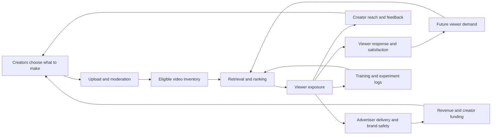
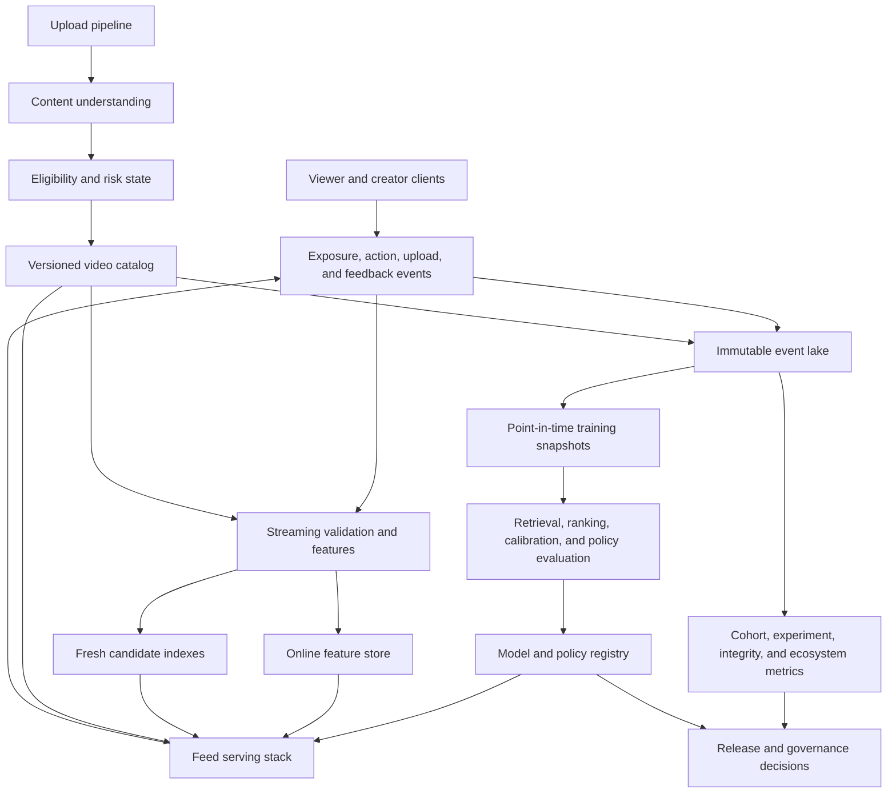

> *Asked in: staff, principal, and senior-principal recommendation system design, product ML, experimentation, and technical-strategy rounds.*

Design the feed as a coupled viewer and creator system. Optimize durable viewer value under explicit creator, quality, advertiser, and platform constraints. Do not collapse these policy choices into one permanent weighted score.

A basic answer covers retrieval, ranking, list composition, features, labels, serving, and online tests. A senior answer adds calibration, exposure bias, creator cold start, safe exploration, concentration loops, moderation, incidents, and long-horizon measurement. Principal scope adds portfolio choices, decision rights, and evidence that can reverse a policy.

This page gives a reference design for a 60-minute answer. In an interview, state the objective hierarchy, draw the request path, and take two difficult mechanisms deep.

## The prompt

A global short-form video product has 800 million monthly viewers and 25 million active creators. Viewers open a full-screen feed and swipe through videos lasting from several seconds to three minutes.

The current ranker predicts watch time, completion, likes, shares, and follows. A recent release raised daily watch time by 4.8 percent. Eight weeks later, creator research found a different pattern. New-creator retention fell, exposure concentrated among established accounts, and several high-quality categories produced less content.

The company also operates an advertising business. Advertisers need brand-safe reach and credible measurement. Trust and safety teams enforce content policy across regions and age groups. Serving must remain below 120 milliseconds at the 99th percentile.

Design recommendation for the next two years. Improve viewer value while maintaining a healthy supply of creators. Cover models, data, experiments, serving, policy, operations, ownership, and the choices expected at staff, principal, and senior-principal scope.

## State the answer before drawing the system

Use a multi-stage recommender with several candidate sources, calibrated task heads, and a constrained list composer. Train models to estimate viewer responses and longer-term outcomes. Apply eligibility, safety, diversity, exposure, freshness, and advertising rules outside the predictive heads.

The objective hierarchy has four levels:

1. **Legal and safety constraints:** prohibited content, age rules, privacy, regional policy, and severe integrity risks block exposure.
2. **Durable participant health:** viewer satisfaction, creator opportunity, advertiser trust, and platform reliability set launch guardrails.
3. **Product outcomes:** satisfied viewing, useful discovery, creator production, and sustainable revenue guide tradeoffs within those constraints.
4. **Model diagnostics:** ranking loss, calibration, retrieval recall, latency, and cost explain behavior but do not define product success.

A single weighted sum cannot settle a dispute between viewer retention, creator opportunity, child safety, and advertiser suitability. Their units, time horizons, evidence quality, and acceptable failure rates differ. Some constraints are hard. Some use budgets or floors. Others require a policy decision with a named owner.

The design therefore separates prediction from policy. Models estimate outcomes under stated exposure conditions. A versioned policy layer chooses allowable tradeoffs, records the decision, and supports rollback.

## Clarify the product and authority

Ask questions that can change the architecture or objective.

### Surface and viewer intent

- Is this the main swipe feed, a following feed, search, or notifications?
- Does the surface promise entertainment, learning, social connection, or rapid discovery?
- Are sessions usually two minutes or forty minutes?
- How do age, language, region, device, and network quality change the experience?
- Can viewers choose stronger topic, creator, or time controls?

### Creator supply

- What fraction of uploads comes from new, occasional, professional, and institutional creators?
- Which creator outcome is scarce: first qualified exposure, repeat production, income, audience formation, or trust?
- How long does a creator need to judge whether publishing is worthwhile?
- Are creators paid directly, through advertising, through commerce, or outside the platform?
- Which categories need longer production cycles than daily entertainment?

### Policy and integrity

- Which content is ineligible, restricted, reduced, labeled, or allowed?
- When does a moderation appeal restore distribution?
- Which decisions need human review?
- Can a ranking team alter exposure policy without trust and safety approval?
- What evidence is required before a creator receives a penalty?

### Advertising and business

- Are advertisements inserted after organic ranking or jointly allocated?
- Which brand-safety classes apply by advertiser and region?
- Does ad load depend on session depth, user tolerance, or inventory?
- Which revenue changes are temporary auction effects?
- Can commercial incentives influence organic creator distribution?

### Scale and operations

- How many feed requests and uploads arrive each second?
- How quickly must a new upload become retrievable?
- What are the candidate count, ranking budget, and tail-latency target?
- Which features require real-time updates?
- What fallback can operate during feature, model, or policy outages?

Assume the main personalized feed receives 500,000 requests per second at peak. Each request returns ten items and prefetches the next page. About 20 million videos arrive daily. Most viewer sessions begin with little explicit intent.

## Model the product as a coupled system

The recommender allocates scarce attention. That allocation changes creator behavior, future inventory, advertiser demand, and the next training set.



The arrows have different delays. A skip arrives in seconds. A viewer return label may need weeks. Creator retention may need one or three months. Supply quality can change over several production cycles.

This structure creates interference. Showing one video removes an impression from another. Giving a creator more reach can change that creator's next upload. A viewer-level experiment can affect creators who supply both treatment and control viewers.

The system also has several scarce resources:

- viewer attention;
- first-page positions;
- creator exposure;
- moderation capacity;
- exploration traffic;
- advertisement opportunities;
- serving compute;
- product attention for policy changes.

A senior answer says which resource each control allocates. A broad word like engagement does not identify the allocation.

## Build an objective hierarchy

Start with separate objectives and constraints. Combine only quantities whose relationship has been reviewed and measured.

### Viewer objective

Use a durable viewer outcome as the primary product objective. One example is incremental satisfied active days over 28 days among eligible viewers.

No single observed label measures satisfaction. Use a measurement system containing:

- session starts and qualified watches;
- rapid skips and abandonment;
- explicit likes, saves, shares, and follows;
- hides, reports, blocks, and topic controls;
- sampled satisfaction surveys;
- next-day and next-week return;
- repeated viewing that suggests either value or compulsion;
- time spent followed by regret or time-limit actions.

Watch time remains useful. It measures consumed attention and gives a dense training signal. It should remain a diagnostic or bounded product metric when extra minutes may reflect low-quality continuation.

### Creator objective

The creator objective is sustainable production of content that viewers value under platform policy. It is not equal exposure for every upload and it is not creator retention at any cost.

Measure creator health through cohorts and opportunity transitions:

- fraction receiving a first qualified test audience;
- time from upload to enough evidence for a decision;
- probability of reaching 100, 1,000, or 10,000 qualified viewers;
- repeat upload rate after quality-adjusted exposure;
- 30-day and 90-day active creator retention;
- audience formation across several uploads;
- creator earnings, where applicable;
- appeal rate and successful appeal restoration;
- concentration of impressions and earnings;
- production by category, language, region, and creator tenure.

Qualified exposure excludes accidental autoplay, invalid traffic, and viewers outside the intended audience. A creator who reaches 10,000 uninterested viewers did not receive useful opportunity.

### Advertiser objective

Advertisers need effective and trusted delivery. Track:

- incremental conversions or brand lift;
- reach and frequency;
- viewability and completion under valid traffic;
- brand-safety violations;
- adjacency to unsuitable content;
- campaign pacing;
- auction health and advertiser concentration;
- complaint, refund, and make-good rates.

Revenue is a platform outcome, but short-term revenue can rise through excessive ad load. Viewer abandonment and advertiser trust should constrain that choice.

### Platform objective

The platform needs reliable, affordable, and governable operation. Track:

- feed availability and latency percentiles;
- cost per satisfied session;
- model and policy rollback time;
- moderation backlog and appeal delay;
- privacy and data-use violations;
- measurement coverage and label maturity;
- incident frequency and blast radius;
- engineering support cost per experiment;
- ability to reproduce exposure decisions.

### Hard constraints, guardrails, and diagnostics

Keep these types distinct.

| Type | Example | Decision behavior |
| --- | --- | --- |
| Hard constraint | Known prohibited content cannot be recommended | Block before ranking or composition |
| Guardrail | New-creator 30-day retention cannot fall beyond an approved margin | Stop expansion and investigate |
| Budget | Exploration may consume up to two percent of eligible impressions | Allocate within a reviewed risk limit |
| Floor | Each policy-eligible new-creator cohort receives enough qualified tests to measure opportunity | Repair candidate supply or allocation |
| Product objective | Increase satisfied active days | Compare causal estimates over a mature horizon |
| Diagnostic | Candidate recall at 10,000 | Use to explain losses before ranking |

A named cross-domain owner may approve a temporary guardrail exception after affected owners review evidence and uncertainty. A model optimizer cannot grant that exception.

## Define the measurement contract before the model

A metric needs a population, event, attribution rule, horizon, maturity rule, and owner.

For example:

```text
Metric: new_creator_d30_active_rate
Eligible cohort:
  creator published first policy-eligible video in week W
Assignment or exposure regime:
  pre-treatment creator cell when available; otherwise market policy and saturation
Primary denominator:
  all eligible creators in the cohort, regardless of later exposure
Outcome:
  creator publishes another policy-eligible video on days 15 through 30
Companion pathway:
  qualified-test receipt within 14 days and retention by exposure band
Slices:
  region, language, category, creator acquisition channel, moderation state
Maturity:
  complete 31 days after cohort week closes
Owner:
  creator ecosystem product and data science
Decision use:
  launch guardrail for broad ranking changes
```

This definition keeps creators denied exposure in the primary denominator. Conditioning the primary retention metric on treatment-driven exposure would create post-treatment selection. Exposure-conditioned views remain useful pathway diagnostics, but they cannot be the only launch guardrail.

The maturity rule also prevents a fresh cohort from appearing to have zero retention.

Metric contracts should include revision history. Changing qualified impression logic can create a false trend even when product behavior is stable.

### Leading and lagging indicators

Long-horizon outcomes arrive too late for daily operation. Use leading indicators that have demonstrated a relationship with mature outcomes.

Creator leading indicators can include:

- fraction of eligible uploads entering a test bucket within six hours;
- median qualified impressions in the first day;
- share of new creators whose first three uploads receive distinct audience tests;
- creator-facing feedback latency;
- concentration among eligible impressions;
- coverage of content categories with healthy viewer demand.

Viewer leading indicators can include:

- rapid-skip rate;
- session abandonment after repeated similar items;
- hide and report rates;
- survey response on sampled sessions;
- topic and creator diversity over a week;
- voluntary return after a natural break.

A leading indicator needs periodic validation. If first-day exposure stops predicting 30-day creator retention, it loses authority as a launch signal.

### Cohort maturity board

Maintain a board for each major release:

| Horizon | Available evidence | Allowed decision |
| --- | --- | --- |
| Minutes to hours | latency, errors, policy blocks, rapid skips | stop an incident or continue a canary |
| One to seven days | session quality, survey samples, early concentration | expand cautiously or hold |
| Two to four weeks | viewer return, creator opportunity transitions | decide broad viewer rollout |
| One to three months | creator retention, supply mix, advertiser trust | confirm, repair, or reverse ecosystem policy |

The board prevents an early watch-time win from becoming a final ecosystem verdict.

## Design candidate generation as a portfolio

At this scale, no ranker scores every eligible video. Candidate generation should preserve several ways for an item to enter the feed.

### Candidate sources

1. **Personalized embedding retrieval:** a user or session tower retrieves nearby video embeddings from an approximate nearest-neighbor index.
2. **Sequence continuation:** a session model finds items compatible with recent watches, skips, topic shifts, and completion patterns.
3. **Follow and relationship graph:** recent eligible uploads from followed creators or close social connections.
4. **Content-based retrieval:** text, audio, visual, language, topic, and style features match current viewer interests.
5. **Fresh inventory:** recent uploads receive a controlled route before collaborative signals become reliable.
6. **New-creator pool:** policy-eligible videos from creators lacking exposure history enter bounded quality-aware tests.
7. **Regional and cultural trends:** time-local patterns enter with velocity and integrity controls.
8. **Editorial or public-interest sources:** reviewed collections support events, civic information, and underserved content needs.
9. **Exploration source:** uncertain items with plausible viewer fit enter under a logged propensity policy.
10. **Recovery and diversity source:** candidates repair missing topics, creators, languages, or viewpoints when the current set is too narrow.

Each source should have an owner, recall target, eligibility contract, quota range, and degradation behavior.

### Merge and deduplicate

Candidate IDs carry source membership, retrieval score, index version, eligibility version, and retrieval propensity when known. The merge stage deduplicates without erasing source evidence.

An item retrieved by both follow graph and embedding search may deserve different interpretation from an item found only through exploration. Preserve every source bit for analysis.

Use source floors or ranges rather than fixed permanent quotas. A new viewer may need more trend and exploration supply. A mature viewer may need more follow and sequence candidates. Policy can raise a source floor during a creator cold-start repair.

### Retrieval models

Personalized embedding retrieval can use a two-tower model trained with sampled softmax or in-batch negatives. The viewer tower encodes longer-term interests and bounded recent context. The video tower combines content embeddings, language, topic, freshness, and exposure-aware history.

Observed watches are policy-selected positives. Sample negatives from items that were eligible and plausibly exposed, then evaluate how the sampling policy changes calibration and coverage. Random unseen catalog items are often too easy and teach little about near-neighbor ranking.

Precompute stable video embeddings and update fresh-video embeddings through a streaming path. Use approximate nearest-neighbor indexes with coarse region, language, and policy partitions. Recheck current eligibility after retrieval because index state can lag moderation.

A sequence retriever can model short session intent separately from long-term taste. Keep its source identity visible. Otherwise, a temporary session pattern can silently dominate every candidate path.

### Retrieval evaluation

Measure retrieval before ranking:

- recall of later high-value items within the candidate set;
- eligible catalog coverage;
- new-video and new-creator coverage;
- source overlap and marginal contribution;
- category, language, and region coverage;
- retrieval latency and index freshness;
- exposure propensity support;
- frequency of empty or low-quality source returns.

An excellent ranker cannot choose an item that retrieval omitted. Many ecosystem failures begin as candidate starvation rather than ranking error.

## Build a multi-task ranker with calibrated outputs

The ranker estimates several viewer responses for each candidate. A shared trunk can use viewer, session, video, creator, context, and cross features. Task-specific experts or heads handle outcomes with different labels and time scales.

### Ranking architecture

Use a long-term viewer encoder, a bounded session sequence encoder, precomputed multimodal video features, exposure-aware creator context, and explicit interaction features. Keep slow content computation outside the request path. Update only small real-time counters and session state during serving.

A shared trunk with task heads is a clear baseline. Multi-gate mixture of experts or task-specific branches can help when sparse satisfaction labels conflict with dense watch labels. Architecture changes should follow per-task ablations, gradient diagnostics, and serving cost.

Limit historical creator features or normalize them for prior opportunity. Raw follower and impression counts can let earlier allocation dominate content evidence. Compare a content-rich path against the full history model for low-exposure inventory.

Possible heads include:

- probability of watch beyond two seconds;
- expected watch duration conditional on a qualified start;
- probability of completion, normalized by video duration;
- rapid skip;
- like, save, share, follow, hide, block, and report;
- sampled satisfaction response;
- next-session return;
- creator profile visit;
- voluntary session continuation after the item.

Do not train every outcome on every row. Use explicit masks for delayed, sampled, or ineligible labels. Preserve label maturity and observation probability.

Do not copy a session-level return label onto every shown item without an attribution rule. Use a sequence objective, a documented proxy, or randomized evidence for longer-term contribution. An item-level return head otherwise learns position, session length, and prior policy as if each item caused the outcome.

Estimate advertisement opportunity with a separate session model. This keeps bids and campaign state out of organic item predictions while allowing the final composer to account for ad fatigue.

### Separate training balance from product policy

A multi-task training objective can be written as

$$
L(\theta)=\sum_{t=1}^{T}w_t L_t(\theta).
$$

The weights $w_t$ control optimization. They do not state how the product values an extra share against a report or a creator opportunity.

Normalize loss scale, inspect gradient magnitude, and measure task conflict by layer. Compare hard sharing, task-specific branches, multi-gate mixture of experts, or progressive layered extraction when negative transfer appears.

An auxiliary watch head may improve representation while remaining absent from the final decision policy. Conversely, a policy constraint can affect ranking without becoming a training head.

### Calibrate every decision-facing head

Calibration means a predicted probability of 0.2 corresponds to about a 20 percent event rate on the relevant deployment population.

Calibrate item predictions under a declared reference exposure regime. If a post-ranking response model includes assigned position, calibrate that model separately. Do not feed an unknown future position into a pre-composition item calibrator.

Useful calibration slices include:

- task;
- country and language where needed;
- video duration bucket;
- position or exposure regime;
- new versus established content;
- traffic source;
- policy version;
- label maturity cohort.

Use held-out deployment-like data. Platt scaling, isotonic regression, beta calibration, or learned calibrators are possible choices. Monitor expected calibration error, reliability plots, and decision-weighted calibration error.

A sparse report head and a dense watch head can have very different base rates. Combining their raw logits gives arbitrary behavior. Even calibrated predictions do not decide the policy tradeoff. They only put estimates into interpretable units.

### Represent uncertainty

New videos and rare viewer contexts have uncertain predictions. Carry uncertainty or support features into composition and exploration.

Useful signals include:

- posterior variance or ensemble disagreement;
- effective sample size for creator and video history;
- distance from training support;
- calibration confidence by slice;
- age of the content and feature snapshot;
- uncertainty in moderation or topic labels.

Uncertainty should not excuse unsafe distribution. It controls whether an eligible item receives a bounded test, a conservative score, or human review.

## Correct exposure and position bias

Training data records outcomes for shown items. The current policy chose those items and positions. Raw watch and click labels therefore reward prior exposure.

Log the full observation process:

- request and viewer identifiers;
- eligible candidate set or a sampled representation;
- retrieval sources and scores;
- pre-composition predictions;
- policy and model versions;
- final slate and positions;
- assignment and actual exposure;
- randomization propensity;
- viewport, autoplay, and network state;
- mature outcomes and corrections.

### Examination and position

A full-screen feed still has position effects. Early items receive more viewers. Later items are seen only by people who continue the session. Network delay and prefetch failure can also change actual exposure.

Estimate examination or continuation probabilities through controlled position randomization where risk permits. Continuation logs show whether a position was reached. They do not identify an item's causal effect at that position without randomization or a justified structural model.

### Inverse propensity methods

For logged action $a_i$, context $x_i$, reward $r_i$, logging policy $\mu$, and target policy $\pi$, an inverse propensity estimate is

$$
\widehat V_{IPS}(\pi)=\frac{1}{n}\sum_i\frac{\pi(a_i\mid x_i)}{\mu(a_i\mid x_i)}r_i.
$$

Use self-normalization, clipping, or doubly robust estimation when appropriate. Report effective sample size and weight tails. None of these repairs missing support.

For non-negative weights $w_i$, report

$$
n_{eff}=\frac{(\sum_i w_i)^2}{\sum_i w_i^2}.
$$

Do not publish a counterfactual estimate when overlap is missing or effective sample size cannot support the requested precision. Narrow the target policy comparison, collect exploration data, or run an online experiment instead.

A feed slate is a structured action. Full-slate propensity is often too small for useful estimation. Item or position factorizations require assumptions about within-session interaction. Validate those assumptions against randomized online evidence.

### Creator exposure is treatment

Creator history features often include prior impressions, followers, and engagement. These values partly record earlier ranking decisions.

Use care when interpreting them as intrinsic quality. Compare models with exposure-normalized creator features, content-only paths, and limited historical windows. Audit whether an established-account feature suppresses equally good new content.

## Compose a list under explicit constraints

Ranking items independently can produce a repetitive or unsafe page. A list composer considers interactions among the selected items and the current session.

Possible constraints include:

- policy eligibility for the viewer's age and region;
- maximum repeated creator count within a window;
- topic and format diversity;
- minimum freshness when qualified inventory exists;
- bounded new-creator tests;
- language compatibility;
- no near-duplicate videos;
- fatigue limits for sounds, trends, or advertisements;
- brand-safety rules around ad slots;
- exploration budget;
- serving and prefetch feasibility.

Use a fast greedy re-ranker, constrained beam search, submodular objective, or integer optimization on a small top set. The choice depends on latency and interaction complexity.

A useful formulation is constrained selection after hard eligibility and policy decisions:

$$
\max_{S} U_{viewer}(S)
$$

subject to eligibility, risk, repetition, exploration, ad-load, and opportunity constraints. $U_{viewer}$ can combine reviewed viewer predictions, but it does not absorb creator, advertiser, or safety authority. Those objectives retain separate guardrails, experiments, and decision owners. Some constraints may be soft within approved ranges. Severe safety constraints remain hard.

The composer should emit reason codes. Examples are `selected_personal_fit`, `fresh_inventory_test`, `creator_repeat_cap`, `policy_ineligible`, and `topic_repair`. Reason codes support debugging, creator explanations, and incident analysis.

### Session-aware composition

The next item depends on what the viewer already saw. Maintain a lightweight session state containing:

- recent topics and creators;
- skips and qualified watches;
- repeated sounds or formats;
- session depth and elapsed time;
- recent negative feedback;
- ad exposure and fatigue;
- exploration already consumed;
- quality or wellbeing prompts already shown.

The session state must have bounded size and a clear fallback. If it is unavailable, use conservative repetition and ad-load rules.

## Give new creators a qualified learning opportunity, not guaranteed reach

Creator cold start has two related problems. The model knows little about a new creator, and the platform has little behavioral evidence for each new video.

A sound policy provides qualified learning opportunities among eligible content. It does not promise equal impressions or suppress clear viewer preferences.

### Cold-start path

1. Run content understanding and policy checks before recommendation.
2. Build embeddings from video, caption, audio, topic, language, and production features.
3. Match the video to a small plausible audience.
4. Allocate a bounded test with known propensity.
5. Compare outcomes against similar content under similar exposure.
6. Expand, hold, narrow, or stop based on calibrated evidence.
7. Let later uploads benefit from transferable creator evidence without making history permanent.

The first audience should be relevant enough to produce information. Random global exposure creates bad viewer experiences and noisy creator feedback.

Keep a randomized allocation within eligible matched audiences when risk permits. This separates early allocation effects from content-match selection and estimates how creator and viewer outcomes respond to test size.

### Evidence ladder

Use stages rather than one viral threshold:

- policy and technical eligibility;
- content-based audience match;
- small qualified test;
- broader matched test;
- regional or interest expansion;
- trend distribution if velocity and integrity checks pass;
- sustained personalized retrieval based on mature outcomes.

Each stage has minimum evidence, maximum exposure, and stop conditions. The thresholds can vary by category because a niche educational video and a dance trend have different audience sizes.

### Creator-facing feedback

Creators need understandable signals. Give ranges and reason classes rather than false precision.

Useful feedback includes:

- whether the video passed policy eligibility;
- whether a technical issue limited delivery;
- audience match and early response ranges;
- appeal status;
- repeated policy or quality concerns;
- whether evidence is still immature.

Do not reveal features that invite direct abuse. Keep internal anti-spam thresholds and sensitive moderation signals protected.

### Measure opportunity conditionally

Compare creator outcomes after accounting for content eligibility, category demand, upload cadence, region, and acquisition channel. Also report unadjusted outcomes because adjustment can hide product effects.

Track survival curves for creator cohorts. A drop concentrated after repeated low-exposure uploads suggests a different mechanism from a drop after policy removals.

## Explore safely and measure the exploration policy

Exploration gathers information and broadens opportunity. It consumes viewer attention and can expose low-quality content, so it needs a budget and eligibility gate.

### Exploration units

Explore among:

- uncertain videos with strong content-based fit;
- new creators who passed quality and policy checks;
- topics where the viewer model has weak support;
- source allocations rather than arbitrary items;
- policy variants within approved ranges.

Do not explore prohibited or high-risk content for learning value.

### Algorithms

Contextual bandits can choose among eligible candidates or source allocations. Thompson sampling uses posterior uncertainty. Upper confidence bound methods add an uncertainty bonus. Epsilon-greedy is simple but spends traffic without directing it toward informative choices.

For large slates, use a layered approach. Retrieval sources propose eligible items. A small exploration controller chooses a source or candidate subset. The main composer still enforces safety, repetition, and session constraints.

### Logging

Every exploratory choice needs:

- the eligible action set;
- chosen action;
- action probability;
- context snapshot;
- policy version;
- exposure and position;
- reward horizon;
- safety and quality state.

Without propensities, the data cannot support reliable counterfactual evaluation.

### Exploration budgets

Set budgets by viewer, session, content risk, and market maturity. A new market may need more broad learning. A vulnerable age group may allow less uncertainty.

Review the budget through causal outcomes. More exploration is not automatically healthier. It can reduce viewer value without improving creator learning if candidate quality is poor.

## Control virality and concentration loops

Short-form feeds can amplify early noise. A small watch advantage creates more impressions, more engagement evidence, and an even larger ranking advantage.

### Common loops

**Popularity loop:** prior impressions create social proof and richer features. The model interprets those consequences as future merit.

**Velocity loop:** rapid early engagement raises trend exposure. Larger exposure increases measured velocity.

**Creator capital loop:** established creators have followers, production resources, and known audience embeddings. New creators receive less precise matching.

**Topic loop:** a short-lived topic gain changes the training distribution. The next model overpredicts future demand for that topic.

**Moderation loop:** heavily exposed content receives more reports and review. Low-exposure content has less observed policy evidence, which can look safer by accident.

### Concentration metrics

Track several views because one number can hide movement:

- top 0.1, 1, and 10 percent share of qualified impressions;
- Herfindahl-Hirschman index across creators and categories;
- Gini coefficient of impressions and earnings;
- effective number of creators receiving meaningful reach;
- transition rates across exposure bands;
- concentration within language, region, and category;
- viewer-level creator diversity over seven and 28 days;
- repeated exposure to the same creator or topic.

Do not target a flat distribution. Viewer demand and creator quality differ. Look for unexplained concentration growth, closed opportunity transitions, and reduced supply in valuable categories.

### Damp unstable amplification

Possible controls include:

- use exposure-normalized response estimates;
- cap the contribution of recent raw impression counts;
- require mature evidence before broad expansion;
- apply velocity decay and anomaly checks;
- reserve source capacity for fresh eligible inventory;
- limit repeated creator exposure within a session;
- detect coordinated engagement before trend expansion;
- compare content-only and history-rich rankers for new inventory;
- keep a stable exploration cohort.

Each control changes who receives attention. Version it as policy and evaluate both viewer and creator outcomes.

## Integrate quality, moderation, and integrity

Recommendation should consume a versioned eligibility and risk contract. It should not infer all policy from engagement labels.

### Content states

A practical state machine can include:

- processing;
- eligible;
- eligible with audience restrictions;
- reduced pending review;
- ineligible;
- appealed;
- restored;
- removed.

Ranking and caching must react to state changes quickly. A removed video should leave candidate indexes, caches, and prefetched queues within a defined service level.

### Quality is broader than policy

Policy asks whether content may be shown. Product quality asks whether showing it creates value.

Quality signals may cover originality, information value, production clarity, misleading framing, spam, duplication, and viewer regret. These signals need independent labels and appeal-aware analysis.

Do not turn an opaque quality model into an unreviewable policy system. Document label sources, false-positive costs, protected slices, and the authority to change thresholds.

### Moderation selection bias

Human review is selective. Popular, reported, and model-flagged content receives more labels. Treat unlabeled content as unknown rather than clean.

Use random audits within risk strata, appeal outcomes, and independent expert samples. Separate reviewer disagreement from model error.

Eligibility labels decide whether content may enter ranking. Quality estimates decide how eligible content competes and remain subject to selection-bias audits. Do not train a quality model to reproduce the moderation queue and then present that score as intrinsic creator quality.

### Adversarial adaptation

Creators and coordinated networks adapt to ranking. Monitor:

- copied formats and near duplicates;
- engagement rings;
- purchased traffic;
- rapid account creation;
- policy evasion through text, audio, or visual changes;
- bait-and-switch edits;
- cross-account content laundering.

Integrity defenses should feed eligibility and trend controls. Avoid exposing sensitive detector thresholds through creator analytics.

## Protect each participant with guardrails

### Viewer guardrails

- severe content exposure;
- reports, blocks, and hides;
- rapid-skip and abandonment tails;
- age-inappropriate exposure;
- repeated-topic and repeated-creator fatigue;
- survey dissatisfaction;
- seven-day and 28-day retention;
- time-control use and regret indicators;
- latency, errors, and data consumption.

### Creator guardrails

- first qualified exposure coverage;
- new-creator opportunity transitions;
- 30-day and 90-day creator retention;
- concentration by creator cohort;
- appeal delay and restoration success;
- false policy or quality penalties;
- category and regional supply decline;
- earnings concentration where monetization exists;
- unexplained reach volatility.

### Advertiser guardrails

- brand-safety incident rate;
- invalid traffic;
- reach and frequency distortion;
- conversion or lift quality;
- campaign pacing failures;
- adjacency policy violations;
- auction concentration;
- advertiser retention and make-good cost.

### Platform guardrails

- feed availability and tail latency;
- serving cost per satisfied session;
- index and feature freshness;
- privacy violations;
- policy propagation delay;
- rollback time;
- unexplained exposure changes;
- experiment sample-ratio mismatch;
- observability coverage.

Guardrails need thresholds, uncertainty treatment, and an owner. A dashboard without a stop rule cannot govern a launch.

## Keep advertisements and organic recommendation accountable

Advertisements share viewer attention with organic videos, but their allocation has extra constraints.

Use a slot or opportunity allocator that considers session depth, ad fatigue, campaign pacing, viewer tolerance, and brand safety. The ad auction can rank eligible advertisements within an approved opportunity.

Do not let advertiser bids silently change organic creator predictions. Keep organic ranking, ad eligibility, auction, and final composition evidence separately inspectable.

Measure incremental revenue against viewer and creator effects. An extra ad can shorten the session, change which creators receive later impressions, and alter future viewer return. Revenue per request misses those effects.

For creator revenue sharing, audit whether ranking and monetization incentives create unstable content choices. A policy that rewards raw watch time may push creators toward longer or repetitive formats even when viewers report lower satisfaction.

## Design the data and training architecture

The architecture needs event-time correctness, versioned policy, and mature outcomes.



### Event schema

An impression event should record:

```text
FeedImpression
  request_id
  viewer_id_or_privacy_safe_key
  session_id
  timestamp
  model_manifest_id
  policy_version
  candidate_snapshot_reference
  video_id
  creator_id
  retrieval_sources[]
  pre_rank_predictions{}
  final_position
  selection_reason_codes[]
  assignment_probability
  actual_exposure_state
  eligibility_version
  feature_snapshot_ids[]
```

Viewer actions reference the impression. Creator events reference upload and creator cohort. Moderation events preserve decision, reviewer source, appeal, and effective time.

### Point-in-time training data

Join features as they existed before the ranking decision. Do not use later follower counts, mature engagement, or moderation results as historical input.

Store label maturity explicitly. A 28-day return head trains only on examples whose outcome window closed. Survey labels also need sampling probabilities.

### Dataset and model manifests

A training manifest records:

- source event ranges;
- feature definitions and versions;
- eligibility policy;
- negative sampling;
- propensity treatment;
- label windows and maturity;
- creator and viewer cohort filters;
- code and environment digest;
- model architecture and loss weights;
- calibration data;
- privacy and retention class.

A deployment manifest binds retrieval, ranker, calibrators, composer policy, moderation version, feature schema, and experiment assignment. Rolling back only the ranker can fail if the composer or calibrator also changed.

## Build the online serving path

A feed request can follow this path:

1. Resolve viewer, device, region, age policy, and session context.
2. Read bounded online features with freshness metadata.
3. Query candidate sources in parallel under per-source deadlines.
4. Merge, deduplicate, and apply current eligibility.
5. Score candidates with the multi-task ranker.
6. Apply calibrated predictions and uncertainty metadata.
7. Compose the slate under policy, diversity, exposure, and ad constraints.
8. Write decision evidence before returning the page.
9. Prefetch media and the next candidate page.
10. Emit actual exposure after client rendering.

### Example latency budget

| Stage | p99 budget |
| --- | ---: |
| Context and feature reads | 20 ms |
| Parallel candidate retrieval | 30 ms |
| Merge and eligibility | 10 ms |
| Ranking | 35 ms |
| Composition and ads | 15 ms |
| Evidence write and response | 10 ms |

The numbers are illustrative. Media startup has a separate budget and often dominates perceived quality.

### Freshness

New uploads need a streaming path into content features, moderation state, and candidate indexes. A slower batch index can rebuild global structures.

Record feature age. If a real-time counter is stale, the model should know or use a bounded fallback. Silent stale values can exaggerate trend velocity.

### Caching

Cache stable content embeddings, eligibility metadata, and some viewer representations. Include policy, region, age class, and model compatibility in security-relevant cache keys.

Do not cache a final slate beyond the period where moderation, session state, or creator repetition remains valid.

### Degraded modes

- If one candidate source fails, continue with source floors relaxed and record the gap.
- If real-time features fail, use a validated stale or batch representation.
- If the ranker fails, use a conservative cached or lightweight model.
- If the composer policy fails, use a reviewed static policy with strict safety filters.
- If eligibility state is unavailable, block uncertain content rather than assume eligibility.
- If evidence writes fail, stop broad experiments and high-risk policy changes.

Every degradation path needs offline and production tests. A fallback used only during incidents can drift for months.

## Evaluate models before online exposure

Offline evaluation supports iteration and catches regressions. It cannot establish the full ecosystem effect.

### Retrieval evaluation

Report recall, coverage, source contribution, cold-start coverage, freshness, and slice behavior. Use future qualified interactions cautiously because the logging policy shaped them.

### Ranking evaluation

Report:

- log loss or task-specific loss;
- calibration and reliability plots;
- ranking metrics such as normalized discounted cumulative gain;
- expected watch and satisfaction diagnostics;
- severe negative-event recall;
- performance by viewer, creator, content, and exposure cohort;
- counterfactual estimates with support diagnostics;
- robustness to missing or stale features;
- latency and cost.

### List evaluation

Replay composition on frozen candidate sets. Measure repetition, diversity, policy eligibility, source coverage, creator concentration, exploration use, and ad load.

Frozen candidates isolate composer behavior. They do not reveal retrieval or future supply changes.

### Simulation limits

A simulator can model viewer continuation, creator upload response, and policy transitions. Use it to reject unstable policies and exercise incidents.

The simulator learns from historical policy and assumptions. It cannot prove a new creator economy outcome. Compare simulated predictions with mature online cohorts and update the model when they diverge.

## Design causal experiments for a coupled ecosystem

A conventional viewer-randomized A/B test estimates a treatment effect under interference assumptions that often fail here.

### Assignment and exposure

Assign viewers persistently when carryover matters. Record actual exposure because cache, eligibility, and fallback can dilute assignment.

Check sample-ratio mismatch, instrumentation, pre-period balance, and policy compatibility before reading outcomes.

### Interference

Creators supply content to treatment and control viewers. Treatment exposure can change creator production, which later changes inventory for both groups. Viral trends also cross experiment cells.

Possible designs include:

- viewer-level randomization for immediate feed effects;
- creator-cluster randomization for creator policy changes;
- market or geographic clusters when spillovers stay mostly local;
- switchback tests for auction or system-wide allocation changes;
- saturation experiments that vary treatment share by cluster;
- stable long-term holdouts for cumulative feedback loops.

Each design answers a different estimand. Creator clustering can reduce direct contamination while lowering power and creating network spillovers. Geographic tests can confound cultural and market differences.

### Long horizons

A two-week test may capture novelty and early viewer response. It may miss creator production cycles, category exit, advertiser trust, and model retraining feedback.

Use staged decisions:

1. safety and system canary;
2. short viewer experiment;
3. broader experiment with creator opportunity checks;
4. mature creator and viewer cohort review;
5. retained holdout or stepped rollout for persistent effects.

Do not keep harmful treatment live only to reach a planned duration. Predeclare emergency stop rules.

### Multiple metrics

Define one primary causal product outcome for the decision horizon. Treat severe safety events and approved ecosystem guardrails separately.

Control false discovery for secondary claims. A launch can still stop on a predeclared guardrail without claiming that every movement is causal.

### Policy learning from experiments

Experiments should record enough data to estimate response curves. Binary treatment alone tells little about whether an exploration budget should be 0.5, 1, or 2 percent.

Randomize approved parameter ranges when safe. Estimate heterogeneous effects by predeclared creator and viewer cohorts. Avoid searching many slices after observing damage and presenting one favorable subgroup as the plan.

## Investigate a watch-time win with creator damage

Suppose a ranker launch raises watch time by 4.8 percent and next-day viewer return by 0.7 percent. After eight mature weeks, new-creator 30-day retention falls by 9 percent relative. The top 1 percent of creators gain six points of impression share.

Do not assume concentration caused retention damage. Build a causal and mechanical investigation.

### Validate measurement

- Confirm the creator cohort definition did not change.
- Check maturity and exposure eligibility.
- Verify assignment, actual exposure, and sample ratios.
- Compare experiment, rollout, and policy versions.
- Check whether moderation or creator acquisition changed concurrently.
- Recompute concentration from immutable impression events.

### Trace the mechanism

Partition the feed decision into:

- retrieval source share;
- ranker score movement;
- calibration movement;
- composer constraints;
- trend expansion;
- exploration allocation;
- moderation eligibility;
- ad displacement.

Inspect transition rates. Did fewer new creators enter the test pool? Did they enter but lose during ranking? Did tests reach mismatched viewers? Did broad expansion thresholds become harder after calibration changed?

### Estimate affected cohorts

Compare by category, language, region, acquisition channel, upload cadence, and initial content quality. Look for a dose response between lost qualified exposure and later publishing.

Use creator-level or cluster-level experimental evidence where available. Historical correlation between reach and retention may reflect creator quality or effort.

### Choose containment

If the release is still controlled, stop expansion and restore the prior manifest for affected traffic. If viewer gains are valuable and damage is localized, narrow the rollback to the source allocation, calibrator, or composer policy causing the loss.

Do not create an untested creator boost during the incident. Restore known behavior first. Test repairs under explicit budgets after containment.

## Operate incidents and rollback

An ecosystem incident may appear slowly. The response still needs defined severity and authority.

### Incident classes

- prohibited content receives broad distribution;
- a policy state fails to propagate;
- feed latency or empty pages rise;
- one creator or topic captures abnormal exposure;
- new inventory stops entering candidates;
- reports or hides spike in a vulnerable cohort;
- creator opportunity or retention breaches a mature guardrail;
- advertiser adjacency violates a contract;
- experiment assignment or logging becomes invalid.

### Immediate controls

Provide kill switches for:

- model manifest;
- candidate source;
- trend expansion;
- exploration policy;
- composer constraint set;
- advertisement opportunity policy;
- content, creator, topic, region, or age cohort;
- experiment cell.

Kill switches require authentication, audit, testing, and a known owner. They should not depend on the failing recommendation service.

### Rollback unit

Rollback the deployment manifest, not a loose collection of model files. Restore compatible retrieval indexes, ranker, calibration, composition, feature schema, and policy versions.

Keep a conservative fallback that has recent production evidence. Test rollback regularly and measure time to stable exposure.

### After containment

1. Reconstruct exposure and policy decisions from immutable logs.
2. Identify the earliest leading indicator that moved.
3. Quantify viewer, creator, advertiser, and platform effects.
4. Repair affected participants where possible.
5. Add regression tests and alert thresholds.
6. Revisit release gates and ownership gaps.
7. Publish an internal decision record with residual uncertainty.

An incident review should state which assumption failed. “The model changed distribution” is too broad to guide repair.

## Assign governance and metric ownership

Policy tradeoffs need explicit decision rights.

### Suggested ownership

| Domain | Accountable owner | Required partners |
| --- | --- | --- |
| Viewer product outcome | Feed product and applied science | Research, design, wellbeing |
| Creator opportunity and retention | Creator product and ecosystem science | Ranking, economics, research |
| Ranking models and calibration | Recommendation engineering and science | Data platform, product owners |
| Eligibility and integrity | Trust and safety | Legal, policy, ranking, operations |
| Advertising allocation | Ads product and auction science | Feed, brand safety, finance |
| Experiment validity | Experimentation platform and data science | Metric owners, infrastructure |
| Serving reliability | Feed infrastructure | Ranking, media delivery, incident command |
| Cross-domain tradeoff | Named product executive with technical council | All accountable owners |

The cross-domain owner does not replace domain accountability. They decide approved tradeoffs after domain owners present evidence and uncertainty.

### Policy change record

Every material exposure policy change should record:

- problem and affected participants;
- metrics and current baselines;
- alternatives considered;
- hard constraints and approved ranges;
- causal evidence and limits;
- expected short and long effects;
- rollout and maturity schedule;
- stop, repair, and reversal conditions;
- owners and review date.

This record separates durable policy from model implementation. A new model may improve estimates without reopening every business rule.

### Review cadence

Use several cadences:

- daily operational review for incidents and leading indicators;
- weekly experiment review for validity and early guardrails;
- monthly mature cohort review;
- quarterly objective and portfolio review;
- immediate review after severe policy or integrity events.

Do not renegotiate every policy weight during a daily launch meeting. Escalate only when evidence crosses an approved boundary or invalidates an assumption.

## Choose an incremental roadmap

### Quarter 1: establish evidence and control

- define viewer, creator, advertiser, and platform metric contracts;
- version exposure policy and deployment manifests;
- repair impression, candidate, propensity, and maturity logging;
- add source-level and creator-cohort dashboards;
- establish rollback by manifest;
- run a new-creator exposure audit;
- keep the existing ranker unless an active incident requires change.

### Quarter 2: improve prediction and composition

- build calibrated multi-task heads;
- add explicit negative feedback and survey labels;
- deploy session-aware repetition and diversity constraints;
- separate fresh and new-creator sources;
- validate content-only cold-start retrieval;
- introduce a small safe exploration bucket.

### Quarters 3 and 4: learn causal response

- run creator-cluster or saturation experiments;
- estimate exploration and opportunity response curves;
- improve trend integrity and velocity decay;
- add advertiser and creator long-horizon holdouts where feasible;
- compare centralized and source-specific composition policies;
- retire features that encode exposure without incremental value.

### Year 2: adjust the portfolio

- invest in creator audience matching where cold-start evidence supports it;
- expand causal measurement for supply response;
- improve category-specific maturity models;
- federate policy implementation across regions under shared contracts;
- retire redundant rankers or policy layers;
- keep research bets with explicit evidence checkpoints.

The roadmap begins with measurement because the reported failure concerns a delayed ecosystem outcome. Replacing the ranker before fixing attribution can repeat the damage with less visibility.

## Make level-specific portfolio choices

### Staff-level choices

A staff candidate should make one feed path reliable across several teams.

Expected decisions include:

- define event and feature contracts;
- build source-aware retrieval and calibrated ranking;
- enforce list constraints with reason codes;
- establish point-in-time datasets and mature labels;
- implement cold-start tests and exploration logging;
- create manifest rollback and degraded modes;
- align ranking, data, moderation, and serving owners.

Staff depth appears in mechanisms. The candidate should explain calibration, propensity logging, list composition, or a rollback trace precisely.

### Principal-level choices

A principal candidate decides the boundary among ranking, creator policy, trust, ads, and infrastructure.

Expected decisions include:

- choose which objectives remain domain-owned;
- define shared exposure and experiment contracts;
- order investment among prediction, cold start, integrity, measurement, and serving;
- price the opportunity cost of a large model against better exploration or labels;
- set evidence that expands or stops creator interventions;
- develop staff owners for ranking, experimentation, and ecosystem measurement;
- preserve regional variation without forking the event contract.

Principal scope appears when the candidate rejects a technically attractive project because another constraint has greater product value.

### Senior-principal choices

Titles differ across employers. Treat this as an organization-wide scope pattern.

A senior-principal candidate coordinates several principal-owned directions over multiple years. The candidate should define a small doctrine:

- attention allocation is observable and versioned;
- severe policy constraints remain outside engagement optimization;
- participant health uses mature causal evidence;
- new supply receives qualified learning opportunities;
- domains retain accountable owners;
- major policy choices have reversal conditions.

Expected portfolio choices include:

- balance feed capability, creator supply, trust, ads, and measurement;
- decide which exposure standards should span products;
- assign principal owners with real decision rights;
- preserve independent research paths when evidence is weak;
- respond to regulation, market entry, and business-model change;
- retire policies whose original assumptions no longer hold;
- ensure another leader can run the review system.

Senior-principal breadth does not excuse shallow ranking knowledge. The candidate should still defend one estimator, training interaction, serving failure, or experiment design.

## Compare rejected approaches

### Optimize raw watch time

Watch time is dense and easy to measure. Used alone, it can favor repetitive, sensational, or long content and hide viewer regret. It also ignores how exposure shapes future supply.

### Put creator retention in the item score

Creator retention is delayed, creator-level, and affected by many platform actions. Adding a predicted retention value to every item can produce poor attribution and gaming.

Use creator outcomes to govern policy, candidate access, and experiments. Add a decision-facing model only after defining its causal interpretation and calibration.

### Give every new creator equal impressions

Equal raw exposure ignores audience fit, content quality, safety, and category demand. It can harm viewers and give creators noisy feedback.

Provide a qualified test opportunity under known propensities and reviewed budgets.

### Add one diversity penalty

Diversity has viewer, session, creator, category, language, and time dimensions. One pairwise penalty cannot represent all of them.

Use several interpretable constraints and evaluate their marginal effect.

### Trust offline replay

Replay is useful for model and policy diagnostics. Historical candidates and outcomes came from an earlier policy. Replay cannot identify future creator production or new viral loops.

### Launch on a short A/B test

Short tests catch system and immediate viewer effects. They do not mature creator retention, advertiser trust, or supply response. Use staged authority and later confirmation.

### Centralize every decision in ranking

Ranking engineers cannot own legal policy, creator economics, ad contracts, and product goals alone. Centralize shared evidence and enforcement contracts while retaining domain accountability.

## Structure a 60-minute interview

### Minutes 0 to 6: define the coupled product

Clarify the surface, participants, business model, policy, scale, and reported failure. State that the feed allocates attention and changes future supply.

### Minutes 6 to 12: set the objective hierarchy

Name hard constraints, durable participant guardrails, the primary viewer outcome, creator health metrics, and platform diagnostics. Reject a permanent scalar for policy conflict.

### Minutes 12 to 22: draw retrieval, ranking, and composition

Cover candidate-source portfolio, multi-task calibrated heads, and session-aware list constraints. Explain how fresh and new-creator content enters.

### Minutes 22 to 32: go deep on one learning problem

Choose one:

- exposure and position bias;
- creator cold start and exploration;
- multi-task interference and calibration;
- virality and concentration;
- moderation selection bias.

Write an estimator, state assumptions, and name logging requirements.

### Minutes 32 to 41: data and serving

Describe point-in-time events, maturity, features, indexes, latency, caching, deployment manifests, and degraded modes.

### Minutes 41 to 49: experiments and long horizons

Discuss assignment, exposure, interference, creator spillovers, cluster or saturation designs, mature cohorts, and retained holdouts.

### Minutes 49 to 55: incident and governance

Walk through the watch-time win and creator damage. Contain, roll back, trace the mechanism, assign owners, and define repair evidence.

### Minutes 55 to 60: portfolio and changed conditions

State staff, principal, or senior-principal choices. Give one investment deferred, one assumption under review, and one condition that reverses the direction.

## Observer rubric

Score each dimension from 0 to 2.

| Dimension | 0 | 1 | 2 |
| --- | --- | --- | --- |
| Framing | Treats the feed as item prediction | Names viewers and creators | Models coupled attention, supply, ads, policy, and time horizons |
| Objective | Optimizes watch time | Lists many metrics | Builds an explicit hierarchy with owners and constraints |
| Retrieval | Uses one embedding index | Adds several sources | Manages a source portfolio with cold-start and degradation contracts |
| Ranking | Predicts one event | Adds multi-task heads | Separates training balance, calibration, uncertainty, and policy |
| Composition | Sorts by score | Adds a diversity penalty | Enforces session, safety, exposure, exploration, and ad constraints |
| Bias | Calls clicks labels | Mentions position bias | Logs propensities, checks support, and states estimator limits |
| Ecosystem | Says support creators | Adds retention metrics | Traces opportunity, concentration, virality, and supply response |
| Experimentation | Runs a viewer A/B test | Adds long metrics | Handles interference, maturity, clustering, and retained controls |
| Operations | Monitors latency | Adds rollback | Versions full manifests, degradation, incident authority, and repair |
| Scope | Adds teams and years | Gives a roadmap | Makes portfolio, ownership, succession, and reversal choices |

A strong staff answer usually scores 2 on retrieval, ranking, data, and operations. A principal answer should also score 2 on objective hierarchy, ecosystem, experimentation, and ownership. A senior-principal answer should add portfolio coherence, delegated leaders, external adaptation, and succession.

## Strong signals

- Frames recommendation as attention allocation with delayed supply effects.
- Gives viewers, creators, advertisers, and platform teams separate guardrails.
- Keeps hard safety rules outside engagement optimization.
- Uses several candidate sources with explicit cold-start paths.
- Separates multi-task loss weights from product policy.
- Calibrates task heads on deployment-like cohorts.
- Logs candidate sets, propensities, actual exposure, and policy versions.
- Treats list composition as constrained session-aware selection.
- Explains how new creators receive informative audience tests.
- Measures concentration without assuming a flat exposure target.
- Names interference and long-horizon limits of viewer A/B tests.
- Uses leading indicators only after validating them against mature cohorts.
- Rolls back a compatible manifest and traces source, score, and policy effects.
- Assigns metric and policy owners rather than delegating tradeoffs to the model.
- Defers or retires a project when another portfolio constraint dominates.

## Weak signals

- Starts with a transformer and approximate nearest-neighbor index before defining the product.
- Calls watch time the north star without a satisfaction or regret model.
- Puts every concern into one weighted score.
- Treats likes and watches as unbiased relevance labels.
- Adds new-creator boosts without eligibility, audience fit, or propensity logging.
- Promises equal exposure for all creators.
- Uses one diversity metric for every ecosystem concern.
- Ignores advertiser effects on organic exposure.
- Assumes a two-week user experiment identifies creator retention effects.
- Reports fresh cohorts before labels mature.
- Has no policy propagation or moderation rollback path.
- Makes the ranking team accountable for every business and safety decision.
- Uses organization-wide language without an investment choice or delegated owner.
- Cannot explain one estimator, calibration failure, or serving trace.

## Changed-condition questions

1. The company removes advertising and pays creators from subscriptions. Which objectives and guardrails change?
2. A region requires chronological distribution for followed creators. What remains personalized?
3. New-creator retention rises while viewer satisfaction falls. Which ranges are negotiable, and who decides?
4. A large creator threatens to leave unless reach becomes more predictable. What product control is safe to offer?
5. Moderation appeals take ten days. How should uncertain content and restored content reenter distribution?
6. The exploration bucket improves creator learning but increases reports among teenagers. How do eligibility and budgets change?
7. A competitor pays creators for raw views. How does that external incentive alter your supply model?
8. The top one percent impression share rises because viewers strongly prefer a major live event. Is that unhealthy concentration?
9. A new ranker improves calibrated satisfaction predictions but doubles p99 latency. Which serving and product evidence decides the launch?
10. Half of watch events arrive late during a mobile telemetry outage. Which metrics and training jobs stop?
11. An advertisement model wants the same session features as organic ranking. Which data and decision boundaries remain separate?
12. Content generated by models grows to half of uploads. How do originality, cost, and creator identity controls change?
13. A policy regulator asks for explanations of creator reach changes. Which reason codes and records can you expose?
14. A new market has little local content. Do you import global supply, increase exploration, fund creation, or change the product promise?
15. Creator cluster randomization has severe spillovers through viral trends. Which estimand can a saturation design recover?
16. A viewer can explicitly choose chronological, following-only, or discovery modes. How should that control affect training and metrics?
17. A source outage removes fresh inventory for six hours. Which fallback protects viewers and creator opportunity?
18. Survey satisfaction improves while 28-day return is flat. How do you interpret disagreement between the measures?
19. A creator policy raises supply in one category and crowds out another. Which portfolio owner decides whether to continue?
20. The executive sponsor requests a global creator boost before the mature experiment finishes. What evidence permits or blocks it?

For each question, state the affected participant, decision owner, causal limit, policy range, and rollback path. Preserve technical depth when the discussion moves into strategy.

---

*Related: [Design YouTube's recommender](/questions/design-youtube-recommender/), [choose metrics for an ML product](/questions/choose-ml-product-metrics/), [multi-task learning and objective interference](/concepts/multi-task-learning-objective-interference/), [position bias and counterfactual ranking](/concepts/position-bias-counterfactual-learning-to-rank/), and the [annotated ecosystem strategy mock](/guides/annotated-ecosystem-strategy-mock/).*
