## Summary

Chinchilla scaling laws determine compute-optimal model size and token allocation for a given training budget. Mixture-of-experts (MoE) decoupling expands parameter capacity while keeping active FLOPs fixed. A fused Triton kernel removes the intermediate activation write-read cycle to high-bandwidth memory (HBM), speeding up MoE feed-forward layers when expert expansion $F$ exceeds hidden dimension $D$.

## Chinchilla scaling derivation for dense and MoE models

A fixed compute budget $C$ in floating-point operations (FLOPs) can be spent on a larger model parameter count $N$ or a larger dataset token count $D$. Loss decreases with both parameters and tokens according to an empirical power law:

$$
L(N, D) = E + \frac{A}{N^{\alpha}} + \frac{B}{D^{\beta}}.
$$

For a dense transformer, each parameter participates in roughly 2 FLOPs per token during the forward pass and 4 FLOPs per token during backpropagation. Total training compute is:

$$
C \approx 6 N D.
$$

Minimizing loss under the compute constraint $6 N D = C$ yields the optimal parameter and token allocation:

$$
\min_{N,D}\ \frac{A}{N^{\alpha}} + \frac{B}{D^{\beta}} \quad \text{subject to}\quad 6 N D = C.
$$

Setting the partial derivatives equal via a Lagrangian multiplier produces the scaling relationship:

$$
N^* \propto C^{a}, \quad D^* \propto C^{b}, \quad a + b = 1.
$$

When $\alpha \approx \beta \approx 0.34$, the exponents yield equal scaling rates $a \approx b \approx 0.5$. This gives the compute-optimal training ratio of approximately 20 tokens per parameter:

$$
\frac{D^*}{N^*} \approx 20.
$$

### The Mixture-of-Experts scaling relationship

An MoE layer with $E$ experts and top-$k$ routing separates total stored parameters $N_t$ from active parameters $N_a$:

$$
N_a = \frac{k}{E} N_t + N_{\text{shared}}.
$$

Training compute per token depends on active parameters ($C \approx 6 N_a D$), while total model capacity scales with $N_t$. Effective parameters can be modeled as:

$$
N_{\text{eff}}(N_t, N_a) \approx N_a^{1-\gamma} N_t^{\gamma}, \quad \gamma \in (0, 1).
$$

Under this formulation, total parameter count $N_t$ can grow significantly faster than active compute $N_a$. MoE models scale knowledge capacity without increasing per-token FLOPs, constrained by GPU memory capacity and network communication rather than compute budget alone.

## PyTorch MoE implementation

An MoE feed-forward layer routes tokens to top-$k$ experts, permutes tokens to group them contiguously per expert, executes grouped matrix multiplications, and recombines expert outputs.

```python
import torch
import torch.nn.functional as F

def moe_ffn(x: torch.Tensor, Wup: torch.Tensor, Wdown: torch.Tensor, gate_w: torch.Tensor, k: int = 2) -> torch.Tensor:
    # x: [T, D], Wup: [E, D, F], Wdown: [E, F, D], gate_w: [D, E]
    T, D = x.shape
    E = Wup.shape[0]

    logits = x @ gate_w
    w, idx = torch.topk(logits, k, dim=-1)
    w = w.softmax(dim=-1)

    flat_idx = idx.reshape(-1)
    perm = torch.argsort(flat_idx, stable=True)
    xg = x.repeat_interleave(k, dim=0)[perm]
    sizes = torch.bincount(flat_idx, minlength=E)

    h = torch._grouped_mm(xg, Wup, sizes)
    h = F.silu(h) * h
    y = torch._grouped_mm(h, Wdown, sizes)

    inv = torch.empty_like(perm)
    inv[perm] = torch.arange(perm.numel(), device=x.device)
    y = y[inv].reshape(T, k, D)
    return (w.unsqueeze(-1) * y).sum(dim=1)
```

In standard execution, the intermediate tensor $h \in \mathbb{R}^{(T \cdot k) \times F}$ is written to HBM by the first grouped matrix multiplication and read back from HBM by the second.

## Fused Triton kernel mechanism

When an MoE layer is memory-bandwidth bound, reading and writing the intermediate activation tensor dominates execution time.

For $t$ tokens routed to an expert with hidden dimension $D$ and expanded dimension $F$:

- Unfused memory traffic (reads and writes): $4tD + 4tF + 4DF$ bytes.
- Fused memory traffic (intermediate kept in SRAM): $4tD + 4DF$ bytes.

The relative speedup from keeping $h$ in GPU SRAM registers is:

$$
\text{Speedup} \approx 1 + \frac{t F}{t D + D F}.
$$

When expansion ratio $F > D$ and per-expert batch size $t$ is moderate, the intermediate activation $tF$ dominates memory traffic. Fusing the up-projection, activation, and down-projection into one tile program removes the $4tF$ HBM traffic term.

```mermaid
flowchart TB
	accTitle: Fused Triton MoE kernel eliminates intermediate HBM activation round trip
	accDescr: In the unfused pipeline, up-projection writes intermediate activation tensor h to HBM, which is then read back by down-projection. In the fused Triton kernel, up-projection, SiLU activation, and down-projection happen inside GPU SRAM tiles, writing only the final output to HBM.
	subgraph U["UNFUSED MOE FFN (TWO KERNELS)"]
		X1["Input x [t, D]"] -->|"Read HBM"| K1["Up-GEMM: x @ Wup"]
		K1 -->|"Write 2tF bytes"| HBM["HBM Activation h [t, F]"]
		HBM -->|"Read 2tF bytes"| K2["Down-GEMM: SiLU(h) @ Wdown"]
		K2 -->|"Write HBM"| Y1["Output y [t, D]"]
	end
	subgraph F["FUSED TRITON KERNEL (ONE PASS)"]
		X2["Input x [t, D]"] -->|"Read HBM once"| SRAM["GPU SRAM TILE (Registers)"]
		subgraph S["IN-SRAM BLOCK STREAMING"]
			SRAM -->|"Tile dot"| H_SRAM["h_tile = x_tile @ Wup_tile"]
			H_SRAM -->|"Elementwise"| ACT["h_tile = SiLU(h_tile)"]
			ACT -->|"Accumulate"| ACC["acc += h_tile @ Wdown_tile"]
		end
		ACC -->|"Write HBM once"| Y2["Output y [t, D]"]
	end
	class X1,X2 viz-input
	class HBM,K1,K2 viz-warning
	class SRAM,H_SRAM,ACT,ACC viz-focus
	class Y1,Y2 viz-output
```

<!-- visual:fused-moe-triton-sram-roofline -->


<p class="diagram-caption"><strong>Read it this way:</strong> Unfused MoE execution writes and reads intermediate dimension F through HBM twice. Fused Triton kernels stream tiles of F inside GPU SRAM, eliminating HBM activation traffic when F exceeds D.</p>

### Triton fused kernel implementation

```python
import triton
import triton.language as tl

@triton.jit
def fused_up_act_down_kernel(
    x_ptr, wup_ptr, wdown_ptr, y_ptr,
    stride_xt, stride_xd,
    stride_wup_d, stride_wup_f,
    stride_wd_f, stride_wd_d,
    stride_yt, stride_yd,
    T, D, F,
    BT: tl.constexpr, BD: tl.constexpr, BF: tl.constexpr,
):
    pid_t = tl.program_id(0)
    offs_t = pid_t * BT + tl.arange(0, BT)
    offs_d = tl.arange(0, BD)

    x_tile = tl.load(
        x_ptr + offs_t[:, None] * stride_xt + offs_d[None, :] * stride_xd,
        mask=offs_t[:, None] < T,
    )
    acc = tl.zeros((BT, BD), dtype=tl.float32)

    for f0 in range(0, F, BF):
        offs_f = f0 + tl.arange(0, BF)
        Wup_tile = tl.load(
            wup_ptr + offs_d[:, None] * stride_wup_d + offs_f[None, :] * stride_wup_f
        )
        h = tl.dot(x_tile, Wup_tile)
        h = h * tl.sigmoid(h)

        Wd_tile = tl.load(
            wdown_ptr + offs_f[:, None] * stride_wd_f + offs_d[None, :] * stride_wd_d
        )
        acc += tl.dot(h.to(Wd_tile.dtype), Wd_tile)

    tl.store(
        y_ptr + offs_t[:, None] * stride_yt + offs_d[None, :] * stride_yd,
        acc.to(tl.bfloat16),
        mask=offs_t[:, None] < T,
    )
```

## Verification and roofline profiling

To verify memory-bandwidth savings, profile execution using Nsight Compute (`ncu`) or `torch.profiler` and inspect DRAM transfer counters (`dram__bytes_read` and `dram__bytes_write`).

1. Measure total HBM bytes moved by both implementations. The fused kernel moves approximately $4tF$ fewer bytes per layer invocation.
2. Sweep the expansion ratio $F/D$ at fixed token batch size $t$. The measured speedup increases monotonically with $F/D$ while the kernel remains memory-bound.
3. Sweep per-expert token count $t$. As $t$ increases, arithmetic intensity grows ($tFD / (tD + FD)$), transitioning the workload from memory-bandwidth bound to compute bound.
4. On a roofline plot, the unfused implementation sits on the HBM memory bandwidth line, while the fused implementation shifts upward toward peak Tensor Core compute throughput.

Related: [Transformer compute and memory accounting](/concepts/transformer-compute-memory-accounting/), [GPU memory hierarchy](/concepts/gpu-memory-hierarchy/), [Neural scaling laws and compute-optimal training](/concepts/neural-scaling-laws/).
